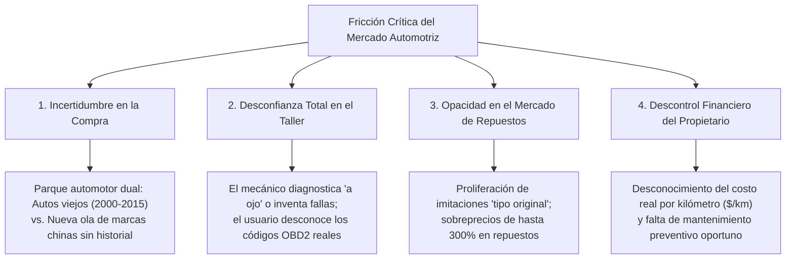
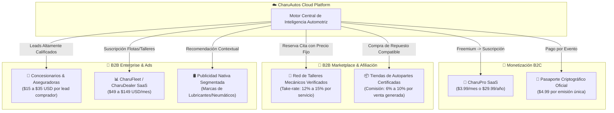

# Sección 01: Resumen Ejecutivo, Tesis de Negocio y Modelo de Monetización SaaS
### Estrategia Comercial B2C/B2B, Ecosistema de Afiliación, Unit Economics y Pasarelas de Pago
*Plataforma Comercial CharuAutos • Enfoque Cloud-Native SaaS • Mercado Inicial: Venezuela / LatAm*

---

## 1.1. Contexto de Mercado y Tesis de Inversión

El mercado automotriz en América Latina (y particularmente en mercados de alta volatilidad y parque vehicular envejecido como Venezuela) padece una **fricción sistémica originada por la asimetría de información**:

### La Tesis CharuAutos:
Transformar la relación del conductor con su vehículo mediante un **SaaS Automotriz Inteligente** que actúa como un copiloto digital imparcial. No vendemos vehículos ni operamos talleres; construimos la **capa de confianza digital, diagnóstico técnico y analítica de costos** que conecta a conductores con los mejores proveedores del ecosistema.

---

## 1.2. Misión, Visión y Propuesta de Valor Diferencial (UVP)

- **Misión:** Erradicar la asimetría de información en el ciclo de vida vehicular, dotando a los conductores de herramientas de diagnóstico, comparación basada en datos y control analítico de costos.
- **Visión:** Convertirnos en el estándar digital de pasaporte y telemetría vehicular en Latinoamérica, siendo la plataforma indispensable para comprar, diagnosticar, reparar y vender un vehículo.
- **Propuesta de Valor Única (UVP):**
  > *"La plataforma inteligente que te dice con precisión qué vehículo comprar según tu presupuesto y tus rutas, qué le duele a tu auto cuando enciende una luz de alerta y cómo blindarte contra estafas y sobrecostos en repuestos y talleres."*

---

## 1.3. Modelo Integral de Monetización SaaS (B2C + B2B Marketplace)

CharuAutos implementa una estructura de ingresos diversificada y sinérgica con 6 canales de monetización complementarios:

### Detalle de Flujos de Ingreso:

#### 1. B2C Freemium & Membresía "CharuPro"
- **Nivel Gratuito (Hook de Crecimiento Viral):**
  - Acceso irrestricto al **Matchmaker de compra** y comparador de modelos.
  - 3 consultas diagnósticas OBD2 mensuales con semáforo básico de severidad.
  - Registro de 1 vehículo en el Cuaderno de Mantenimiento con métricas esenciales.
- **Suscripción CharuPro ($3.99 USD/mes o $29.99 USD/año):**
  - Consultas OBD2 ilimitadas con árbol completo de causa-raíz (80/20) y guía de preguntas para el mecánico.
  - Gestión multi-vehículo (hasta 4 vehículos en el garage familiar).
  - Exportación ilimitada del **Pasaporte Criptográfico de Mantenimiento en PDF** con código QR de verificación para maximizar el valor de reventa.
  - Proyecciones analíticas avanzadas de $/km y alertas predictivas de desgaste basadas en kilometraje.
  - Descuentos exclusivos del 10% al 15% en mano de obra en la Red de Talleres Verificados.

#### 2. B2B Marketplace: Talleres Mecánicos Verificados ("Red Don Carlos")
- Cuando un usuario detecta un código DTC (ej. `P0171` mezcla pobre), la plataforma le presenta talleres auditados cercanos con precio de mano de obra pactado y garantía de transparencia.
- **Take-rate:** CharuAutos retiene entre el **12% y el 15%** del valor de la orden de servicio canalizada a través de la plataforma.

#### 3. B2B E-Commerce: Afiliación de Repuestos y Autopartes
- La plataforma vincula de inmediato la falla o el plan de mantenimiento preventivo con el repuesto exacto (ej. kit de tiempo para Chevrolet Aveo 1.6 o bujías de iridio para Toyota Corolla 1.8).
- Convenios directos con importadores mayoristas y repuesteras de reputación certificada que garantizan repuestos originales (no copias).
- **Comisión por Venta:** **6% al 10%** sobre el valor bruto del repuesto adquirido.

#### 4. B2B Lead Generation: Concesionarios y Agencias de Vehículos
- Los usuarios que completan el flujo del Matchmaker declaran presupuesto, capacidad de financiamiento y preferencia de carrocería.
- Los usuarios con intención de compra de modelos nuevos o seminuevos son conectados con concesionarios oficiales autorizados para pruebas de manejo o cotizaciones crediticias.
- **Tarifa por Lead Calificado (CPL):** **$15 a $35 USD** por lead verificado con scoring financiero.

#### 5. B2B Corretaje de Seguros Vehiculares y Garantías Mecánicas
- Integración en el dashboard para cotizar pólizas de responsabilidad civil (RCV) y todo riesgo según el perfil de uso del vehículo.
- **Comisión por Emisión:** Entre **10% y 20%** de la prima del primer año de póliza.

#### 6. Publicidad Nativa Segmentada y Patrocinios Contextuales
- Cero banners invasivos. La publicidad se inserta como recomendaciones de ingeniería contextual:
  - Si un motor requiere especificación API SP `0W-20`, se destaca la recomendación de marcas premium aliadas (ej. Motul, Castrol, Mobil 1).
  - Si el vehículo necesita reemplazo de neumáticos, se muestran ofertas geolocalizadas de distribuidores autorizados.

#### 7. B2B SaaS "CharuFleet" (Micro-Flotas y Talleres)
- Panel de control web para talleres mecánicos independientes y dueños de pequeñas flotas (Ridery/Yummy, reparto urbano, furgonetas):
  - Gestión centralizada de mantenimientos, control de kilometraje de múltiples unidades, proyección de recambios y generación de presupuestos estandarizados.
  - **Precio:** Tier Inicial $49 USD/mes (hasta 10 vehículos); Tier Pro $149 USD/mes (hasta 50 vehículos).

---

## 1.4. Pasarelas de Pago Bimonetarias y Tokenización Recurrente

Para operar exitosamente en mercados bimonetarios con alta inflación y múltiples monedas:
- **Cobros Internacionales / Tarjetas:** Integración vía **Stripe Billing** para suscripciones automáticas en USD.
- **Pagos Locales en Bolívares (VES):** Integración con API bancaria de **Pago Móvil C2P / Débito Inmediato** a tasa oficial BCV del día, generando tokens de renovación periódica.
- **Criptoactivos:** Integración nativa con **Binance Pay SDK** (USDT sin comisión de red) y **Zinli / Pipol Pay** para pagos en dólares digitales.

---

## 1.5. Unit Economics y Proyección Financiera SaaS (Base: 5,000 Usuarios Activos)

| Métrica SaaS | Meta / Estimación | Racional Estratégico |
| :--- | :---: | :--- |
| **CAC (Costo de Adquisición de Cliente)** | **$1.10 USD** | Adquisición orgánica impulsada por redes sociales (`@charuautopics`), boca a boca del Matchmaker y talleres aliados. |
| **Tasa de Conversión a CharuPro** | **4.2%** | 210 suscriptores de pago = **$6,298 USD/año** en ARR directo. |
| **ARPU B2C Anual** | **$7.80 USD** | Combina suscripciones recurrentes con micropagos de certificados. |
| **Transacciones de Marketplace (Servicios + Repuestos)** | **3.5% mensual** | 175 servicios/repuestos al mes con ticket promedio de $75 USD y take-rate 12% = **$1,575 USD/mes** ($18,900 USD anual). |
| **Venta de Leads Concesionarios / Seguros** | **40 leads/mes** | 40 leads a $25 USD promedio = **$1,000 USD/mes** ($12,000 USD anual). |
| **LTV Proyectado (a 24 meses)** | **$14.50 USD por usuario** | Gran retención al almacenar el historial completo del auto. |
| **Ratio LTV / CAC** | **> 13x** | Eficiencia de capital excepcional para un modelo impulsado por producto (Product-Led Growth). |
| **Payback Period** | **< 3 meses** | Recuperación rápida del costo de adquisición gracias al ticket del marketplace. |
