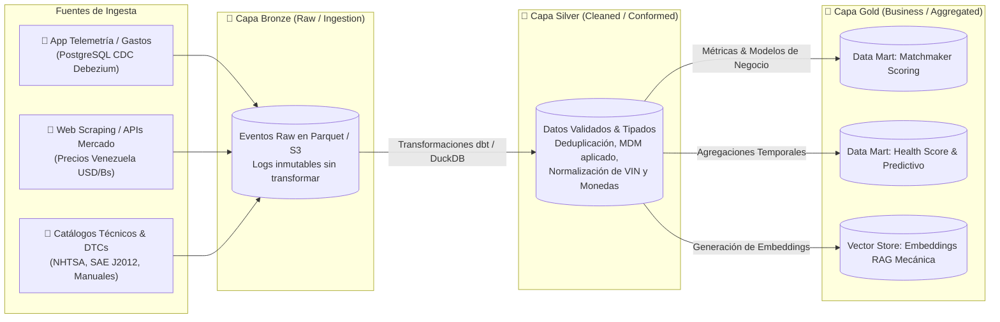
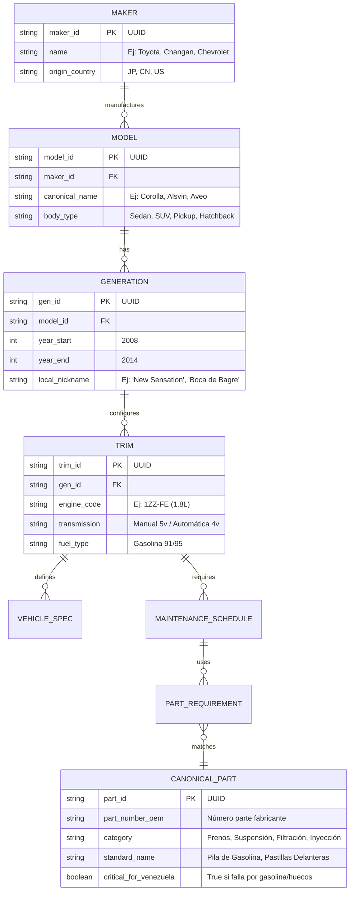
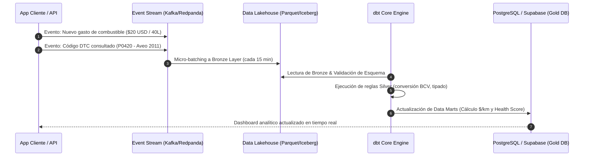
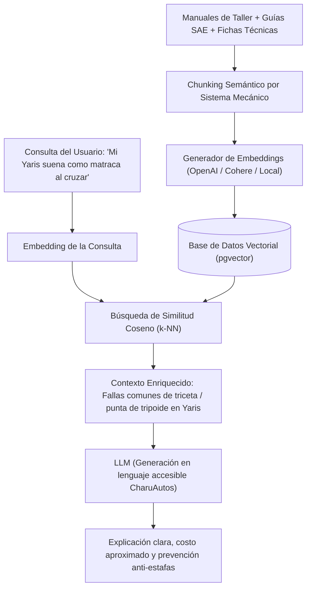

# Sección 02: Gestión y Gobernanza de Datos (Data Engineering & Governance)
### Arquitectura de Datos, Calidad, Linaje y Modelado Analítico para CharuAutos App
*Diseñado bajo estándares de Ingeniería de Datos moderna para entornos analíticos y operativos escalables.*

---

## 2.1. Arquitectura de Datos: Enfoque Medallion (Lakehouse)

Para soportar tanto la operativa en tiempo real de la aplicación (OLTP) como la analítica avanzada, el motor de recomendación del Matchmaker y los modelos de IA (OLAP / RAG), implementamos una **Arquitectura Medallion** desacoplada:

### 1. Capa Bronze (Raw Data Store)
- **Propósito:** Almacén inmutable de solo adición (*append-only*).
- **Formato:** Archivos Apache Parquet particionados por `año/mes/día/fuente` almacenados en Cloud Object Storage (S3 / Cloudflare R2 / MinIO).
- **Tipos de Datos:** Eventos crudos de navegación del Matchmaker, respuestas crudas de las entrevistas, registros de cargas de combustible, fallas ingresadas por usuarios y scrapings de precios de vehículos usados en portales locales.

### 2. Capa Silver (Cleansed & Enriched Core)
- **Propósito:** Tablas limpias, validadas, deduplicadas y estructuradas según el modelo canónico.
- **Transformaciones:**
  - Limpieza de cadenas y estandarización fonética de marcas/modelos (ej. corregir "Toyoya Corola" a `TOYOTA COROLLA`).
  - Conversión de precios multimoneda a una base estandarizada USD a la tasa oficial BCV del día del registro.
  - Validación de coherencia de kilometraje (detección de saltos temporales erróneos o regresión de odómetro).

### 3. Capa Gold (Business Level / Data Marts)
- **Propósito:** Consumo directo para la aplicación, dashboards analíticos y motores de inteligencia artificial.
  - **Data Mart Matchmaker:** Fichas técnicas consolidadas con puntuaciones de confiabilidad, disponibilidad de repuestos en Venezuela y costo total de propiedad (TCO).
  - **Data Mart Telemetría y Salud:** Agregaciones por marca/modelo de frecuencia de códigos DTC según kilometraje (ej. *"El 68% de los Aveo con más de 120,000 km reportan falla P0300"*).
  - **Vector Database (Qdrant / pgvector):** Embeddings vectoriales de síntomas mecánicos y causas raíz para alimentar el asistente RAG en lenguaje natural.

---

## 2.2. Master Data Management (MDM): Catálogo Canónico Vehicular

La fragmentación y los errores en nombres de vehículos en Venezuela es uno de los mayores problemas de datos. El sistema implementa una entidad de **Golden Record** para vehículos y repuestos:

### Reglas de Normalización de Entidades:
1. **Identificador Global Canónico (CarID):** Cada vehículo comercializado en Venezuela posee un UUID inmutable que desacopla el nombre comercial de su especificación técnica.
2. **Aliases y Moteado Popular:** El MDM mapea los modismos populares venezolanos (*"Corolla Pantallita"*, *"Spark Tapita"*, *"Yaris Belén"*, *"Silverado Carita Sucia"*) hacia el `trim_id` exacto, permitiendo que el buscador y el chatbot entiendan el lenguaje de la calle sin romper la consistencia relacional.
3. **Equivalencias de Repuestos (Cross-Reference Engine):** Mapeo de piezas OEM contra alternativas de repuesteras del *Aftermarket* reconocidas (Denso, Bosch, Valeo, ACDelco, 555) descartando copias de baja calidad.

---

## 2.3. Pipelines de Datos & Ingesta (ETL / ELT)

### Orquestación y Herramientas:
- **Orquestador:** **Prefect** o **Airflow** ligero en contenedor Docker.
- **Transformación en el Data Warehouse:** **dbt (data build tool)** para control de versiones en SQL, pruebas automáticas de integridad y generación de documentación de linaje.
- **Ingesta de Fichas Técnicas:** Scrapers programados que ingieren especificaciones oficiales y validan contra la base de datos global de la **NHTSA VPIC API**.

---

## 2.4. Data Quality & Data Observability

Para garantizar la veracidad de las recomendaciones del Matchmaker y la precisión del dashboard, se implementa un marco de observabilidad de datos basado en **Great Expectations** y pruebas automatizadas en **dbt**:

| Dimensión de Calidad | Regla / Prueba Implementada | Acción ante Falla |
| :--- | :--- | :--- |
| **Completitud** | Todo registro de vehículo debe contener obligatoriamente: `trim_id`, `combustible`, `despeje_suelo_mm` y `capacidad_tanque_litros`. | Registro rechazado a cuarentena (*Dead Letter Queue*). |
| **Consistencia de Kilometraje** | `Kilometraje_Actual >= Kilometraje_Anterior` (Monotonicidad estricta). La tasa de avance no puede exceder los 1,000 km/día (salvo flag explícito de viaje). | Alerta de posible manipulación de odómetro / error de dedo del usuario. |
| **Data Drift en Precios** | Desviación estándar del precio promedio de mercado de un modelo específico > 25% en una ventana móvil de 7 días. | Alerta al equipo comercial para revisar si hubo distorsión cambiaria o error de scraping. |
| **Validez de Códigos DTC** | El código ingresado debe coincidir con la expresión regular `^[PBCU][0-3][0-9A-F]{3}$` (Estándar SAE J2012). | Si no existe, se clasifica como código específico de fabricante o error tipográfico y se envía a revisión. |

---

## 2.5. Privacidad, Seguridad y Anonimización de Datos

1. **Anonimización de Patrones de Uso y Kilometraje:**
   - Para alimentar los modelos de recomendación general (Big Data automotriz), los datos de conducción y fallas se disocian completamente del nombre, cédula/DNI y correo electrónico del usuario mediante técnicas de **K-Anonimato**.
2. **Cifrado de Número de Chasis (VIN) y Placas:**
   - El VIN y la placa del vehículo se consideran identificadores sensibles. Se almacenan cifrados a nivel de columna con **AES-256-GCM** y se indexan mediante hashes ciegos (*Blind Indexing con HMAC-SHA256*) para permitir búsquedas sin exponer el dato en texto plano.
3. **Linaje del Dato (Data Lineage):**
   - Trazabilidad completa con dbt Docs y OpenLineage: cualquier cálculo visible en el dashboard (ej. *"Costo por kilómetro: $0.14 USD/km"*) puede ser auditado hacia atrás hasta el ticket de combustible o factura original que lo originó.

---

## 2.6. Modelado Analítico y Preparación para IA / RAG

- **Almacenamiento Vectorial:** Extensión **pgvector** integrada en la misma base de datos PostgreSQL, evitando mantener una infraestructura separada en la etapa de MVP.
- **Metadatos Enriquecidos:** Cada fragmento vectorial incluye filtros relacionales: `{ "marca": "Toyota", "modelo": "Yaris", "componente": "Tripoide/Junta Homocinética", "frecuencia_venezuela": "Alta" }`.
