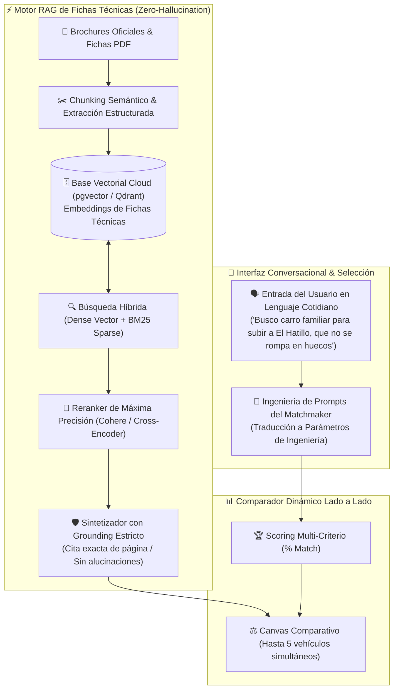
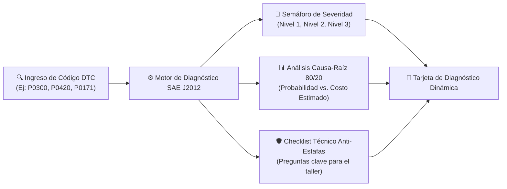
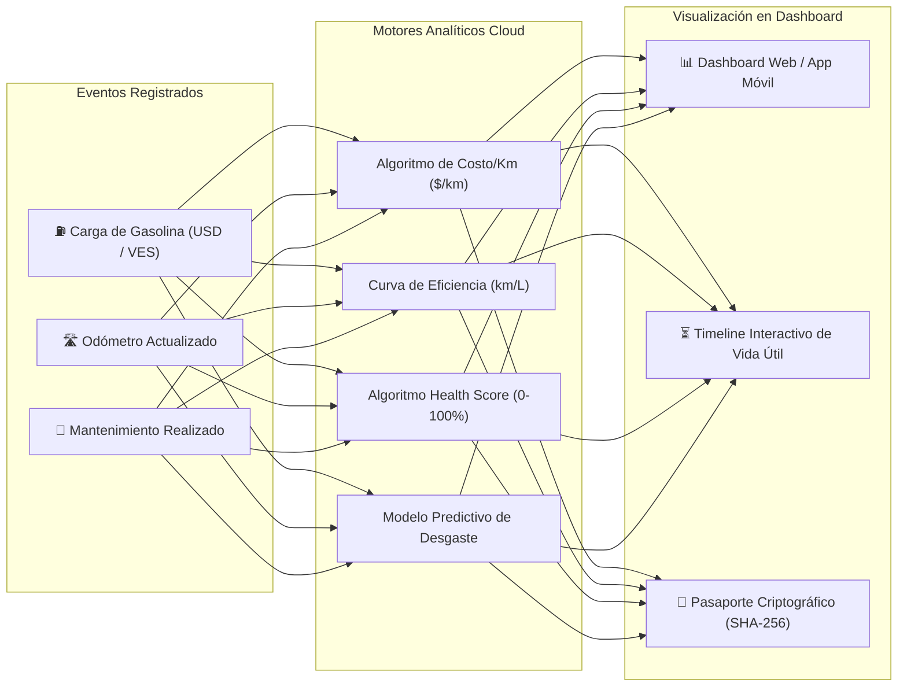

# Sección 03: Especificación Funcional de los 3 Pilares Core
### Diseño de Producto, Ingeniería de Prompts, Motor RAG, Diagnóstico OBD2 y Analítica Cloud
*Plataforma Comercial CharuAutos SaaS • Arquitectura Cloud-Native • Experiencia Libre de Fricción*

---

## 3.1. Pilar 1: Módulo de Búsqueda y Comparación (Matchmaker + RAG)

El **Pilar 1** combina un flujo conversacional guiado con un **motor RAG (Retrieval-Augmented Generation)** de alta precisión para recuperar y comparar especificaciones técnicas de vehículos sin alucinaciones.



### 1. Ingeniería de Prompts Conversacionales (Traductor de Necesidades)
El Matchmaker guía al usuario a través de un diálogo empático y desestructurado que un LLM (o un árbol de decisión determinista en modo offline) traduce a restricciones de ingeniería automotriz:

#### Matriz de Traducción Semántica:
| Expresión Coloquial del Usuario | Interpretación de Ingeniería Automotriz | Restricciones de Filtrado en Base de Datos |
| :--- | :--- | :--- |
| *"Las calles por donde ando están llenas de baches y huecos profundos"* | Alta tolerancia a impacto, rigidez estructural y despeje vertical generoso. | `clearance_mm >= 160`, suspensión delantera MacPherson reforzada o multibrazo con perfil de neumático $\ge 60$ (evitar perfil bajo). |
| *"Tengo que subir cerros y subidas empinadas a diario con la familia"* | Alta entrega de par motor a bajas revoluciones y adecuada relación peso-potencia. | `torque_nm >= 140` disponible a $\le 3,800\,\text{RPM}$, relación peso/potencia $\le 12.5\,\text{kg/HP}$, caja con relaciones cortas (evitar cajas CVT con sobrecalentamiento). |
| *"No quiero dolores de cabeza con la gasolina regular"* | Motor de baja compresión y tolerancia a combustible de octanaje irregular o con sedimentos. | Relación de compresión $\le 10.5:1$, inyección indirecta multipunto (MPI/VVT) atmosférica preferida sobre inyección directa GDI con alta compresión. |
| *"Quiero que los repuestos se consigan hasta en la farmacia"* | Alta densidad de inventario en el mercado de reposición local. | Índice de disponibilidad de repuestos `>= 85/100` (Chevrolet, Toyota, Ford tradicionales frente a importaciones boutique). |

#### Prompt del Sistema para el Agente Matchmaker (System Prompt):
```text
Eres el Asistente Técnico Senior de CharuAutos. Tu objetivo es asesorar imparcialmente al usuario para seleccionar el vehículo ideal.
REGLAS INVIOLABLES:
1. Nunca uses jerga técnica sin explicarla de inmediato con una metáfora cotidiana.
2. Si el presupuesto del usuario es inferior al precio de mercado, advierte con honestidad la necesidad de colchón para mantenimiento preventivo ($500 - $800 USD).
3. Evalúa rigurosamente las condiciones locales: despeje de baches, calidad de gasolina y disponibilidad real de repuestos.
4. Entrega siempre un Top 3 ordenado por % de compatibilidad, desglosando PROS, CONTRAS y un DICTAMEN TÉCNICO claro.
```

---

### 2. Arquitectura RAG para Fichas Técnicas (Anti-Alucinaciones)
Para evitar que la IA invente datos de potencia, consumo o medidas, se implementa una arquitectura **RAG con Grounding Estricto**:
- **Ingesta de Fichas Técnicas (PDF / Brochures):** Se procesan mediante extracción híbrida (OCR + PyMuPDF) dividiendo los documentos en fragmentos semánticos (Motor, Transmisión, Chasis/Dimensiones, Seguridad).
- **Almacenamiento Vectorial:** Cada fragmento se indexa en `pgvector` con metadatos estructurados (`maker`, `model`, `year`, `trim`, `source_file`, `page_number`).
- **Recuperación Híbrida:** Combina búsqueda vectorial densa con búsqueda exacta por palabras clave (BM25) para códigos de motor específicos (ej. `1ZZ-FE`, `GW4G15K`, `E4T15C`).
- **Regla de Cero Alucinación:** Si un dato (ej. capacidad exacta del maletero o torque) no está explícitamente contenido en el documento fuente, la respuesta declara: `"Dato no especificado en la ficha técnica oficial del fabricante"`.

---

### 3. Comparador Dinámico Multi-Vehículo (Hasta 5 Simultáneos)
- **Eliminación Automática de Referencia:** Si el usuario carga 2 o más vehículos (vía PDF o catálogo), el vehículo de prueba se retira automáticamente y la grilla compara exclusivamente los vehículos seleccionados.
- **Detección Automática de Ganadores (`LÍDER`):** El sistema calcula dinámicamente los valores máximos para Potencia (HP), Torque (Nm), Despeje (mm), Maletero (L) y Tanque (L), asignando la insignia verde **`LÍDER`** a la mejor especificación.
- **Acción de Limpieza y Guardado:** Permite guardar la sesión comparativa en la base de datos cloud y reabrirla o compartirla mediante enlace permanente.

---

## 3.2. Pilar 2: Asistente Mecánico y Diagnóstico OBD2

El **Pilar 2** digitaliza el protocolo diagnóstico automotriz internacional (**SAE J2012 / ISO 15031**) para empoderar al usuario antes de pisar un taller mecánico.



### 1. El Semáforo de Severidad ISO/SAE
- **🟢 Nivel 1 (Leve / Operación Segura):**
  - *Definición:* Fallas no críticas que no comprometen la integridad del motor a corto plazo (ej. `P0442` fuga mínima EVAP, `P0128` termostato por debajo de temperatura de regulación).
  - *Acción:* Monitoreo rutinario; no requiere asistencia de grúa ni detención del viaje.
- **🟡 Nivel 2 (Advertencia Técnica / Precaución):**
  - *Definición:* Desviaciones en mezcla o emisiones que provocan pérdida de potencia o sobreconsumo de combustible (ej. `P0171` mezcla pobre, `P0420` catalizador degradado por azufre).
  - *Acción:* Agendar revisión en los próximos 7 a 15 días para evitar daños colaterales.
- **🔴 Nivel 3 (Severidad Crítica / Detención Inmediata):**
  - *Definición:* Riesgo inminente de destrucción mecánica o incendio (ej. `P0300` misfire aleatorio con luz parpadeante, `P0524` baja presión de aceite, `P0217` sobrecalentamiento del motor).
  - *Acción:* Detener el vehículo inmediatamente en zona segura, apagar el motor y solicitar grúa.

---

### 2. Matriz de Causa-Raíz 80/20 y Guía para el Mecánico ("Escudo Anti-Estafas")
Desglosa las causas más probables ordenadas de menor a mayor costo para evitar que el taller intente reemplazar piezas costosas sin diagnóstico previo:

```text
╔══════════════════════════════════════════════════════════════════════════════════════════════╗
║  🛡️ CHARUAUTOS — CHECKLIST TÉCNICO // ASESORÍA DE TALLER                                     ║
╠══════════════════════════════════════════════════════════════════════════════════════════════╣
║  Código Detectado: P0420 (Eficiencia de Catalizador Baja) • Severidad: Nivel 2 (Moderada)    ║
║                                                                                              ║
║  DESGLOSE CAUSA-RAÍZ (PRINCIPIO DE PARETO 80/20):                                            ║
║  1. [60% Probabilidad - $25-$45 USD]: Sensor de oxígeno secundario contaminado o carbonizado. ║
║  2. [25% Probabilidad - $10-$20 USD]: Fisura o fuga de aire en la tubería antes del sensor.   ║
║  3. [15% Probabilidad - $180-$450 USD]: Convertidor catalítico fundido o destruido.          ║
║                                                                                              ║
║  PREGUNTAS DE CONFRONTACIÓN PARA EL MECÁNICO:                                                ║
║  [ ] "¿Graficó la forma de onda del sensor de oxígeno secundario en vivo con el escáner para ║
║      confirmar si oscila erráticamente antes de condenar el catalizador?"                    ║
║  [ ] "¿Verificó que no existan fugas de aire fresco en el tubo de escape o juntas?"          ║
║  [ ] "Exijo ver la lectura de voltajes antes y después de cualquier intervención."           ║
╚══════════════════════════════════════════════════════════════════════════════════════════════╝
```

---

## 3.3. Pilar 3: Cuaderno de Mantenimiento Dinámico & Dashboard Analítico Cloud

El **Pilar 3** convierte cada carga de combustible y servicio de taller en inteligencia analítica centralizada en la nube con sincronización bidireccional.



### 1. Algoritmo de Costo Real por Kilómetro ($\$/\text{km}$ Bimonetario)
Calcula el costo operativo total ponderado en función de la inflación local y la dualidad monetaria (USD / VES):

$$\text{Costo}_{\$/\text{km}} = \frac{\sum_{t=1}^{N} \left( \text{Gasto Combustible}_{t} + \text{Gasto Mantenimiento}_{t} + \text{Seguro / Impuestos}_{t} \right)}{\Delta \text{Kilómetros Recorridos}}$$

- Si el usuario paga en bolívares (VES), el sistema convierte automáticamente el monto a USD oficial usando la tasa oficial del Banco Central (BCV) del timestamp exacto del registro.

---

### 2. Algoritmo Dinámico de Salud Vehicular ("Health Score" 0 a 100%)
El puntaje de salud del vehículo ($H \in [0, 100]$) se actualiza dinámicamente con cada reporte:

$$H = 100 - \sum_{k=1}^{M} \left( \Delta_{\text{vencimiento}, k} \times \omega_k \right) - \sum_{d \in \text{DTCs}} \Omega_d$$

Donde:
- $\omega_k$: Factor de ponderación del componente según su criticidad mecánica (ej. Aceite de motor $\omega=25$, Correa de tiempo en motor de interferencia $\omega=35$, Pastillas de freno $\omega=20$, Filtro de habitáculo $\omega=5$).
- $\Delta_{\text{vencimiento}, k}$: Porcentaje de exceso sobre el intervalo recomendado de recambio.
- $\Omega_d$: Penalización por códigos DTC activos no resueltos (Nivel 1: $\Omega=5$, Nivel 2: $\Omega=15$, Nivel 3: $\Omega=35$).

---

### 3. Planes de Mantenimiento Preventivo Estandarizados
La plataforma almacena programas de mantenimiento preventivo parametrizados según marca, motorización y kilometraje:

| Intervalo de Kilometraje | Mantenimientos Obligatorios | Fluido / Componente Específico | Criticidad |
| :--- | :--- | :--- | :---: |
| **Cada 5,000 km** | Cambio de aceite mineral / semi-sintético y filtro | 10W-30 / 15W-40 API SP | Alta |
| **Cada 10,000 km** | Cambio de aceite 100% sintético, filtro de aire y rotación de neumáticos | 0W-20 / 5W-30 Full Synthetic | Alta |
| **Cada 40,000 km** | Sustitución de bujías, líquido de frenos (DOT 4) y refrigerante (OAT 50/50) | Bujías de Iridio / Cobre según catálogo | Muy Alta |
| **Cada 60,000 - 80,000 km** | Kit de correa de distribución + tensor y bomba de agua | Correa reforzada (crítico en motores Aveo/Optra) | **Crítica** |
| **Cada 80,000 - 100,000 km** | Mantenimiento de transmisión (CVT / Automática tradicional) y amortiguadores | Fluido homologado OEM (CVT Fluid / ATF WS) | Muy Alta |

---

### 4. Pasaporte Digital Criptográfico con Cadena Inmutable de Odómetro
- Cada actualización de odómetro se enlaza al bloque previo mediante un hash **SHA-256 inmutable**:
  $$\text{Hash}_n = \text{SHA-256}(n \parallel \text{vehicle\_id} \parallel \text{km}_n \parallel \text{timestamp} \parallel \text{Hash}_{n-1})$$
- **Regla Estricta de Monotonicidad:** Si un usuario o actor intenta ingresar un kilometraje menor ($\text{km}_n < \text{km}_{n-1}$), el sistema bloquea la mutación y activa una **Alerta de Fraude**, protegiendo a los futuros compradores de vehículos usados.
