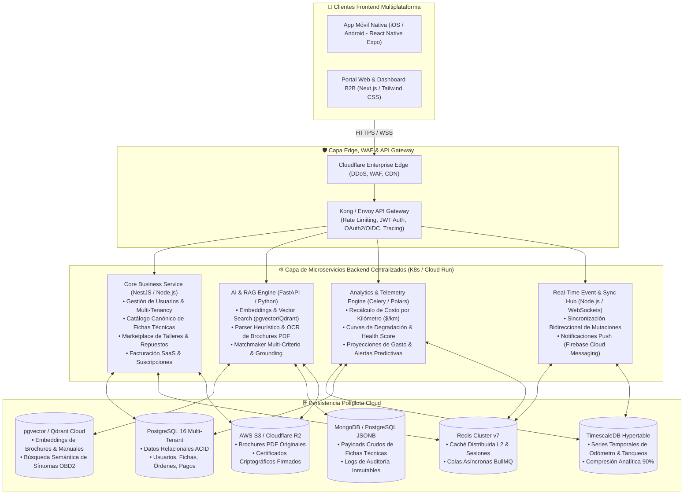
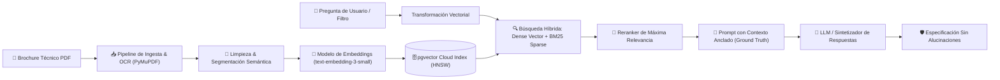

# Sección 04: Arquitectura Técnica Cloud-Native y Stack SaaS
### Diseño de Arquitectura Distribuida, APIs REST/GraphQL, Persistencia Políglota y Pipeline RAG
*Plataforma Comercial CharuAutos • Enfoque Cloud-Native Escalable • Preparado para Producción Centralizada*

---

## 4.1. Visión General de la Arquitectura Cloud-Native

La arquitectura de **CharuAutos** se transforma formalmente en un sistema **Cloud-Native / SaaS Multi-Tenant**, desacoplando clientes frontend, capas perimetrales de seguridad, microservicios de negocio, motores de analítica distribuida y almacenamiento políglota:



---

## 4.2. Capa de APIs: RESTful y Endpoints GraphQL

Para satisfacer las demandas tanto de clientes móviles como de paneles web analíticos:
- **API RESTful (OpenAPI 3.1):** Utilizada para operaciones estándar de recursos, autenticación, procesamiento de pagos y subida de archivos binarios (PDFs).
- **API GraphQL:** Utilizada en los dashboards analíticos del Cuaderno de Mantenimiento y en el Comparador de Vehículos para permitir consultas complejas con agregaciones personalizadas sin sobrecargar la red móvil (*over-fetching* / *under-fetching*).
- **Seguridad en Gateway:** Autenticación basada en **JSON Web Tokens (JWT)** firmados con algoritmo asimétrico **RS256** mediante proveedor OAuth2/OIDC, con rotación periódica de claves públicas.
- **Control de Acceso Basado en Roles (RBAC):**
  - `ROLE_DRIVER`: Conductor particular (gestión de vehículos propios y consultas).
  - `ROLE_MECHANIC`: Taller verificado (recepción de órdenes y validación de reparaciones).
  - `ROLE_DEALER`: Concesionario aliado (acceso a leads calificados del Matchmaker).
  - `ROLE_FLEET_ADMIN`: Gestor de flota (acceso masivo a telemetría de múltiples unidades).
  - `ROLE_SUPERADMIN`: Administración central de la plataforma.

---

## 4.3. Modelado de Datos Vehiculares Cloud (Esquemas Relacionales, NoSQL y Series de Tiempo)

### 1. Esquema Relacional Canónico (PostgreSQL 16 DDL)

```sql
-- HABILITACIÓN DE EXTENSIONES CLOUD
CREATE EXTENSION IF NOT EXISTS "uuid-ossp";
CREATE EXTENSION IF NOT EXISTS "pgcrypto";
CREATE EXTENSION IF NOT EXISTS "vector";

-- CATÁLOGO MAESTRO: MARCAS
CREATE TABLE canonical_makers (
    id UUID PRIMARY KEY DEFAULT gen_random_uuid(),
    name VARCHAR(100) UNIQUE NOT NULL,
    country_of_origin VARCHAR(3) NOT NULL, -- ISO 3166-1 alpha-3
    logo_url TEXT,
    created_at TIMESTAMP WITH TIME ZONE DEFAULT NOW()
);

-- CATÁLOGO MAESTRO: MODELOS
CREATE TABLE canonical_models (
    id UUID PRIMARY KEY DEFAULT gen_random_uuid(),
    maker_id UUID NOT NULL REFERENCES canonical_makers(id) ON DELETE CASCADE,
    name VARCHAR(120) NOT NULL,
    body_type VARCHAR(40) NOT NULL CHECK (body_type IN ('sedan', 'suv', 'hatchback', 'pickup', 'crossover', 'van')),
    created_at TIMESTAMP WITH TIME ZONE DEFAULT NOW(),
    UNIQUE(maker_id, name)
);

-- CATÁLOGO MAESTRO: ESPECIFICACIONES TÉCNICAS (TRIMS)
CREATE TABLE canonical_trims (
    id UUID PRIMARY KEY DEFAULT gen_random_uuid(),
    model_id UUID NOT NULL REFERENCES canonical_models(id) ON DELETE CASCADE,
    trim_name VARCHAR(150) NOT NULL,
    year_start INT NOT NULL,
    year_end INT,
    hp INT NOT NULL CHECK (hp > 0),
    torque_nm NUMERIC(6, 2) NOT NULL CHECK (torque_nm > 0),
    torque_rpm INT DEFAULT 4000,
    curb_weight_kg INT CHECK (curb_weight_kg > 0),
    ground_clearance_mm INT NOT NULL CHECK (ground_clearance_mm > 0),
    trunk_capacity_liters INT CHECK (trunk_capacity_liters >= 0),
    fuel_tank_capacity_liters INT NOT NULL CHECK (fuel_tank_capacity_liters > 0),
    engine_displacement VARCHAR(50) NOT NULL, -- Ej: '1.5L Turbo GW4G15K'
    transmission_type VARCHAR(60) NOT NULL, -- Ej: 'Automática 7-Vel Doble Embrague (DCT)'
    drivetrain VARCHAR(20) NOT NULL CHECK (drivetrain IN ('FWD', 'RWD', 'AWD', '4WD_PART_TIME', '4WD_FULL_TIME')),
    market_availability_ve VARCHAR(40) DEFAULT 'Moderada',
    source_brochure_url TEXT,
    created_at TIMESTAMP WITH TIME ZONE DEFAULT NOW()
);

-- VEHÍCULOS DE USUARIOS (MULTI-TENANT GARAGE)
CREATE TABLE user_vehicles (
    id UUID PRIMARY KEY DEFAULT gen_random_uuid(),
    user_id UUID NOT NULL REFERENCES auth.users(id) ON DELETE CASCADE,
    trim_id UUID NOT NULL REFERENCES canonical_trims(id),
    nickname VARCHAR(80),
    vin VARCHAR(17),
    encrypted_license_plate TEXT,
    license_plate_hash VARCHAR(64) NOT NULL,
    current_odometer_km INT NOT NULL DEFAULT 0 CHECK (current_odometer_km >= 0),
    health_score INT NOT NULL DEFAULT 100 CHECK (health_score BETWEEN 0 AND 100),
    last_service_date DATE,
    created_at TIMESTAMP WITH TIME ZONE DEFAULT NOW(),
    updated_at TIMESTAMP WITH TIME ZONE DEFAULT NOW()
);

-- CADENA CRIPTOGRÁFICA INMUTABLE DE ODÓMETRO (ANTI-FRAUDE)
CREATE TABLE odometer_blockchain (
    block_index BIGINT NOT NULL,
    vehicle_id UUID NOT NULL REFERENCES user_vehicles(id) ON DELETE CASCADE,
    logged_at TIMESTAMP WITH TIME ZONE NOT NULL DEFAULT NOW(),
    odometer_km INT NOT NULL CHECK (odometer_km >= 0),
    service_reason VARCHAR(255) NOT NULL,
    previous_hash VARCHAR(64) NOT NULL,
    current_hash VARCHAR(64) NOT NULL,
    PRIMARY KEY (vehicle_id, block_index)
);
```

### 2. Esquema de Series de Tiempo (TimescaleDB Hypertables)

```sql
-- REGISTRO DE COMBUSTIBLE Y EFICIENCIA OPERATIVA
CREATE TABLE fuel_telemetry (
    time TIMESTAMP WITH TIME ZONE NOT NULL,
    vehicle_id UUID NOT NULL,
    liters_filled NUMERIC(6, 2) NOT NULL,
    total_cost_usd NUMERIC(8, 2) NOT NULL,
    total_cost_ves NUMERIC(12, 2) NOT NULL,
    bcv_exchange_rate NUMERIC(10, 4) NOT NULL,
    odometer_at_fill INT NOT NULL,
    calculated_km_per_liter NUMERIC(5, 2),
    calculated_cost_per_km_usd NUMERIC(6, 4)
);

-- Conversión a Hypertable con particionamiento temporal
SELECT create_hypertable('fuel_telemetry', 'time', if_not_exists => TRUE);
CREATE INDEX idx_fuel_telemetry_vehicle ON fuel_telemetry(vehicle_id, time DESC);
```

### 3. Esquema NoSQL Documental para Fichas Técnicas No Estructuradas (JSONB / Cloud Storage)
Para absorber catálogos en formatos variables y scrapings de fichas en PDF:
```json
{
  "_id": "doc_brochure_haval_jolion_2024",
  "source_file": "FICHA_TECNICA_GWM_HAVAL_JOLION.pdf",
  "storage_url": "s3://charuautos-brochures/haval/jolion_2024.pdf",
  "sha256": "e3b0c44298fc1c149afbf4c8996fb92427ae41e4649b934ca495991b7852b855",
  "metadata": {
    "maker": "GWM Haval",
    "model": "Haval Jolion",
    "year": 2024,
    "scraped_at": "2026-09-20T12:00:00Z"
  },
  "raw_sections": {
    "powertrain": "Motor 1.5L Turbo con 141 HP y 210 Nm de torque @ 2000-4400 RPM",
    "transmission": "Automática de 7 velocidades con doble embrague (7DCT)",
    "chassis": "Suspensión delantera independiente MacPherson, trasera barra de torsión",
    "dimensions": "Despeje libre al suelo 163 mm, maletero 430 L, tanque 48 L"
  }
}
```

---

## 4.4. Arquitectura RAG (Retrieval-Augmented Generation) para Fichas Técnicas



### Protocolo de Prevención de Alucinaciones:
1. **Filtro de Relevancia Estricto:** Si la similitud coseno es inferior a $0.78$, el sistema rechaza la inferencia y declara la ausencia del dato.
2. **Atribución de Fuente:** Cada dato comparativo incluye metadatos de verificación: `source_file: 'FICHA_TECNICA_GWM_HAVAL_JOLION.pdf'`, `page: 2`, `field: 'Torque Máximo'`.
3. **Guardrails de Salida:** Un validador de tipos verifica que números de potencia, torque o dimensiones cumplan con rangos plausibles de la industria automotriz ($30 \le \text{HP} \le 1,200$; $50 \le \text{Nm} \le 1,500$; $100 \le \text{mm} \le 350$).

---

## 4.5. Lógica de Procesamiento Analítico Distribuido (Worker de Telemetría)

El microservicio de analítica ejecuta trabajos asíncronos distribuidos en segundo plano (Celery / Redis) ante cada mutación vehicular:

1. **Recálculo de Costo Operativo por Kilómetro ($\$/\text{km}$):**
   - Agrupa los registros de combustible y mantenimiento de los últimos 30, 90 y 365 días.
   - Aplica corrección monetaria a dólares constantes a tasa BCV.
2. **Detección de Anomalías de Consumo:**
   - Si el rendimiento de combustible ($\text{km/L}$) cae más de un **$20\%$** frente a la media histórica del vehículo, el sistema emite una notificación de advertencia preventiva sugiriendo revisión de filtros de aire, bujías o sensores de oxígeno.
3. **Proyección Predictiva de Desgaste (Supervivencia de Weibull):**
   - Modela el desgaste de componentes críticos (pastillas de freno, correas de tiempo, amortiguadores) usando curvas de confiabilidad automotriz calibradas con factores de severidad vial.
