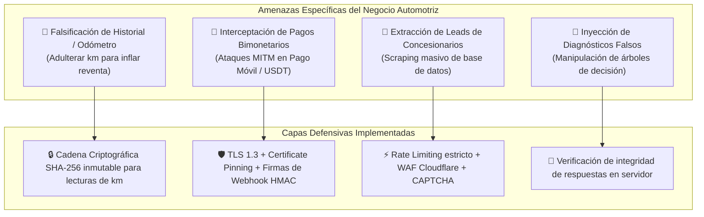
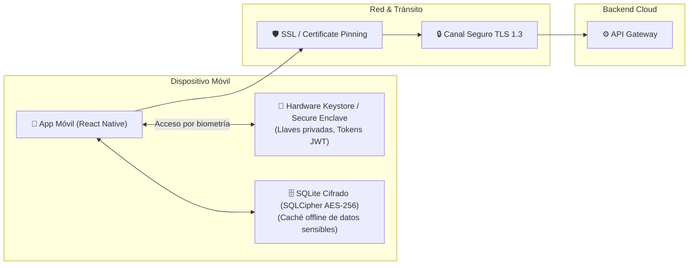
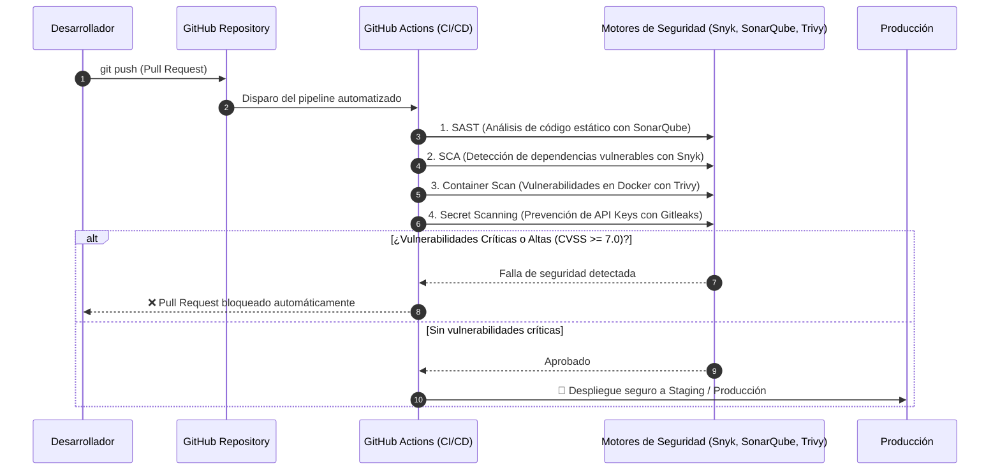

# Sección 05: Ciberseguridad, Implementación y Mantenimiento Continuo
### Estrategia de Seguridad en Profundidad (Defense-in-Depth), AppSec, DevSecOps y Resiliencia Operativa
*Estándares de referencia: OWASP Mobile Top 10 • OWASP API Top 10 • NIST CSF • CIS Benchmarks*

---

## 5.1. Marco de Ciberseguridad y Modelo de Amenazas (Threat Modeling)

Para proteger la integridad de los datos de los usuarios, las transacciones financieras multimoneda y la autenticidad de los certificados de mantenimiento de los vehículos, aplicamos el modelo de amenazas **STRIDE**:



| Categoría STRIDE | Amenaza Concreta | Contramedida de Seguridad |
| :--- | :--- | :--- |
| **Spoofing (Suplantación)** | Un taller o usuario no autorizado registra servicios en nombre de un taller certificado. | Autenticación multifactor (MFA), firmas digitales asimétricas y verificación de identidad KYC para talleres de la red. |
| **Tampering (Adulteración)** | Manipulación local en el dispositivo del kilometraje o registros de gastos de combustible. | Hashing criptográfico en cadena (Merkle Tree local) y sincronización con marca de tiempo inmutable en el backend. |
| **Repudiation (Repudio)** | Un taller desconoce haber emitido un presupuesto o cobrado un trabajo deficiente. | Audit Log inmutable de todas las transacciones con identificador único de sesión y firma de recepción. |
| **Information Disclosure (Fuga)** | Exposición del VIN, placa o ubicación del vehículo que facilite el robo o rastreo de conductores. | Cifrado a nivel de campo (Field-Level Encryption) con AES-256-GCM y ofuscación de identificadores. |
| **Denial of Service (DoS)** | Ataques de denegación de servicio a las APIs de consulta OBD2 o al Matchmaker. | Cloudflare WAF, rate limiting por token/IP (Redis Token Bucket) y CDN perimetral para activos estáticos. |
| **Elevation of Privilege** | Un usuario normal intenta acceder a la consola administrativa de concesionarios o talleres. | Control de Acceso Basado en Roles (RBAC) estricto con validación de Claims en cada endpoint del backend. |

---

## 5.2. Seguridad en la Aplicación Móvil (AppSec & Client-Side Hardening)

Siguiendo el estándar **OWASP Mobile Application Security (MASVS)**:



1. **Almacenamiento Seguro de Credenciales:**
   - Prohibido el uso de `AsyncStorage` o `SharedPreferences` sin cifrar para tokens o datos sensibles.
   - Implementación de **Keychain** en iOS y **Android Keystore / EncryptedSharedPreferences** mediante la librería `react-native-keychain`.
2. **Cifrado de Base de Datos Local:**
   - La base de datos local-first (SQLite / WatermelonDB) opera cifrada con **SQLCipher (AES-256)**, derivando la llave de cifrado a partir del enclave de seguridad del teléfono.
3. **Anti-Tampering y Detección de Dispositivos Vulnerables:**
   - Detección en tiempo de ejecución de dispositivos con **Root (Android)** o **Jailbreak (iOS)** usando comprobaciones de integridad SafetyNet / Play Integrity API y DeviceCheck de Apple.
   - Ofuscación del código JavaScript compilado mediante **Hermes bytecode** y herramientas de ofuscación de código contra ingeniería inversa.
4. **Certificate Pinning:**
   - Prevención de ataques Man-In-The-Middle (MITM) mediante *SSL Pinning*, impidiendo que certificados raíz instalados maliciosamente en el teléfono intercepten el tráfico de la app.

---

## 5.3. Criptografía y Protección de Datos

### 1. Datos en Tránsito
- Exclusivamente **TLS 1.3** con suites de cifrado modernas (ECDHE-ECDSA-AES128-GCM-SHA256).
- Rechazo forzado de conexiones HTTP planas mediante directivas **HSTS (HTTP Strict Transport Security)** con un `max-age` de 2 años.

### 2. Datos en Reposo (Data at Rest)
- Bases de datos (PostgreSQL, TimescaleDB, S3) con cifrado transparente **AES-256**.
- **Field-Level Encryption (FLE):** Los campos ultrasensibles (VIN del vehículo, número de placa, cuentas de Pago Móvil o direcciones) se cifran en la capa de aplicación antes de ingresar a la base de datos.
- **Gestión de Llaves Criptográficas:** Rotación automática de llaves cada 90 días administrada mediante **AWS KMS** o **HashiCorp Vault**.

### 3. Integridad Criptográfica del Odómetro (Anti-Fraude de Kilometraje)
- Para que el **Certificado Digital de Mantenimiento** sea reconocido por aseguradoras y compradores de autos usados:
  - Cada registro de kilometraje incluye: `hash_actual = SHA-256(km + fecha_utc + user_id + hash_anterior)`.
  - Si un usuario o atacante intenta alterar una lectura histórica, la cadena criptográfica se rompe y el certificado pierde su estado de "Verificado".

---

## 5.4. Seguridad de Infraestructura y Red (Zero Trust)

```mermaid
flowchart TD
    Internet["🌐 Internet / Tráfico Público"] --> Cloudflare["🛡️ Cloudflare Enterprise WAF + DDoS Protection"]
    Cloudflare --> ALB["⚖️ Application Load Balancer (Solo acepta tráfico de Cloudflare)"]
    
    subgraph VPC Privada (AWS / GCP)
        subgraph Subred Pública
            ALB
            Bastion["🚪 Bastion Host con MFA & WireGuard VPN"]
        end
        
        subgraph Subred Privada (Aplicación)
            K8s["☸️ Clúster Kubernetes / Contenedores NestJS & FastAPI"]
        end
        
        subgraph Subred Aislada (Datos)
            RDS[("🗄️ PostgreSQL + TimescaleDB (Sin IP pública)")]
            RedisCluster[("⚡ Redis Cache")]
        end
    end
    
    ALB --> K8s
    K8s --> RDS
    K8s --> RedisCluster
```

1. **Aislamiento de Red:**
   - La base de datos y los servicios internos **carecen de dirección IP pública**. Solo son accesibles desde los pods de la aplicación dentro de una Virtual Private Cloud (VPC) privada.
2. **Gestión Centralizada de Secretos:**
   - Prohibido el uso de variables de entorno en archivos `.env` en producción.
   - Los secretos (credenciales de base de datos, API keys de pasarelas de pago, tokens de LLM) se inyectan en memoria al arrancar usando **Doppler** o **AWS Secrets Manager**.
3. **Mínimo Privilegio (Principle of Least Privilege):**
   - Políticas IAM estrictas para cada microservicio: el servicio de ingesta no tiene permisos para borrar datos, solo para escribir (*append-only*).

---

## 5.5. Pipeline DevSecOps & Automatización de la Seguridad

La seguridad se integra en el ciclo de vida del desarrollo de software (SSDLC) desde el primer commit:



---

## 5.6. Plan de Mantenimiento Continuo, Gestión de Vulnerabilidades y Respuesta a Incidentes

### 1. Ciclo de Mantenimiento Preventivo y Parches
- **Parches de Dependencias:** Revisión quincenal automatizada con **Dependabot / Renovate**. Parches de emergencia desplegados en < 24 horas ante alertas críticas (Zero-Day).
- **Hardening Trimestral de Infraestructura:** Rotación de certificados TLS, revisión de roles IAM y auditoría de accesos de personal técnico.

### 2. Plan de Copias de Seguridad y Resiliencia (Disaster Recovery)
- **Estrategia 3-2-1:**
  - 3 copias de los datos: Base de datos primaria, réplica de lectura en caliente en zona de disponibilidad secundaria, y backups diarios cifrados en almacenamiento de objetos en región geográfica distinta.
- **RTO (Recovery Time Objective):** < 1 hora.
- **RPO (Recovery Point Objective):** < 5 minutos (mediante WAL archiving en PostgreSQL).
- **Simulacros de Recuperación:** Pruebas programadas semestrales de restauración total de base de datos desde cero.

### 3. Protocolo de Respuesta a Incidentes (IRP)
```text
┌─────────────────┐     ┌─────────────────┐     ┌─────────────────┐     ┌─────────────────┐
│ 1. DETECCIÓN    │ ──> │ 2. CONTENCIÓN   │ ──> │ 3. ERRADICACIÓN │ ──> │ 4. POST-MORTEM  │
│ Alerta en SIEM  │     │ Aislamiento del │     │ Parcheo de la   │     │ Informe técnico │
│ o anomalía WAF  │     │ servicio/token  │     │ vulnerabilidad  │     │ y mejoras al IRP│
└─────────────────┘     └─────────────────┘     └─────────────────┘     └─────────────────┘
```
- **Monitoreo & SIEM:** Centralización de logs de seguridad con **Datadog** o stack **ELK** con alertas inmediatas a Telegram/Slack para eventos sospechosos (múltiples intentos fallidos de login, exportación masiva de datos).
- **Notificación y Transparencia:** Protocolo de comunicación a usuarios en caso de incidentes de seguridad que involucren datos personales en cumplimiento con estándares internacionales.
