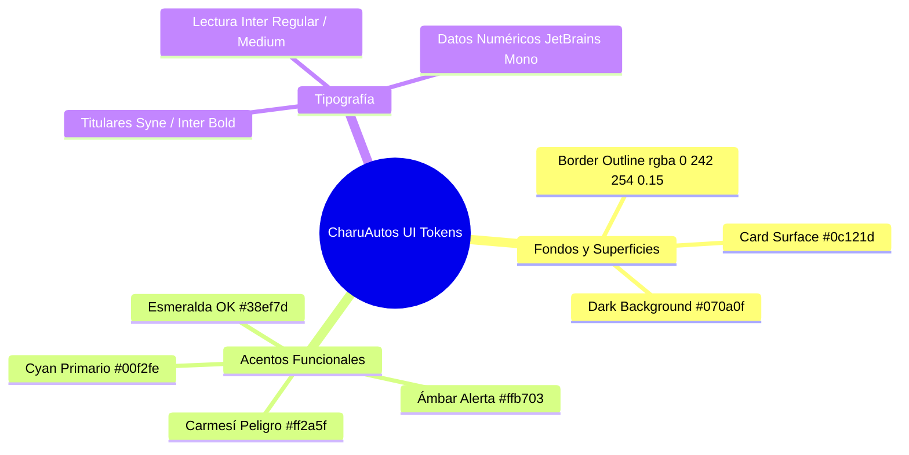
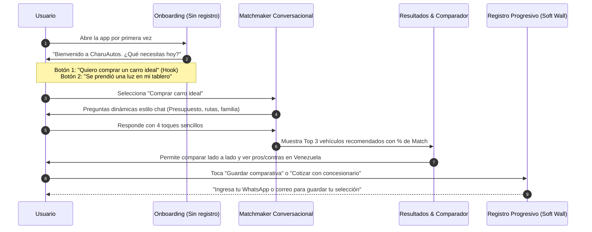

# Sección 06: Diseño UI/UX y Experiencia del Usuario
### Sistema de Diseño "Dark Showroom", Wireflows de Baja Fricción y Psicología del Conductor
*Enfocado en accesibilidad, legibilidad en autopista y reducción del estrés ante emergencias mecánicas.*

---

## 6.1. Sistema de Diseño: "Dark Showroom" Design Tokens

La estética visual de **CharuAutos App** extiende la línea de diseño de la marca: una atmósfera moderna, nocturna y premium inspirada en los tableros de instrumentos deportivos, que además **reduce drásticamente el consumo de batería en pantallas OLED** de teléfonos celulares:

### Tabla Canónica de Design Tokens (Tailwind CSS / NativeWind):

| Token Semántico | Valor Hex / RGBA | Uso en Interfaz |
| :--- | :--- | :--- |
| `color-bg-base` | `#070a0f` | Fondo principal de todas las vistas de la app. |
| `color-surface-card` | `#0c121d` | Fondo de tarjetas, módulos interactivos y modales. |
| `color-primary-cyan` | `#00f2fe` | Botones de acción principal (CTA), barras de progreso, iconos clave. |
| `color-accent-amber` | `#ffb703` | Advertencias preventivas, nivel 2 de OBD2, insignias Pro. |
| `color-danger-crimson` | `#ff2a5f` | Alertas críticas de semáforo rojo (Detener auto), servicios vencidos. |
| `color-success-emerald`| `#38ef7d` | Nivel 1 de OBD2, mantenimientos al día, Health Score > 85%. |
| `color-text-primary` | `#f8fafc` | Titulares, nombres de vehículos, cifras monetarias principales. |
| `color-text-muted` | `#94a3b8` | Textos explicativos secundarios, fechas y labels de soporte. |

---

## 6.2. Wireflows del Onboarding y Flujo del Matchmaker

El diseño prioriza el valor inmediato (*Time-to-Value < 45 segundos*):

### Reglas de Diseño de la Entrevista Conversacional:
1. **Un solo concepto por pantalla:** Evitar formularios kilométricos que generen fatiga mental.
2. **Controles Táctiles Masivos:** Los botones de opción tienen un alto mínimo de **56dp** con feedback háptico (vibración sutil), diseñados para ser operados cómodamente con una sola mano.
3. **Barra de Progreso Reactiva:** Un indicador visual superior con la mascota **Charu** avanzando a lo largo de una pista de carreras para mantener la gamificación.

---

## 6.3. Interacciones de Baja Fricción Cognitiva y Accesibilidad en Ruta

1. **"Modo Manos Sucias / Emergencia en Autopista":**
   - Cuando el usuario accede a la sección de emergencias (ej. cambio de llanta o código OBD2 crítico), la interfaz entra en modo de alto contraste con tipografías ampliadas en un 130% y elementos táctiles gigantes para que puedan accionarse incluso con luz solar intensa en el arcén de la carretera.
2. **Soporte de Lectura Text-to-Speech (Voz):**
   - El protocolo de seguridad para cambio de neumático o diagnóstico crítico incluye un botón de audio para que el conductor pueda escuchar las instrucciones paso a paso mientras tiene las manos ocupadas con las herramientas.
3. **Semáforo Visual Redundante (Diseño para Daltónicos):**
   - Todo estado de advertencia combina **color + icono universal + texto explícito** (ej. 🔴 Círculo Rojo + 🛑 Icono Octagonal + Texto: *"CRÍTICO: DETENER MOTOR"*), garantizando que usuarios con daltonismo no confundan una alerta grave con una leve.
