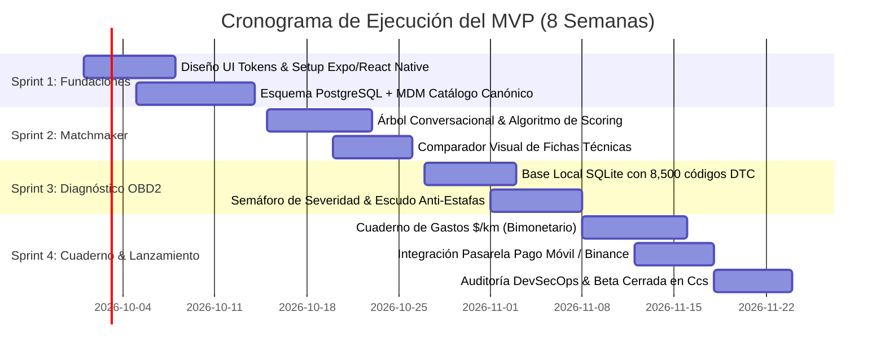

# Sección 07: Plan de Ejecución, Roadmap y Go-To-Market (Venezuela)
### Estrategia de Lanzamiento, Despliegue en 4 Sprints, KPIs de Crecimiento y Mitigación de Riesgos
*Enfocado en alcanzar Product-Market Fit rápido y flujo de caja positivo en los primeros 6 meses.*

---

## 7.1. Plan de Desarrollo del MVP en 4 Sprints (8 Semanas)

El cronograma prioriza la entrega continua del valor principal (Matchmaker y Diagnóstico Manual) con la mínima sobrecarga de infraestructura:



### Detalle de Entregables por Sprint:
- **Sprint 1 (Días 1 a 14):** Base del proyecto en React Native (Expo) con TypeScript y NativeWind. Base de datos PostgreSQL con extensión pgvector y tablas canónicas del MDM vehicular de los 100 modelos más comunes en Venezuela.
- **Sprint 2 (Días 15 a 28):** Módulo funcional del **Matchmaker de compra**. Chatbot interactivo y vista comparativa lado a lado con fichas técnicas traducidas.
- **Sprint 3 (Días 29 a 42):** Módulo del **Asistente Mecánico OBD2 manual**. Buscador reactivo por código DTC con semáforo ISO de severidad, desglose de causas raíz 80/20 y generador del "Escudo Anti-Estafas".
- **Sprint 4 (Días 43 a 56):** Cuaderno de Mantenimiento con timeline interactivo y cálculo bimonetario de costo por kilómetro ($/km y Bs./km). Pruebas de seguridad DevSecOps y lanzamiento de la Beta Privada para los primeros 300 conductores en Caracas y Valencia.

---

## 7.2. Estrategia Go-To-Market (GTM) para Venezuela

```mermaid
flowchart TD
    subgraph Canales de Adquisición Orgánica (Top of Funnel)
        A1["📱 TikTok & Reels (@charuautopics)<br>Videos virales: 'Los 3 carros que NO debes comprar en Venezuela'<br>'¿Qué significa la luz amarilla de tu Aveo?'"]
        A2["👥 Comunidades de Marca en WhatsApp / Telegram<br>Club Aveo, Club Corolla, Propietarios Changan"]
        A3["📚 Ebooks e Historietas de CharuAutos<br>(Funnels de conversión desde los lectores interactivos)"]
    end

    subgraph Activación del Usuario (Middle of Funnel)
        M1["🚀 Matchmaker Gratuito en la App<br>(Compartir ficha comparativa en historias de Instagram)"]
    end

    subgraph Monetización & Alianzas (Bottom of Funnel)
        B1["🏢 Concesionarios de Nuevos / Usados<br>(Venta de leads calificados)"]
        B2["🔧 Red Piloto de 10 Talleres Éticos en Caracas<br>(Boleíta, Los Ruices, Chacao, Las Mercedes)"]
        B3["💎 Suscripción CharuPro (Pago Móvil / USDT)"]
    end

    A1 & A2 & A3 --> M1
    M1 --> B1 & B2 & B3
```

### 1. El Gancho Viral en Redes Sociales
- Aprovechar la marca y personalidad ya construida de **CharuAutos** (`@charuautopics`) con micro-videos de humor y educación que confrontan mitos populares de la mecánica venezolana (ej. el mito de echarle agua al radiador, o la trampa de los talleres tramposos tipo *Don Chanchullo*). Cada video cierra con un llamado a la acción: *"Descarga CharuAutos y usa el Matchmaker gratis antes de comprar carro"*.

### 2. Alianzas Piloto de Talleres Mecánicos
- Reclutamiento de **10 talleres mecánicos de prestigio** en la Gran Caracas (zonas industriales de Boleíta, Los Ruices, San Martín, Chacao).
- Para ser admitidos, los talleres firman el **Manifiesto Ético CharuAutos**: entregar siempre las piezas viejas retiradas al cliente, no alterar presupuestos sin autorización previa y otorgar un 10% de descuento a miembros *CharuPro*.

---

## 7.3. Métricas Clave de Éxito (KPIs) y Matriz de Mitigación de Riesgos

### 1. Cuadro de Mando de KPIs (Primeros 90 Días Post-Lanzamiento)
- **Adquisición:** 5,000 descargas orgánicas.
- **Activación:** > 65% de los usuarios completan al menos una consulta en el Matchmaker o ingresan un código DTC en sus primeras 48 horas.
- **Retención (D30):** > 28% de retención activa a los 30 días mediante el registro de gastos de combustible o recordatorios de mantenimiento.
- **Conversión Monetaria:**
  - 3.5% de conversión a suscripción *CharuPro*.
  - Al menos 60 leads de compra referidos a concesionarios/agencias.

---

### 2. Matriz de Mitigación de Riesgos

| Riesgo Identificado | Nivel de Impacto | Estrategia Concreta de Mitigación |
| :--- | :---: | :--- |
| **Riesgo Cambiario e Hiperinflación** | Alto | Toda la contabilidad interna y precios base de la app se tasan en **USD**. Los pagos en Bolívares se calculan en tiempo real consumiendo la API de la tasa oficial del Banco Central de Venezuela (BCV). |
| **Intermitencia de Conectividad Eléctrica y Móvil** | Alto | **Arquitectura 100% Local-First:** El motor de búsqueda de códigos OBD2, la guía de emergencias y el registro de combustible funcionan sin internet gracias a la base de datos local SQLite cifrada. |
| **Falsos Diagnósticos Mecánicos / Responsabilidad Legal** | Medio | En todos los diagnósticos se incluye un descargo de responsabilidad legal claro: la app actúa como herramienta informativa y educativa de referencia, no como peritaje pericial vinculante. |
| **Fricción en Métodos de Pago Locales** | Medio | Integración prioritaria de **Pago Móvil P2P/C2P** automatizado junto con **Binance Pay (USDT)** para permitir pagos directos sin necesidad de tarjetas de crédito internacionales. |
