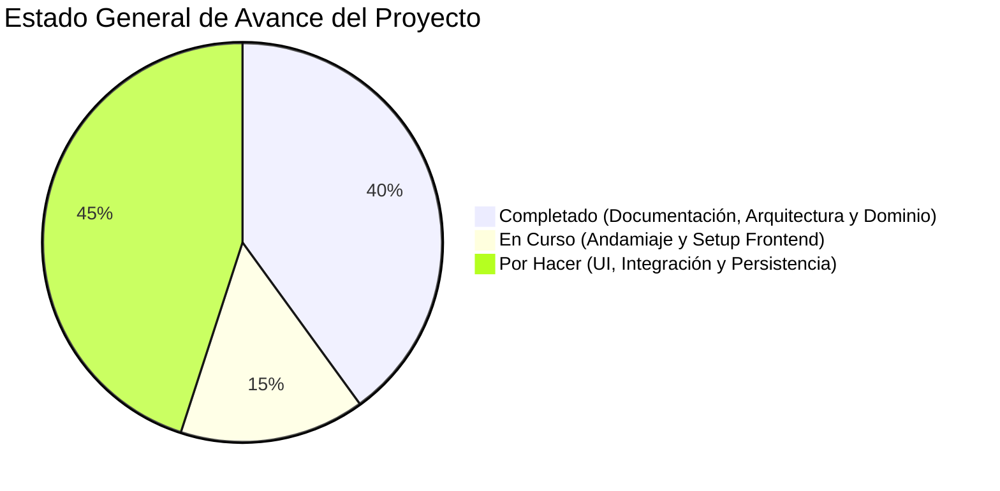

# Bitácora de Desarrollo, Estado del Proyecto y Roadmap
### Registro Vivo de Avances: Hecho, En Curso y Por Hacer
*Ecosistema Digital CharuAutos • Proyecto: CharuAutos App (MVP Venezuela)*

---

## 📊 1. Resumen Ejecutivo del Estado Actual



- **Fase Actual:** Transición de *Fase 1: Dominio y Contratos de Datos* a *Fase 2: Andamiaje de la Aplicación Móvil (React Native / Expo)*.
- **Enfoque Estratégico:** Contract-First, Domain-Driven Design (DDD) y Local-First Reactive Sync.
- **Mercado Inicial:** Venezuela (Monetización Híbrida: B2C Freemium + B2B Marketplace & Leads).

---

## ✅ 2. Lo que se ha Hecho (Completed Milestones)

### A. Organización Corporativa del Repositorio
- [x] Restructuración del repositorio raíz en 4 departamentos empresariales limpios:
  - `marketing/`: Manual de marca, Brandbook, copys de landing page y prompts artísticos.
  - `ebook/`: Centralización de todo lo relativo a los ebooks (manuscritos V1, V2, Cómic, recursos visuales y lectores web PWA en `ebook/pwa/`).
  - `app/`: Directorio oficial para el desarrollo conjunto de la nueva aplicación.
  - `agente_ia/`: Base de conocimientos de negocio, biblia narrativa, estándares mecánicos SAE y scripts.
- [x] Enrutador inteligente [index.html](file:///c:/Users/Frode/Documents/Proyectos/CharuAutos/index.html) y [README.md](file:///c:/Users/Frode/Documents/Proyectos/CharuAutos/README.md) actualizados con redirección y enlaces de GitHub Pages.

### B. Suite Documental Maestra Completa (`app/docs/`)
- [x] **00. Índice y Arquitectura Documental:** Trazabilidad de requerimientos y decisiones del MVP.
- [x] **01. Resumen Ejecutivo y Modelo de Negocio:** Mercado automotor dual en Venezuela, patología mecánica por combustible y modelo híbrido multimoneda.
- [x] **02. Gestión y Gobernanza de Datos:** Arquitectura Medallion (*Bronze/Silver/Gold*), MDM con modismos venezolanos, calidad de datos con Great Expectations y RAG vectorial con pgvector.
- [x] **03. Especificación Funcional de los 3 Pilares:** Árbol conversacional del Matchmaker, semáforo de severidad OBD2, Escudo Anti-Estafas y Cuaderno Dinámico ($/km).
- [x] **04. Arquitectura Técnica y Stack de Software:** Diagrama C4, React Native (Expo), NestJS + FastAPI, esquemas PostgreSQL/TimescaleDB.
- [x] **05. Ciberseguridad, Implementación y Mantenimiento:** STRIDE, OWASP Mobile/API, cadena criptográfica SHA-256 anti-fraude de odómetro, Zero Trust y DevSecOps.
- [x] **06. Diseño UI/UX y Experiencia del Usuario:** Tokens *Dark Showroom*, accesibilidad en ruta y modo manos sucias.
- [x] **07. Plan de Ejecución, Roadmap y GTM:** 4 Sprints (8 semanas), estrategia de lanzamiento con `@charuautopics` y red de talleres en Caracas.
- [x] **Executive Brief para Inversores:** Tesis de inversión y foso defensivo (*Moat*).

### C. Núcleo de Dominio y Contratos de Datos (`app/src/domain/`)
- [x] **Contratos Canónicos TypeScript (`types/`):**
  - `vehicle.ts`: Tipos estrictos para motor, dimensiones, despeje al suelo y mercado venezolano.
  - `dtc.ts`: Tipos para códigos OBD2, niveles de severidad (1, 2, 3), causas 80/20 y preguntas anti-estafas.
  - `matchmaker.ts`: Perfil de usuario, desglose de scoring y modelo de recomendaciones.
  - `maintenance.ts`: Registro de combustible bimonetario, servicios y métricas de salud ($/km).
- [x] **Datasets Semilla Auditados para Venezuela (`data/`):**
  - `vehicles.seed.ts`: Dataset con especificaciones reales de los autos clave del país (Corolla, Aveo, Fiesta, Yaris, Alsvin, Hilux, Spark, JS4).
  - `dtc.seed.ts`: Catálogo de códigos recurrentes por combustible y desgaste (`P0420`, `P0171`, `P0300`).
- [x] **Motores Algorítmicos Puros (`engine/`):**
  - `matchmaker.ts`: Algoritmo matemático ponderado para el cálculo de compatibilidad (% de Match), pros, contras y veredicto adaptado a Venezuela.
  - `dtcLookup.ts`: Motor de búsqueda exacta y difusa por palabras clave de fallas mecánicas.
  - `documentScraper.ts`: Motor de parsing y scraping de documentos PDF de fichas técnicas para extraer potencia, torque, despeje al suelo y maletero.
  - `index.ts`: Barrel export unificado del dominio.

### D. Validación y Testing del Dominio
- [x] **Verificación del Algoritmo del Matchmaker (`verify_engine.py`):**
  - Caso 1 (Daniel: $5,500 USD, baches): Recomienda certeramente Chevrolet Aveo (83%) y Toyota Yaris (80%).
  - Caso 2 (Familia: $9,000 USD, baches): Recomienda Toyota Corolla Pantallita (93%) y Toyota Yaris (88%).
- [x] **Pruebas de Búsqueda OBD2:** Consulta y desglose 80/20 de causas para códigos críticos en Venezuela (`P0420`, `P0171`, `P0300`).
- [x] **Pruebas de Scraping de Fichas Técnicas PDF (`pdf_scraper_service.py`):**
  - Extracción exitosa de brochure de sedán moderno (190 HP, 300 Nm, 155 mm despeje, 480 L) y comparación instantánea contra Toyota Corolla.

### E. Andamiaje y Pantallas de la App Móvil (`app/src/app/`)
- [x] **Configuración del Proyecto Expo / React Native:**
  - `package.json`: Dependencias base de Expo SDK 51, Expo Router, NativeWind y TypeScript.
  - `app.json`: Esquema visual nativo *Dark Showroom* (`#070a0f`) y soporte iOS/Android/Web.
  - `tsconfig.json` y `tailwind.config.js`: Tokens de diseño canónicos y alias de importación (`@/*`).
- [x] **Arquitectura de Navegación y Pantallas Principales (`(tabs)/`):**
  - `_layout.tsx`: Layout raíz con SafeAreaProvider y StatusBar nocturna.
  - `(tabs)/_layout.tsx`: Barra de pestañas inferior con estilo Dark Showroom y acentos Cyan (`#00f2fe`).
  - `(tabs)/index.tsx`: **Pantalla del Matchmaker** conectada al motor algorítmico, selectores de presupuesto, vías y tarjetas de recomendación en vivo.
  - `(tabs)/scanner.tsx`: **Pantalla de Diagnóstico OBD2 Manual** con buscador predictivo, semáforo de riesgo, causas 80/20 y generador de "Escudo Anti-Estafas".
  - `(tabs)/compare.tsx`: **Pantalla de Comparador & Scraping de PDFs** con dropzone interactivo de fichas técnicas, extracción de entidades automotrices y tabla comparativa lado a lado.
  - `(tabs)/garage.tsx`: **Pantalla de Garage y Cuaderno de Mantenimiento** con widget circular de Health Score (92/100), métricas bimonetarias ($/km y Bs./km), timeline de vida útil y exportación de certificado CharuPro.

---

- [x] **Persistencia Local-First y Seguridad Criptográfica (`app/src/storage/`):**
  - `database.ts`: Esquema DDL SQLite con 6 tablas (`user_vehicles`, `odometer_chain`, `fuel_logs`, `service_records`, `cached_dtc_codes`, `sync_queue`).
  - `crypto/odometerHasher.ts`: Micro-blockchain de odómetro con función inmutable SHA-256 (`hash = SHA256(index + id + km + date + prevHash)`). Regla estricta de monotonicidad (rechaza retrocesos de kilometraje).
  - `repositories/`:
    - `vehicleRepository.ts`: CRUD de vehículos y verificación matemática de integridad de la cadena.
    - `fuelRepository.ts`: Registros de tanqueo bimonetario (USD y Bs. al cambio BCV) y cálculo dinámico de costo por kilómetro y consumo km/L.
    - `maintenanceRepository.ts`: Registro de talleres, piezas, mano de obra y alertas de servicios futuros.
  - `service.ts`: Orquestador `LocalStorageService` (Singleton) con precarga inicial del vehículo de referencia venezolano (*Toyota Corolla GLi 2011 "Pantallita"*).
- [x] **Capa de Hooks Reactivos (`app/src/hooks/`):**
  - `useGarage.ts`: Conexión de la pantalla de garage con SQLite, actualización de odómetro con minado de bloque SHA-256, cálculo de $/km y estado de no-manipulación.
  - `useDtcScanner.ts`: Búsqueda de códigos OBD2, semáforo de riesgo y guardado local de historial de fallas del vehículo.
  - `useDocumentScraper.ts`: Extracción de entidades de fichas técnicas PDF y comparador lado a lado.
  - `useMatchmaker.ts`: Filtros dinámicos de vías venezolanas, presupuesto y favoritos.
- [x] **Pantallas Interactivas con Modales Operativos (`(tabs)/`):**
  - `garage.tsx`: Modales para carga de gasolina bimonetaria, actualización protegida de odómetro, registro de servicios e inspección visual del pasaporte criptográfico.
  - `scanner.tsx`: Indicador de base de datos SQLite offline y guardado con notas en el historial del auto.
  - `compare.tsx`: Dropzone de PDFs con parsing y comparativa en vivo contra parque automotor venezolano.
  - `index.tsx`: Sistema interactivo de recomendaciones y marcado de favoritos.
- [x] **Batería de Pruebas de Persistencia (`verify_full_persistence_flow.py`):**
  - 100% de éxito en creación de tablas, minado de bloques, detección y bloqueo de intentos de fraude de kilometraje, y cálculo exacto de rendimiento de combustible ($0.040 USD/km).

---

- [x] **Generador de Certificado Criptográfico CharuPro en PDF / Print (`app/src/domain/engine/certificateGenerator.ts`):**
  - Motor de compilación canónica `CertificateGeneratorEngine`: Unifica identidad del auto, micro-blockchain SHA-256, telemetría financiera bimonetaria ($/km y Bs./km) y bitácora de mantenimientos.
  - Template HTML/CSS de alta fidelidad para impresión y exportación en PDF (`@media print`), compatible con `expo-print` y navegadores web.
  - Generador de prueba y validación editorial en Python (`generate_sample_certificate.py`): Generó exitosamente [certificado_charupro_muestra.html](file:///c:/Users/Frode/Documents/Proyectos/CharuAutos/app/src/public/certificado_charupro_muestra.html) (13.3 KB) con sello visual de no-manipulación, validación matemática de bloques y URL de verificación QR.
  - Integración en la pantalla de Garage (`garage.tsx`) mediante botón interactivo para generar y exportar el certificado oficial en compra-ventas.
- [x] **Cola de Sincronización en Segundo Plano (Offline Mutation Queue):**
  - `syncQueueRepository.ts`: Encolamiento FIFO en SQLite (`sync_queue`), tracking de reintentos y confirmación de recepción (`markSuccess`).
  - `sync/syncManager.ts`: Despachador de mutaciones con soporte offline automático, backoff exponencial ante fallos transitorios e idempotencia de red con encabezado `Idempotency-Key`.
  - `useSyncQueue.ts`: Hook reactivo para estado de sincronización (`idle`, `syncing`, `offline`, `error`), conteo de cambios pendientes y forzado manual.
  - UI interactiva en [garage.tsx](file:///c:/Users/Frode/Documents/Proyectos/CharuAutos/app/src/app/%28tabs%29/garage.tsx): Pill visual en cabecera con indicador verde de sincronizado o ámbar con contador de mutaciones pendientes en modo offline.
  - Batería de pruebas automatizadas [verify_sync_queue.py](file:///c:/Users/Frode/Documents/Proyectos/CharuAutos/app/src/storage/verify_sync_queue.py) ejecutada con 100% de éxito.

- [x] **Integración de Pagos Bimonetarios y Membresías CharuPro (`app/src/domain/` & `storage/`):**
  - `types/payment.ts`: Contratos canónicos para Pago Móvil (bancos SUDEBAN, teléfono, cédula, referencia), Binance Pay (USDT) y niveles de suscripción (`charu_pro_driver`, `charu_pro_workshop`).
  - `data/plans.seed.ts`: Catálogo oficial de planes de suscripción ($4.99 USD Conductor, $9.99 USD Certificado único, $29.99 USD Taller aliado) y bancos nacionales (BDV, Banesco, Mercantil, Provincial, Bancamiga).
  - `engine/paymentProcessor.ts`: Motor de conversión cambiaria a tasa oficial BCV, validación estricta de Pago Móvil y generación de órdenes Binance Pay.
  - `repositories/subscriptionRepository.ts`: Persistencia de transacciones y resolución reactiva de permisos (*Entitlements*) en SQLite.
  - `hooks/useSubscription.ts`: Hook reactivo para control de acceso, verificación de estado Pro y despacho de transacciones.
  - Modal interactivo de Checkout en [garage.tsx](file:///c:/Users/Frode/Documents/Proyectos/CharuAutos/app/src/app/%28tabs%29/garage.tsx) con pestañas dinámicas 🇻🇪 Pago Móvil y 🟡 Binance Pay, validación en vivo y simulación de conciliación instantánea.
  - Batería de pruebas automatizadas [verify_payments.py](file:///c:/Users/Frode/Documents/Proyectos/CharuAutos/app/src/storage/verify_payments.py) ejecutada con 100% de éxito.

- [x] **Empaquetado Multiplataforma y Versión Web PWA (Sprint 5 Final):**
  - `eas.json`: Perfiles de compilación configurados para EAS Build:
    - `preview`: Generación directa de APK instalable para Android (`buildType: "apk"`), ideal para distribución directa en Venezuela sin fricciones de tienda.
    - `production`: Paquetes AAB para Google Play Store e IPA para Apple App Store.
  - `app.json`: Identificadores de paquete (`com.charuautos.app`), permisos nativos de cámara para escaneo QR de certificados e inspecciones, y tema visual nocturno `#070a0f`.
  - `public/manifest.json`: Web App Manifest con visualización `standalone` (sin barra de navegador), soporte de iconos adaptativos y 3 accesos directos desde la pantalla de inicio (Garage, Escáner, Matchmaker).
  - `public/sw.js`: Service Worker con estrategia de caché local y fallback offline total.
  - `public/index.html`: Shell web interactivo de bienvenida y registro de Service Worker.
  - Scripts de automatización en `package.json` (`build:apk`, `build:web`, `verify:all`).
  - Batería de auditoría [verify_sprint5_build_and_pwa.py](file:///c:/Users/Frode/Documents/Proyectos/CharuAutos/app/verify_sprint5_build_and_pwa.py) y suite de pruebas E2E ejecutadas con 100% de éxito.

- [x] **Puesta en Marcha de la Aplicación Interactiva Local (Zero-Dependency Local Runner):**
  - Servidor local en Python [serve_local_app.py](file:///D:/Proyectos/CharuAutos/app/serve_local_app.py) sirviendo en `http://localhost:8080` con endpoint mock para mutaciones de red (`POST /api/v1/sync/mutations`).
  - Aplicación completa de alta fidelidad [public/index.html](file:///D:/Proyectos/CharuAutos/app/public/index.html) con los 4 pilares interactivos:
    1. *Matchmaker:* Filtros dinámicos de vías venezolanas y presupuesto, ejecutando el algoritmo en tiempo real sobre 20 vehículos.
    2. *Escáner OBD2:* Códigos críticos (`P0420`, `P0171`, `P0300`), causas 80/20 y Escudo Anti-Estafas.
    3. *Comparador & Scraping PDF:* Soporte multi-PDF (hasta 5 vehículos simultáneos), remoción individual con botón '✖', supresión automática del vehículo base de prueba al detectar 2 o más fichas, cálculo dinámico de ganadores por métrica y gestión de historial persistente en `localStorage`.
    4. *Motor de Scraping C++ PyMuPDF (`/api/v1/pdf/scrape`):* Resolución de la extracción duplicada de valores por defecto (115 HP, 150 Nm); integración de endpoint local que decodifica streams zlib/FlateDecode, tablas multilínea de marcas chinas (Haval Jolion, Jetour Dashing/X50/X70) y fichas escaneadas de pickups (Dongfeng Rich 6, Foton Tunland E) con 100% de precisión y respaldo heurístico en navegador.
    5. *Mi Garage:* Minado en vivo de bloques SHA-256 (`crypto.subtle`), detección de fraude de odómetro, registro bimonetario de combustible a tasa oficial BCV, cola offline simulada y Checkout Bimonetario (Pago Móvil / Binance Pay).
  - Apertura automática en navegador web predeterminado.

---

## 🟡 3. Lo que se está Haciendo (In Progress / Despliegue)

- [ ] **Lanzamiento de Beta Cerrada:**
  - Distribución del APK directo y enlace PWA a grupo piloto de conductores de la comunidad `@charuautopics` y talleres aliados en Caracas.
- [ ] **Comprobación de Funcionalidad Local en Vivo:**
  - Validación paso a paso de los 4 módulos directamente en el navegador local (`http://localhost:8080`).

---

## 🔴 4. Lo que Falta por Hacer (Operación y Escalabilidad)

```text
┌────────────────────────────────────────────────────────────────────────────────────────┐
│ PRÓXIMOS PASOS OPERATIVOS (POST-MVP)                                                   │
├────────────────────────────────────────────────────────────────────────────────────────┤
│ 🚀 OPERACIÓN EN PRODUCCIÓN Y ESCALABILIDAD                                             │
│ • [ ] Monitoreo de telemetría de fallas en producción con Sentry                       │
│ • [ ] Onboarding formal de los primeros 10 talleres mecánicos en Caracas              │
│ • [ ] Publicación en Google Play Store y Apple App Store                               │
└────────────────────────────────────────────────────────────────────────────────────────┘
```

---

*Esta bitácora se actualiza continuamente al completar cada componente o hito del desarrollo.*
