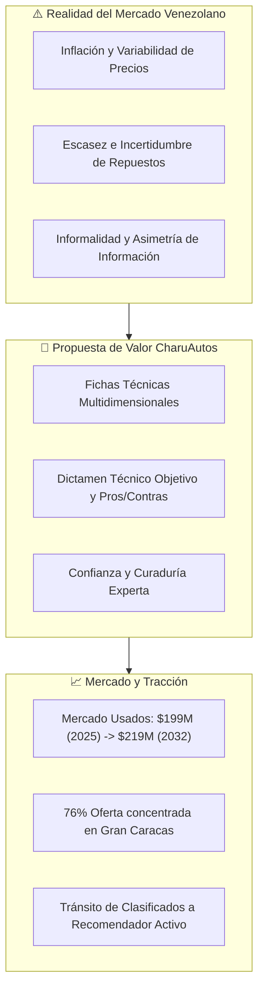
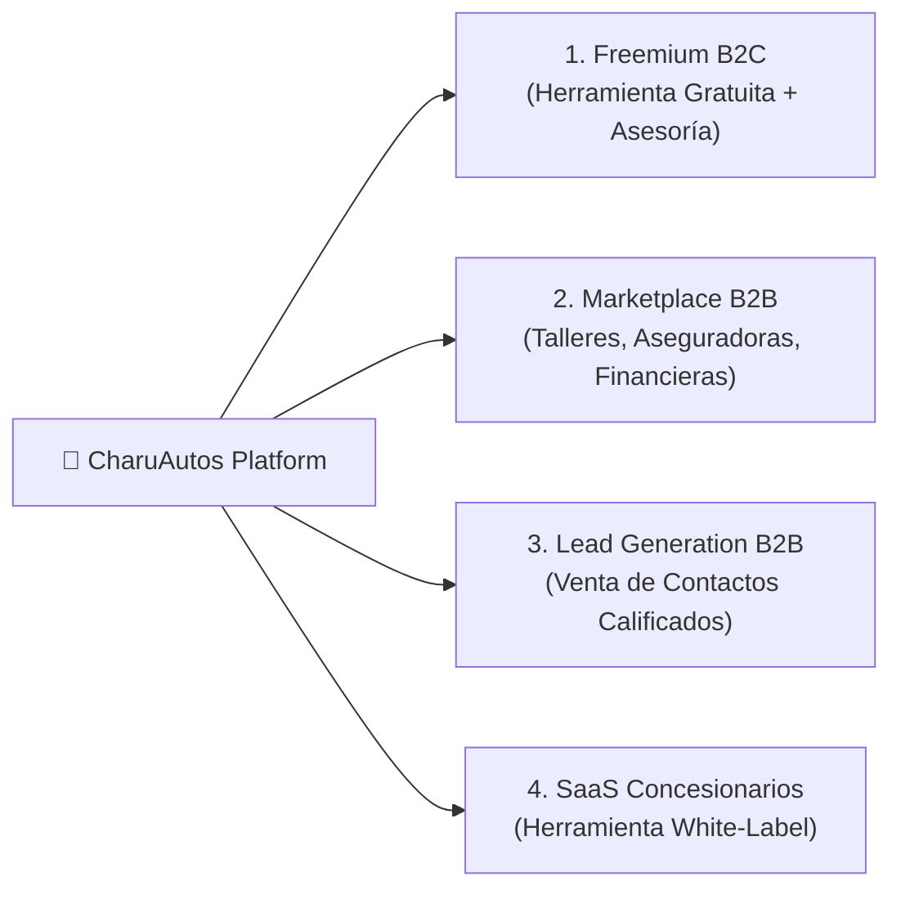
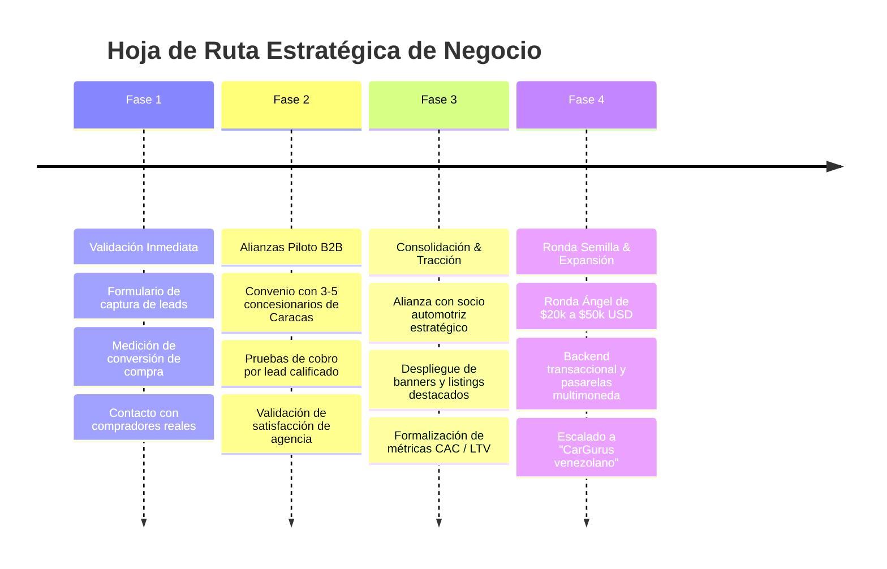

# 💡 Ideas del Proyecto — Ideas de Monetización y Factibilidad de Negocio

> **Documento:** Ideas del Proyecto & Estrategias de Monetización  
> **Proyecto:** CharuAutos App (MVP Venezuela)  
> **Área:** Negocio, Finanzas & Tesis de Inversión  
> **Fuente de Entrada:** Evaluación Estratégica de Inversor y Emprendedor  
> **Fecha:** Septiembre 2026  

---

## 🎯 1. Resumen Ejecutivo

CharuAutos representa una propuesta de valor de alto impacto en el ecosistema automotriz venezolano al abordar la asimetría de información en la compra de vehículos usados mediante **asesoría y dictámenes técnicos curados**. 

A diferencia de los portales de clasificados tradicionales (*Mercado Libre*, *tuBurra*), el diferencial clave no es solo listar autos, sino brindar certidumbre, comparativas técnicas objetivas y transparencia en un entorno desafiante (inflación, repuestos escasos, informalidad).

### Principales Conclusiones de la Evaluación:
1. **Factibilidad:** Proyecto altamente factible como nicho especializado. Para escalar y ser rentable a largo plazo, debe transicionar de una herramienta de contenido/asesoría hacia un **modelo híbrido transaccional (Marketplace + SaaS + Lead Gen)**.
2. **Mercado Objetivo:** Mercado estimado en **USD 199 millones (2025)** proyectado a **USD 219 millones (2032)** con CAGR de 1.2%, con una alta concentración geográfica (**76% en la Gran Caracas / Región Capital**).
3. **Estrategia de Monetización Inmediata:** Iniciar con **publicidad contextual y venta de leads calificados a concesionarios**, para luego incorporar **suscripciones premium para compradores** y **software SaaS white-label para agencias**.
4. **Visión:** Posicionarse como el **"CarGurus venezolano"** mediante alianzas estratégicas con 3-5 concesionarios piloto y una ronda ángel de validación (USD 20k–50k).

---

## 📊 2. Análisis de Factibilidad y Diagnóstico de Mercado



### 2.1. Propuesta de Valor y Diferenciación
* **El Problema:** La adquisición de vehículos usados en Venezuela depende históricamente de recomendaciones empíricas o boca a boca, con un alto riesgo de estafas mecánicas o sobreprecios.
* **La Solución CharuAutos:** Sistema de recomendación inteligente con fichas técnicas, pros/contras y dictamen técnico adaptado a repuestos, combustible y topografía venezolana.
* **Foso Defensivo (Moat):** Curaduría técnica especializada y análisis contextualizado de fiabilidad, frente a portales que solo ofrecen listados planos de anuncios.

### 2.2. Riesgos Críticos y Estrategias de Mitigación

| Riesgo Detectado | Impacto | Estrategia de Mitigación / Solución |
| :--- | :--- | :--- |
| **Dependencia de datos dinámicos** | Alto | Pipelines de ingesta continua (web scraping + crowdsourcing de precios en talleres y concesionarios). |
| **Monetización incierta en MVP** | Medio-Alto | Implementación modular de fuentes de ingreso desde el día 1 (Lead gen B2B primero, freemium después). |
| **Escalabilidad y pasarelas de pago** | Alto | Esquema bimonetario dual: pagos locales en Bs (Pago Móvil / API bancaria) y divisas (Binance Pay / USDT / Zelle / Stripe). |
| **Reacción de competidores grandes** | Medio | Mantener el foco en la profundidad del diagnóstico técnico y la experiencia del usuario (UI/UX asistida y RAG automotriz). |

---

## 🏢 3. Modelo de Negocio Híbrido

CharuAutos consolida su modelo combinando adquisición masiva de tráfico con servicios B2B de alto valor:



1. **Freemium + Contenido de Alto Valor:**
   * La herramienta base (búsqueda, catálogo y comparador) se mantiene gratuita para generar volumen de usuarios y retención orgánica.
   * Funcionalidades avanzadas (historial profundo de precios, reportes de inspección y alertas tempranas) integradas en nivel Premium.
2. **Marketplace de Servicios Automotrices Conectados:**
   * Conexión directa entre compradores y ecosistema de postventa: talleres mecánicos certificados, tiendas de repuestos, casas de cambio de aceite y aseguradoras.
3. **Generación de Leads Calificados (Lead Gen B2B):**
   * Debido a que el usuario filtra activamente por presupuesto, uso previsto, año y tipología de motor, CharuAutos captura intención de compra en etapa final del embudo (High Intent).
   * Los concesionarios y vendedores pagan por leads verificados y pre-cualificados.
4. **SaaS White-Label para Concesionarios y Agencias:**
   * Módulo de recomendación y asesoría técnica integrable en los sitios web o plataformas de inventario de concesionarios para elevar su ratio de conversión.

---

## 💰 4. Matriz Estratégica de Fuentes de Monetización

| Fuente de Ingreso | Descripción y Mecánica | Potencial de Retorno | Esfuerzo de Implementación |
| :--- | :--- | :---: | :---: |
| **Comisión por Lead / Venta Calificada** | Cobro a concesionarios y agencias por cada contacto con intención validada que agenda visita o compra (modelo *pay-per-lead* o *success fee*). | **Alto** | Medio |
| **Publicidad Contextual y Listings Destacados** | Banners segmentados, patrocinios de marca y posicionamiento destacado para talleres de repuestos, lubricantes y concesionarios. | **Alto** | Bajo (Quick Win) |
| **Suscripción Premium B2C ("CharuPro")** | Informes detallados ilimitados, alertas instantáneas de oportunidades por debajo del valor de mercado y soporte preferencial. | **Medio** | Medio |
| **Venta de Datos Agregados e Inteligencia de Mercado** | Reportes de tendencias de precios, índices de depreciación y demanda por modelo para aseguradoras, bancas y distribuidores de repuestos. | **Medio** | Medio-Alto |
| **Afiliación con Financieras y Aseguradoras** | Comisión por referir usuarios validados a microcréditos vehiculares, pólizas RCV o seguros de pérdida total. | **Medio** | Medio |
| **Servicios de Inspección Pre-Compra** | Alianza con redes de talleres mecánicos afiliados para prestar servicio de peritaje técnico a domicilio con margen compartido. | **Bajo-Medio** | Alto |

---

## 🚀 5. Hoja de Ruta de Validación y Escala (Recomendaciones del Inversor)



### Plan de Acción Inmediato (Next Steps):
1. **Validación de Demanda en la App:** Incorporar botón de contacto y reserva directa de vehículos para medir tasa de clics (CTR) e intención transaccional real.
2. **Alianza Piloto con 3-5 Concesionarios en Caracas:** Presentar la propuesta de leads pre-cualificados a agencias de la zona capital (donde reside el 76% del volumen).
3. **Incorporación de Socio del Sector Automotriz:** Sumar un asesor o socio comercial con trayectoria en compra-venta de vehículos para acelerar la firma de acuerdos.
4. **Preparación de Ronda de Inversión Ángel:** Armar un pitch enfocado en unit economics, captación y monetización para levantar entre **USD 20,000 y USD 50,000**, destinados al desarrollo backend y consolidación operativa.

---

## 📎 6. Anexo: Texto Original de la Evaluación del Inversor

```text
Como inversor y emprendedor, he analizado el proyecto CharuAutos y a continuación presento mi evaluación. Se trata de un MVP (Producto Mínimo Viable) desplegado en GitHub Pages, que funciona como un recomendador experto de autos usados para el mercado venezolano. La propuesta es interesante, pero requiere una estrategia clara para convertirse en un negocio sostenible.

---

📊 Evaluación de Factibilidad

Producto y propuesta de valor:
CharuAutos resuelve un problema real: la compra de un auto usado en Venezuela es compleja por la inflación, la escasez de repuestos y la informalidad del mercado. La herramienta ofrece fichas técnicas con precios de mercado, pros/contras y un "dictamen técnico" para cada modelo (ej. Chevrolet Aveo, Toyota Yaris, etc.). Esto aporta confianza y transparencia a un comprador que normalmente depende del boca a boca.

Mercado:
El mercado de autos usados en Venezuela se estima en USD 199 millones (2025) con proyección a USD 219 millones (2032), un crecimiento moderado pero constante (CAGR 1.2%). La digitalización avanza: los compradores buscan plataformas que ofrezcan seguridad ante la inestabilidad económica. La zona capital concentra el 76% de la oferta de usados, lo que indica un mercado geográficamente concentrado pero con alto volumen.

Competencia:
Existen portales como tuBurra y Mercado Libre que listan vehículos usados, pero se enfocan en anuncios clasificados. CharuAutos se diferencia al ofrecer asesoría técnica automatizada, un nicho menos atendido. Su ventaja es la curaduría experta; su desventaja es que depende de datos que deben actualizarse constantemente.

Riesgos:

· Dependencia de datos: los precios y la disponibilidad de repuestos cambian rápidamente en Venezuela.
· Monetización incierta: al ser un MVP, no tiene aún un modelo de ingresos definido.
· Escalabilidad: para crecer necesita integraciones con concesionarios, talleres y pasarelas de pago (difíciles en Venezuela).
· Competencia de plataformas grandes: si Mercado Libre o tuBurra añaden funcionalidades similares, el nicho se reduce.

Veredicto de factibilidad: Factible como proyecto de nicho, pero no como negocio de alto crecimiento sin una estrategia de monetización robusta y alianzas locales. Es un producto de contenido/herramienta que puede atraer tráfico, pero debe convertirse en un marketplace o servicio SaaS para generar ingresos recurrentes.

---

🏢 Modelo de Negocio al que se Ajusta

CharuAutos encaja en un modelo híbrido:

1. Freemium + Contenido de valor:
      La herramienta básica es gratuita y atrae usuarios. El valor está en la información curada (dictámenes técnicos). Esto es similar a un medio especializado o un comparador.
2. Marketplace de servicios automotrices:
      Puede evolucionar hacia un marketplace que conecte compradores con concesionarios, talleres mecánicos, aseguradoras y financieras. Los ingresos vendrían de comisiones por lead o suscripciones de proveedores.
3. Generación de leads (Lead Gen):
      Los concesionarios y vendedores particulares pagan por contactos calificados. CharuAutos ya segmenta por presupuesto, uso y años, lo que genera leads de alta intención.
4. SaaS para concesionarios:
      Ofrecer una versión white-label de la herramienta para que los concesionarios la usen en sus webs y mejoren su tasa de conversión.

---

💰 Cómo lo Monetizaría

Propondría múltiples flujos de ingresos para diversificar el riesgo:

Fuente de ingreso | Descripción | Potencial
Suscripción Premium para compradores | Acceso a informes detallados, historial de precios, alertas de nuevas unidades y contacto directo con vendedores verificados. | Medio
Publicidad de concesionarios y talleres | Banners y listings destacados de dealers, talleres de repuestos y servicios de mantenimiento. | Alto
Comisión por lead/venta | Cobrar a concesionarios por cada contacto que concrete una visita o compra (modelo performance-based, como Uobo). | Alto
Venta de datos agregados | Informes de mercado para aseguradoras, financieras y fabricantes (precios, demanda por modelo, etc.). | Medio
Afiliación con financieras | Comisión por referir clientes a créditos automotrices o seguros. | Medio
Servicios de inspección pre-compra | Alianza con talleres para ofrecer inspección técnica a domicilio, con margen por servicio. | Bajo-Medio

Estrategia recomendada:
Comenzar con publicidad y leads (bajo esfuerzo, ingresos rápidos), mientras se construye la base de datos. Luego, introducir suscripción premium para compradores recurrentes y SaaS para concesionarios. La clave está en demostrar tracción (usuarios activos, leads generados) para atraer inversión o alianzas.

---

🚀 Conclusión como Inversor

CharuAutos tiene potencial como proyecto de nicho en un mercado con necesidades no resueltas. Sin embargo, no es un negocio escalable por sí solo sin una capa de servicios transaccionales. Mi recomendación sería:

1. Validar la demanda: lanzar una versión con registro de usuarios y medir cuántos solicitan contacto con vendedores.
2. Cerrar alianzas con 3-5 concesionarios para probar el modelo de leads pagados.
3. Buscar un socio local con experiencia en el sector automotriz para acelerar la credibilidad.
4. Preparar una ronda de inversión ángel (USD 20-50k) para desarrollo de backend y estrategia de monetización.

Si se ejecuta con disciplina, podría convertirse en el "CarGurus venezolano" para el segmento de usados. Pero requiere foco en monetización y alianzas, no solo en la herramienta.
```
