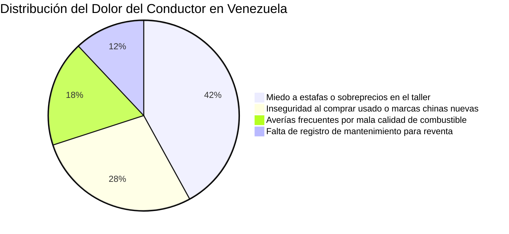
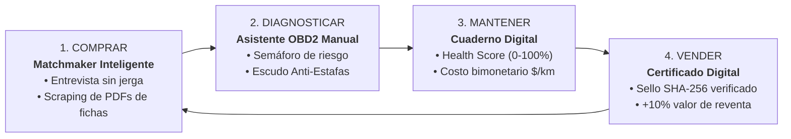
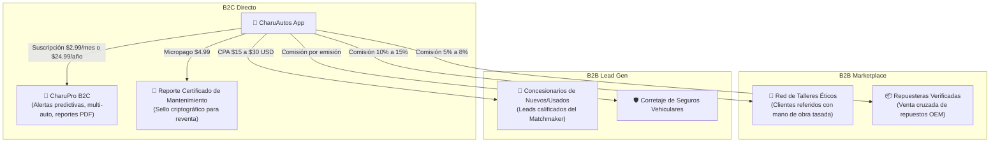
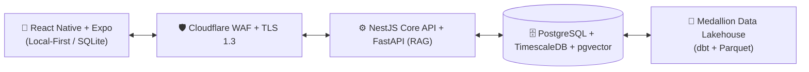
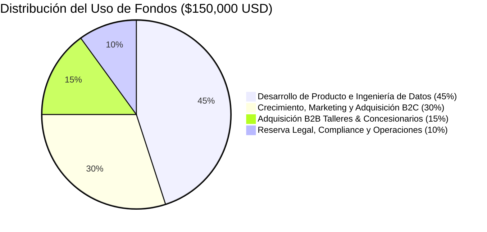

# CharuAutos App — Pitch Deck Maestro para Inversores
### Presentación de Tesis de Inversión, Modelo de Negocio y Escalabilidad
*Confidencial • Ronda Semilla (Seed Round) • Mercado: Venezuela & Región Andina*

---

## 🎯 Diapositiva 1: Portada & Visión Ejecutiva
```text
  ██████╗██╗  ██╗ █████╗ ██████╗ ██╗   ██╗ █████╗ ██╗   ██╗████████╗ ██████╗ ███████╗
 ██╔════╝██║  ██║██╔══██╗██╔══██╗██║   ██║██╔══██╗██║   ██║╚══██╔══╝██╔═══██╗██╔════╝
 ██║     ███████║███████║██████╔╝██║   ██║███████║██║   ██║   ██║   ██║   ██║███████╗
 ██║     ██╔══██║██╔══██║██╔══██╗██║   ██║██╔══██║██║   ██║   ██║   ██║   ██║╚════██║
 ╚██████╗██║  ██║██║  ██║██║  ██║╚██████╔╝██║  ██║╚██████╔╝   ██║   ╚██████╔╝███████║
```
- **Tagline:** *"Pasión Automotriz al Alcance de tus Manos"*
- **Misión:** Democratizar el conocimiento automotriz y erradicar la asimetría de información en la compra, diagnóstico y mantenimiento de vehículos.
- **La Oportunidad:** Construir la super-app y el pasaporte digital del vehículo para más de 5.5 millones de conductores en Venezuela y 45 millones en la región andina.

---

## 🛑 Diapositiva 2: El Gran Problema del Mercado



1. **Desconfianza Endémica (78% de insatisfacción):** Los conductores asisten al taller mecánico con ansiedad, temiendo cobros inflados por fallas inventadas (*"Don Chanchullo"*).
2. **Dilema del Parque Automotor Dual:** Comprar un auto tradicional usado (2000-2015: *Corolla, Aveo, Fiesta*) con riesgo de piezas piratas vs. arriesgarse con la nueva ola de marcas chinas desconocidas (2021-2025: *Changan, JAC, Chery, Dongfeng*).
3. **El Combustible Destruye Componentes:** El octanaje irregular y los sedimentos multiplican las fallas en pilas de gasolina, sensores de oxígeno y catalizadores (DTCs `P0420`, `P0171`, `P0300`).

---

## 💡 Diapositiva 3: La Solución — CharuAutos App

Un ecosistema digital cerrado que acompaña al conductor durante todo el ciclo de vida de su vehículo:



---

## 📈 Diapositiva 4: Tamaño del Mercado (TAM - SAM - SOM)

```text
┌────────────────────────────────────────────────────────────────────────┐
│  TAM (Total Addressable Market) — Hispanoamérica                       │
│  85 Millones de Vehículos Ligeros • $45,000M USD Gasto Anual Posventa │
└───────────────────────────────────┬────────────────────────────────────┘
                                    ▼
┌────────────────────────────────────────────────────────────────────────┐
│  SAM (Serviceable Addressable Market) — Venezuela & Región Andina      │
│  5.5 Millones de Vehículos en Venezuela • $2,200M USD Gasto Anual      │
└───────────────────────────────────┬────────────────────────────────────┘
                                    ▼
┌────────────────────────────────────────────────────────────────────────┐
│  SOM (Serviceable Obtainable Market) — Meta Año 1-2 (MVP)              │
│  85,000 Usuarios Activos (Caracas, Valencia, Maracaibo)               │
│  Facturación Anual Estimada: $680,000 USD                             │
└────────────────────────────────────────────────────────────────────────┘
```

---

## 💎 Diapositiva 5: Modelo de Negocio Híbrido & Monetización

La plataforma no depende de un solo canal; diversifica ingresos entre el usuario final y los actores comerciales de la industria automotriz:



---

## 📊 Diapositiva 6: Unit Economics & Proyección Financiera

### Métricas Unitarias por Usuario (Cohorte Venezuela):
- **CAC (Costo de Adquisición de Cliente):** **$0.80 - $1.50 USD** *(apalancado en la marca `@charuautopics`)*.
- **ARPU (Ingreso Promedio por Usuario Registrado):** **$8.10 USD/año**.
- **LTV (Lifetime Value a 24 meses):** **$14.50 USD**.
- **Ratio LTV / CAC:** **> 9.6x** *(muy por encima del estándar de la industria de 3x)*.
- **Margen Bruto del Software:** **82%**.

### Proyección a 3 Años (Escenario Base):

| Métrica Clave | Año 1 (Lanzamiento) | Año 2 (Expansión Nacional) | Año 3 (Regionalización) |
| :--- | :---: | :---: | :---: |
| **Usuarios Registrados** | 25,000 | 120,000 | 450,000 |
| **Suscriptores CharuPro B2C** | 875 (3.5%) | 5,400 (4.5%) | 24,750 (5.5%) |
| **Servicios Talleres/Repuestos** | 1,200 transacciones | 11,500 transacciones | 54,000 transacciones |
| **Ingresos Anuales Totales** | **$74,500 USD** | **$412,000 USD** | **$1,890,000 USD** |
| **EBITDA** | -$18,000 USD *(Inversión)* | **+$115,000 USD (28%)** | **+$680,000 USD (36%)** |

---

## 🏰 Diapositiva 7: El Foso Defensivo (*Moat*) & Ventajas Competitivas

1. **Efecto de Red y Costo de Cambio (Data Lock-in):**
   - El historial de mantenimiento acumulado es el activo del usuario. Borrar la app significa perder la bitácora verificada que demuestra que el auto fue bien cuidado.
2. **Master Data Management Localizado:**
   - La base de datos canónica entiende los modismos de Venezuela (*"Corolla Pantallita"*, *"Yaris Belén"*), las fallas de combustible y los precios reales de repuestos del mercado informal y formal.
3. **Scraping Inteligente de Fichas Técnicas PDF:**
   - Permite ingresar al instante cualquier modelo chino que aterrice en el país, extrayendo potencia, torque, despeje de huecos y maletero para compararlo contra los líderes del mercado.
4. **Resiliencia 100% Offline (Local-First):**
   - El escáner OBD2 y las guías de emergencia funcionan sin señal en carreteras y sótanos.

---

## ⚙️ Diapositiva 8: Arquitectura Técnica & Seguridad Grado Financiero



- **Cadena Criptográfica Anti-Fraude:** Registros de odómetro enlazados con hashes `SHA-256`, impidiendo la alteración de kilometraje para reventa.
- **Gobernanza de Datos:** Arquitectura Medallion (*Bronze/Silver/Gold*), K-Anonimato y pruebas automatizadas con Great Expectations.

---

## 🛣️ Diapositiva 9: Roadmap de Ejecución (MVP en 8 Semanas)

```text
MES 1 - 2 (Sprints 1-4)    ──> MES 3 - 4 (Tracción)       ──> MES 5 - 6 (Monetización)
• MVP Funcional en React Native • Lanzamiento Beta Cerrada    • Activación CharuPro y Pagos
• Matchmaker + OBD2 Manual      • 5,000 Usuarios Caracas      • Red 25 Talleres Afiliados
• Scraping de PDFs activo       • Alianza 10 Talleres Piloto  • Venta de Leads a Agencias
```

---

## 💼 Diapositiva 10: La Ronda de Inversión (*The Ask*)

### Buscamos: **$150,000 USD (Ronda Semilla / Pre-Seed)**
- **Instrumento:** SAFE (Simple Agreement for Future Equity) con valoración cap o equity directo.



### Hitos a Alcanzar con esta Ronda (Runway: 14 Meses):
1. **25,000 Usuarios Activos Mensuales (MAU)** en Venezuela.
2. **$6,500 USD de Ingresos Recurrentes Mensuales (MRR)** alcanzando punto de equilibrio (*Break-Even* operativo).
3. Red de **40 talleres mecánicos y 15 concesionarios/agencias** activos en plataforma.
4. Preparación de métricas para Ronda Seed Serie A regional (expansión a Colombia).

---

## 🏁 Diapositiva 11: Contacto y Llamado a la Acción
- **Proyecto:** CharuAutos App (`@charuautopics`)
- **Deck Interactivo y Documentación Completa:** [`app/docs/`](file:///c:/Users/Frode/Documents/Proyectos/CharuAutos/app/docs)
- **Mensaje de Cierre:**  
  > *"El mercado automotriz en Hispanoamérica sigue funcionando como en 1990. Estamos construyendo la infraestructura de datos y confianza para los próximos 20 años. Únete a nosotros."*
