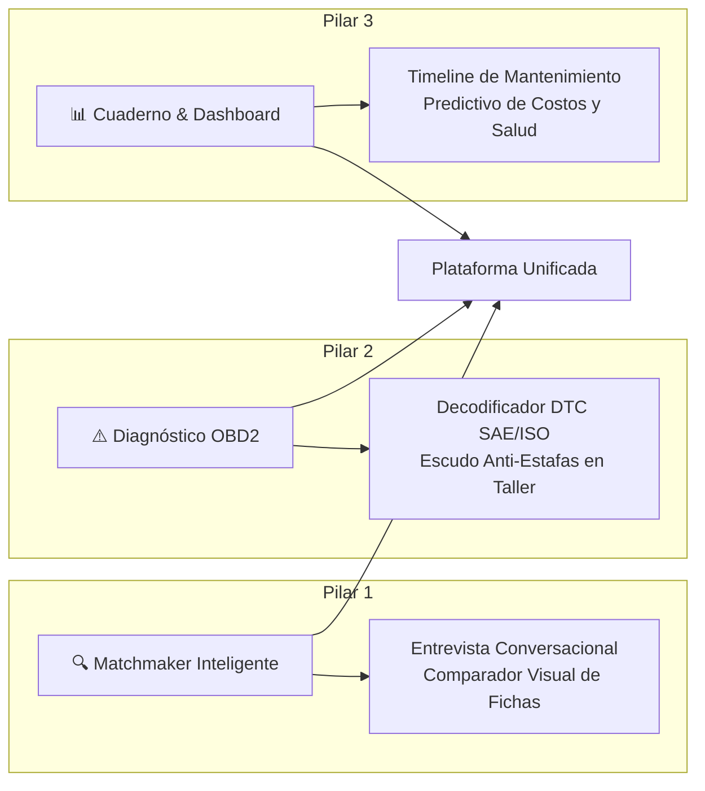
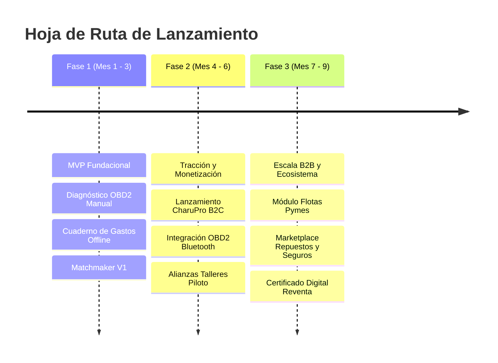

# CharuAutos App — Executive Pitch Deck & Análisis Estratégico Inicial
### Documento de Tesis de Inversión y Arquitectura de Producto
*Elaborado por el Comité Multidisciplinario de Dirección: Finanzas, Producto, Arquitectura, UX e Ingeniería Automotriz.*

---

## Executive Summary (Resumen Ejecutivo)

**CharuAutos App** es una plataforma tecnológica integral diseñada para resolver el mayor punto de dolor en el ciclo de vida del propietario de vehículos en Hispanoamérica: **la asimetría de información y la falta de transparencia en la compra, diagnóstico y mantenimiento automotriz**.

El mercado automotriz de posventa y compraventa en la región mueve más de **$45,000M USD anuales**, pero opera con métodos analógicos, desconfianza endémica y sobreprecios evitables. CharuAutos combina inteligencia de datos, modelos conversacionales guiados y arquitectura local-first para crear el primer **"Copiloto Digital del Conductor Inteligente"**, cerrando el ciclo completo del usuario: **Elegir bien el auto -> Entender qué le pasa -> Gestionar su salud y valor de reventa**.

---

## 1. Perspectiva Multidisciplinaria del Comité

```mermaid
flowchart TD
    subgraph Dirección Multidisciplinaria
        M1["💼 Monetización & Negocios<br>(Modelos de Ingresos B2C/B2B)"]
        M2["🚀 Emprendimiento Tech<br>(PMF, Moat y Tracción)"]
        M3["💻 Arquitectura de Software<br>(Multiplataforma, Cloud & APIs)"]
        M4["🎨 Diseño UI/UX<br>(Accesibilidad & Conversational UI)"]
        M5["🔧 Ingeniería Automotriz<br>(SAE/ISO, DTCs, Telemetría)"]
    end
    M1 --- M2
    M2 --- M3
    M3 --- M4
    M4 --- M5
    M5 --- M1
    
    Dirección Multidisciplinaria --> Core["🚗 CharuAutos App Platform"]
```

### 1.1. Comerciante & Experto en Monetización
*Tesis:* "Una app automotriz no puede depender únicamente de micro-suscripciones B2C. El verdadero valor económico está en posicionarnos como el **nodo de confianza transaccional**. Si somos el asesor que le dice al usuario qué auto comprar, qué repuesto necesita o si el presupuesto del mecánico es justo, somos el canal de adquisición más valioso para talleres, aseguradoras y repuesteras (Take-rates del 8% al 15%)."

### 1.2. Emprendedor de Tecnología y Crecimiento
*Tesis:* "El foso defensivo (*Moat*) no es el código, sino los datos acumulados y el costo de cambio. Si logramos que el usuario guarde todo el historial de su auto en nuestra app, el 'Pasaporte Digital del Auto' eleva el valor de reventa del vehículo en el mercado usado. Nadie querrá borrar la app porque borrarla significaría devaluar su propio activo."

### 1.3. Arquitecto de Software
*Tesis:* "Debemos construir bajo principios **Local-First y Reactive Sync**. Las carreteras, garajes subterráneos y talleres mecánicos suelen tener nula cobertura de red. Si la app se congela o exige conexión a internet para ver cómo cambiar una llanta o qué significa un código P0300, el producto falla. Arquitectura desacoplada, sincronización en segundo plano y caching predictivo."

### 1.4. Especialista en UI/UX
*Tesis:* "La mecánica intimida al 75% de los conductores, especialmente mujeres y conductores jóvenes. Eliminamos la jerga técnica hostil. No le preguntamos al usuario '¿Cuántos Nm de torque busca?', le preguntamos '¿Viajas con la familia cargada en cuestas empinadas o solo en tráfico urbano?'. El diseño debe respirar calma, claridad y control mediante micro-interacciones empáticas."

### 1.5. Experto Automotriz y Mecánico
*Tesis:* "Los escáneres OBD2 genéricos solo arrojan un código crudo como `P0420` que asusta al conductor y permite que le cobren un convertidor catalítico nuevo de $800 USD cuando a menudo es solo un sensor de oxígeno sucio o una fuga de escape. Nuestro motor de diagnóstico contextualiza la severidad, las causas raíz por probabilidad y el protocolo de inspección honesta antes de pisar el taller."

---

## 2. Los Tres Pilares Funcionales (Core Value Proposition)



### Pilar 1: Matchmaker de Autos & Comparador de Fichas Técnicas
- **Entrevista Empática:** Chatbot interactivo y asistente paso a paso con preguntas situacionales: presupuesto real de mantenimiento, hábitos de viaje, tipo de asfalto/caminos rurales, capacidad de carga familiar y economía de combustible.
- **Scoring de Compatibilidad:** Algoritmo ponderado que asigna un `% de Match` a cada vehículo del mercado disponible.
- **Comparador Lado a Lado Sin Jerga:** Fichas técnicas normalizadas donde el torque se traduce en "fuerza para subir pendientes", el despeje en "tolerancia a baches y reductores de velocidad", y el costo de mantenimiento en "gasto anual estimado en repuestos".

### Pilar 2: Asistente Mecánico & Diagnóstico OBD2
- **Traductor Inteligente de Códigos DTC:** Búsqueda instantánea por código (P, B, C, U) con categorización visual por nivel de riesgo (🟢 Leve / 🟡 Precaución / 🔴 Crítico: Detener vehículo).
- **Árbol de Probabilidad Causa-Raíz:** Desglose del 80/20 de los componentes que realmente causan la falla, diferenciando repuestos de $15 de averías mayores.
- **Protocolo de Taller "Blindaje al Conductor":** Generación de una hoja de instrucciones o preguntas clave para formularle al mecánico, eliminando la posibilidad de presupuestos inflados.

### Pilar 3: Cuaderno de Mantenimiento Dinámico & Dashboard Analítico
- **Timeline Interactivo de Vida Útil:** Registro cronológico de intervenciones (aceite, frenos, amortiguadores, correas, batería).
- **Health Score del Vehículo:** Algoritmo dinámico que calcula la salud global del auto (0 al 100%) según kilometraje y servicios vencidos.
- **Métricas de Rendimiento Financiero:**
  - Costo real por kilómetro recorrido ($/km).
  - Consumo promedio y desviación de eficiencia de combustible (detección de inyectores sucios o neumáticos desinflados).
  - Alertas predictivas inteligentes antes de que ocurra la falla catastrófica.

---

## 3. Matriz Exhaustiva de Modelos de Monetización

Para maximizar el valor de la empresa, proponemos un **modelo híbrido escalonado** que diversifica el riesgo y activa flujos de caja en el corto, mediano y largo plazo:

| Modelo de Negocio | Tipo | Mecánica de Ingresos | Potencial de Facturación | Facilidad de Implementación |
| :--- | :---: | :--- | :---: | :---: |
| **1. Freemium B2C (Suscripción 'CharuPro')** | Recurrente | App gratuita con funciones básicas. Nivel Pro ($3.99 - $5.99/mes o $29.99/año): Diagnósticos ilimitados con IA, escaneo OBD2 Bluetooth en vivo, historial multi-vehículo y exportación de certificado de reventa verificado. | Alto volumen, bajo ticket | Alta (Stripe / RevenueCat) |
| **2. Marketplace / Comisiones de Afiliación (Take-Rate)** | Transaccional | Comisión del 8% al 15% por cada servicio reservado en talleres mecánicos certificados ("Red Don Carlos") o compra de repuestos y neumáticos recomendados. | Muy Alto | Media (Alianzas estratégicas) |
| **3. Lead Generation (CPA Concesionarios y Seguros)** | B2B / Performance | Venta de leads calificados del módulo Matchmaker a concesionarios de autos nuevos/usados y cotizaciones de pólizas de seguro vehicular ($15 - $40 USD por lead cerrado). | Alto | Rápida validación |
| **4. B2B SaaS para Micro-Flotas** | Recurrente B2B | Plan para empresas con 3 a 30 vehículos (reparto, transporte ligero, pymes) a $4.99/vehículo/mes: panel web centralizado, control de mantenimientos y prevención de multas. | Alto margen, baja rotación (Low Churn) | Media |
| **5. Hardware Bundle (E-Commerce Directo)** | Venta Directa | Venta de escáner Bluetooth OBD2 oficial marca *CharuAutos* vinculado a la app + 1 año de suscripción Pro incluida ($39 - $49 USD, margen bruto del 55%). | Flujo de caja inmediato | Media (logística e-commerce) |

---

## 4. Arquitectura de Software y Stack Tecnológico Propuesto

```mermaid
flowchart TB
    subgraph Client Layer
        Mobile["📱 Mobile App (React Native + Expo)<br>iOS & Android"]
        Web["💻 Web Dashboard (Next.js / Tailwind CSS)<br>PWA Offline Ready"]
    end
    
    subgraph API & Gateway Layer
        Gateway["🛡️ API Gateway / Reverse Proxy"]
        Auth["🔑 Supabase Auth / OAuth2"]
    end
    
    subgraph Backend Services
        CoreAPI["⚙️ Core API Service (NestJS / Node.js)"]
        AIService["🧠 AI Diagnostic Engine (FastAPI / Python)<br>RAG con Base Mecánica SAE"]
        SyncService["🔄 Local-First Sync Engine (WatermelonDB / RxDB)"]
    end
    
    subgraph Data & Storage
        Postgres[("🗄️ PostgreSQL (Vehículos, Usuarios)")]
        Timescale[("📈 TimescaleDB (Telemetría, Gastos, OBD2)")]
        Redis[("⚡ Redis Cache (Sesiones, DTC Lookup)")]
    end
    
    Client Layer --> Gateway
    Gateway --> CoreAPI
    Gateway --> AIService
    CoreAPI --> Postgres
    CoreAPI --> Timescale
    CoreAPI --> Redis
```

### 4.1. Frontend Multiplataforma
- **Framework:** **React Native con Expo** (TypeScript). Permite un 90% de código compartido entre iOS, Android y versión Web (PWA), con acceso nativo a Bluetooth LE para escáneres OBD2 y cámara para escaneo de VIN/facturas.
- **Persistencia Local-First:** **WatermelonDB** o **PowerSync** sobre SQLite local. Funcionamiento instantáneo a 60fps sin latencia de red.
- **Gráficos & Visualizaciones:** **Victory Native** o **React Native Skia** para renderizado fluido del timeline interactivo y dashboards de consumo.

### 4.2. Backend & Microservicios
- **Core API:** **Node.js (NestJS)** en TypeScript. Modular, robusto y escalable, facilitando la arquitectura limpia orientada al dominio (DDD).
- **Microservicio de IA & Diagnóstico:** **Python (FastAPI)** con arquitectura RAG (Retrieval-Augmented Generation) para conectar modelos LLM con las bases de datos de fallas automotrices y fichas técnicas auditadas.
- **Base de Datos Principal:** **PostgreSQL** hospedado en Supabase/AWS RDS con extensiones relacionales y **TimescaleDB** para series temporales de kilometraje, gastos y lecturas de sensores.
- **Caché & Cola de Tareas:** **Redis + BullMQ** para respuestas ultrarrápidas de códigos de falla y procesamiento asíncrono de reportes.

### 4.3. Fuentes de Datos & APIs Automotrices
- **Códigos DTC y Diagnóstico:** Base de datos estandarizada SAE J2012 / ISO 15031 pre-cargada localmente en la app para consulta 100% offline.
- **Fichas Técnicas & Especificaciones:**
  - *NHTSA VPIC API* (gratuita, decodificación de VIN global).
  - *CarQuery API* / *AutoData* / Integración de base de datos propia compilada por el equipo de ingeniería mecánica de CharuAutos.
- **Hardware OBD2:** Protocolo estándar ELM327 sobre BLE (Bluetooth Low Energy) usando la librería `react-native-ble-plx`.

---

## 5. Hoja de Ruta de Producto (Roadmap Estratégico)


