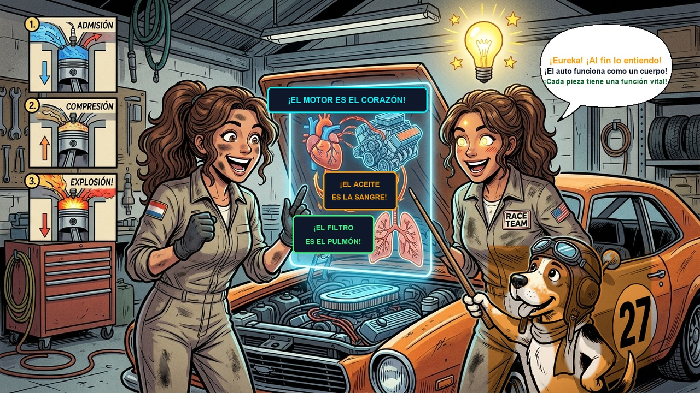
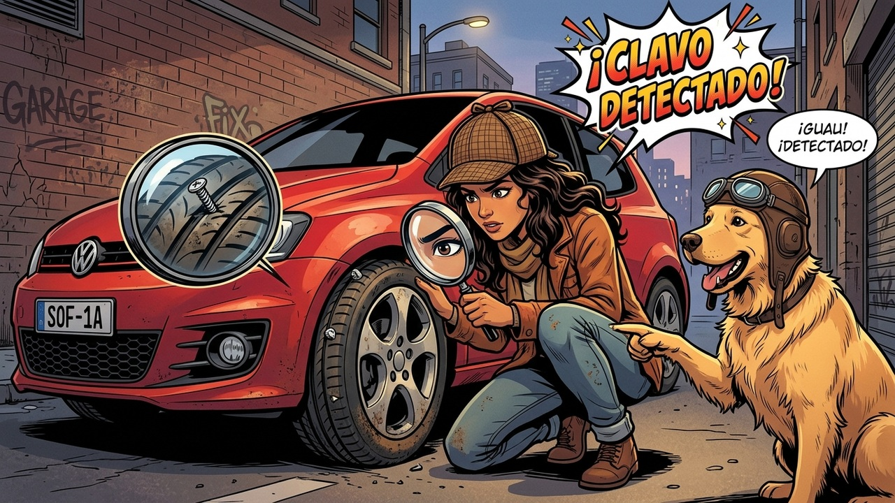
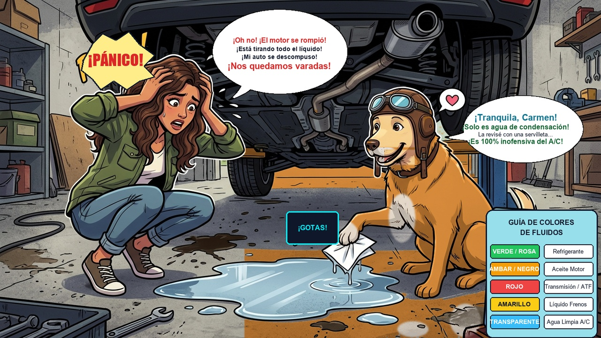
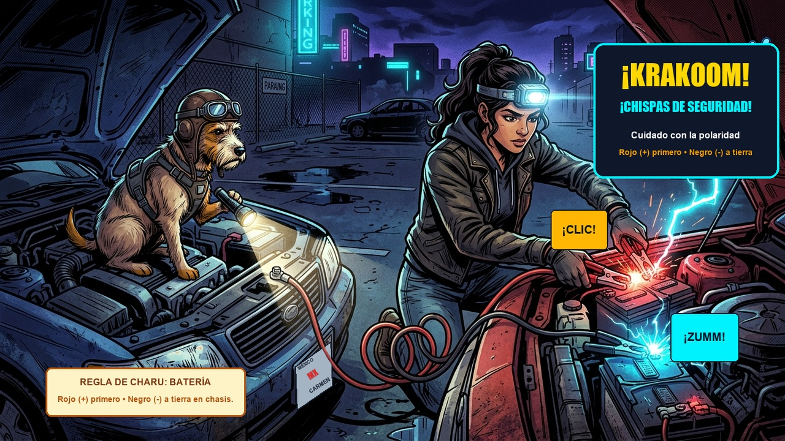
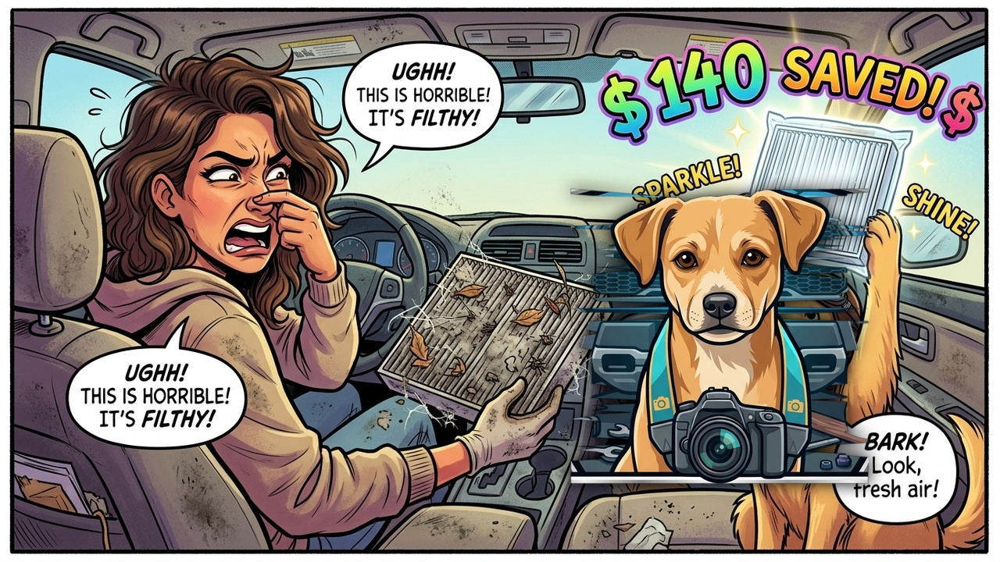
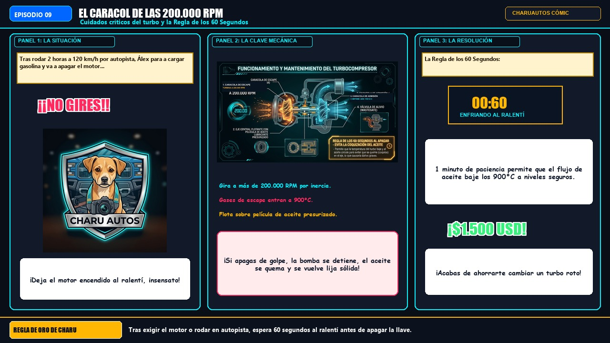
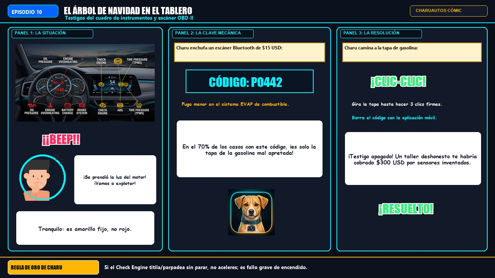
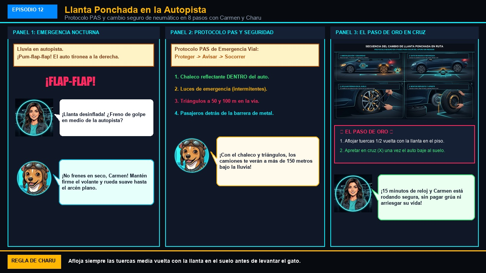
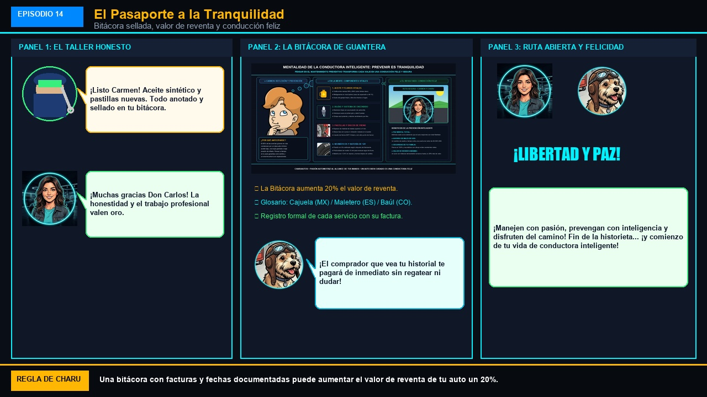

# Las Aventuras de Charu: El Conductor Inteligente
## Novela Gráfica y Libro de Historietas Ilustrada de Mecánica Preventiva
*Basado en el Manual Práctico del Conductor Inteligente de CharuAutos (`@charuautopics`)*
**Slogan Oficial:** `🐾 PASIÓN AUTOMOTRIZ AL ALCANCE DE TUS MANOS`

---

# Prólogo y Personajes
## Las Aventuras de Charu: El Manual del Conductor Inteligente en Historieta Ilustrada

---

*Las Aventuras de Charu: El Manual del Conductor Inteligente en Historieta Ilustrada*

---

### [ESCENA: Taller Dark Showroom de CharuAutos iluminado con luces de neón cian. Un flamante hatchback rojo espera con el capó abierto. Charu viste su casco de piloto con gafas reflectantes y Carmen estrena las llaves de su primer vehículo.]

**[CARTUCHO DEL NARRADOR]:**
> ¡Bienvenida al universo de CharuAutos! Una novela gráfica concebida para que cualquier persona, sin importar su experiencia previa, aprenda a cuidar su vehículo, prevenir averías costosas y blindarse contra engaños de taller con humor, arte y ciencia práctica.

**Charu (Piloto y Mentor)** `🐾 ¡Copiloto al Rescate!`:
*apoyado sobre el capó con las gafas de piloto arriba y una sonrisa cómplice*
> "¡Hola a todos los apasionados del camino! Soy Charu, tu copiloto de carreras. Acompáñame junto a Carmen a lo largo de 14 capítulos llenos de aventuras donde aprenderemos a descifrar los misterios mecánicos y a desmantelar las trampas de los malos talleres."

**Carmen (Conductora Principiante)** `✨ ¡Emocionada pero con Dudas!`:
*sosteniendo con orgullo el llavero de su auto rojo, aunque con una gota de sudor frío*
> "¡Hola! Por fin logré comprar mi primer auto y me encanta la libertad que siento al manejar... pero cada vez que escucho un ruido raro o veo una luz encenderse en el velocímetro, ¡siento que voy a quedar en bancarrota! ¡Necesito que Charu me convierta en una conductora inteligente!"

**Don Carlos (El Mecánico Honesto)** `🔧 ¡Maestro de Confianza!`:
*limpiándose las manos con un paño limpio en su taller AutoSolución*
> "En mi taller tenemos una máxima sagrada: la honestidad no da clientes para una semana, da clientes para toda la vida. Aquí aprenderás a exigir diagnósticos por escrito, ver piezas sustituidas y reconocer un trabajo profesional con garantía."

**Don Chanchullo (El Taller Sospechoso)** `😈 ¡Trampa del Taller!`:
*Un gato doméstico bicolor blanco y negro con patrón de máscara de esmoquin, arnés de cuero tosco manchado de grasa negra, gafas de aviador agrietadas colgando, estuche de herramientas con llave oxidada y un medidor de calibración manipulado con diales y cables desordenados.*
> "¡Je, je, je! Mientras existan conductoras que no sepan mirar el aceite ni pregunten qué repuestos les ponen, ¡mi negocio de presupuestos inflados seguirá viento en popa!"

---

💡 **[LA REGLA DE ORO DE CHARU]:**
> *"Un auto no es un monstruo de metal: es una máquina noble que recompensa con años de fidelidad a quien aprende su lenguaje."*

---

# Episodio 01 — El Misterio del Capó y las 5 Reglas de Oro
### Las Aventuras de Charu • Módulo 01 Adaptado a Historieta

---

*Seguridad física, sentido común y peligros del refrigerante hirviendo*

---

### [ESCENA: Sábado por la mañana en la cochera. Tras regresar de un viaje por carretera, Carmen nota un silbido vaporoso bajo el capó y decide abrirlo por primera vez para ver si le falta agua.]

**[CARTUCHO DEL NARRADOR]:**
> Carmen abre el seguro del capó. El vano motor irradia una ola de calor sofocante. Ve una tapa metálica brillante con un símbolo de advertencia y estira el brazo decidida...

**Carmen (Conductora Principiante)** `🤔 Curiosidad Ingenua`:
*con la mano a escasos centímetros de la tapa metálica del radiador*
> "Bueno... esto no debe ser tan difícil. Solo desenrosco esta tapita plateada para echarle un poco de agua del grifo..."

💥 **[EFECTO SONORO VISUAL]:** *¡SSSSSS-CLAC!* (Vapor a presión silbando a más de 115°C)

**Charu (Piloto y Mentor)** `🛑 ¡ALTO AHÍ!`:
*aterrizando en un salto acrobático y apartando el brazo de Carmen de un manotazo firme*
> "¡¡DETENTE, CARMEN!! ¡Si giras esa tapa ahora mismo, el refrigerante presurizado a 125°C estallará como un géiser hirviendo directo a tu cara, cuello y brazos causando quemaduras de tercer grado!"

**Carmen (Conductora Principiante)** `😱 ¡Pánico y Asombro!`:
*retrocediendo dos pasos con las manos en el pecho y el corazón acelerado*
> "¡¿125 grados?! ¡¿Una bomba de vapor en mi propio auto?! ¡Casi termino en el hospital el primer fin de semana!"

**Charu (Piloto y Mentor)** `📋 Reglas Sagradas`:
*desplegando una infografía holográfica con 5 mandamientos de seguridad*
> "¡Tranquila, para eso estamos aquí! Memoriza las 5 Reglas Inviolables: 1. Motor caliente = Zona Prohibida (espera 45 min). 2. Superficie plana y freno puesto. 3. El gato hidráulico jamás sostiene el auto solo (usar torres). 4. Desconectar el borne negativo de la batería antes de tocar cables. 5. Gafas y guantes siempre."

**Carmen (Conductora Principiante)** `😌 ¡Lección Aprendida!`:
*colocándose unos guantes de nitrilo y gafas protectoras con renovada compostura*
> "¡Anotadísimo en mi mente! La seguridad física va primero. ¡Ahora explícame qué es lo que hace latir a este auto!"

---

💡 **[LA REGLA DE ORO DE CHARU]:**
> *"Nunca abras la tapa del radiador ni del vaso presurizado con el motor caliente. Deja enfriar al menos 45 minutos."*

---

# Episodio 02 — El Auto es un Cuerpo Humano
### Las Aventuras de Charu • Módulo 02 Adaptado a Historieta

---

*Anatomía del vano motor y el ciclo de 4 tiempos sin jerga*

---

### [ESCENA: Bajo la luz clara de la cochera, Carmen observa el bloque motor repleto de mangueras, tubos y sensores. Charu despliega un holograma interactivo que compara la máquina con un organismo vivo.]

**[CARTUCHO DEL NARRADOR]:**
> Carmen mira el vano motor con expresión perpleja, como si intentara descifrar jeroglíficos alienígenas.

**Carmen (Conductora Principiante)** `🤯 Confusión Total`:
*rascándose la cabeza y señalando el laberinto de cables y tubos de acero*
> "Charu, sé totalmente honesto... ¿Cómo diablos hace este bloque de fierros para mover más de una tonelada de peso con solo acariciar un pedal?"

**Charu (Piloto y Mentor)** `💡 Analogía Médica`:
*apuntando con una varita holográfica brillante al corazón del motor*
> "¡Míralo como un cuerpo humano! Motor = Corazón; Aceite sintético = Sangre que lubrica y enfría; Filtro de aire = Pulmones; Gasolina = Comida; Tubo de escape = Exhalación; Computadora ECU = Cerebro digital."

💥 **[EFECTO SONORO VISUAL]:** *¡BUM! ¡BRROOOM!* (Ciclo de 4 Tiempos: Admisión ➡️ Compresión ➡️ Explosión ➡️ Escape)

**Carmen (Conductora Principiante)** `💡 ¡Momento Eureka!`:
*con los ojos brillantes y una gran sonrisa de entendimiento*
> "¡Eureka! ¡Tiene todo el sentido del mundo! Si el aceite se seca, le da un infarto; si el filtro se tapa, el motor se asfixia; y si la gasolina está sucia, se indigesta. ¡Por fin lo entiendo sin fórmulas raras!"

**Charu (Piloto y Mentor)** `🏆 ¡Exacto!`:
*sonriendo satisfecho con las orejas levantadas*
> "¡Esa es la mentalidad! Y recuerda: cuando enciendas en frío por la mañana, dale 30 a 60 segundos antes de moverte para que la 'sangre' llegue a cada rincón del 'corazón'."

---

💡 **[LA REGLA DE ORO DE CHARU]:**
> *"El 75% del desgaste de un motor ocurre en los primeros 90 segundos posteriores al encendido en frío; nunca aceleres a fondo al arrancar."*

---

# Episodio 03 — La Caja Mágica de la Cajuela
### Las Aventuras de Charu • Módulo 03 Adaptado a Historieta

---

*Herramientas esenciales y kit de emergencia táctico de cajuela*

---

### [ESCENA: Apertura de la cajuela del auto rojo de Carmen. En su interior reina el desorden: un paraguas quebrado, botellas de plástico, una toalla playera y bolsas de supermercado arrugadas.]

**[CARTUCHO DEL NARRADOR]:**
> Charu se asoma a la cajuela abierta y parpadea atónito ante el caos acumulado.

**Charu (Piloto y Mentor)** `🤨 Inspección Severa`:
*cruzando los brazos y levantando una ceja con ironía cómica*
> "Carmen... Si hoy a las 11 de la noche en una autopista solitaria se te poncha una llanta, ¿planeas ahuyentar los peligros arrojándole ese paraguas roto y la toalla playera?"

**Carmen (Conductora Principiante)** `😳 Vergüenza Divertida`:
*sonrojándose mientras apila apenada los cacharros viejos fuera del maletero*
> "¡Ups! Confieso que la cajuela se convirtió en el armario de lo que no sabía dónde guardar... ¡El vendedor me juró que venía con llanta de repuesto y no revisé nada más!"

💥 **[EFECTO SONORO VISUAL]:** *¡CLIC! ¡EQUIPADO!* (El Kit Táctico resplandece ordenado en su estuche rígido)

**Charu (Piloto y Mentor)** `🛡️ Equipamiento Táctico`:
*abriendo con orgullo un maletín negro con compartimentos de espuma de alta densidad*
> "¡Aquí tienes tu kit táctico de rescate! 2 triángulos reflectantes de base pesada, linterna frontal LED recargable, minicompresor 12V con manómetro digital, kit de mechas vulcanizantes y cables pasa-corriente calibre 4 AWG. Y el chaleco reflectante va en la guantera: ¡te lo pones ANTES de abrir la puerta!"

**Carmen (Conductora Principiante)** `💪 ¡Empoderada!`:
*guardando el kit táctico con firmeza y orden impecable*
> "¡Todo cupo en un solo estuche compacto que costó menos de $45 USD! Ahora sé que si ocurre una eventualidad, tengo las armas necesarias para salir rodando."

---

💡 **[LA REGLA DE ORO DE CHARU]:**
> *"Guarda siempre el chaleco reflectante en la guantera o debajo del asiento del conductor, jamás en el fondo de la cajuela."*

---

# Episodio 04 — La Caminata del Detective
### Las Aventuras de Charu • Módulo 04 Adaptado a Historieta

---

*Inspección perimetral 360° en 3 tiempos antes de salir*

---

### [ESCENA: Exterior de la vivienda. Carmen lleva cómicamente una gorra de detective y una lupa gigante en la mano. Charu la guía paso a paso alrededor de la carrocería del auto rojo.]

**[CARTUCHO DEL NARRADOR]:**
> La inmensa mayoría de los conductores enciende el motor y arranca a ciegas... hasta que a los quinientos metros una llanta en el rin destruye el neumático.

**Charu (Piloto y Mentor)** `🕵️‍♂️ Modo Detective`:
*olfateando el suelo y señalando el perímetro del vehículo*
> "¡Elemental, mi querida Carmen! La 'Caminata 360°' se divide en 3 rutinas: Diaria (30 segundos rodeando el auto buscando charcos o llantas bajas), Semanal (3 minutos abriendo capó en frío) y Mensual (15 minutos calibrando la presión de las 5 ruedas, incluida la de repuesto)."

**Carmen (Conductora Principiante)** `🧐 Ojo Clínico`:
*arrodillándose junto a la rueda delantera izquierda e inspeccionando la goma con la lupa*
> "¡Espera un segundo, Charu! Mira aquí... en el surco central de la llanta delantera... ¡hay un tornillo plateado con cabeza de estrella bien clavado!"

💥 **[EFECTO SONORO VISUAL]:** *¡CLAVO DETECTADO!* (¡Detección preventiva a tiempo en la cochera!)

**Charu (Piloto y Mentor)** `🎉 ¡Deducción Brillante!`:
*chocando la pata con la mano de Carmen entusiasmado*
> "¡Brillante deducción, detective Carmen! Si hubieras salido a la autopista a 100 km/h, ese tornillo habría reventado el neumático en plena marcha provocando un accidente. ¡30 segundos de caminata te ahorraron una grúa de $120 USD y salvaron tu integridad!"

---

💡 **[LA REGLA DE ORO DE CHARU]:**
> *"Calibra la presión de los neumáticos siempre en frío; al rodar la fricción calienta el aire y marca hasta 4 PSI de más en el manómetro."*

---

# Episodio 05 — El Misterio del Charco de Colores
### Las Aventuras de Charu • Módulo 05 Adaptado a Historieta

---

*Varilla de aceite, niveles y diagnóstico visual de fugas en el piso*

---

### [ESCENA: Carmen retrocede su auto un metro en la cochera y de pronto vislumbra una mancha líquida transparente que brilla sobre el cemento pulido.]

**[CARTUCHO DEL NARRADOR]:**
> Los ojos de Carmen se abren desmesuradamente al descubrir la mancha en el piso.

**Carmen (Conductora Principiante)** `😱 ¡Pánico Desesperado!`:
*apoyando ambas manos en sus mejillas con expresión de telenovela dramática*
> "¡¡UN CHARCO EN EL PISO!! ¡Se le salió un órgano vital al auto! ¡Se le está vaciando el motor! ¡Dime que no voy a tener que empeñar mi salario!"

**Charu (Piloto y Mentor)** `🧪 Prueba Científica`:
*agachándose con calma zen y apoyando una servilleta blanca sobre la gota*
> "¡Respira hondo, Carmen! Mira la servilleta: el líquido es 100% transparente, inodoro y fluido como el agua pura. ¡Es simple condensación normal del evaporador del aire acondicionado! Tu motor está más sano que nunca."

**Charu (Piloto y Mentor)** `🎨 La Paleta de Colores`:
*mostrando una paleta de pintor con las gotas de colores mecánicos*
> "Memoriza el arcoíris de fluidos: Rosa o Verde fosforescente = Refrigerante dulce (peligro); Ámbar o Negro viscoso = Aceite de motor; Rojo vino = Fluido de transmisión ATF; Amarillo paja aceitoso = Líquido de frenos (¡alerta máxima!)."

💥 **[EFECTO SONORO VISUAL]:** *¡FALSA ALARMA!* (Varilla de aceite leída en frío: nivel al 80% entre MIN y MAX)

**Carmen (Conductora Principiante)** `😌 ¡Alivio Cósmico!`:
*secándose una gota de sudor de la frente con una sonrisa radiante*
> "¡Ufff, qué respiro! Ya aprendí: si es agua pura debajo del copiloto, es el A/C enfriando; si tiene color y olor químico, entonces sí busco la linterna."

---

💡 **[LA REGLA DE ORO DE CHARU]:**
> *"Jamás uses agua de grifo en el radiador; los minerales corroen los conductos internos y hierve a solo 100°C. Usa refrigerante OAT certificado al 50/50."*

---

# Episodio 06 — Las Runas Secretas del Neumático
### Las Aventuras de Charu • Módulo 06 Adaptado a Historieta

---

*Código DOT de caducidad, banda de rodamiento y presión del pilar B*

---

### [ESCENA: En una gomería / llantera de segunda mano con letreros llamativos: 'LLANTAS SEMINUEVAS A PRECIO DE REGALO: $25 USD'. Carmen inspecciona un caucho con apariencia reluciente.]

**[CARTUCHO DEL NARRADOR]:**
> El vendedor ofrece con insistencia un neumático lustrado con abundante silicona negra brillante.

**Carmen (Conductora Principiante)** `🤑 Tentación de Oferta`:
*tocando el neumático brillante con intenciones de sacar la tarjeta*
> "¡Mira qué ganga, Charu! Está baratísima, se ve negrísima como nueva y los surcos se ven profundos. ¡Con esto me ahorro $80 dólares!"

**Charu (Piloto y Mentor)** `🛑 ¡Frena esa Billetera!`:
*apuntando con su pata a un pequeño óvalo grabado en el flanco del caucho*
> "¡Alto ahí! Lee las runas sagradas del flanco: 'DOT XXXX 1418'. ¿Sabes qué significa? Semana 14 del año 2018. ¡Ese neumático tiene 8 años de fabricado! La goma está reseca y cristalizada. En una frenada sobre piso mojado patinarás como si estuvieras en una pista de patinaje sobre hielo."

💥 **[EFECTO SONORO VISUAL]:** *¡DOT 1418: CADUCADO!* (Caucho cristalizado = 0% de agarre en pavimento mojado)

**Carmen (Conductora Principiante)** `😱 ¡Casi Caigo en la Trampa!`:
*apartando la mano del neumático con indignación hacia el vendedor*
> "¡¿Me iban a vender una llanta de hace 8 años disfrazada con abrillantador?! ¡Menos mal me enseñaste a descifrar el código DOT y la prueba de la moneda!"

**Charu (Piloto y Mentor)** `📖 La Verdad del Pilar B`:
*señalando la calcomanía metálica en el marco de la puerta del auto de Carmen*
> "Y la presión correcta nunca es el número gigante que dice la llanta (esa es la presión máxima de ruptura). La presión de ingeniería está en la etiqueta del Pilar B de tu auto: 32 PSI adelante y 30 PSI atrás."

---

💡 **[LA REGLA DE ORO DE CHARU]:**
> *"Los neumáticos caducan a los 5 años desde su fecha de fabricación aunque conserven dibujo profundo; el caucho pierde elasticidad y se vuelve piedra."*

---

# Episodio 07 — Chispa y Rescate a Medianoche
### Las Aventuras de Charu • Módulo 07 Adaptado a Historieta

---

*Batería, fusibles de colores y puente seguro sin quemar la ECU*

---

### [ESCENA: Medianoche en el estacionamiento desolado de un centro comercial. Carmen gira la llave de encendido... Las luces parpadean débilmente y solo se escucha un triste chasquido metálico.]

**[CARTUCHO DEL NARRADOR]:**
> La noche está fría y el tablero apenas tiene fuerza para encender los testigos. Un conductor bienintencionado se acerca con unos cables finos y enredados.

💥 **[EFECTO SONORO VISUAL]:** *¡TRAC-TRAC-TRAC!* (El motor de arranque no gira: batería con menos de 10.5V)

**Carmen (Conductora Principiante)** `😰 Angustia Nocturna`:
*apretando el volante con el frío de la noche y mirando el estacionamiento oscuro*
> "¡No enciende! El señor de al lado me dice que conectemos los cables rojo con rojo y negro con negro directo entre las dos baterías a ver qué pasa..."

**Charu (Piloto y Mentor)** `🛑 ¡ALTO VOLTAJE!`:
*sacando los cables profesionales 4 AWG de su kit táctico y colocándose las gafas protectoras*
> "¡Si conectas al revés o cierras el circuito sobre la batería que desprende hidrógeno inflamable, provocarás un chispazo que freirá la computadora del motor de $1.200 USD! Sigue el Orden Sagrado del Rescate."

**Charu (Piloto y Mentor)** `⚡ El Orden Sagrado`:
*guiando la mano de Carmen paso a paso con su linterna*
> "1. Pinza Roja al Positivo (+) de tu batería muerta. 2. Pinza Roja al Positivo (+) del auto donante. 3. Pinza Negra al Negativo (-) del auto donante. 4. Pinza Negra a un tornillo o metal sin pintar del chasis de tu auto, LEJOS de la batería."

💥 **[EFECTO SONORO VISUAL]:** *¡WROOOOM!* (El motor ruge al primer giro de llave sin titubeos)

**Carmen (Conductora Principiante)** `💪 ¡Triunfo Absoluto!`:
*acelerando suavemente con una sonrisa triunfal en el rostro*
> "¡Arrancó de inmediato y sin soltar una sola chispa peligrosa! Y ahora sé que si se me apaga la radio o una luz, reviso los fusibles de colores por 50 centavos."

---

💡 **[LA REGLA DE ORO DE CHARU]:**
> *"La última pinza negra va a un metal sólido sin pintar del bloque motor o chasis, NUNCA al borne negativo de la batería agotada para evitar chispas inflamables."*

---

# Episodio 08 — Respirando Aire Puro en la Guantera
### Las Aventuras de Charu • Módulo 08 Adaptado a Historieta

---

*Filtro de cabina en 5 minutos, bujías y correas*

---

### [ESCENA: Carmen enciende el aire acondicionado en un día caluroso. De los ductos de ventilación sale una ráfaga con hedor a moho, hojas en descomposición y calcetín viejo.]

**[CARTUCHO DEL NARRADOR]:**
> Carmen tose y estornuda mientras una nube de polvo microscópico invade la cabina.

💥 **[EFECTO SONORO VISUAL]:** *¡ATCHÍÍÍS!* (Ojos llorosos y aroma a humedad insoportable)

**Carmen (Conductora Principiante)** `🤢 Asco y Frustración`:
*tapándose la nariz con una mano y apagando el ventilador*
> "¡Qué asco! Fui a un taller a preguntar y me dijeron que tenían que desmontar todo el tablero por $150 USD para hacerle una 'higienización profunda' de cuatro horas..."

**Charu (Piloto y Mentor)** `🐶 ¡Ni se te Ocurra!`:
*apuntando hacia la parte posterior de la guantera con una linterna*
> "¡Te quieren ver la cara! El 90% de los malos olores provienen simplemente del filtro de cabina antipolen saturado. No hay que desmontar nada: abres la guantera, presionas dos topes laterales plásticos, destrabas la compuerta y extraes el cartucho."

**Carmen (Conductora Principiante)** `😲 ¡Increíblemente Fácil!`:
*extrayendo el filtro viejo repleto de hojas secas y colocando uno nuevo con carbón activado*
> "¡No tardé ni 4 minutos de reloj! El filtro nuevo me costó apenas $10 dólares en la refaccionaria. ¡Me acabo de ahorrar $140 USD de mano de obra y el aire ahora huele a brisa de montaña!"

**Charu (Piloto y Mentor)** `🌿 Truco Maestro`:
*respirando hondo con aire puro*
> "Y acuérdate de mi regla de oro: apaga el botón A/C 2 minutos antes de apagar el motor. El soplador secará las gotas del evaporador y los hongos jamás volverán a colonizar tu auto."

---

💡 **[LA REGLA DE ORO DE CHARU]:**
> *"Apaga el botón A/C dos minutos antes de llegar a tu destino manteniendo el soplador encendido; esto secará la condensación y evitará que nazcan hongos."*

---

# Episodio 09 — El Caracol de las 200.000 RPM
### Las Aventuras de Charu • Módulo 09 Adaptado a Historieta

---

*Turbocompresor, mitos de enfriamiento y la Regla de los 60 Segundos*

---

### [ESCENA: Estación de servicio al borde de una autopista rápida. Carmen se estaciona tras manejar 2 horas a 120 km/h y se prepara para apagar el motor de inmediato.]

**[CARTUCHO DEL NARRADOR]:**
> El motor turboalimentado de Carmen acaba de trabajar a fondo. El turbocompresor se encuentra al rojo vivo bajo el aislante térmico.

**Carmen (Conductora Principiante)** `⏱️ Apuro Cotidiano`:
*con la mano en la llave lista para girarla y bajarse a comprar un café*
> "¡Uff, qué buen ritmo traíamos en la pista! Voy a apagar rápido para ir al baño..."

**Charu (Piloto y Mentor)** `🛑 ¡60 SEGUNDOS SAGRADOS!`:
*poniendo su pata sobre la mano de Carmen en la llave*
> "¡¡CARMEN, ESPERA UN MINUTO!! Tu auto tiene motor turbo. Esa turbina gira a más de 200.000 revoluciones por minuto empujada por gases de escape que rozan los 900°C. Flota sobre una microscópica película de aceite a presión."

**Charu (Piloto y Mentor)** `🔥 La Ciencia de la Fricción`:
*mostrando un gráfico térmico de carbonización de aceite*
> "Si cortas el motor de golpe, la bomba de aceite se detiene al instante. El aceite estancado en el eje hirviendo se cocina y se convierte en coque (carbón abrasivo). ¡Esa lija destruye el turbo de $1.500 USD en pocos meses!"

💥 **[EFECTO SONORO VISUAL]:** *¡TIC... TAC... 60s!* (60 segundos al ralentí bajan la temperatura interna 300 grados)

**Carmen (Conductora Principiante)** `😌 Paciencia de Oro`:
*mirando tranquilamente su reloj de pulsera mientras el motor descansa en marcha mínima*
> "58... 59... ¡60 segundos! Es fascinante pensar que 60 segundos de paciencia protegen una pieza de más de mil quinientos dólares. ¡De ahora en adelante siempre le daré su minuto de respiro!"

---

💡 **[LA REGLA DE ORO DE CHARU]:**
> *"Tras una exigencia en autopista o subida pronunciada, deja el motor turbo al ralentí durante 60 segundos antes de girar la llave de apagado."*

---

# Episodio 10 — El Árbol de Navidad en el Tablero
### Las Aventuras de Charu • Módulo 10 Adaptado a Historieta

---

*Testigos luminosos, escáner OBD-II y el misterio del tapón de gasolina*

---

### [ESCENA: A mitad de camino hacia el trabajo. En el tablero de instrumentos se ilumina una silueta amarilla con forma de motor: CHECK ENGINE.]

**[CARTUCHO DEL NARRADOR]:**
> Un pequeño pitido alerta a Carmen. Una luz ámbar fija brilla en su velocímetro.

💥 **[EFECTO SONORO VISUAL]:** *¡BEEP-BEEP!* (Testigo Check Engine (MIL) iluminado en ámbar constante)

**Carmen (Conductora Principiante)** `😰 Susto en el Tablero`:
*aferrándose al volante con los ojos clavados en el ícono amarillo*
> "¡¡CHARU, EL MOTORCITO AMARILLO!! ¡Se prendió el Check Engine! Llamé a un taller rápido y me dijeron que seguramente se dañó el convertidor catalítico o la caja de velocidades..."

**Charu (Piloto y Mentor)** `🚦 Semáforo ISO`:
*conectando un pequeño escáner OBD-II Bluetooth de $15 USD bajo el volante*
> "¡Calma! Recuerda el código de colores ISO: Azul/Verde = Sistema activo; Amarillo ámbar = Precaución/Atención programada (el auto rueda seguro, no hay que llamar grúa); Rojo = Peligro crítico (apagar de inmediato); Amarillo parpadeante = Falla de encendido severa (detenerse)."

**Charu (Piloto y Mentor)** `📱 Diagnóstico en Vivo`:
*mostrando la pantalla del teléfono de Carmen conectada al escáner*
> "El escáner arroja: 'Código P0455: Fuga grande en sistema EVAP'. ¿Cargaste gasolina esta mañana, Carmen?"

**Carmen (Conductora Principiante)** `💡 ¡Resolución en 5 Segundos!`:
*bajando del auto, cerrando la tapa del combustible y girándola con fuerza*
> "¡Sí! El despachador de la gasolinera la dejó floja. La apreté hasta escuchar los 3 clics ('¡CLIC-CLIC-CLIC!'), borré el código con la aplicación... ¡y la luz jamás volvió a encenderse! ¡Cero dólares gastados!"

---

💡 **[LA REGLA DE ORO DE CHARU]:**
> *"Aprieta siempre el tapón del tanque de combustible hasta escuchar 3 clics firmes; una tapa floja dispara el código EVAP de Check Engine simulando una avería grave."*

---

# Episodio 11 — La Factura Fantasma y los 100k km
### Las Aventuras de Charu • Módulo 11 Adaptado a Historieta

---

*El mapa de kilometraje, mitos de fluidos sellados y correa de distribución*

---

### [ESCENA: En el taller honesto AutoSolución. Don Carlos recibe a Carmen para la revisión de los 60.000 km con su manual de mantenimiento abierto sobre el mostrador.]

**[CARTUCHO DEL NARRADOR]:**
> El odómetro del auto de Carmen marca exactamente 60.020 kilómetros.

**Carmen (Conductora Principiante)** `📋 Revisión Informada`:
*mostrando a Don Carlos su cuaderno con los puntos del manual del fabricante*
> "Don Carlos, en otro taller me pasaron un presupuesto de $850 USD diciendo que a los 60 mil kilómetros hay que limpiar inyectores con ultrasonido, cambiar cables y hacer 'lavado interno de motor'..."

**Don Carlos (El Mecánico Honesto)** `🔧 Transparencia Total`:
*tachando con una pluma roja los conceptos innecesarios en la hoja*
> "¡Puro invento comercial, señorita Carmen! Lo que el fabricante de tu auto estipula para los 60.000 km es muy claro: cambio de fluido ATF de caja automática, líquido de frenos DOT 4, bujías y filtro de aire. El servicio real cuesta $190 USD, no $850."

**Carmen (Conductora Principiante)** `🤔 Duda del Fluido Eterno`:
*preguntando con genuina curiosidad técnica*
> "Don Carlos, ¿y es verdad lo que dicen en algunos concesionarios de que el aceite de la transmisión automática dura 'de por vida' y nunca se cambia?"

**Don Carlos (El Mecánico Honesto)** `💡 Desmintiendo el Mito`:
*mostrando una probeta con fluido ATF degradado y oscuro frente a uno nuevo traslúcido*
> "¡Ese es el mito más peligroso de la industria! 'De por vida' solo significa hasta que venza la garantía de fábrica. El fluido hidráulico se degrada por calor y fricción. Cambiarlo a los 60k km evita una reparación de $3.500 USD."

💥 **[EFECTO SONORO VISUAL]:** *¡$660 AHORRADOS!* (Mantenimiento preventivo real y transmisión protegida para 300.000 km)

---

💡 **[LA REGLA DE ORO DE CHARU]:**
> *"No existe ningún aceite eterno: el fluido de transmisión automática (ATF/CVT) debe sustituirse rigurosamente entre los 60.000 y 80.000 km para no quemar la caja."*

---

# Episodio 12 — Llanta Ponchada en la Autopista
### Las Aventuras de Charu • Módulo 12 Adaptado a Historieta

---

*Protocolo PAS y cambio seguro de neumático en 8 pasos*

---

### [ESCENA: Noche lluviosa en una autopista de alta velocidad. De pronto se escucha un tironeo sordo en la rueda trasera derecha: la llanta se ha desinflado por completo.]

**[CARTUCHO DEL NARRADOR]:**
> La dirección vibra con fuerza. Carmen mantiene el pulso firme sin entrar en pánico.

💥 **[EFECTO SONORO VISUAL]:** *¡PUM-FLAP-FLAP!* (Neumático desinflado perdiendo sustentación sobre el asfalto mojado)

**Carmen (Conductora Principiante)** `🛑 Nervios bajo Control`:
*sujetando el volante con ambas manos a las 9 y a las 3 sin frenar bruscamente*
> "¡Se desinfló la llanta trasera! No voy a clavar los frenos... ruedo suave hacia el arcén derecho bien iluminado y plano."

**Charu (Piloto y Mentor)** `🛡️ Protocolo PAS en Marcha`:
*alcanzando el chaleco reflectante amarillo neón de la guantera*
> "¡Ponte el chaleco reflectante ANTES de abrir la puerta! Enciende las intermitentes de emergencia. Yo coloco los triángulos reflectantes a 50 y 100 metros atrás para que el tráfico nos vea desde lejos."

**Carmen (Conductora Principiante)** `💪 El Paso de Oro`:
*con la llave de cruz en mano, aflojando media vuelta cada tuerca con la llanta en el piso*
> "¡Y aplico el secreto que me enseñaste!: aflojo las tuercas media vuelta en el suelo ANTES de subir el gato. Luego subo el auto, cambio la rueda, coloco la de repuesto, bajo el gato y aprieto en estrella (cruz X) con todo mi peso."

💥 **[EFECTO SONORO VISUAL]:** *¡CLAC-CRAC! ¡LISTO!* (Rueda de repuesto asegurada firmemente en 15 minutos exactos)

**Carmen (Conductora Principiante)** `🏎️ ¡Orgullo y Empoderamiento!`:
*guardando las herramientas con una sonrisa de satisfacción total*
> "¡15 minutos cronometrados! Sin mojarme de más, segura y sin tener que esperar 2 horas por una grúa costosa. ¡Soy completamente autónoma!"

---

💡 **[LA REGLA DE ORO DE CHARU]:**
> *"Afloja siempre las tuercas o birlos media vuelta con la llanta apoyada en el suelo ANTES de levantar el gato; de lo contrario la rueda girará loca en el aire."*

---

# Episodio 13 — El Duelo en el Taller Mecánico
### Las Aventuras de Charu • Módulo 13 Adaptado a Historieta

---

*El Escudo Anti-Estafas y el Protocolo de 5 Pasos de Carmen*

---

### [ESCENA: Taller desordenado 'El Tornillo Loco'. Don Chanchullo frota sus manos mientras contempla a Carmen llegar con su vehículo para un simple cambio de pastillas de freno.]

**[CARTUCHO DEL NARRADOR]:**
> Don Chanchullo pone cara de preocupación fingida y sale del foso con una libreta grasienta.

**Don Chanchullo (El Taller Sospechoso)** `😈 El Cuento del Tío`:
*meneando la cabeza con gesto de tragedia exagerada*
> "Uy, señorita... qué suerte tuvo de llegar viva. El tren delantero está destrozado, los amortiguadores reventados y la cremallera quebrada. Son $850 dólares o el auto no puede rodar ni una cuadra..."

**Carmen (Conductora Principiante)** `🛡️ ¡ESCUDO ACTIVADO!`:
*cruzando los brazos con mirada serena, firme e inquebrantable*
> "Un momento, Don Chanchullo. Vamos a aplicar el Escudo de CharuAutos: 1. Le tomé foto al odómetro frente a usted. 2. Exijo presupuesto por escrito desglosando repuesto y mano de obra. 3. No autorizo extras por teléfono. 4. Las piezas viejas me las entrega en mi cajuela en las cajas nuevas. 5. ¿Sus repuestos son OEM o Tier 1 con garantía certificada?"

**Don Chanchullo (El Taller Sospechoso)** `😰 ¡Descubierto In Fraganti!`:
*tragando saliva y guardando apresuradamente la libreta grasienta*
> "Eh... bueno... ejem... mirándolo bien con mejor iluminación... el tren delantero está en perfecto estado. En realidad solo eran las pastillas de freno delanteras gastadas por $45 USD..."

💥 **[EFECTO SONORO VISUAL]:** *¡ESCUDO: 95% DESCUENTO!* (La factura se redujo de $850 a $45 USD en 30 segundos)

**Charu (Piloto y Mentor)** `🏆 ¡Jaquel Mate!`:
*haciendo una reverencia con su casco de carreras*
> "¡Cuando un mecánico abusivo se da cuenta de que la conductora tiene conocimiento, exige comprobantes y no firma cheques en blanco, se le acaba el negocio del engaño!"

---

💡 **[LA REGLA DE ORO DE CHARU]:**
> *"Exige siempre que te devuelvan las piezas viejas sustituidas dentro de las cajas de los repuestos nuevos para verificar que realmente las cambiaron."*

---

# Episodio 14 — El Pasaporte a la Tranquilidad
### Las Aventuras de Charu • Módulo 14 Adaptado a Historieta

---

*Bitácora de servicio, valor de reventa y conducción feliz*

---

### [ESCENA: Atardecer dorado en una carretera panorámica. Carmen conduce su auto rojo con gafas de sol oscuras, Charu viaja en el asiento del copiloto disfrutando de la brisa, y sobre el tablero descansa la Bitácora de Mantenimiento sellada.]

**[CARTUCHO DEL NARRADOR]:**
> En el taller de Don Carlos, el auto de Carmen recibió sus repuestos certificados y cada detalle quedó registrado con sello y firma profesional.

**Don Carlos (El Mecánico Honesto)** `⭐ Trabajo Impecable`:
*entregándole a Carmen su libreta sellada con las facturas adjuntas*
> "¡Listo Carmen! Aceite sintético certificado, pastillas nuevas y revisión de 25 puntos. Tu Bitácora de Guantera está sellada con fecha, kilometraje y número de lote."

**Charu (Piloto y Mentor)** `💎 Oro en la Guantera`:
*tocando la bitácora con orgullo*
> "¡Esa pequeña libreta es tu pasaporte a la tranquilidad! El día que decidas vender este auto, cualquier comprador que vea todo documentado te pagará de inmediato el precio más alto del mercado sin dudar."

**Carmen (Conductora Principiante)** `✨ Libertad y Paz`:
*conduciendo con serenidad y alegría bajo los últimos rayos dorados del sol*
> "Atrás quedaron los días de miedo e incertidumbre. Ahora entiendo mi auto, sé cuidarlo, sé defenderme en un taller y disfruto cada kilómetro con una sonrisa. ¡Gracias Charu!"

💥 **[EFECTO SONORO VISUAL]:** *¡CONDUCCIÓN FELIZ!* (Ruta abierta, música en el estéreo y seguridad total en cada curva)

**Charu (Piloto y Mentor)** `🏁 Mensaje Final`:
*levantando su pulgar con la bandera de cuadros al viento*
> "¡Manejen con pasión, prevengan con inteligencia y disfruten del camino! Fin de la historieta... ¡y comienzo de tu vida como Conductora Inteligente!"

---

💡 **[LA REGLA DE ORO DE CHARU]:**
> *"Una bitácora de servicio con facturas y fechas documentadas puede aumentar el valor de reventa de tu auto hasta un 20% frente a otro sin historial comprobable."*

---
