# MANUAL PRÁCTICO DEL CONDUCTOR INTELIGENTE (VERSIÓN 2.0)
## Mecánica Básica Preventiva para Propietarios de Autos con Cero Conocimientos
### *Por CharuAutos (@charuautopics)*
**Slogan Oficial:** `🐾 PASIÓN AUTOMOTRIZ AL ALCANCE DE TUS MANOS`  
**Edición:** 2.0 — Edición Especial Ilustrada • 14 Módulos Prácticos  
**Propósito:** Guía práctica paso a paso para cuidar tu vehículo, ahorrar en reparaciones y entender la mecánica sin jerga técnica.

---

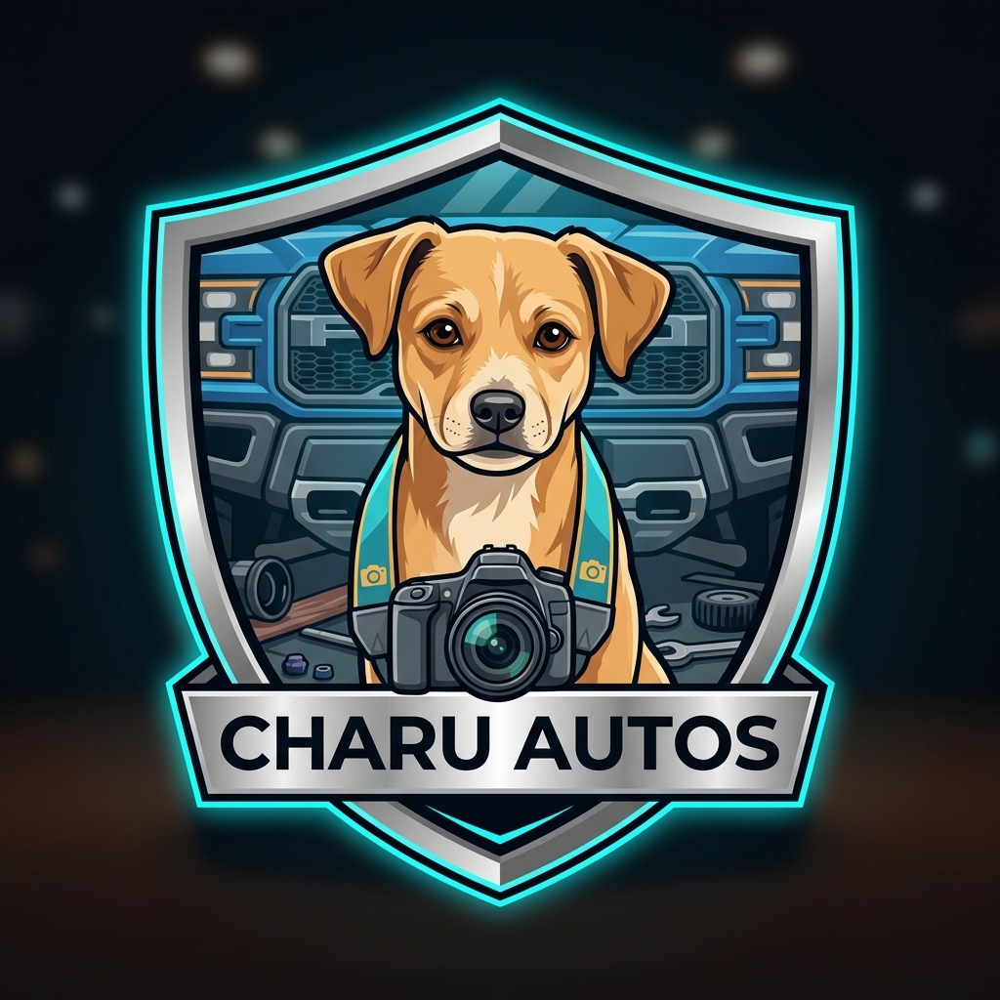

---

## 📌 TABLA DE CONTENIDOS

1. [Módulo 01 — Introducción, Seguridad Primero & Advertencia Legal](#módulo-01--introducción-seguridad-primero--advertencia-legal)
2. [Módulo 02 — Cómo Funciona un Auto (Explicado sin Jerga)](#módulo-02--cómo-funciona-un-auto-explicado-sin-jerga)
3. [Módulo 03 — Herramientas Básicas y el Kit de Emergencia](#módulo-03--herramientas-básicas-y-el-kit-de-emergencia)
4. [Módulo 04 — Rutinas de Inspección Preventiva](#módulo-04--rutinas-de-inspección-preventiva)
5. [Módulo 05 — Fluidos Vitales: La Sangre y el Sudor de tu Vehículo](#módulo-05--fluidos-vitales-la-sangre-y-el-sudor-de-tu-vehículo)
6. [Módulo 06 — Neumáticos, Frenos y Seguridad Activa](#módulo-06--neumáticos-frenos-y-seguridad-activa)
7. [Módulo 07 — Batería, Sistema Eléctrico, Fusibles y Luces](#módulo-07--batería-sistema-eléctrico-fusibles-y-luces)
8. [Módulo 08 — Filtros, Bujías, Correas y Escobillas](#módulo-08--filtros-bujías-correas-y-escobillas)
9. [Módulo 09 — El Turbocompresor: Cuidados Críticos y la Regla de los 60 Segundos](#módulo-09--el-turbocompresor-cuidados-críticos-y-la-regla-de-los-60-segundos)
10. [Módulo 10 — Testigos del Tablero y Escáner OBD-II para Principiantes](#módulo-10--testigos-del-tablero-y-escáner-obd-ii-para-principiantes)
11. [Módulo 11 — Mantenimiento por Kilometraje y Costos Estimados](#módulo-11--mantenimiento-por-kilometraje-y-costos-estimados)
12. [Módulo 12 — Protocolo de Emergencias en Ruta y Cambio de Llanta](#módulo-12--protocolo-de-emergencias-en-ruta-y-cambio-de-llanta)
13. [Módulo 13 — Guía para ir al Taller sin Ser Estafado](#módulo-13--guía-para-ir-al-taller-sin-ser-estafado)
14. [Módulo 14 — Apéndices, Checklists Imprimibles y Bitácora de Mantenimiento](#módulo-14--apéndices-checklists-imprimibles-y-bitácora-de-mantenimiento)

---

---

# Módulo 01 — Introducción, Seguridad Primero & Advertencia Legal
### Manual del Conductor Inteligente • Edición Cero Conocimientos
*Por CharuAutos (@charuautopics) — "Pasión Automotriz al Alcance de tus Manos"*

---

*Charu — Mascota Oficial y Símbolo de Pasión Automotriz*

---

## ⚡ 1. Bienvenido al Mundo del Conductor Inteligente

Si acabas de comprar tu primer auto, o llevas años conduciendo pero cada vez que abres el capó sientes que estás mirando una nave espacial alienígena, **este manual fue escrito exactamente para ti**.

La gran mayoría de los libros automotrices cometen uno de dos errores fatales:
1. Son folletos comerciales superficiales que solo te dicen "ve al concesionario oficial para cualquier detalle".
2. O son manuales densos para ingenieros mecánicos con diagramas eléctricos incomprensibles y fórmulas de torque.

Este manual rompe esa brecha. Nuestro objetivo **no es convertirte en mecánico de carreras**, sino darte la **autonomía, criterio y seguridad práctica** para cuidar tu inversión, no quedarte varado en carretera y saber con exactitud cuándo un taller te está hablando con honestidad o cuándo intentan inflar una factura con servicios innecesarios.

---

## 🛡️ 2. Seguridad Primero: Las 5 Reglas de Oro Inviolables

Antes de tocar cualquier pieza metálica o aflojar una tuerca, graba estas cinco reglas en tu mente. La mecánica básica es sencilla y gratificante, pero un auto pesa más de 1.500 kg y almacena fluidos a alta presión y temperaturas superiores a los 90 °C.

> [!CAUTION]
> ### ⚠️ REGLA 1: JAMÁS ABRAS EL TAPÓN DEL RADIADOR CON EL MOTOR CALIENTE
> El circuito de enfriamiento trabaja bajo presión (entre 0.9 y 1.3 bares). Si abres el tapón con el motor caliente, el refrigerante hirviendo a más de 105 °C saldrá proyectado como un géiser hacia tu rostro y manos, causando quemaduras químicas y térmicas de segundo y tercer grado en segundos.  
> **Regla práctica:** Espera siempre un mínimo de **45 a 60 minutos** con el motor apagado antes de intervenir en el tapón del radiador o del depósito de expansión.

> [!WARNING]
> ### ⚠️ REGLA 2: NUNCA TE METAS DEBAJO DE UN AUTO SOSTENIDO SOLO POR UN GATO
> El gato hidráulico o de tijera que viene en tu cajuela está diseñado **únicamente para levantar el auto durante los minutos que tardas en cambiar una llanta**, jamás para sostener peso mientras una persona trabaja debajo. Un retén hidráulico puede colapsar sin previo aviso.  
> **Regla de oro:** Si alguna vez requieres mirar por debajo, el vehículo debe estar apoyado sobre **torres o caballetes metálicos certificados (Jack Stands)** con el freno de mano puesto y cuñas bloqueando las ruedas opuestas.

> [!IMPORTANT]
> ### ⚠️ REGLA 3: PROTECCIÓN PERSONAL OBLIGATORIA (EPP BÁSICO)
> Tus manos y tus ojos son insustituibles:
> - **Gafas de seguridad de policarbonato:** Evitan que chispas de batería o salpicaduras de fluidos cáusticos (como el líquido de frenos) alcancen tus ojos.
> - **Guantes de nitrilo gruesos o mecánicos:** El aceite quemado contiene hidrocarburos aromáticos policíclicos (HAP) cancerígenos; los metales del escape pueden estar al rojo vivo.
> - **Cero ropa holgada, bufandas o collares:** Cualquier tela suelta puede ser atrapada instantáneamente por las correas en movimiento del motor.

> [!TIP]
> ### 💡 REGLA 4: RETIRA LLAVES Y DESCONECTA EL BORNE NEGATIVO AL TRABAJAR CON ELECTRICIDAD
> Si vas a tocar fusibles, cambiar una batería o manipular sensores, asegúrate de que el contacto esté completamente apagado y guarda las llaves fuera del switch para evitar arranques accidentales.

> [!NOTE]
> ### 📖 REGLA 5: EL MANUAL DEL FABRICANTE SIEMPRE MANDA
> Cada modelo tiene sus propias tolerancias, viscosidades de aceite recomendadas por ingeniería y presiones de neumáticos específicas. La información en este libro aplica a la inmensa mayoría de autos a combustión del mercado global, pero ante cualquier discrepancia, **la palabra final la tiene el Manual del Propietario de tu vehículo**.

---

## ⚖️ 3. Descargo de Responsabilidad Técnica y Legal (Disclaimer)

Este compendio tiene como propósito la educación preventiva y el empoderamiento del conductor en tareas de mantenimiento primario (nivel usuario). La intervención en componentes críticos de seguridad activa (sistemas hidráulicos de frenos, dirección asistida, bolsas de aire o módulos ABS) debe realizarse con la debida precaución y, ante la menor duda técnica, derivarse a técnicos profesionales certificados (ASE u homólogos). El autor y CharuAutos no asumen responsabilidad por daños materiales o personales derivados de la manipulación negligente de herramientas o vehículos.

---

# Módulo 02 — Cómo Funciona un Auto (Explicado sin Jerga)
### Manual del Conductor Inteligente • Edición Cero Conocimientos
*Por CharuAutos (@charuautopics) — "Pasión Automotriz al Alcance de tus Manos"*

---

## 🚗 1. La Metáfora del Cuerpo Humano

Para entender tu vehículo sin necesidad de estudiar ingeniería, imagínalo como un organismo vivo:

| Componente del Auto | Equivalente Humano | Función Vital |
| :--- | :--- | :--- |
| **Motor** | El Corazón | Bombea energía mecánica y potencia |
| **Gasolina / Diésel** | El Alimento | La energía química cruda que alimenta el ciclo |
| **Aceite de Motor** | La Sangre que Lubrica | Evita fricción destructiva metal contra metal |
| **Sistema de Refrigeración** | El Sudor / Termostato | Mantiene la temperatura constante en 90 °C |
| **Sistema Eléctrico** | El Sistema Nervioso | Genera la chispa, sensores y controla la ECU |
| **Frenos** | Músculos de Detención | Disipan la inercia convirtiéndola en calor |
| **Suspensión y Neumáticos**| Las Piernas y Calzado | Absorben impactos y mantienen el agarre |

---

## ⚙️ 2. Los 6 Sistemas Vitales de tu Auto

### 1. El Motor (El Corazón a 4 Tiempos)
El 95% de los autos a combustión funcionan con el ciclo Otto/Diésel de 4 tiempos:
1. **Admisión:** Abre la válvula y entra una mezcla de aire y gasolina pulverizada.
2. **Compresión:** El pistón sube y comprime la mezcla con enorme fuerza.
3. **Explosión / Combustión:** La bujía salta con una chispa eléctrica; la mezcla explota y empuja el pistón hacia abajo violentamente. **De aquí sale toda la fuerza del auto**.
4. **Escape:** Sube el pistón y expulsa los gases quemados hacia el escape y silenciador.

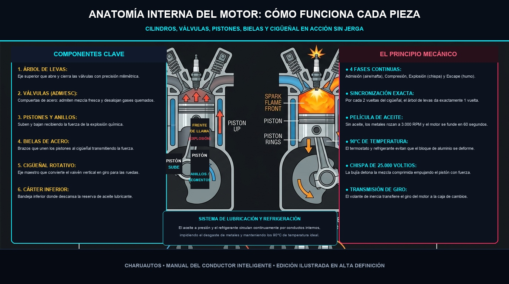
*Infografía Técnica en Alta Definición: Funcionamiento y relación entre árboles de levas, válvulas, pistones, bielas y cigüeñal.*
> **¿Por qué te importa saber esto?**  
> Porque para que ese proceso ocurra miles de veces por minuto sin fundirse, el motor necesita **3 cosas que jamás pueden faltar**:
> - **Aire limpio** (a través del filtro de aire).
> - **Chispa a tiempo** (a través de las bujías).
> - **Lubricación continua** (a través del aceite y filtro de aceite).

---

### 2. La Transmisión / Caja de Cambios (La Palanca de Fuerza)
El motor gira muy rápido (entre 800 y 6.000 revoluciones por minuto). Si conectaras las ruedas directamente al motor, el auto saldría disparado o se apagaría al arrancar.
- La **caja de cambios** adapta esa velocidad mediante engranajes:
  - Las marchas bajas (1ª y 2ª) dan **mucha fuerza y poca velocidad** (para arrancar o subir pendientes).
  - Las marchas altas (4ª, 5ª y 6ª) dan **poca fuerza y mucha velocidad** (para viajar en carretera gastando poca gasolina).
- **Cajas Manuales:** El conductor usa el pedal de embrague para conectar y desconectar la fuerza.
- **Cajas Automáticas (ATF / CVT / Doble Embrague):** El vehículo cambia los engranajes mediante presión hidráulica y computadoras.

---

### 3. El Sistema de Refrigeración (El Enfriador)
Solo el 30% de la gasolina se convierte en movimiento; el 70% restante se transforma en calor puro.
- El **radiador** enfría el líquido refrigerante con el viento que entra por la parrilla frontal.
- La **bomba de agua** hace circular el refrigerante por canales internos del bloque motor.
- El **termostato** es una compuerta inteligente: si el motor está frío, se cierra para que caliente rápido; cuando llega a 90 °C, se abre para enviar el fluido al radiador.

---

### 4. El Sistema de Frenos (La Seguridad Crítica)
La mayoría de los autos modernos tienen **frenos de disco hidráulicos** en las 4 ruedas (o tambores en las traseras):
- Cuando pisas el pedal, empujas **líquido de frenos** incompresible por tuberías metálicas.
- Ese líquido empuja un pistón en la mordaza (*caliper*).
- La mordaza aprieta dos **pastillas de freno** abrasivas contra un disco de acero que gira con la rueda.
- La fricción detiene el auto transformando la velocidad en calor extremo.

---

### 5. Suspensión y Dirección (El Control del Camino)
- **Amortiguadores y Resortes:** Absorben los baches para que las llantas nunca pierdan contacto con el asfalto.
- **Rótulas y Muñones:** Son las articulaciones esféricas que permiten que las ruedas giren a los lados y suban y bajen simultáneamente.

---

### 6. Sistema Eléctrico y Batería (El Cerebro)
- La **batería** solo sirve para arrancar el auto y alimentar accesorios cuando el motor está apagado.
- Una vez que el motor arranca, el **alternador** genera toda la electricidad del vehículo y recarga la batería para el siguiente arranque.

---

## 🔍 3. Mapa Visual Rápido Bajo el Capó

Cuando abras el cofre, busca estos 4 tapones universales:
1. **Tapón de Aceite:** Tiene grabado el icono de una aceitera goteando.
2. **Varilla de Aceite:** Tirador con anilla de plástico (amarilla o naranja).
3. **Depósito de Refrigerante:** Tanque traslúcido con líquido rosado, verde o azul.
4. **Depósito Limpiaparabrisas:** Tapa plástica (casi siempre azul o negra) con un parabrisas y chorritos de agua grabados.

---

## 🔍 Resumen Visual del Motor: El Vano Motor en Español

Para que nunca más sientas miedo al abrir el capó, esta infografía resume la ubicación típica de los depósitos y componentes esenciales:

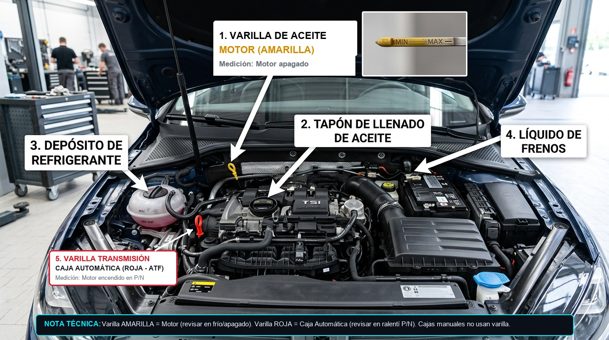
*Guía Visual de Identificación de Componentes en el Vano Motor*

---

# Módulo 03 — Herramientas Básicas y Kit de Emergencia
### Manual del Conductor Inteligente • Edición Cero Conocimientos
*Por CharuAutos (@charuautopics) — "Pasión Automotriz al Alcance de tus Manos"*

---

## 🧰 1. El Kit del Principiante Inteligente (Menos de $40 USD)

No necesitas gastar cientos de dólares en cajas de herramientas profesionales. Como conductor precavido, solo requieres 6 elementos esenciales que caben en una pequeña bolsa bajo el asiento:

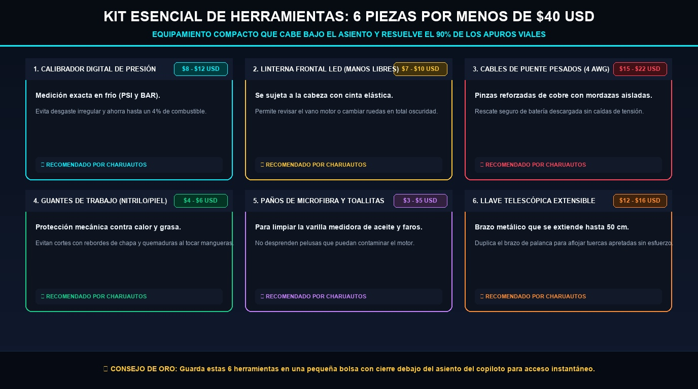
*Infografía Técnica en Alta Definición: Las 6 herramientas clave para llevar bajo el asiento por menos de $40 USD.*

| Herramienta Recomendada | Costo Estimado | Utilidad Clave en Ruta |
| :--- | :---: | :--- |
| **1. Calibrador Digital de Neumáticos** | $8 - $12 USD | Medir presión exacta en frío (PSI/Bar) |
| **2. Linterna Frontal LED (Manos Libres)** | $7 - $10 USD | Iluminar vano motor o rueda sin ocupar manos |
| **3. Juego de Cables de Puente (4 AWG)** | $15 - $22 USD | Rescate seguro de batería descargada |
| **4. Guantes de Trabajo Nitrilo / Piel** | $4 - $6 USD | Protección contra calor, filos y grasa |
| **5. Paños de Microfibra y Toallitas** | $3 - $5 USD | Limpieza de varilla de aceite y manos |
| **6. Llave Telescópica Extensible** | $12 - $16 USD | Palanca adicional para aflojar tuercas apretadas |

> [!TIP]
> **El Secreto de la Llave Telescópica:** La llave pequeña en forma de "L" que traen los autos de fábrica es corta y requiere que hagas una fuerza sobrehumana para aflojar tuercas apretadas con pistola neumática en talleres. Una llave telescópica extensible duplica tu brazo de palanca: **con la mitad de esfuerzo aflojas cualquier tuerca fácilmente**.

---

## 🎒 2. El Kit Obligatorio de Supervivencia en la Cajuela

En la mayoría de los países de habla hispana, estos elementos son obligatorios por ley de tránsito y te salvarán la vida ante una avería en autopista:

1. **Triángulos de Señalización Reflectivos (2 unidades):**  
   - Se colocan a **50 metros detrás del auto** en carretera convencional y a **100 metros en autopista** para avisar a los autos que vienen a 120 km/h.
2. **Chaleco Reflectante de Alta Visibilidad:**  
   - **Guárdalo dentro de la guantera o bajo el asiento del piloto**, NUNCA en la cajuela. Si te bajas del auto en una noche oscura sin el chaleco puesto, corres riesgo de atropellamiento.
3. **Mini Compresor Eléctrico Portátil (12V para encendedor):**  
   - Cuesta entre $20 y $30 USD y te permite inflar una llanta desinflada en 4 minutos sin tener que desmontarla en un lugar peligroso.
4. **Botiquín de Primeros Auxilios:**  
   - Gasas estériles, vendas, alcohol, cinta médica, tijeras y analgésicos básicos.
5. **Extintor Automotriz de Polvo Químico Seco (Tipo ABC):**  
   - Verifica que el manómetro esté en la zona verde y no vencido.

---

## ❌ Qué Cosas NO Vale la Pena Comprar al Inicio
- **Juegos de 150 llaves y copas:** Ocupan espacio, pesan 15 kg y el 90% de las medidas jamás las usarás.
- **Líquidos "milagrosos" para tapar fugas de radiador:** Contienen partículas que taponan los conductos microscópicos del calefactor de cabina y causan averías de cientos de dólares.
- **Herramientas de marcas ultra baratas sin certificar:** Se doblan en el primer intento y redondean las tuercas dejándote atrapado.

---

## 🎒 Resumen Visual: El Kit de Emergencia Completo en tu Cajuela

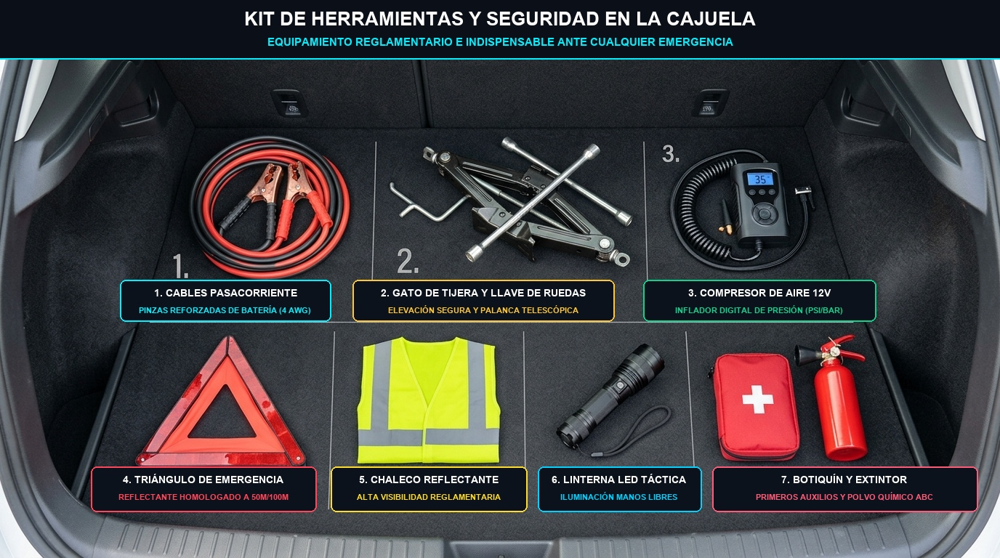
*Elementos Reglamentarios y Esenciales para Conducir con Tranquilidad en Ciudad y Carretera*

---

# Módulo 04 — Rutinas de Revisión en 5 Minutos (Diaria, Semanal y Mensual)
### Manual del Conductor Inteligente • Edición Cero Conocimientos
*Por CharuAutos (@charuautopics) — "Pasión Automotriz al Alcance de tus Manos"*

---

## ⏱️ 1. La Filosofía del Mantenimiento Predictivo

El 80% de las averías catastróficas (motor fundido, caja rota o radiador estallado) **empiezan semanas antes como una fuga silenciosa o un nivel bajo** que pudo detectarse con una mirada de 30 segundos.

Crear hábitos preventivos es la diferencia entre gastar $15 USD en un litro de aceite a tiempo o gastar $2.500 USD en rectificar un motor arruinado.

---

## 🚶 2. El Chequeo Visual Diario (30 Segundos al Acercarte al Auto)

Cada mañana antes de subirte al vehículo, haz una inspección rápida en 3 pasos:

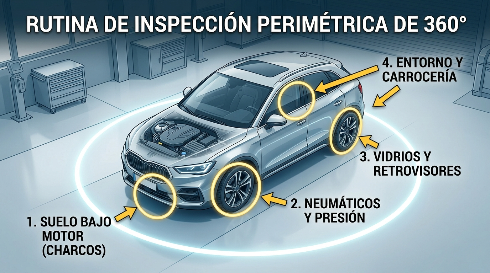
*Infografía Automotriz: Los 4 puntos de chequeo perimétrico en 10 segundos antes de encender el motor.*

- **Paso 1: Suelo bajo el motor.** ¿Hay charcos negros (aceite), rosados/verdes (coolant) o rojizos (caja)? *(Nota: agua clara e inodora es condensación normal del A/C).*
- **Paso 2: Las 4 ruedas.** Comprueba visualmente que ninguna llanta se vea visiblemente aplastada o desinflada.
- **Paso 3: Vidrios y retrovisores.** Parabrisas libre de excrementos de aves, nieve, ramas o suciedad que reste visibilidad.
- **Paso 4: Entorno y carrocería.** Asegúrate de que no haya mascotas, juguetes o pilotes ocultos detrás de la trayectoria de salida.

---

## 🗓️ 3. La Rutina Semanal de 5 Minutos (Día Sábado o Domingo)

Con el auto estacionado en un lugar plano y el motor **frío y apagado**:

### 1. Nivel de Aceite de Motor
- Saca la varilla amarilla/naranja.
- Límpiala con un papel o toalla de microfibra.
- Insértala de nuevo hasta el fondo.
- Retírala y observa: el aceite debe estar **entre los orificios o marcas MIN y MAX**.
- *Si está cerca del MIN:* Agrega de 0.5 a 1 litro del aceite de la misma viscosidad recomendada en tu manual.

### 2. Nivel de Líquido Refrigerante / Coolant
- Mira el envase plástico translúcido al lado del radiador.
- Sin abrirlo, confirma que el nivel esté entre las marcas **COLD / MIN** y **FULL / MAX**.

### 3. Líquido Limpiaparabrisas
- Abre la tapa azul y rellena con líquido lavaparabrisas formulado (evita agua del grifo sola porque crea hongos y sarro que obstruyen los aspersores).

---

## 📆 4. La Rutina Mensual de 10 Minutos (El Primer Fin de Semana de Cada Mes)

| Componente | Qué Comprobar | Acción Preventiva |
| :--- | :--- | :--- |
| **Presión de Neumáticos** | Medir con calibrador digital las 4 ruedas + la de repuesto. | Inflar a las PSI indicadas en la etiqueta de la puerta del conductor. |
| **Líquido de Frenos** | Nivel visible a través del envase transparente cerca de la pared de fuego. | Si bajó del MIN, no solo rellenes: ¡revisa desgaste de pastillas! |
| **Batería y Bornes** | Inspeccionar si hay corrosión blanca/azulada en los postes. | Limpiar con agua caliente y bicarbonato usando un cepillo viejo. |
| **Luces Exteriores** | Encender bajas, altas, intermitentes, reversa y freno. | Pídele a alguien que mire atrás o apóyate contra una pared para ver el reflejo. |
| **Escobillas Limpiaparabrisas** | Pasar un trapo húmedo por el filo de goma. | Si rechina, salta o deja rayas sobre el vidrio, cámbialas de inmediato. |

---

# Módulo 05 — Fluidos Vitales: La Sangre y el Sudor de tu Vehículo
### Manual del Conductor Inteligente • Edición Cero Conocimientos
*Por CharuAutos (@charuautopics) — "Pasión Automotriz al Alcance de tus Manos"*

---

## 🩸 1. Los 5 Fluidos Esenciales que Mantienen Vivo tu Motor

Un vehículo moderno depende de cinco fluidos principales para funcionar sin destruirse a sí mismo. Si aprendes a revisarlos, evitarás el 70% de las averías catastróficas de motor y transmisión:

*Infografía Técnica en Alta Definición: Ubicación exacta de los depósitos en el vano motor, colores y frecuencias de reemplazo.*

| Fluido Vital | Color Saludable | Cuándo Revisar | Consecuencia de Falla |
| :--- | :--- | :--- | :--- |
| **Aceite de Motor** | Miel dorado a ámbar traslúcido | Cada 1.000 km o 15 días | Fundición completa del motor |
| **Líquido Refrigerante** | Rosa fosforito, verde neón o azul | Mensualmente (siempre en frío) | Sobrecalentamiento y junta de culata |
| **Líquido de Frenos** | Amarillo pálido a ámbar claro | Cada 2 a 3 meses | Pérdida total de capacidad de frenado |
| **Dirección Asistida / ATF** | Rojo grosella brillante o rosa | Cada 3 meses | Dirección pesada y desgaste de bomba |
| **Limpiaparabrisas** | Azul o verde traslúcido | Semanalmente | Visibilidad nula ante barro o lluvia |

---

## 🛢️ 2. Aceite de Motor: Lectura Exacta de la Varilla

El aceite lubrica las piezas metálicas que se mueven a miles de revoluciones por minuto, dispersa el calor interno y arrastra impurezas hacia el filtro.

### Procedimiento de Medición en 5 Pasos:
1. **Superficie plana:** Estaciona el auto en un terreno completamente horizontal. En una pendiente, la lectura será falsa.
2. **Motor tibio/frío:** Apaga el motor y espera al menos **10 a 15 minutos** para que todo el aceite de la culata descienda al cárter.
3. **Primera extracción:** Saca la varilla (suele tener tirador amarillo o naranja). Límpiala completamente con un paño de microfibra o papel sin pelusa. No mires esta primera lectura: no es válida porque el aceite salpicó al circular.
4. **Segunda inserción:** Introduce la varilla hasta el fondo firmemente, espera 3 segundos y extráela con cuidado manteniéndola vertical con la punta hacia abajo.
5. **Lectura visual:** Observa dónde se sitúa la película brillante de aceite.

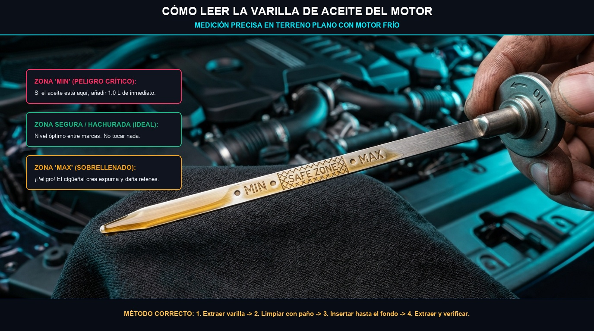
*Fotografía e Ilustración: Interpretación correcta de los niveles de la varilla (MIN, Zona Segura y el peligro grave del sobrellenado).*

> [!WARNING]
> ### ⚠️ El Error del Sobrellenado
> Muchos conductores novatos piensan: "si un poco es bueno, más es mejor". **Falso y peligroso**. Si el nivel de aceite supera la marca MAX, el cigüeñal golpeará la superficie del aceite batiéndolo como mayonesa y creando burbujas de aire. Las bombas de aceite no bombean espuma, por lo que las piezas se quedarán sin lubricación y los retenes reventarán por exceso de presión en el cárter.

### Decodificando la Viscosidad: ¿Qué significa 5W-30 o 0W-20?
- **El número con la "W" (Winter / Invierno):** Indica la fluidez en frío. Un `0W` o `5W` fluye como agua al arrancar a baja temperatura, llegando al árbol de levas en microsegundos.
- **El segundo número (Verano / Temperatura de operación a 100 °C):** Indica la viscosidad cuando el motor está a régimen térmico pleno. Un `30` o `40` mantendrá una película protectora resistente bajo el sol abrasador.
- **¿Mineral vs Sintético?:** Los aceites **100% sintéticos** modernos protegen el doble, se degradan menos y resisten hasta 10.000 - 15.000 km frente a los 5.000 km del mineral clásico. Usa siempre la especificación recomendada por el fabricante (API SP, ILSAC GF-6 o normas ACEA).

---

## ❄️ 3. Refrigerante / Anticongelante: El Escudo Térmico

El refrigerante es una mezcla equilibrada de 50% agua desmineralizada y 50% glicol (monoetilenglicol) con aditivos anticorrosivos. Eleva el punto de ebullición a más de 125 °C bajo presión y evita que el bloque se congele a -35 °C.

> [!CAUTION]
> ### 🛑 REGLA INQUEBRANTABLE DE SEGURIDAD
> **NUNCA, BAJO NINGUNA CIRCUNSTANCIA, ABRAS EL DEPÓSITO DE EXPANSIÓN O RADIADOR CON EL MOTOR RECIÉN APAGADO.**  
> El sistema almacena líquido a más de 100 °C y presiones de 1 a 1.4 bar. Al retirar el tapón, la caída repentina de presión hace que el líquido entre en ebullición instantánea, provocando una erupción que rocía agua hirviendo y vapor directamente sobre tu cara y manos.  
> Espera siempre que el motor esté **frío al tacto** (mínimo 45 minutos).

### ¿Por qué NUNCA se debe usar agua de grifo?
El agua del grifo contiene sales, cloro y cal que oxidan el radiador por dentro, forman sarro que tapa los conductos microscópicos de la culata y corroe la bomba de agua. Solo en una emergencia absoluta y para llegar al taller más próximo se admite agua; luego deberá drenarse y purgarse el circuito por completo.

---

## 🛑 4. Líquido de Frenos: La Fuerza Hidráulica Oculta

El líquido de frenos transmite la fuerza de tu pie desde el pedal hasta las cuatro ruedas con una presión que supera los 100 bares.

- **Naturaleza Higroscópica:** El líquido de frenos absorbe humedad ambiental del aire como una esponja a través de los microporos de los manguitos flexibles.
- **El Fenómeno del "Vapor Lock":** Con apenas un 3% de agua absorbida, el punto de ebullición del líquido cae de 260 °C a menos de 150 °C. Si bajas una colina frenando repetidamente, los discos calientan las pinzas, el agua dentro del líquido hierve y crea **burbujas de vapor**. Como el vapor se comprime, el pedal de freno se irá al fondo **sin frenar el auto**.
- **Cambio Obligatorio:** Se debe reemplazar cada **2 años o 40.000 km**, independientemente del uso del auto.
- **Especificaciones:** La mayoría de autos usan **DOT 4** (compatible hacia atrás con DOT 3). Nunca mezcles con fluidos base silicona (DOT 5).

> [!WARNING]
> El líquido de frenos es un decapante corrosivo para la pintura de la carrocería. Si derramas una sola gota en la chapa, enjuágala inmediatamente con abundante agua corriente.

---

## 🕵️‍♂️ 5. Guía de Detección de Fugas en el Suelo (Tabla del Detective)

Si al mover tu auto por la mañana ves manchas en el suelo del garaje o la acera, no te alarmes a ciegas; usa esta tabla de identificación cromática y de consistencia:

*Infografía Técnica en Alta Definición: Diagnóstico inmediato de averías según el color, textura y consistencia del charco bajo el auto.*

| Color del Charco | Textura y Olor | Origen Probable | Nivel de Urgencia |
| :--- | :--- | :--- | :--- |
| **Transparente** | Acuosa, inodora | Condensación de Aire Acondicionado | 🟢 **NORMAL:** No es una fuga de fluido |
| **Marrón oscuro** | Oleosa, resbaladiza | Aceite lubricante de motor | 🟡 **MODERADO:** Revisar nivel en varilla |
| **Rosa / Verde** | Acuosa, olor dulce | Líquido Refrigerante / Anticongelante | 🔴 **ALTO:** Peligro de sobrecalentamiento |
| **Rojo brillante** | Aceitosa, fluido fino | ATF (Caja automática o servodirección) | 🔴 **ALTO:** Acudir a taller especializado |
| **Ámbar claro** | Muy resbalosa al tacto | Líquido de Frenos | ⛔ **CRÍTICO: ¡NO CONDUCIR EL AUTO!** |

---

# Módulo 06 — Neumáticos, Frenos y Seguridad Activa
### Manual del Conductor Inteligente • Edición Cero Conocimientos
*Por CharuAutos (@charuautopics) — "Pasión Automotriz al Alcance de tus Manos"*

---

## 🛞 1. Los Neumáticos: Tus Únicos 4 Puntos de Contacto con la Tierra

Mucha gente cree que los frenos detienen el vehículo; en estricto rigor físico, **los frenos detienen las ruedas, pero los neumáticos detienen el auto**. El área total de contacto entre un automóvil moderno y el asfalto equivale aproximadamente al tamaño de cuatro postales de papel. De esa minúscula superficie dependen tu vida y la de tus acompañantes.

---

## 💨 2. Presión de Inflado en Frío: Dónde Encontrarla y Cómo Medirla

El error más común es leer la presión máxima grabada en el flanco del neumático (ej: `44 PSI MAX PRESS`). **Ese NO es el inflado de tu auto; es el límite de ruptura que soporta el neumático antes de reventar en fábrica.**

### Dónde está la etiqueta oficial de tu auto:
Abre la puerta del conductor y mira el **pilar B** (el marco metálico donde traba la puerta). Allí encontrarás una placa metálica o pegatina con la presión exacta para tu modelo (expresada en PSI y BAR), distinguiendo entre carga normal y carga completa con equipaje.

### ¿Qué significa medir "en frío"?:
Se considera en frío cuando el auto ha rodado **menos de 2 km** o ha estado estacionado durante al menos **2 horas**. Al rodar por autopista, la fricción calienta el aire interno y sube la presión de 3 a 5 PSI de forma natural; jamás desinfles un neumático caliente pensando que está sobreinflado.

---

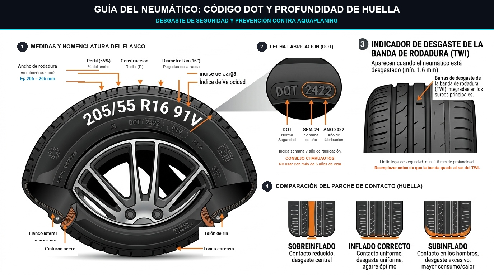
*Fotografía e Ilustración: Interpretación del código DOT de antigüedad, prueba de la moneda y prevención de aquaplaning.*

## 🪙 3. La Prueba de la Moneda y el Código de Antigüedad DOT

### A. La Prueba de la Moneda para Desgaste de Banda:
El límite legal mínimo en la mayoría de países es de **1.6 mm** de profundidad en los surcos principales, pero sobre asfalto mojado la distancia de frenado se duplica cuando el dibujo baja de **3.0 mm**.

1. Toma una moneda con borde visible (por ejemplo, una moneda de 1 Euro, de 10 pesos mexicanos o una moneda de 1 cuarto de dólar americano con la cabeza de Washington hacia abajo).
2. Introdúcela en las ranuras centrales de la banda de rodadura.
3. Si puedes ver la parte superior de la corona o el borde exterior completo sin que el surco lo cubra, el neumático ha perdido sus canales de evacuación hidrodinámica: **el riesgo de aquaplaning en lluvia es inminente**.

### B. El Código DOT: La Fecha de Caducidad de la Goma:
Los neumáticos caducan por envejecimiento natural de los polímeros del caucho (se cristalizan y se vuelven rígidos como plástico), aunque nunca se hayan usado y tengan el dibujo intacto.
- Busca la palabra **DOT** en el flanco exterior y localiza un recuadro ovalado con **4 dígitos numéricos**:
  - Ejemplo: `DOT ... 2423`
  - **Primeros 2 dígitos (24):** Semana del año (Semana 24 = principios de Junio).
  - **Últimos 2 dígitos (23):** Año de fabricación (2023).
- **Regla de oro:** Neumáticos con más de **5 años** deben inspeccionarse minuciosamente por microfisuras; con más de **7 a 8 años**, deben reemplazarse por seguridad aunque tengan dibujo.

---

## 🔄 4. Rotación, Alineación y Balanceo

- **Rotación (cada 10.000 km):** Como las ruedas delanteras soportan el peso del motor, la dirección y el 70% de la frenada, se desgastan el doble de rápido que las traseras. Rotarlas de eje distribuye el desgaste de forma uniforme y alarga su vida útil un 40%.
- **Balanceo (Equilibrado):** Si el volante **tiembla o vibra rítmicamente** a velocidades de autopista (entre 90 y 120 km/h), las ruedas han perdido sus contrapesos de plomo.
- **Alineación:** Si sueltas el volante unos metros en una recta plana y el auto **se desvía bruscamente hacia la izquierda o derecha**, o si notas que las llantas se gastan más por el borde interno que por el externo, la geometría de la suspensión está descalibrada.

---

## 🛑 5. Inspección Visual de Pastillas y Discos de Freno

No necesitas desarmar la rueda para tener una estimación del estado de tus frenos en la mayoría de rines de aleación:

| Elemento de Freno | Condición Saludable | Señal de Reemplazo Urgente |
| :--- | :--- | :--- |
| **Grosor de Pastilla** | 8 mm a 12 mm de material | Menos de 3 mm (Acudir de inmediato al taller) |
| **Disco de Freno** | Superficie lisa y pulida | Surcos profundos, reborde alto o alabeo |
| **Sonido al Frenar** | Silencio o leve fricción suave | Chirrido metálico chillón continuo |
| **Tacto en el Pedal** | Firme, directo y progresivo | Esponjoso, se va al fondo o vibra con fuerza |

> [!NOTE]
> ### 🎵 El Famoso "Chirrido de Chivato"
> Las pastillas de calidad incorporan una pequeña lengüeta de chapa metálica llamada avisador acústico. Cuando el material de fricción se desgasta hasta los 2.5 mm, esa chapita roza contra el disco produciendo un chillido agudo al frenar. No te asustes: es un diseño de ingeniería deliberado para avisarte antes de que el soporte de hierro dañe el disco.

---

## 🛑 Resumen Visual: Anatomía de Frenos y Suspensión

*Despiece de Cáliper, Pastillas, Disco Ventilado y Amortiguador*

---

# Módulo 07 — Batería, Sistema Eléctrico, Fusibles y Luces
### Manual del Conductor Inteligente • Edición Cero Conocimientos
*Por CharuAutos (@charuautopics) — "Pasión Automotriz al Alcance de tus Manos"*

---

## ⚡ 1. La Batería de 12V: El Corazón Eléctrico

La batería tiene una misión principal: entregar una corriente violenta de entre 300 y 600 amperios durante 2 segundos para mover el motor de arranque. Una vez que el motor enciende, el **alternador** toma el relevo, genera la electricidad del vehículo y recarga la batería.

### Los Voltajes que Debes Conocer:
Si tienes un multímetro digital básico de $10 USD:
- **12.6V a 12.8V (Motor apagado):** Batería cargada al 100%.
- **12.2V (Motor apagado):** Batería al 50% de carga (recarga preventiva).
- **Menos de 11.9V (Motor apagado):** Batería descargada o comunicada internamente. No arrancará.
- **13.8V a 14.4V (Motor encendido en ralentí):** El alternador está cargando perfectamente. Si marca menos de 13.2V o más de 15.0V, el alternador o regulador está averiado.

---

## 🔌 2. Protocolo de Puente de Arranque Seguro (Jump Start)

Hacer un puente de arranque de manera incorrecta puede quemar computadoras de a bordo (ECU) o provocar explosiones de gas hidrógeno liberado por una batería dañada. Sigue rigurosamente este orden:

*Infografía Automotriz: Secuencia 1-2-3-4 de conexión de cables para pasar corriente y comprobación de fusible sano vs quemado.*

### Paso a Paso Riguroso:
1. **Posición:** Estaciona el auto auxiliador cerca del auto sin batería, pero **sin que los parachoques o carrocerías se toquen entre sí**. Apaga el motor y retira las llaves en ambos.
2. **Paso 1 (Rojo a Muerta):** Conecta una pinza del **cable ROJO (+)** al borne positivo de la batería descargada.
3. **Paso 2 (Rojo a Sana):** Conecta la otra pinza del **cable ROJO (+)** al borne positivo de la batería del auto donante.
4. **Paso 3 (Negro a Sana):** Conecta una pinza del **cable NEGRO (-)** al borne negativo de la batería donante.
5. **Paso 4 (Negro a Masa Metálica del Auto Muerto):** Conecta la otra pinza del **cable NEGRO (-)** a una parte metálica gruesa y sin pintar del bloque del motor o tornillo de la torreta de amortiguación del auto varado.
   - *¿Por qué no al borne negativo de la batería descargada?* Porque al conectar el último cable siempre salta una microchispa. Si la batería descargada emitió vapores de hidrógeno inflamable, la chispa podría provocar una deflagración. Conectarlo al chasis alejado de la batería elimina este riesgo.
6. **Arranque:**
   - Enciende el auto donante y mantenlo acelerado levemente a 1.500 RPM durante 3 a 5 minutos para transferir energía inicial.
   - Da arranque al auto averiado. Debería encender de inmediato.
7. **Desconexión en Orden Inverso Exacto:**
   - 1° Retirar pinza negra de masa metálica.
   - 2° Retirar pinza negra del auto donante.
   - 3° Retirar pinza roja del auto donante.
   - 4° Retirar pinza roja del auto auxiliado.
8. **Rodaje:** Conduce el auto auxiliado durante un mínimo de 30 a 45 minutos continuos sin apagarlo para que el alternador restaure la carga química.

---

## 🧯 3. Fusibles: Los Guardianes de la Instalación Eléctrica

Si de repente dejan de funcionar los limpiaparabrisas, la toma de 12V del mechero o una luz interior, el 90% de las veces no hay una avería grave: simplemente se ha "volado" (fundido) un fusible de $0.50 USD.

### La Anatomía de un Fusible de Cuchilla:
### Tabla de Códigos de Color Estándar DIN:
| Color del Fusible | Amperaje (A) | Circuitos Típicos Protegidos |
| :--- | :---: | :--- |
| **Naranja / Beige** | 5A | Módulos de confort, sensores del cuadro |
| **Rojo** | 10A | Luces de posición, radio, airbag |
| **Azul** | 15A | Tomas de mechero 12V, bomba limpiaparabrisas |
| **Amarillo** | 20A | Faros principales, limpiaparabrisas |
| **Blanco / Claro** | 25A | Luneta térmica trasera, ventilador A/C |
| **Verde** | 30A | Elevalunas eléctricos, motor de calefacción |

> [!CAUTION]
> ### 🚫 LA REGLA SAGRADA DE LOS FUSIBLES
> **NUNCA instales un fusible de mayor amperaje que el original y JAMÁS sustituyas un fusible por papel de aluminio o un trozo de alambre de cobre.**  
> El fusible es el eslabón débil diseñado a propósito para derretirse de forma controlada si hay un cortocircuito. Si colocas un fusible de 30A donde iba uno de 10A, el fusible no se fundirá; lo que se fundirá e incendiará será el mazo de cables dentro de tu tablero.

---

## 💡 4. Cambio de Bombillas Halógenas (H7 / H4)

- **Regla de oro:** **NUNCA toques la ampolla de cuarzo/cristal con los dedos descalzos**. La grasa natural de tu piel se transfiere al cristal. Al encender la bombilla y superar los 250 °C, esa grasa crea un punto caliente que hace que el cristal se sobrecaliente localmente y estalle en pocos días. Manipúlala siempre sosteniéndola por el casquillo metálico o usando guantes limpios.

---

# Módulo 08 — Filtros, Bujías, Correas y Escobillas
### Manual del Conductor Inteligente • Edición Cero Conocimientos
*Por CharuAutos (@charuautopics) — "Pasión Automotriz al Alcance de tus Manos"*

---

## 🌬️ 1. Filtros de Aire: Los Pulmones del Auto y del Pasajero

### A. Filtro de Aire de Motor (Cambio DIY en 5 minutos):
Tu motor respira unos 10.000 litros de aire por cada litro de gasolina quemado. Si el filtro de aire está saturado de polvo e insectos, el motor trabaja forzado, pierde entre un 5% y 10% de potencia y aumenta el consumo de combustible.

- **Cómo cambiarlo:**
  1. Ubica la caja de plástico negra rectangular en el vano motor con una manguera gruesa que va hacia la admisión.
  2. Suelta las 2 a 4 grapas metálicas o retira un par de tornillos con destornillador de estrella.
  3. Levanta la tapa, extrae el filtro antiguo fijándote en su posición.
  4. Aspira o limpia con un paño húmedo el polvo suelto en el fondo de la caja plástica.
  5. Inserta el filtro nuevo y cierra las grapas asegurándote de que selle perfectamente alrededor del labio de goma.
- **La prueba de la linterna:** Pon una linterna por detrás del filtro. Si la luz no atraviesa el papel plisado, está saturado y debe reemplazarse.

### B. Filtro de Habitáculo / Cabina (El filtro antipolen):

*Procedimiento Visual: Extracción de Guantera y Sustitución del Filtro Antipolen en 5 Minutos*
Purifica el aire que tú y tu familia respiran por las rejillas del aire acondicionado.
- **Síntomas de cambio:** Olor a humedad o "calcetín sucio" al encender el aire, y vidrios que se empañan constantemente en invierno sin poder desempañarse con rapidez.
- **Ubicación típica:** En el 80% de los autos modernos se encuentra detrás de la guantera del copiloto (se sueltan dos topes plásticos laterales sin herramientas) o en la base exterior del parabrisas.
- **Atención a la flecha:** El filtro tiene grabada una flecha con las palabras `AIR FLOW ⬇️`. Debe apuntar siempre en la dirección hacia donde viaja el aire (suele ser hacia el suelo del habitáculo).

---

## ⚡ 2. Bujías: La Chispa de la Vida

En los motores de gasolina, la bujía genera el arco voltaico de más de 20.000 voltios que inflama la mezcla aire-combustible.

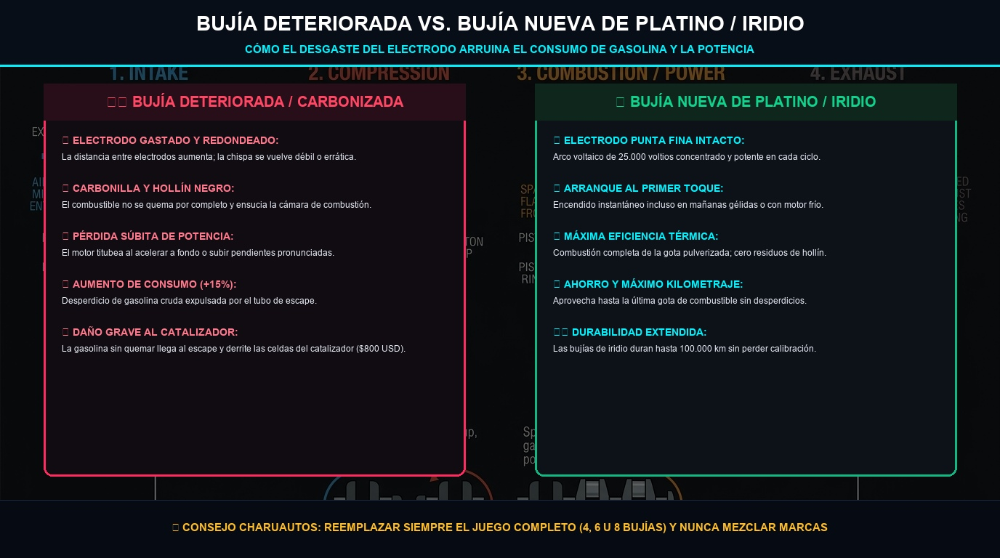
*Infografía Técnica en Alta Definición: Comparativa entre bujía deteriorada y bujía nueva de platino/iridio, síntomas de falla y eficiencia.*

| Tipo de Bujía | Material del Electrodo | Intervalo Típico de Reemplazo | Rendimiento |
| :--- | :--- | :---: | :--- |
| **Cobre / Estándar** | Núcleo de cobre tradicional | 20.000 a 30.000 km | Tradicional, económico |
| **Platino (Single/Double)** | Pastilla de platino soldado | 60.000 a 80.000 km | Alta durabilidad y estabilidad |
| **Iridio (Iridium)** | Punta extrafina de iridio | 100.000 a 120.000 km | Máxima eficiencia de chispa |

### Lectura Rápida del Electrodo al Retirarlas:
- **Color café claro / gris tostado:** Combustión perfecta y motor en óptima salud.
- **Cubierta de hollín negro seco:** Mezcla excesivamente rica (demasiada gasolina o filtro de aire tapado).
- **Brillante o aceitosa:** Retenes de válvula o aros de pistón gastados que dejan pasar aceite a la cámara.
- **Electrodo derretido o blanco lechoso:** Mezcla excesivamente pobre o sobrecalentamiento severo.

---

## 🔄 3. Correas: La Diferencia Vital entre Accesorios y Distribución

Muchos conductores confunden las dos correas del motor. Conocer la diferencia te evitará perder miles de dólares:

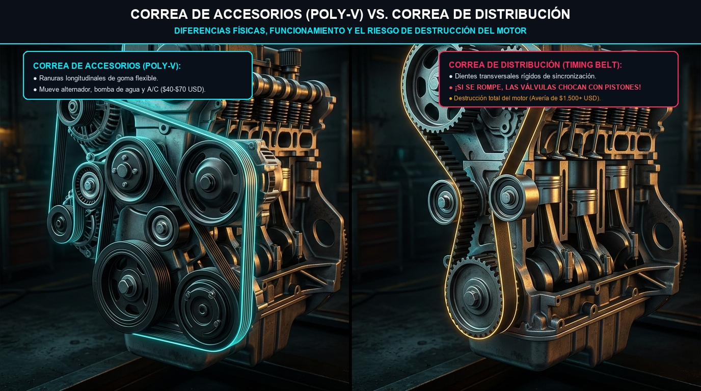
*Fotografía e Ilustración: Diferencias morfológicas, funcionamiento y el grave riesgo de rotura de la correa de distribución.*

| Característica | Correa de Accesorios (Poly-V) | Correa de Distribución (Timing Belt) |
| :--- | :--- | :--- |
| **Visibilidad** | Visible a simple vista al lateral del motor | Oculta bajo tapas plásticas herméticas |
| **Morfología** | Ranuras longitudinales paralelas | Dientes de caucho transversales reforzados |
| **Función** | Mueve alternador, compresor A/C y bomba | Sincroniza el giro del cigüeñal con el árbol de levas |
| **Si se rompe** | Se apaga el alternador y se endurece la dirección | ¡Las válvulas chocan contra los pistones y destrozan el motor! |
| **Costo reparación** | $40 - $90 USD (cambio sencillo) | $1.500 - $3.000+ USD en rectificado y motor nuevo |

> [!CAUTION]
> ### 🛑 ¿Tu Auto Tiene Correa o Cadena de Distribución?
> - **Cadena metálica:** Bañada en aceite de motor. Suele durar la vida útil del vehículo (250.000+ km) y solo requiere inspección de tensores si empieza a sonar metálicamente al arrancar en frío.
> - **Correa de goma:** Se degrada con los años. **Debe reemplazarse estrictamente por tiempo o kilometraje** (típicamente cada 5 a 6 años o entre 60.000 y 100.000 km, lo que ocurra primero), aunque a simple vista se vea entera.

---

## 🌧️ 4. Escobillas Limpiaparabrisas: El Truco de la Toalla

Cambiar las plumillas o escobillas es una tarea de 3 minutos que te ahorra hasta $30 USD de mano de obra en talleres:

1. Levanta el brazo metálico del limpiaparabrisas hasta su posición de servicio vertical.
2. **El truco de la toalla (VITAL):** Coloca inmediatamente una toalla gruesa doblada sobre el parabrisas, directamente debajo del brazo levantado. Si mientras retiras la escobilla el brazo de acero accionado por resorte se te resbala de las manos, **impactará como un martillo contra el cristal y lo quebrará al instante**. La toalla absorberá el impacto.
3. Presiona la pestaña plástica de liberación central y desliza la escobilla desgastada hacia abajo.
4. Inserta la nueva escobilla en el gancho (generalmente tipo "J-Hook") hasta escuchar un "click" audible.
5. Retira la cubierta plástica protectora de la goma y apoya suavemente el brazo sobre el cristal.

---

# Módulo 09 — El Turbocompresor: Cuidados Críticos y la Regla de los 60 Segundos
### Manual del Conductor Inteligente • Edición Cero Conocimientos
*Por CharuAutos (@charuautopics) — "Pasión Automotriz al Alcance de tus Manos"*

---

*Infografía Técnica: El Eje Flotante, Temperaturas Extremas y la Regla de Oro de los 60 Segundos*

---

## 🌪️ 1. ¿Qué es un Turbo y por qué tu Auto Probablemente Tiene Uno?

Si compraste un auto fabricado en los últimos 10 a 15 años, lo más seguro es que su motor sea turboalimentado (incluso en vehículos utilitarios compactos de 1.0 a 1.5 litros como EcoBoost, TSI, TCe, PureTech o diésel TDI/CRDi).

### La Explicación sin Jerga:
Imagina un **molino de viento diminuto de altísima precisión**. El turbo aprovecha los gases calientes que salen por el escape para hacer girar una turbina. Esa turbina mueve un compresor que **inyecta mucho más aire a presión dentro de los cilindros**. 
- **El resultado:** Un motor pequeño de 3 o 4 cilindros obtiene la potencia y aceleración de un motor grande de 6 cilindros, pero consumiendo mucho menos combustible cuando conduces suave.

---

## ⏱️ 2. La Regla de Oro: Los 60 Segundos que Salvan Miles de Dólares

El eje que une las dos turbinas del turbo gira a velocidades vertiginosas (entre **150.000 y 250.000 revoluciones por minuto**) y soporta temperaturas que superan los **850 °C a 1.000 °C**. 

A esa velocidad, ningún rodamiento de bolas convencional sobreviviría. El eje "flota" sobre una **micro-película de aceite de motor a presión** inyectada por la bomba de lubricación.

> [!CAUTION]
> ### 🛑 EL ERROR FATAL: APAGAR EL MOTOR DE GOLPE
> Cuando conduces por autopista a 120 km/h o subes una cuesta exigente, el turbo está al rojo vivo.  
> Si llegas a una estación de servicio o a tu casa y **apagas el motor de inmediato**, la bomba de aceite se detiene en seco.  
> El aceite que queda atrapado dentro del turbo quieto se "cocina" por el calor residual extremo (fenómeno de **carbonización / coquización**), convirtiéndose en carbón duro abrasivo.  
> Al día siguiente, cuando arranques, ese carbón rayará el eje y destruirá los sellos.  
> **Costo de reemplazar un turbo dañado: $800 a $2.500 USD.**

### 💡 El Protocolo de los 60 Segundos:
1. **Al arrancar por las mañanas:** Espera **30 a 60 segundos** en ralentí antes de iniciar la marcha para que la presión de aceite llegue al turbo. Conduce con suavidad los primeros 5 minutos sin pisar el acelerador a fondo.
2. **Al llegar a tu destino (especialmente tras autopista o viajes largos):** Permanece sentado con el motor en ralentí durante **60 segundos** antes de girar la llave para apagar. Ese minuto permite que el aceite siga fluyendo fresco, evacuando el calor extremo del turbo de forma progresiva.

---

## 🛢️ 3. El Aceite que Exige un Motor Turbo

Los motores turboalimentados no perdonan el uso de aceites baratos o minerales:
- **100% Sintético Obligatorio:** Requieren aceites formulados específicamente para resistir cizallamiento térmico extremo (normas **API SP**, **ILSAC GF-6** o **ACEA C2/C3**).
- **Protección contra LSPI (Preignición a Baja Velocidad):** En motores turbo de inyección directa de baja cilindrada (TGDI), el aceite incorrecto puede causar detonaciones destructivas espontáneas dentro del cilindro.
- **Respetar los Kilómetros:** Nunca extiendas el cambio de aceite más allá de los **10.000 km** o 1 año. En un motor turbo, el aceite viejo con hollín degrada directamente los sellos de la turbina.

---

## 👂 4. Síntomas de un Turbo en Problemas

Aprende a identificar las señales de fatiga antes de una rotura catastrófica:

| Síntoma Sensorial | Qué está Ocurriendo en el Turbo | Acción Recomendada |
| :--- | :--- | :--- |
| **🚓 Silbido como sirena de policía** al acelerar | Holgura excesiva en el eje flotante y roce de álabes | Acudir de inmediato al taller; el turbo está por romperse |
| **💨 Humo denso azulado o blanquecino** por el escape | Retenes de aceite quemados dejan filtrar fluido | Revisar nivel de aceite a diario y cambiar cartucho (CHRA) |
| **🐌 Pérdida súbita de aceleración ("Limp Mode")** | Manguera de intercooler rajada o válvula wastegate trabada | Inspeccionar abrazaderas, manguitos o válvula de descarga |

---

# Módulo 10 — Testigos del Tablero y Escáner OBD-II para Principiantes
### Manual del Conductor Inteligente • Edición Cero Conocimientos
*Por CharuAutos (@charuautopics) — "Pasión Automotriz al Alcance de tus Manos"*

---

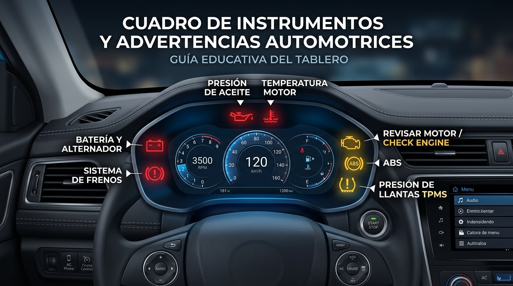
*Guía Gráfica de Testigos y Prioridades del Cuadro de Mandos en Español*

---

## 🚦 1. El Sistema de Semáforo del Cuadro de Instrumentos

Cuando giras la llave a la posición de contacto ("ON"), todos los testigos del cuadro se iluminan durante unos segundos en lo que se conoce como "autotest del sistema". Al arrancar el motor, deben apagarse por completo.

Si alguno permanece encendido o parpadea mientras conduces, clasifícalo inmediatamente según el código internacional de colores ISO 2575:

---

## ⚠️ 2. Los 7 Testigos Críticos que Jamás Debes Ignorar

| Icono Simbolizado | Color | Significado Real sin Jerga |
| :--- | :---: | :--- |
| **🛢️ Tetera de Aceite** | 🔴 Rojo | **PRESIÓN DE ACEITE NULA:** El motor se fundirá en segundos si no lo apagas |
| **🌡️ Termómetro en Líquido** | 🔴 Rojo | **TEMPERATURA CRÍTICA:** Sobrecalentamiento extremo del motor |
| **🪫 Batería con Polos** | 🔴 Rojo | **FALLO DE ALTERNADOR:** El sistema eléctrico se alimenta solo de la batería |
| **🛑 Círculo con Exclamación (!)** | 🔴 Rojo | **FRENO DE MANO O FUGA:** Nivel crítico en depósito de frenos |
| **🏎️ Silueta de Motor (Check Engine)**| 🟡 Amarillo | **FALLO DE SISTEMA:** Sensor averiado o combustión imperfecta (escanear) |
| **🛞 Neumático con Rayas (!)** | 🟡 Amarillo | **TPMS:** Presión baja de aire en uno o más neumáticos |
| **⭕ Círculo con letras ABS** | 🟡 Amarillo | **ABS INACTIVO:** El auto frena pero sin antibloqueo en piso deslizante |

> [!CAUTION]
> ### 🛑 La Tetera Roja: La Emergencia Más Letal
> El testigo de la tetera **NO mide la cantidad de aceite**, sino la **presión hidráulica**. Si se enciende en marcha significa que el aceite no está llegando con fuerza a las bielas y pistones. Si sigues conduciendo aunque sea 60 segundos, las piezas metálicas se soldarán por fricción extrema ("motor fundido" o "biela desbocada").  
> **Acción:** Pisar embrague, detenerse en el arcén, apagar el motor al instante y pedir grúa.

---

## 📱 3. El Escáner OBD-II para Principiantes: Diagnóstico por $15 USD

Desde 1996 en EE.UU. y 2001 en Europa, todos los automóviles cuentan por ley con un puerto estándar llamado **OBD-II (On-Board Diagnostics de 16 pines)**.

### ¿Qué necesitas para leer tu auto tú mismo?
1. **Un adaptador Bluetooth/Wi-Fi mini ELM327:** Cuesta entre $8 y $15 USD en Amazon o tiendas online.
2. **Una app gratuita en tu smartphone:** *Car Scanner ELM OBD2*, *Torque Lite* o *OBD Fusion*.

### Cómo Conectarlo y Diagnosticar en 3 Pasos:
1. Con el auto apagado, enchufa el adaptador en el puerto OBD-II bajo el tablero.
2. Pon la llave en contacto ("ON") sin arrancar el motor.
3. Abre la app en el teléfono, conéctala por Bluetooth y pulsa "Leer códigos de error (Read Fault Codes)".

### Anatomía de un Código DTC (Diagnostic Trouble Code):
La app te devolverá un código de 5 caracteres como `P0300`:
- **P (Powertrain):** Fallo en tren motriz (motor o transmisión).
- **0 (Universal):** Código estándar de la industria SAE.
- **3 (Subsistema):** Sistema de encendido / chispa.
- **00 (Código específico):** Fallo de encendido aleatorio en los cilindros (Random/Multiple Cylinder Misfire).

| Código Común OBD-II | Significado sin Jerga | Causa Más Frecuente |
| :--- | :--- | :--- |
| **P0301 / P0302 / P0303** | Fallo de encendido (chispa) en cilindro 1, 2 o 3 | Bujía desgastada o bobina de encendido defectuosa |
| **P0420** | Eficiencia del catalizador por debajo del umbral | Sensor de oxígeno sucio o catalizador fatigado |
| **P0171** | Sistema demasiado pobre (demasiado aire / poca nafta) | Manguera de vacío rajada o caudalímetro MAF sucio |
| **P0442** | Fuga pequeña en sistema EVAP de vapores | ¡El tapón del tanque de combustible quedó mal cerrado! |

> [!TIP]
> ### 💡 Borrar el Código NO Repara la Falla
> Las aplicaciones tienen un botón que dice "Clear DTC / Borrar Códigos". Si lo pulsas, la luz de Check Engine se apagará temporalmente, pero si no reparaste la pieza física rota, la computadora detectará la anomalía nuevamente tras 20 a 50 km de ciclo de conducción y volverá a encender la luz.

---

# Módulo 11 — Mantenimiento por Kilometraje y Costos Estimados
### Manual del Conductor Inteligente • Edición Cero Conocimientos
*Por CharuAutos (@charuautopics) — "Pasión Automotriz al Alcance de tus Manos"*

---

## 📈 1. Las 5 Etapas del Ciclo de Vida del Vehículo

El mantenimiento automotriz no es un gasto caprichoso: es una póliza de seguro matemático. Por cada dólar que inviertes en mantenimiento preventivo a tiempo, ahorras un promedio de $8 a $12 USD en reparaciones correctivas de emergencia.

---

## 📊 2. Tabla Maestra de Mantenimiento Preventivo

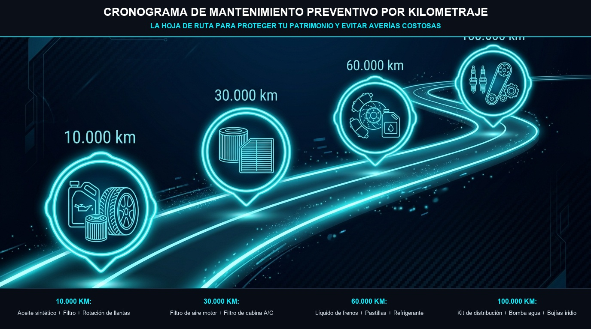
*Fotografía e Ilustración: Hoja de ruta preventiva de 10.000 a 100.000 kilómetros para cuidar tu vehículo e inversión.*

A continuación, los intervalos recomendados por la industria automotriz global con costos aproximados de repuestos (precios orientativos en USD de marcas Tier 1 de calidad) y tiempos de mano de obra en taller:

| Operación de Mantenimiento | Intervalo Típico | Costo Estimado Pieza | Mano de Obra | Nivel Dificultad |
| :--- | :---: | :---: | :---: | :---: |
| **Aceite Sintético + Filtro de Aceite** | 10.000 km / 1 año | $30 - $55 USD | 0.5 - 1.0 h | DIY Fácil |
| **Rotación de los 4 Neumáticos** | 10.000 km / 1 año | $0 (gratis) | 0.5 h | DIY Medio |
| **Filtro de Aire de Motor** | 15.000 - 20.000 km | $12 - $25 USD | 0.2 h | DIY Sencillo |
| **Filtro de Cabina (Antipolen)** | 15.000 - 20.000 km | $10 - $22 USD | 0.3 h | DIY Sencillo |
| **Escobillas Limpiaparabrisas** | 1 año | $15 - $30 USD | 0.1 h | DIY Sencillo |
| **Líquido de Frenos (Purga completa)** | 40.000 km / 2 años | $12 - $20 USD | 1.0 h | Taller |
| **Pastillas de Freno Delanteras** | 35.000 - 50.000 km | $35 - $70 USD | 1.0 h | Taller / Avanzado |
| **Bujías de Iridio (x4)** | 80.000 - 100.000 km | $40 - $75 USD | 0.8 h | Taller / Medio |
| **Cambio Líquido Refrigerante** | 60.000 km / 3 años | $20 - $35 USD | 1.0 h | Taller / Medio |
| **Aceite de Transmisión Manual / ATF** | 60.000 - 80.000 km | $45 - $110 USD | 1.5 h | Taller Especializado |
| **Kit Correa Distribución + Bomba Agua** | 90.000 - 120.000 km | $120 - $250 USD | 3.5 - 5.0 h | Taller Especializado |
| **Amortiguadores Delanteros/Traseros** | 80.000 - 100.000 km | $150 - $350 USD | 2.5 h | Taller Especializado |

---

## 💰 3. El Impacto en el Valor de Reventa

Un automóvil con historial de revisiones comprobable (libro de bitácora sellado y facturas de repuestos organizadas en una carpeta):
1. **Se vende un 15% a 25% más caro** que el mismo modelo con kilometraje idéntico pero sin antecedentes.
2. **Se vende 3 veces más rápido**, porque transmite confianza inmediata al comprador particular o concesionario.

---

# Módulo 12 — Protocolo de Emergencias en Ruta y Cambio de Llanta
### Manual del Conductor Inteligente • Edición Cero Conocimientos
*Por CharuAutos (@charuautopics) — "Pasión Automotriz al Alcance de tus Manos"*

---

## 🛡️ 1. Seguridad en Vía Pública: El Protocolo PAS

Si el auto sufre una avería o pinchazo en plena autopista o carretera secundaria, el mayor peligro no es la avería en sí, sino el riesgo de atropello por otros conductores desatentos.

Aplica la regla internacional **PAS**:
1. **PROTEGER:**
   - Enciende las **luces intermitentes de emergencia (warning / balizas)** de inmediato.
   - Lleva el auto con suavidad hacia el arcén derecho o berma, lo más alejado posible del carril de circulación.
   - Ponte el **chaleco reflectante ANTES de bajar del vehículo**.
   - Coloca los triángulos de preseñalización a **50 metros por detrás** (o usa la baliza luminosa magnética V-16 sobre el techo si está homologada en tu país).
2. **AVISAR:** Llama a tu servicio de asistencia en carretera o números de emergencia vial indicando el punto kilométrico exacto o tu ubicación GPS.
3. **SOCORRER:** Si hay heridos, no moverlos a menos que exista riesgo de incendio inminente.

---

## 🛞 2. El Cambio de Llanta Paso a Paso (A Prueba de Fallos)

Cambiar una rueda ponchada parece intimidante, pero siguiendo esta secuencia lógica de 10 pasos no tendrás ningún contratiempo:

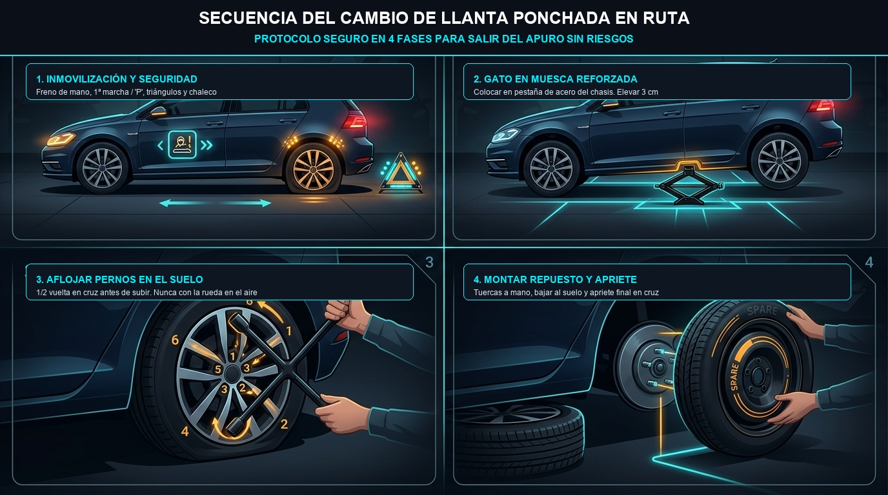
*Fotografía e Ilustración: Secuencia de 4 fases para sustituir una rueda ponchada con máxima seguridad en carretera.*

### Los 10 Pasos Detallados:
1. **Inmovilización Absoluta:** Terreno plano. Pon el freno de mano al máximo. Si es transmisión manual, coloca **1ª marcha** (o marcha atrás); si es automático, posición **"P" (Park)**.
2. **Aflojar en el Suelo (CRÍTICO):** Retira la copa embellecedora si tiene. Con el auto **apoyado en el suelo**, toma la llave de cruceta y gira cada perno o tuerca media vuelta en sentido antihorario (hacia la izquierda).  
   *¿Por qué en el suelo?* Porque si intentas aflojar pernos duros con la rueda suspendida en el aire, la rueda girará loca y corres el riesgo de volcar el auto del gato.
3. **Ubicar el Punto de Apoyo Reforzado:** Mira debajo del zócalo de la carrocería, a unos 15 cm detrás de la rueda delantera o delante de la rueda trasera. Verás una muesca o pestaña metálica gruesa de doble chapa diseñada para recibir la cabeza del gato.
4. **Elevar el Vehículo:** Gira la manivela del gato suavemente hasta que el neumático pinchado quede separado unos **3 a 4 centímetros del suelo**.
5. **El Truco de la Rueda Salvavidas:** Coloca la llanta de repuesto de costado debajo del zócalo del auto (cerca del gato). Si el gato llega a resbalar o fallar, el auto caerá sobre la goma de la rueda y no aplastará tus piernas.
6. **Retirar Tuercas y Llanta Pinchada:** Desenrosca los pernos que ya estaban flojos con la mano y extrae la rueda pinchada hacia afuera.
7. **Montar la Rueda de Repuesto:** Alinea los orificios e introduce la rueda de refacción. Coloca las tuercas a mano hasta que hagan tope y apriétalas suavemente con la llave de cruz.
8. **Recuperar la Rueda Salvavidas y Bajar:** Retira la rueda que pusiste debajo del chasis y baja el gato girando en sentido inverso hasta que la nueva rueda apoye completamente en el suelo. Retira el gato.
9. **Apriete Final en Estrella (Patrón Cruzado):** Con el auto ya en el suelo, aprieta firmemente todas las tuercas siguiendo un orden en estrella (en cruz): nunca en círculo continuo. Esto asegura que el aro asiente perfectamente plano contra el buje sin deformarse.
10. **Revisión de Presión:** Guarda la rueda ponchada, triángulos y gato en la cajuela. Conduce con calma a la estación de servicio más cercana para verificar la presión de la rueda de repuesto.

> [!WARNING]
> ### 🍩 La Rueda de Repuesto Temporal ("Galleta / Donut")
> Si tu auto tiene una rueda de repuesto delgada y compacta:
> - **Velocidad máxima:** Jamás superes los **80 km/h**.
> - **Distancia máxima:** Diseñada para recorrer no más de **80 a 100 km**.
> - Lleva la llanta principal ponchada a reparar a un taller vulcanizador de inmediato.

---

## 🔥 3. ¿Qué Hacer si el Motor Empieza a Recalentarse en Marcha?

Si ves que la aguja de temperatura sube al rojo o sale vapor blanquecino por los bordes del capó:
1. **Enciende la calefacción al máximo con el ventilador a tope:** Parece contradictorio en verano, pero el radiador de la calefacción actúa como un enfriador auxiliar sacando calor del bloque motor.
2. **Oríllate con seguridad:** No aceleres bruscamente; mantén una velocidad constante sin forzar el motor hasta detenerte en un lugar seguro.
3. **Apaga el motor de inmediato.**
4. **Levanta el seguro del capó pero NO abras el tapón de refrigerante:** Deja que el aire circule, pero mantén una distancia prudencial. Espera un mínimo de **45 a 60 minutos** antes de acercarte a tocar mangueras o verificar niveles.

---

# Módulo 13 — Guía para ir al Taller sin Ser Estafado
### Manual del Conductor Inteligente • Edición Cero Conocimientos
*Por CharuAutos (@charuautopics) — "Pasión Automotriz al Alcance de tus Manos"*

---

## 🛡️ 1. El Escudo Protector del Conductor Inteligente

El miedo a ser estafado en un taller mecánico es una de las razones principales por las cuales muchos conductores postergan el mantenimiento preventivo. La asimetría de información juega a favor del mecánico inescrupuloso: él conoce el vocabulario técnico y tú no.

Este módulo te enseña las técnicas exactas de comunicación, documentación y verificación para negociar de igual a igual y evitar sobreprecios absurdos.

---

## 🗣️ 2. Cómo Explicar el Problema sin Parecer un Novato

### La Regla de Oro: Describe Síntomas Sensoriales, JAMÁS des Diagnósticos.
Cuando un conductor llega al taller diciendo: *"Creo que se rompió la transmisión automática"*, el mecánico deshonesto escucha: *"Esta persona está dispuesta a gastar $1.500 USD en una caja de cambios aunque solo sea un taco de motor de $40 USD"*.

| ❌ Lo que NUNCA debes decir | ✅ La Manera Correcta y Precisa |
| :--- | :--- |
| "Creo que la suspensión trasera está rota" | "Escucho un golpe metálico en la rueda trasera derecha al pasar por badenes a 30 km/h" |
| "Cámbienme el alternador que la batería murió" | "Por las mañanas el motor de arranque gira lento durante 3 segundos antes de encender" |
| "Hagan lo que haga falta para que quede bien" | "Revisen el origen del chirrido al frenar y llámenme con un presupuesto escrito detallado antes de comprar o cambiar cualquier pieza" |

---

## 📋 3. Las 4 Cláusulas Innegociables en Todo Presupuesto

Antes de entregar las llaves de tu vehículo en cualquier taller, haz respetar estas 4 condiciones:

### 1. Presupuesto Previo Escrito y Detallado:
El documento debe desglosar:
- Costo unitario de cada repuesto con marca y número de parte.
- Cantidad de horas estimadas de mano de obra y tarifa por hora.
- Impuestos aplicables.

### 2. Cláusula de Cero Sorpresas ("No Add-ons"):
Declara explícitamente: *"Cualquier avería imprevista o pieza adicional que descubran durante el trabajo debe ser aprobada por mí por escrito (WhatsApp o correo) con su costo correspondiente antes de proceder. No autorizo gastos no pactados"*.

### 3. Exigir las Piezas Viejas Sustituidas en una Caja:
Cuando te entreguen el auto reparado, pide ver las piezas usadas que cambiaron:
- Si cambiaron las pastillas de freno, deben entregarte las pastillas viejas en la caja del repuesto nuevo.
- Si cambiaron un termostato, la bomba de agua o un rodamiento, exige ver la pieza desgastada.  
*Esto elimina de raíz la vieja estafa de "cobrar por repuestos que nunca se cambiaron".*

### 4. Conocer las Categorías de Repuestos:

*Infografía: Distinción entre Embalaje Oficial OEM, Calidad de Primer Nivel Aftermarket y Copias Riesgosas*
| Tipo de Repuesto | Qué es en Realidad | Recomendación CharuAutos |
| :--- | :--- | :--- |
| **OEM (Original de Fábrica)** | Caja oficial con el logo de la marca del auto | Calidad máxima pero con sobreprecio del 40-60% |
| **OES / Tier 1 (Bosch, Brembo, NGK, Mann)** | El fabricante real que surte las piezas al concesionario | **¡LA COMPRA INTELIGENTE!** Misma pieza que OEM a mitad de precio |
| **Genérico de Bajo Costo (Marca blanca)** | Copias baratas sin pruebas de fatiga certificadas | ⚠️ Peligro en frenos y suspensión; solo aceptable en plásticos |

---

## 🚩 4. Banderas Rojas (Red Flags) para Huir de un Taller

Huye si notas cualquiera de estos comportamientos:
- Se niegan a darte un presupuesto por escrito o solo te dicen cifras verbales vagas ("te costará unos $300 o más, ya veremos al abrir").
- Te presionan con pánico: *"Si sacas el auto hoy mismo de aquí, tus frenos van a explotar en la esquina y te vas a matar"*.
- Las instalaciones están en un caos absoluto, con charcos de aceite no recogidos y herramientas tiradas por el suelo.
- No te permiten ver las piezas que cambiaron argumentando que "ya las tiraron a la basura".

---

## 🛠️ Resumen Visual: Pasos del Conductor Inteligente en el Taller

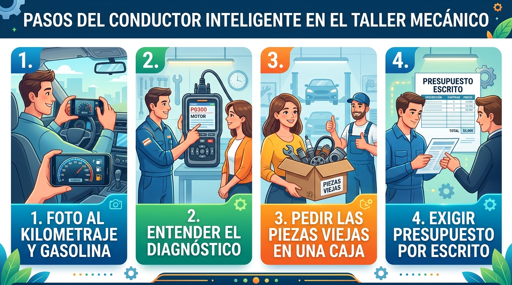
*Protocolo de Recepción, Diagnóstico con Presupuesto Previo y Entrega con Piezas Viejas en Mano*

---

# Módulo 14 — Apéndices, Checklists Imprimibles y Bitácora de Mantenimiento
### Manual del Conductor Inteligente • Edición Cero Conocimientos
*Por CharuAutos (@charuautopics) — "Pasión Automotriz al Alcance de tus Manos"*

---

## 📖 1. Glosario de Términos Automotrices de la A a la Z (Sin Jerga)

- **ABS (Anti-lock Braking System):** Sistema antibloqueo de frenos. Evita que las ruedas patinen en frenadas bruscas, permitiéndote mantener el control del volante.
- **Alternador:** Generador eléctrico accionado por el motor que produce la corriente que usa el auto y recarga la batería de 12V.
- **Aquaplaning:** Fenómeno físico donde el neumático pierde contacto con el asfalto al flotar sobre una película de agua, anulando frenada y dirección.
- **Bujía:** Dispositivo que produce la chispa eléctrica para hacer explotar la mezcla de aire y gasolina en los cilindros.
- **Cárter:** Recipiente o bandeja metálica inferior del motor donde se acumula todo el aceite lubricante cuando el motor está en reposo.
- **Catalizador (Convertidor Catalítico):** Dispositivo en el tubo de escape con metales preciosos (platino, paladio) que transforma gases tóxicos en gases menos contaminantes.
- **DTC (Diagnostic Trouble Code):** Código alfanumérico estandarizado generado por la computadora del vehículo ante un fallo detectado por sensores.
- **ECU (Engine Control Unit):** La computadora central del automóvil que gestiona la inyección, encendido y emisiones en tiempo real.
- **Filtro de Habitáculo:** Filtro de partículas y polen que limpia el aire del sistema de climatización antes de entrar a la cabina de pasajeros.
- **Líquido de Frenos DOT 4:** Fluido hidráulico incompresible con alto punto de ebullición (>230 °C) que transmite la fuerza del pedal a los calipers.
- **OBD-II:** Puerto de diagnóstico universal estandarizado presente en todos los automóviles modernos para conexión de escáneres y herramientas de lectura.
- **Presión PSI:** Libras por pulgada cuadrada (Pounds per Square Inch). Unidad común de medición de presión de inflado en neumáticos.
- **Termostato:** Válvula mecánica termosensible que abre o cierra el paso de refrigerante hacia el radiador para mantener el motor a su temperatura ideal (90 °C).
- **Viscosidad SAE:** Calificación de resistencia al flujo de un aceite lubricante tanto a bajas temperaturas en frío como a régimen de operación en caliente.

---

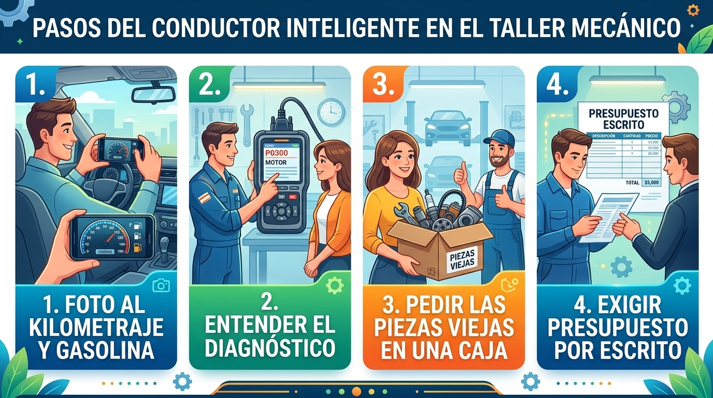
*Cuadro Rápido de Verificaciones de Seguridad para Conducir con Confianza*

## ✅ 2. Checklists Imprimibles de Mantenimiento

### 🟢 Checklist Rápido Semanal (3 Minutos)
- [ ] **Nivel de Aceite de Motor:** Varilla entre marcas MIN y MAX sobre suelo plano.
- [ ] **Nivel de Refrigerante:** En depósito de expansión transparente (sin abrir tapón).
- [ ] **Líquido Limpiaparabrisas:** Lleno con mezcla limpiadora anti-insectos.
- [ ] **Inspección de Neumáticos:** Sin abultamientos laterales (chichones) ni cortes en flancos.
- [ ] **Luces Principales:** Faros frontales, direccionales y luces de stop operativas.

### 🟡 Checklist Mensual de Conductor Inteligente (15 Minutos)
- [ ] **Presión en Frío de los 4 Neumáticos:** Con manómetro según pegatina de pilar B.
- [ ] **Presión de la Rueda de Repuesto:** Verificar inflado correcto (suele requerir 45 a 60 PSI en compactas).
- [ ] **Nivel de Líquido de Frenos:** Depósito transparente entre líneas MIN y MAX.
- [ ] **Bornes de Batería:** Limpios, sin sulfato blanquecino y firmemente ajustados.
- [ ] **Escobillas Limpiaparabrisas:** Sin estrías de goma rotas o saltos sobre el parabrisas.
- [ ] **Inspección de Fugas en el Suelo:** Suelo del garaje limpio de manchas sospechosas.

### 🔵 Checklist Antes de un Viaje en Carretera (Pre-Trip Inspection)
- [ ] Presión de neumáticos ajustada para carga completa (pasajeros + equipaje).
- [ ] Kit de emergencia completo: Chaleco reflectante, triángulos/luz V-16, gato funcional, cruceta y perno de remolque.
- [ ] Pastillas de freno con espesor superior a 4 mm.
- [ ] Aire acondicionado / calefacción y desempañador de luneta trasera funcionando.
- [ ] Documentación reglamentaria: Licencia, seguro de auto vigente, registro vehicular e inspección técnica al día.

---

## 📝 3. Bitácora de Registro de Mantenimientos y Reparaciones

Imprime esta plantilla o consérvala en la guantera de tu auto junto a las facturas del taller:

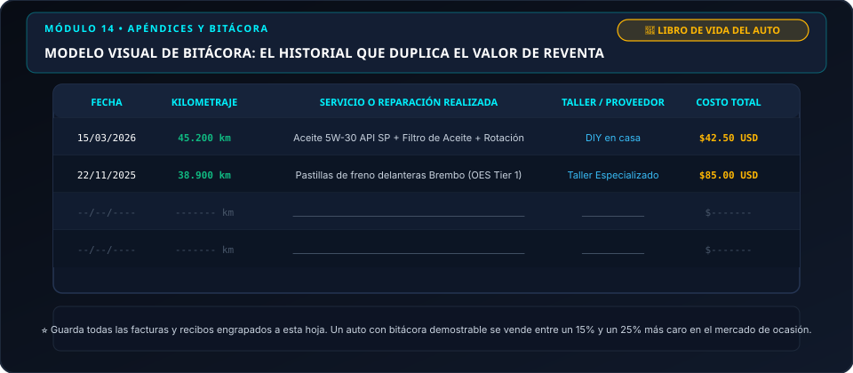
*Ilustración técnica: Formato recomendado para registrar cada intervención mecánica y duplicar la confianza en la reventa.*

| Fecha | Kilometraje | Servicio o Reparación Realizada | Taller / Proveedor | Costo Total |
| :---: | :---: | :--- | :--- | :---: |
| 15/03/2026 | 45.200 km | Aceite 5W-30 API SP + Filtro de Aceite + Rotación | DIY en casa | $42.50 USD |
| 22/11/2025 | 38.900 km | Pastillas de freno delanteras Brembo (OES Tier 1) | Taller Especializado | $85.00 USD |
| --/--/---- | ------- km | ________________________________________________ | ______________ | $------- |
| --/--/---- | ------- km | ________________________________________________ | ______________ | $------- |
| --/--/---- | ------- km | ________________________________________________ | ______________ | $------- |

---

*Fin del Manual Práctico del Conductor Inteligente V2.0 • Diseñado con pasión por CharuAutos*
