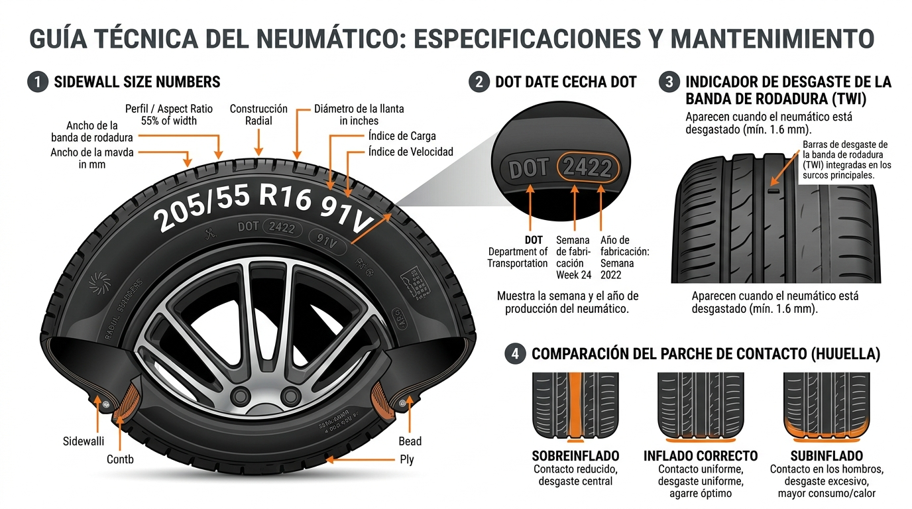

# Módulo 3: La Piel y los Ojos (Neumáticos, Carrocería e Iluminación)

[⬆️ Volver al Índice General](#índice-general)

---

> *"Todo el peso, la aceleración y la frenada de un vehículo de 1.500 kg se sostiene sobre cuatro parches de goma que, sumados, apenas equivalen a la superficie de cuatro palmas de tus manos."*

---

## 1. Guía Técnica del Neumático / Caucho / Llanta

Aprende a leer la ficha técnica estampada en el caucho y cómo evitar desgastes prematuros:



### 1. Sidewall Size Numbers (Medidas de la Llanta):
- **205:** Ancho de la banda de rodadura en milímetros.
- **55:** Perfil (altura del flanco, equivalente al 55% de 205 mm).
- **R16:** Construcción radial y rin metálico de 16 pulgadas de diámetro.
- **91V:** Índice de carga máxima (91 = 615 kg por rueda) y código de velocidad (V = hasta 240 km/h).

### 2. El Código DOT: La Fecha de Caducidad Oculta
- En una ventana ovalada verás 4 números (ej. `DOT 2422` = Semana 24 del año 2022).
- **Regla de seguridad:** Ningún neumático debe usarse pasados los **5 a 6 años** desde su fabricación. Con el tiempo, el caucho se reseca y endurece (*cristalización*), perdiendo agarre y duplicando la distancia de frenado sobre mojado.

### 3. Indicador de Desgaste (TWI) y la Prueba de la Moneda
- Pequeños puentes de goma de 1.6 mm dentro de los canales principales indican el límite de descarte.
- **Prueba casera:** Si introduces una moneda en la ranura y el borde exterior queda visible (menos de 3 mm), cámbialas de inmediato para evitar el fenómeno de **aquaplaning** en lluvia.

### 4. Huella de Contacto según la Presión (PSI)
- **Sobreinflado:** La llanta se apoya solo en el centro, el andar es duro y se pierde agarre.
- **Inflado correcto (entre 30 y 35 PSI en frío):** Desgaste uniforme y agarre óptimo.
- **Subinflado (Presión baja):** El caucho se deforma en los hombros laterales, se sobrecalienta en carretera (riesgo de estallido) y aumenta el consumo de combustible hasta un 8%.

---

## 2. Carrocería y Pintura: Lavado de Dos Cubos sin Rayones

El 90% de los rayones circulares (*swirls*) se originan al lavar el auto con trapos sucios o con detergente lavavajillas de cocina (que destruye la cera protectora).

- **Cubo 1 (Jabón):** Agua con shampoo neutro automotriz y guante de microfibra suave.
- **Cubo 2 (Enjuague):** Agua limpia donde enjuagas el guante antes de volver a tomar shampoo.
- **Excrementos de aves:** Contienen ácido úrico concentrado. Retíralos ablandándolos con una servilleta húmeda con agua tibia, jamás raspando en seco.

---

## 3. Iluminación y Visibilidad

- **Faros amarillentos:** El sol y los rayos UV degradan la capa protectora del policarbonato. Se solucionan con pulido fino y sellador cerámico o laca UV.
- **El error de las bombillas LED baratas:** Instalar bombillos LED genéricos en faros con reflectores de espejo produce un haz de luz disperso que encandila al tráfico contrario y disminuye tu visibilidad a la distancia.

---

## 4. Evidencia Oficial de Seguridad Vial: Datos de la NHTSA

¿Por qué revisar la presión una vez al mes no es opcional? De acuerdo con las investigaciones de accidentes viales de la **National Highway Traffic Safety Administration (NHTSA)** del Departamento de Transporte de EE. UU.:

### 📊 Riesgo de Accidente y Presión de Neumáticos (Fuente: NHTSA Safety Reports)
```
┌──────────────────────────────────────────────┬────────────────┬─────────────────────────────┐
│ Condición del Neumático                      │ Impacto en Riesgo│ Efecto Mecánico y Dinámico │
├──────────────────────────────────────────────┼────────────────┼─────────────────────────────┤
│ Presión subinflada en 25% o más (<24 PSI)    │ 3X Más Riesgo  │ Deformación severa y reventón│
│ Profundidad de surco en banda: 0 a 1.6 mm    │ 26% de Choques │ Pérdida total de agarre mojado│
│ Profundidad de surco en banda: 2.4 a 3.2 mm  │  8% de Choques │ Drenaje de agua aceptable   │
│ Presión correcta según etiqueta de puerta    │ Riesgo basal   │ Distancia de frenado óptima │
└──────────────────────────────────────────────┴────────────────┴─────────────────────────────┘
```

> **Dato de campo:** La NHTSA y el Consejo de Seguridad de EE. UU. (NSC) estiman que **1 de cada 4 vehículos de pasajeros circula con al menos un neumático peligrosamente desinflado**, lo que incrementa el consumo de combustible en un 3.5% y acorta la vida útil del neumático en más de un 25% debido al desgaste acelerado en los flancos.

---

[⬆️ Volver al Índice General](#índice-general)
