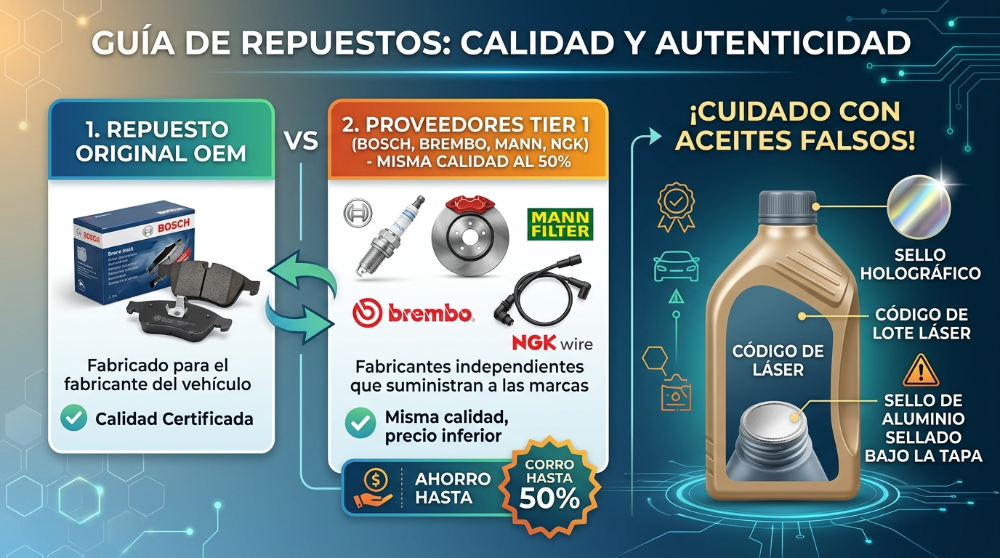

# Módulo 5: Guía de Compra Inteligente de Repuestos y Productos

[⬆️ Volver al Índice General](#índice-general)

---

> *"El dinero se pierde dos veces cuando compras un repuesto de mala calidad: pagas por la pieza barata y luego pagas el doble por la grúa, el mecánico y la pieza buena que debiste comprar desde el inicio."*

---

## 1. Guía del Comprador Inteligente: Calidad y Autenticidad

Conoce la diferencia entre las opciones del mercado y aprende a identificar productos falsificados:



### 1. Repuestos OEM vs. Marcas Tier 1:
- **OEM (Caja con logotipo de marca de auto):** Calidad óptima, pero pagas un sobreprecio de hasta el 50% por el embalaje oficial.
- **Tier 1 (Fabricantes de Primer Nivel):** Marcas de clase mundial como **Mann Filter, Bosch, Brembo, NGK, Denso, Gates o KYB**. Son los fabricantes reales que producen las piezas para las ensambladoras. Comprarlas bajo su propio nombre te da **exactamente la misma calidad y durabilidad con un ahorro del 30% al 50%**.

---

## 2. Alerta de Falsificaciones: Cómo Protegerte

El mercado negro de lubricantes y repuestos clonados es un peligro real:

1. **Hologram Seal (Sello Holográfico):** Los envases legítimos incluyen hologramas con efectos ópticos y microtextos que las copias baratas no pueden reproducir.
2. **Laser-Etched Batch Code (Código de Lote Láser):** Fecha y lote grabados por micro-puntos láser en el plástico o fondo del envase.
3. **Tamper-Evident Foil (Sello de Aluminio Sellado):** Al retirar la tapa roscada, el foil de aluminio debe estar perfectamente termosellado a la boca de la botella, sin rastros de pegamento manual ni arrugas.
4. **El Gancho del Precio Imposible:** Si un galón de aceite 100% sintético que cuesta \$45 USD te lo ofrecen en \$15 USD en un puesto callejero o mercado informal, es aceite reciclado o mineral barato reenvasado.

---

## 3. Matriz de Riesgo: Dónde Ahorrar y Dónde Jamás Escatimar

```
┌────────────────────────────────────────────────────────┐
│               COMPONENTES DE ALTO RIESGO               │
│     (¡NUNCA COMPRES GENÉRICO BARATO O DE DUDOSA MARCA!)│
├────────────────────────────────────────────────────────┤
│ • Pastillas y discos de freno                          │
│ • Rótulas (muñones) y terminales de dirección          │
│ • Kit de correa de distribución (Timing Belt)          │
│ • Bombas de agua y bombas de aceite                    │
│ • Sensores de cigüeñal (CKP) y sensores de oxígeno     │
└────────────────────────────────────────────────────────┘
                           ▲
                           │
┌────────────────────────────────────────────────────────┐
│               COMPONENTES DE BAJO RIESGO               │
│             (SEGURO PARA AHORRAR DINERO)               │
├────────────────────────────────────────────────────────┤
│ • Filtro de cabina (polen)                             │
│ • Escobillas limpiaparabrisas (plumillas / cepillos)   │
│ • Grapas plásticas y molduras de guardabarros          │
│ • Bombillos de iluminación interior                    │
│ • Alfombras y accesorios estéticos                     │
└────────────────────────────────────────────────────────┘
```

---

## 4. La Clave del Código VIN (Número de Chasis)

El número VIN (17 caracteres visibles en la esquina inferior izquierda del parabrisas y en la tarjeta de propiedad del auto) es el documento de identidad único de tu auto. Al cotizar repuestos mecánicos, proporciónale siempre el VIN al vendedor para asegurar compatibilidad total con el año, cilindrada y versión de tu vehículo.

---

[⬆️ Volver al Índice General](#índice-general)
