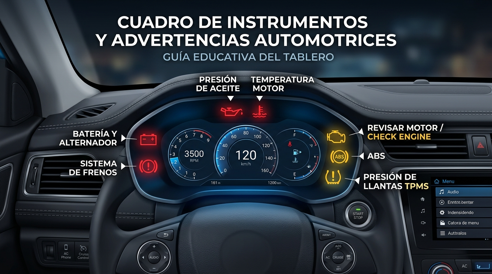
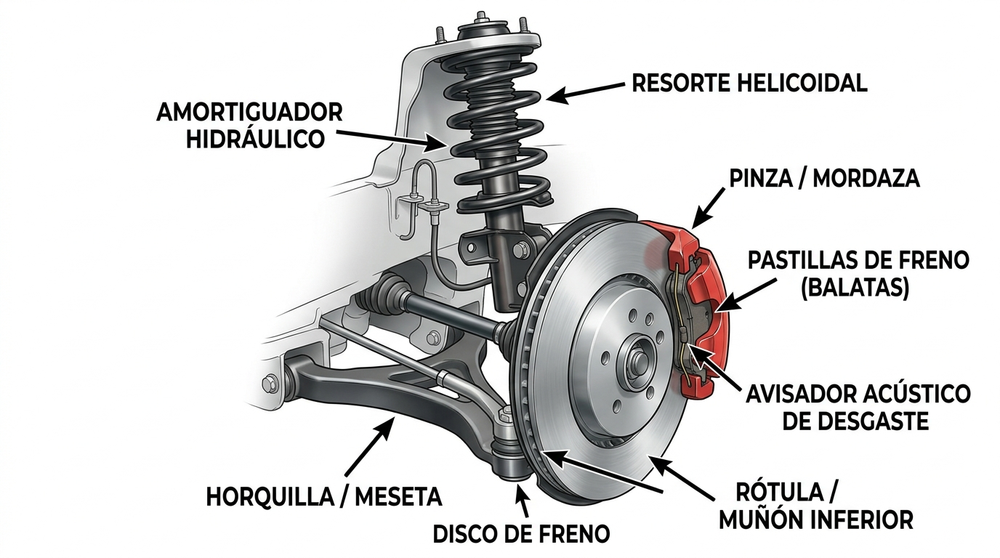
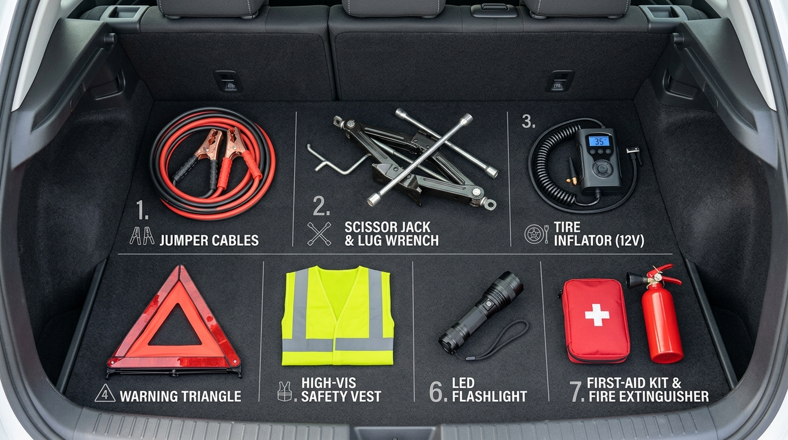

# MANUAL PRÁCTICO DEL CONDUCTOR INTELIGENTE
### Mantenimiento Preventivo, Longevidad y Ahorro en Taller
*Por CharuAutos (@charuautopics) — "Dominio Mecánico & Cultura Automotriz"*

---

> ### 🛡️ AVISO LEGAL Y DESCARGO DE RESPONSABILIDAD TÉCNICA (DISCLAIMER)
> La información técnica, procedimientos, recomendaciones y datos estadísticos expuestos en este manual representan una rigurosa labor de recopilación, síntesis pedagógica y contraste técnico sustentado en:
> 1. **Manuales de Taller y del Propietario (OEM):** Procedimientos estandarizados y tolerancias de ensambladores automotrices.
> 2. **Organizaciones Técnicas y de Normalización:** SAE International, API (American Petroleum Institute), ILSAC, ISO y NHTSA.
> 3. **Fabricantes Certificados de Equipo Original (Tier 1):** Directrices técnicas de Robert Bosch, Garrett Motion, Brembo, ZF Friedrichshafen, Aisin y BorgWarner.
> 4. **Estudios de Industria y Medios Verificados:** Investigaciones de campo del Car Care Council (Auto Care Association), American Automobile Association (AAA) y Automatic Transmission Rebuilders Association (ATRA).
> 5. **Criterio Técnico Profesional:** Buenas prácticas operativas de mecánicos certificados por ASE (Automotive Service Excellence).
> 
> *Este compendio tiene una finalidad estrictamente formativa y preventiva orientada al empoderamiento del conductor y la toma de decisiones informadas. No sustituye ni deroga las especificaciones, tolerancias ni recomendaciones particulares estipuladas en el **Manual Oficial del Fabricante** correspondiente al modelo y año específico de su vehículo. Las intervenciones que comprometan la seguridad activa deben ser realizadas por personal técnico calificado o bajo estrictas normas de seguridad industrial.*

---

<a name="indice-general"></a>
## 📑 Índice General Interactivo

Haz clic en cualquier capítulo para ir directamente al contenido:

- [📌 Módulo 0: Conoce tu Auto, Vocabulario Técnico Práctico y el Semáforo del Tablero](#modulo-0)
  - [1. Vocabulario Maestro de Partes Automotrices](#vocabulario-maestro)
  - [2. La Filosofía del Conductor Inteligente (DIY seguro + Taller)](#filosofia-conductor)
  - [3. La Analogía del Cuerpo Humano](#analogia-cuerpo)
  - [4. El Semáforo del Tablero e Infografía de Testigos](#semaforo-tablero)
  - [5. Los Testigos Críticos Explicados](#testigos-clave)
  - [6. Datos de la Industria: Inspecciones Preventivas (Car Care Council)](#estadisticas-mantenimiento)
- [🛢️ Módulo 1: El Corazón de tu Auto (Motor, Aceites, Fluidos y Filtros)](#modulo-1)
  - [1. Mapa Visual Bajo el Capó / Cofre de Auto Real](#mapa-motor)
  - [2. El Aceite de Motor y Viscosidades (Norma SAE J300)](#aceite-motor)
  - [3. El Peligro del Agua Corriente y el Refrigerante (Coolant)](#refrigerante-motor)
  - [4. Los 3 Filtros Vitales](#filtros-vitales)
  - [5. Correas vs Cadena de Distribución](#correas-distribucion)
  - [6. Datos de Ingeniería: Desgaste en Arranque y Refrigerante (SAE / ASTM)](#estudios-desgaste-motor)
- [🚀 Módulo 2: El Turbocompresor: Mantenimiento Crítico, Longevidad y Hábitos Clave](#modulo-2)
  - [1. Cómo Funciona el Turbo y Lubricación Hidrodinámica a 200.000 RPM](#funcionamiento-turbo)
  - [2. Los Dos Hábitos Sagrados: Enfriamiento de 60 Segundos y Arranque en Frío](#habitos-turbo)
  - [3. Aceite con Certificación API SP contra el Fenómeno LSPI](#aceite-turbo-lspi)
  - [4. Diagnóstico Temprano de Fallas en el Turbo (Silbidos y Humo)](#diagnostico-turbo)
  - [5. El Intercooler: Mantenimiento del Radiador de Aire](#intercooler)
  - [6. Datos Oficiales: Causas de Falla en Turbos (Garrett / BorgWarner)](#estadisticas-turbo)
- [⚙️ Módulo 3: La Fuerza y el Rodaje (Transmisión, Frenos y Suspensión)](#modulo-3)
  - [1. Mapa Mecánico de Frenos y Suspensión en Español](#mapa-frenos)
  - [2. La Transmisión: Desmontando el Mito del "Aceite de por Vida" (ZF/Aisin)](#caja-transmision)
  - [3. Pastillas / Balatas y Discos Alabeados (Brembo)](#sistema-frenos)
  - [4. El Test del Rebote para Amortiguadores](#suspension-amortiguadores)
  - [5. Datos Técnicos: La Curva Térmica de la Transmisión (ATRA)](#curva-atra)
- [🛞 Módulo 4: La Piel y los Ojos (Llantas / Cauchos / Neumáticos, Pintura e Iluminación)](#modulo-4)
  - [1. Guía Técnica del Neumático y el Código DOT (NHTSA / DOT)](#neumaticos-dot)
  - [2. Presión Correcta (PSI) y la Prueba de la Moneda](#presion-desgaste)
  - [3. Lavado de los Dos Cubos y Cuidado de la Pintura](#lavado-pintura)
  - [4. Restauración de Faros y el Peligro de los LED Baratos](#faros-luces)
  - [5. Datos de Seguridad Vial: Subinflado y Accidentabilidad (NHTSA)](#estadisticas-nhtsa-llantas)
- [❄️ Módulo 5: Tu Espacio Seguro (Interior, Climatización y Habitáculo)](#modulo-5)
  - [1. Tutorial DIY: Cambio de Filtro de Cabina en 3 Pasos](#filtro-cabina)
  - [2. El Truco de los 2 Minutos contra el Olor a Humedad del A/C](#olor-aire-acondicionado)
  - [3. Cuidado de Plásticos, Tablero y Tapicería](#cuidados-interior)
- [🛒 Módulo 6: Guía de Compra Inteligente de Repuestos y Productos](#modulo-6)
  - [1. Infografía de Repuestos: OEM vs Tier 1 y Falsificaciones](#categorias-repuestos)
  - [2. Matriz de Riesgo: Dónde Ahorrar y Dónde No Escatimar](#matriz-riesgo)
  - [3. La Clave del Código VIN (Número de Chasis)](#codigo-vin)
- [🛡️ Módulo 7: El Conductor Inteligente frente al Taller Mecánico](#modulo-7)
  - [1. Protocolo Visual de 4 Pasos en el Taller Mecánico](#protocolo-taller)
  - [2. Las 5 Preguntas Clave Antes de Entregar tus Llaves](#preguntas-taller)
  - [3. Banderas Rojas (Red Flags) de Talleres Poco Honestos](#red-flags-taller)
  - [4. Datos Oficiales: Desconfianza en Talleres (Encuesta AAA)](#encuesta-aaa-talleres)
- [📋 Módulo 8 (Anexos): Bitácora de Mantenimiento y Checklists Imprimibles](#modulo-8)
  - [1. El Kit Esencial de Emergencia en la Cajuela](#kit-emergencia)
  - [2. Calendario Maestro por Kilometraje](#calendario-kilometraje)
  - [3. Bitácora Imprimible para la Guantera](#bitacora-imprimible)
  - [4. Checklist de 10 Minutos antes de un Viaje por Carretera](#checklist-viaje)
- [📚 Bibliografía Técnica, Normativas y Fuentes Oficiales](#modulo-9)
  - [1. Organismos Internacionales (SAE, API, ILSAC, NHTSA, ISO)](#organismos-normativos)
  - [2. Manuales y Boletines Técnicos de Fabricantes (Bosch, ZF, Brembo, Gates, Toyota)](#manuales-oem)
  - [3. Certificación Técnica Profesional (ASE)](#certificacion-ase)
  - [4. Investigaciones Estadísticas y Estudios de Campo Oficiales](#estudios-estadisticos-oficiales)

---

<a name="modulo-0"></a>
# Módulo 0: Conoce tu Auto, Vocabulario Técnico Práctico y el Semáforo del Tablero

[⬆️ Volver al Índice General](#indice-general)

> *"No necesitas ser mecánico para cuidar tu patrimonio; solo necesitas entender qué intenta decirte tu vehículo antes de que una avería pequeña se convierta en una factura de miles de dólares."*

<a name="vocabulario-maestro"></a>
### 1. Vocabulario Maestro de Partes Automotrices

| Término Neutro | Términos Comunes y Sinónimos en Español |
| :--- | :--- |
| **Vehículo** | Coche / Auto / Carro |
| **Neumático** | Llanta / Caucho / Neumático |
| **Rin metálico** | Rin / Llanta metálica / Aro |
| **Portaequipaje** | Cajuela / Maleta / Maletero |
| **Cubierta de motor** | Cofre / Capó / Capot |
| **Pastillas de freno** | Balatas / Pastillas de freno |
| **Embrague** | Clutch / Croche / Embrague |
| **Refrigerante** | Anticongelante / Coolant / Refrigerante formulado |
| **Junta homocinética** | Junta homocinética / Flecha / Tripoide |
| **Rótula de suspensión** | Rótula / Muñón de suspensión |
| **Bujes** | Bujes / Gomas / Mesetas |
| **Limpiaparabrisas** | Plumas / Cepillos / Plumillas |
| **Tienda de repuestos** | Refaccionaria / Venta de repuestos / Repuestera |

<a name="filosofia-conductor"></a>
### 2. La Filosofía del Conductor Inteligente (DIY Seguro + Taller)

- **En casa (DIY Seguro):** Inspecciones visuales, chequeo de presiones en frío, cambio del filtro de cabina en 5 minutos y técnicas de lavado sin rayones. Cero riesgos personales ni maniobras peligrosas.
- **En el taller:** Para las tareas complejas (frenos, amortiguadores, correas de distribución), te equipamos con el criterio técnico y las 5 preguntas clave para supervisar y evitar estafas.

<a name="analogia-cuerpo"></a>
### 3. La Analogía del Cuerpo Humano

- **Motor:** Corazón del vehículo.
- **Aceite de Motor:** La sangre que lubrica y enfría.
- **Refrigerante:** La regulación térmica contra la fiebre (sobrecalentamiento).
- **Filtros:** Pulmones y riñones del sistema.
- **Batería y Alternador:** El sistema nervioso y la energía eléctrica.
- **ECU (Computadora):** El cerebro que calibra la inyección.
- **Frenos y Suspensión:** Piernas, rodillas y reflejos de seguridad.

<a name="semaforo-tablero"></a>
### 4. El Semáforo del Tablero e Infografía de Testigos



```
🔴 ROJO     -> PELIGRO CRÍTICO INMEDIATO: Oríllate con seguridad y apaga el motor en menos de 10 segundos.
🟡 AMARILLO -> ADVERTENCIA PREVENTIVA: Continúa a tu destino con suavidad y programa revisión técnica.
🟢/🔵 VERDE -> INFORMATIVO: Un sistema está en funcionamiento (luces, direccionales, crucero).
```

<a name="testigos-clave"></a>
### 5. Los Testigos Críticos Explicados
- 🔴 **Baja Presión de Aceite:** Apaga de inmediato. Continuar manejando fundirá el motor por fricción de metales.
- 🔴 **Sobrecalentamiento:** La temperatura superó los 105°C. Enciende calefacción al máximo, oríllate y apaga. **Nunca abras el depósito caliente**.
- 🔴 **Fallo de Carga de Batería:** El alternador no genera corriente. El auto se apagará cuando se gaste la reserva.
- 🔴 **Freno de Mano / Líquido de Frenos:** Palanca arriba o fuga peligrosa de fluido.
- 🟡 **Check Engine:** Anomalía en emisiones o inyección. Si parpadea, detente: hay fallo de chispa arrojando combustible al catalizador.
- 🟡 **ABS:** Falla en sistema antibloqueo. Frenos tradicionales activos, pero riesgo de derrape en lluvia.
- 🟡 **TPMS:** Llanta/caucho desinflado más del 20%.

<a name="estadisticas-mantenimiento"></a>
### 6. Datos de la Industria: La Realidad del Mantenimiento Preventivo (Car Care Council)
Según las inspecciones masivas de la campaña *Be Car Care Aware* del **Car Care Council** en talleres certificados ASE, **el 80% de los vehículos en circulación presenta al menos un fluido o pieza con necesidad urgente de servicio**:

| Componente o Sistema Inspeccionado | % Falla | Riesgo Consecuente Inmediato |
| :--- | :---: | :--- |
| **Aceite de motor (bajo / degradado)** | **29%** | Fricción severa y desbielado del motor |
| **Líquido refrigerante (bajo / fuga)** | **24%** | Deformación de culata por sobrecalentamiento |
| **Neumáticos (presión baja / surco <2 mm)** | **22%** | 3X más probabilidad de siniestro vial |
| **Filtro de aire de motor (obstruido)** | **19%** | Pérdida de aceleración y +10% consumo de gasolina |
| **Líquido de transmisión (quemado/vencido)** | **17%** | Patinaje de embragues y daño de cuerpo de válvulas |
| **Líquido de frenos (humedad absorbida)** | **15%** | Pérdida de tacto en pedal (*vapor lock*) |
| **Batería y bornes (sulfatados / flojos)** | **14%** | Imposibilidad de encendido imprevisto |

[⬆️ Volver al Índice General](#indice-general)

---

<a name="modulo-1"></a>
# Módulo 1: El Corazón de tu Auto (Motor, Aceite, Fluidos y Filtros)

[⬆️ Volver al Índice General](#indice-general)

<a name="mapa-motor"></a>
### 1. Mapa Visual Bajo el Capó / Cofre de Auto Real


1. **#1. Varilla Medidora de Aceite:** Varilla con detalle de marcas de nivel MIN y MAX.
2. **#2. Tapón de Llenado de Aceite:** Tapa para rellenar aceite de motor.
3. **#3. Depósito de Refrigerante:** Envase traslúcido con marcas de nivel en frío.
4. **#4. Líquido de Frenos:** Depósito transparente cercano al servofreno.

<a name="aceite-motor"></a>
### 2. El Aceite de Motor y Viscosidades (Norma SAE J300)

- **Primer número (5W):** Fluidez en arranque en frío (*W* de *Winter*). Llega a las válvulas en 2 segundos previniendo el 80% del desgaste del motor.
- **Segundo número (30):** Resistencia térmica de la película a 100°C.
- **100% Sintético (Norma API SP / ILSAC GF-6):** Moléculas uniformes de laboratorio. Duración: 10.000 a 15.000 km o 1 año.
- **El mito del aceite grueso:** No uses 20W-50 en autos con más de 100.000 km creyendo que "rellena holguras". Forzarás la bomba y dejarás sin lubricar los árboles de levas. Mantén la viscosidad que pide el manual.

#### Medición en Casa:
Superficie plana, motor apagado y reposado 5 a 10 minutos. Limpia la varilla, insértala hasta el fondo y retírala: debe marcar entre **MIN y MAX**. Superar la marca MAX genera espuma destructiva por batido del cigüeñal.

<a name="refrigerante-motor"></a>
### 3. El Peligro del Agua Corriente y el Refrigerante (Coolant)

- El agua de grifo hierve a 100°C provocando bolsas de vapor y recalentamiento; además, sus sales y cloro oxidan el radiador y destruyen los sellos de la bomba de agua.
- El refrigerante formulado (Norma SAE J1034) hierve a más de 125°C bajo presión y contiene aditivos anticorrosivos.
- **Nunca mezcles tecnologías:** Evita combinar refrigerante inorgánico verde tradicional con orgánico rojo/rosa OAT para no formar sedimentos gelatinosos.

<a name="filtros-vitales"></a>
### 4. Los 3 Filtros Vitales
- **Aceite (ISO 4548):** Cámbialo SIEMPRE en cada cambio de aceite.
- **Aire de Motor:** Reemplazo cada 15.000 a 20.000 km.
- **Combustible:** Protege bomba e inyectores.

<a name="correas-distribucion"></a>
### 5. Correas vs Cadena de Distribución
- **Cadena:** Metálica, prácticamente eterna si se cambia el aceite a tiempo.
- **Correa de goma dentada:** Reemplazo riguroso cada 60.000 a 100.000 km o 5 años (Directrices de Gates Corporation). Si se rompe rodando, los pistones doblarán las válvulas.

<a name="estudios-desgaste-motor"></a>
### 6. Datos de Ingeniería: Desgaste Mecánico y Comparativa Térmica (SAE & ASTM)
- **Fase de mayor degradación (SAE International):** El **75% del desgaste del motor** ocurre durante los primeros 60 a 90 segundos tras el arranque en frío. Un aceite 5W-30 lubrica el tren de válvulas en 6 a 8 segundos; un aceite espeso 20W-50 tarda hasta 45 segundos en fluir a las levas.
- **Comparativa Agua vs Refrigerante 50/50 (ASTM D3306):** El agua hierve a 100°C bajo presión atmosférica y carcome el aluminio de la bomba de agua por cavitación en menos de 20.000 km. El refrigerante formulado al 50/50 presurizado resiste hasta 128°C sin hervir y contiene aditivos anticorrosivos OAT químicamente inertes.

[⬆️ Volver al Índice General](#indice-general)

---

<a name="modulo-2"></a>
# Módulo 2: El Turbocompresor: Mantenimiento Crítico, Longevidad y Hábitos Clave

[⬆️ Volver al Índice General](#indice-general)

> *"Un turbo gira a más de 200.000 revoluciones por minuto y opera a más de 800°C. Un simple mal hábito de 10 segundos al apagar el motor puede destruir una pieza de más de $1.200 USD."*


<a name="funcionamiento-turbo"></a>
### 1. Cómo Funciona el Turbo y Lubricación Hidrodinámica a 200.000 RPM
Los motores turbo modernos aprovechan los gases calientes de escape para girar una turbina a entre **150.000 y 250.000 RPM**, la cual impulsa un compresor que mete aire a alta presión a los cilindros.
- **El eje flotante:** Debido a las revoluciones extremas, el eje no usa rodamientos de bolas tradicionales: **flota sobre una película microscópica de aceite de motor presurizado**. Si el flujo de aceite se corta o se degrada, el metal roza contra metal y el turbo se destruye en instantes.

<a name="habitos-turbo"></a>
### 2. Los Dos Hábitos Sagrados para Dueños de Autos Turbo
1. **El Hábito de los 60 Segundos al Apagar:** Si venías rodando rápido en carretera o exigiendo el motor, **NUNCA apagues el motor de golpe**. Deja el motor en marcha mínima (ralentí) durante **45 a 60 segundos**. Al apagar de golpe, la bomba de aceite se detiene pero el caracol está a 800°C: el aceite estancado se calcina (**coquización**), formando carbón sólido que ralla los retenes al día siguiente.
2. **El Arranque en Frío Progresivo:** Por la mañana espera 30-40 segundos antes de avanzar y no aceleres a fondo ni pases de 2.500 RPM durante los primeros 5 minutos, hasta que el aceite alcance su temperatura de operación (90°C).

<a name="aceite-turbo-lspi"></a>
### 3. Aceite con Certificación API SP contra el Fenómeno LSPI
Los motores turbo de inyección directa sufren de pre-ignición a baja velocidad (**LSPI**), una detonación fuera de tiempo que dobla bielas y destruye pistones. Usa **exclusivamente aceite 100% sintético con certificación API SP o ILSAC GF-6**, que contiene aditivos específicos para erradicar el LSPI.

<a name="diagnostico-turbo"></a>
### 4. Diagnóstico Temprano de Fallas en el Turbo
- **Silbido tipo "Sirena de Policía" al acelerar:** Holgura excesiva en el eje; las aspas rozan las paredes de la caracola. Detén el uso urgente antes de que el eje se parta y entre metal a los cilindros.
- **Humo azulado denso por el escape al acelerar:** Retenes del turbo rotos; el aceite se quema en el escape.
- **Pérdida de potencia súbita ("auto desinflado"):** Falla en la válvula de alivio (*Wastegate*) o manguera de presión rota.

<a name="intercooler"></a>
### 5. El Intercooler: Radiador de Aire
El aire comprimido por el turbo se calienta a más de 120°C. El *Intercooler* lo enfría antes de ingresar al motor. Mantén su panal limpio de suciedad y lodo con agua suave (nunca hidrolavadora a presión directa que doble las aletas).

<a name="estadisticas-turbo"></a>
### 6. Datos Oficiales: Causas Reales de Falla en Turbocompresores (Garrett & BorgWarner)
Análisis de laboratorio de **Garrett Motion** y **BorgWarner** demuestran que **menos del 1% de los turbos fallan por defecto de manufactura**:
- **92% Problemas de Aceite:** Falta de lubricación/flujo (42%), contaminación por impurezas (31%) y coquización térmica por apagar de golpe sin enfriar (19%).
- **5% Ingestión de Cuerpos Extraños:** Polvo y arenilla por filtro de aire defectuoso.
- **2% Sobre-revolución:** Reprogramaciones agresivas o exceso de temperatura.
- **< 1% Defecto de Fábrica.**

[⬆️ Volver al Índice General](#indice-general)

---

<a name="modulo-3"></a>
# Módulo 3: La Fuerza y el Rodaje (Transmisión, Frenos y Suspensión)

[⬆️ Volver al Índice General](#indice-general)

<a name="mapa-frenos"></a>
### 1. Mapa Mecánico de Frenos y Suspensión en Español



- **Resorte Helicoidal y Amortiguador Hidráulico:** Absorben impactos y mantienen la rueda en el asfalto.
- **Disco de Freno:** Pista metálica circular solidaria a la rueda.
- **Pinza / Mordaza (Caliper):** Pistón hidráulico que comprime las pastillas.
- **Pastillas de Freno (Balatas):** Bloque de fricción con lámina avisadora de desgaste acústico (*Avisador acústico de desgaste*).
- **Rótula / Muñón Inferior y Horquilla / Meseta:** Articulaciones de pivote de la suspensión.

<a name="caja-transmision"></a>
### 2. La Transmisión: Desmontando el "Aceite de por Vida" (ZF/Aisin)
- Los boletines técnicos de los fabricantes de cajas automáticas (ZF, Aisin, Jatco) recomiendan cambiar el fluido (ATF o CVT) cada **50.000 a 80.000 km**.
- Cajas CVT exigen **estrictamente fluido CVT original**.
- En cajas manuales: cambia valvulina/MTF cada 60.000 - 80.000 km y no manejes con el pie descansando en el pedal de embrague.

<a name="sistema-frenos"></a>
### 3. Pastillas / Balatas y Discos Alabeados (Brembo)
- El chirrido agudo al frenar avisa que queda menos de 3 mm de pastilla antes de dañar el disco.
- Si el volante vibra al frenar a alta velocidad, los discos están alabeados (ondulados por variación de grosor DTV causada por choque térmico).

<a name="suspension-amortiguadores"></a>
### 4. El Test del Rebote para Amortiguadores
Empuja hacia abajo con fuerza una esquina del auto y suelta: si sube y se queda quieto de inmediato, está perfecto. Si rebota 2 o 3 veces como un barco, el amortiguador perdió su gas o aceite.

<a name="curva-atra"></a>
### 5. Datos Técnicos: La Curva Térmica de la Transmisión (ATRA)
La **Automatic Transmission Rebuilders Association (ATRA)** establece que **más del 90% de las fallas catastróficas de cajas automáticas se deben a sobrecalentamiento**:
- A **79°C (175°F)** el fluido ATF dura **160.000 km**.
- Por cada **11°C (20°F)** de aumento sobre el rango óptimo, **la vida útil del aceite se reduce un 50%** (a 90°C dura 80.000 km; a 102°C dura 40.000 km; a 113°C dura 20.000 km). A 124°C los discos patinan y a 150°C se quema por completo.

[⬆️ Volver al Índice General](#indice-general)

---

<a name="modulo-4"></a>
# Módulo 4: La Piel y los Ojos (Llantas / Cauchos / Neumáticos, Pintura e Iluminación)

[⬆️ Volver al Índice General](#indice-general)

<a name="neumaticos-dot"></a>
### 1. Guía Técnica del Neumático y el Código DOT (NHTSA / DOT)


- **Medida (ej. 205/55 R16 91V):** 205 mm de ancho, 55% de perfil, rin de 16", índice de carga 91 y velocidad V (240 km/h).
- **Código DOT (Fecha de Fabricación):** En ventana ovalada (ej. `DOT 2422` = Semana 24 del 2022). Según la NHTSA, caducan a los **5 a 6 años** por cristalización y endurecimiento del caucho.

<a name="presion-desgaste"></a>
### 2. Presión Correcta (PSI) y Prueba de la Moneda
- Infla a la presión indicada en el marco de la puerta (entre 30 y 35 PSI en frío).
- Prueba de la moneda: Si el borde queda visible en las ranuras (menos de 3 mm), cámbialas para evitar el peligroso aquaplaning.

<a name="lavado-pintura"></a>
### 3. Lavado de Dos Cubos y Cuidado de Pintura
- Un cubo con shampoo neutro y otro con agua limpia para enjuagar el guante de microfibra. Nunca uses lavavajillas de cocina.
- Remueve excrementos de aves ablandándolos con una servilleta húmeda tibia; nunca raspes en seco.

<a name="faros-luces"></a>
### 4. Faros y Bombillas
- Faros amarillentos se restauran puliendo y aplicando sellador UV.
- No instales bombillos LED genéricos baratos en faros de espejo tradicionales para no encandilar al tráfico de frente.

<a name="estadisticas-nhtsa-llantas"></a>
### 5. Datos de Seguridad Vial: Subinflado y Accidentabilidad (NHTSA)
Estudios del Departamento de Transporte de EE. UU. (NHTSA):
- Vehículos con neumáticos subinflados en 25% o más (<24 PSI) tienen **3 veces más probabilidades de sufrir un accidente vial**.
- El **26% de los siniestros** provocados por neumáticos ocurren cuando el surco baja al rango de 0 a 1.6 mm (2/32"). Con dibujo seguro (>3 mm), los accidentes bajan a solo el 8%.
- 1 de cada 4 vehículos rueda con subinflado peligroso, aumentando el consumo de gasolina en un 3.5% y acortando la vida de la goma en un 25%.

[⬆️ Volver al Índice General](#indice-general)

---

<a name="modulo-5"></a>
# Módulo 5: Tu Espacio Seguro (Interior, Climatización y Habitáculo)

[⬆️ Volver al Índice General](#indice-general)

<a name="filtro-cabina"></a>
### 1. Tutorial DIY: Cambio de Filtro de Cabina en 3 Pasos


1. **Paso 1:** Abre la guantera y aprieta las trabas plásticas laterales hacia adentro para descolgarla.
2. **Paso 2:** Desengancha la tapa plástica frontal de la bandeja.
3. **Paso 3:** Retira el filtro viejo y coloca el nuevo con carbón activado respetando la flecha de flujo de aire (*Air Flow*).

<a name="olor-aire-acondicionado"></a>
### 2. El Truco de los 2 Minutos contra el Olor a Humedad del A/C
Apaga el botón **A/C** dos minutos antes de llegar a destino, manteniendo la ventilación a media potencia. Esto seca el evaporador y elimina de raíz la formación de hongos que causan olor a humedad o vinagre.

<a name="cuidados-interior"></a>
### 3. Cuidado de Plásticos y Asientos
Usa limpiadores neutros APC y acondicionadores mate con filtro UV en el tablero. En asientos de cuero, aplica crema hidratante cada 3 meses para evitar resequedad.

[⬆️ Volver al Índice General](#indice-general)

---

<a name="modulo-6"></a>
# Módulo 6: Guía de Compra Inteligente de Repuestos y Productos

[⬆️ Volver al Índice General](#indice-general)

<a name="categorias-repuestos"></a>
### 1. Infografía de Repuestos: OEM vs Tier 1 y Falsificaciones


- **Marcas Tier 1 (Bosch, Brembo, Mann Filter, NGK, Gates, KYB):** Los mismos fabricantes que abastecen a las marcas oficiales. Comprarlas en su propia caja te da la misma calidad con un **ahorro del 30% al 50%**.
- **Detección de Falsificaciones:** Revisa el sello holográfico, el código de lote grabado con láser y el foil de aluminio sellado térmicamente bajo la tapa de la botella de aceite. Desconfía de ofertas con precios absurdamente bajos.

<a name="matriz-riesgo"></a>
### 2. Matriz de Riesgo: Dónde Ahorrar y Dónde Jamás Escatimar
- **Alto Riesgo (Nunca compres genérico barato):** Frenos, rótulas/muñones, kit de distribución, bombas de agua y aceite.
- **Bajo Riesgo (Seguro para ahorrar):** Filtros de cabina, limpiaparabrisas, grapas y alfombras.

<a name="codigo-vin"></a>
### 3. La Clave del Código VIN
El número VIN (17 caracteres en el parabrisas y tarjeta de propiedad) identifica el año, motorización y versión exacta de tu auto para cotizar repuestos sin margen de error.

[⬆️ Volver al Índice General](#indice-general)

---

<a name="modulo-7"></a>
# Módulo 7: El Conductor Inteligente frente al Taller Mecánico

[⬆️ Volver al Índice General](#indice-general)

<a name="protocolo-taller"></a>
### 1. Protocolo Visual de 4 Pasos en el Taller Mecánico


1. **1. Foto al Kilometraje y Gasolina:** Toma foto antes de entregar las llaves.
2. **2. Entender el Diagnóstico:** Pide ver en pantalla el código exacto del escáner y la explicación de la falla.
3. **3. Pedir las Piezas Viejas en una Caja:** Exige que guarden todas las piezas sustituidas en una caja en la maleta/cajuela.
4. **4. Exigir Presupuesto por Escrito:** Desglosando repuestos y mano de obra con regla de no realizar imprevistos sin autorización.

<a name="preguntas-taller"></a>
### 2. Las 5 Preguntas Clave Antes de Entregar tus Llaves
1. *¿Cuál es el código de falla y la causa raíz?*
2. *¿El presupuesto está detallado por escrito?*
3. *¿Qué marca exacta y categoría tendrán los repuestos?*
4. *¿Cuánto tiempo y kilometraje de garantía incluye el trabajo?*
5. *¿Me guardarán las piezas viejas en una caja?*

<a name="red-flags-taller"></a>
### 3. Banderas Rojas de Talleres Deshonestos
- Taller sucio con charcos de aceite en el suelo.
- Diagnósticos alarmistas inmediatos sin pruebas previas.
- Negarse a entregar las piezas viejas reemplazadas.
- Negarse a otorgar garantía por escrito.

<a name="encuesta-aaa-talleres"></a>
### 4. Datos Oficiales: Por qué Desconfían los Conductores (Encuesta Nacional AAA)
La **American Automobile Association (AAA)** documenta que **el 77% de los conductores desconfían de los talleres**:
- **76%** teme que le recomienden servicios o piezas innecesarias.
- **73%** teme cobros excesivos y tarifas infladas.
- **63%** ha vivido malas experiencias en reparaciones previas.
- **49%** duda de la calidad final del trabajo.
- **42%** sospecha que le cobran piezas nuevas que nunca instalaron.

*El protocolo de 4 pasos y las 5 preguntas desarman de raíz el 100% de estas inquietudes.*

[⬆️ Volver al Índice General](#indice-general)

---

<a name="modulo-8"></a>
# Módulo 8 (Anexos): Bitácora de Mantenimiento y Checklists Imprimibles

[⬆️ Volver al Índice General](#indice-general)

<a name="kit-emergencia"></a>
### 1. El Kit Esencial de Emergencia en la Cajuela



1. **#1. Cables Pasacorriente:** Calibre grueso con mordazas de cobre.
2. **#2. Gato Mecánico y Llave de Cruz:** A la medida de tus birlos.
3. **#3. Compresor 12V:** Para conectar a la toma de encendedor.
4. **#4. Triángulos Reflectantes:** De emergencia plegables.
5. **#5. Chaleco Reflectante:** De alta visibilidad.
6. **#6. Linterna LED:** Potente para uso nocturno.
7. **#7. Botiquín y Extintor:** Con manómetro en verde.

<a name="calendario-kilometraje"></a>
### 2. Calendario Maestro por Kilometraje
- **Cada 5.000 a 7.500 km:** Aceite mineral/semisintético + filtro; niveles de refrigerante y frenos; presión de llantas.
- **Cada 10.000 a 15.000 km:** Aceite 100% sintético + filtro; rotación de llantas; inspección de pastillas de freno.
- **Cada 20.000 a 30.000 km:** Filtro de aire y de cabina; bujías convencionales; alineación y balanceo.
- **Cada 40.000 a 50.000 km:** Purgado de líquido de frenos; filtro de combustible; fluido de caja (ATF/CVT).
- **Cada 60.000 a 100.000 km:** Kit de correa de distribución + bomba de agua; bujías de iridio/platino; refrigerante orgánico OAT.

<a name="bitacora-imprimible"></a>
### 3. Bitácora de Registro para la Guantera (Imprimible)

| Fecha | Kilometraje | Servicio Realizado / Repuesto | Marca / Especificación | Taller / Mecánico | Costo Total |
| :---: | :---: | :--- | :--- | :--- | :---: |
| ___/___/___ | ________ km | _____________________________ | _____________________ | _________________ | $ ________ |
| ___/___/___ | ________ km | _____________________________ | _____________________ | _________________ | $ ________ |
| ___/___/___ | ________ km | _____________________________ | _____________________ | _________________ | $ ________ |
| ___/___/___ | ________ km | _____________________________ | _____________________ | _________________ | $ ________ |

<a name="checklist-viaje"></a>
### 4. Checklist de 10 Minutos antes de un Viaje por Carretera
```
[ ] 1. Nivel de Aceite de Motor en plano y frío (entre MIN y MAX)
[ ] 2. Depósito de Refrigerante en marca FULL/MAX en frío
[ ] 3. Depósito de Limpiaparabrisas lleno
[ ] 4. Presión de las 4 Llantas + Repuesto (+2 PSI extra en repuesto)
[ ] 5. Luces Exteriores completas (bajas, altas, direccionales, freno)
[ ] 6. Kit de emergencia en la cajuela/maleta
[ ] 7. Documentación y seguro vigente
```

---

<a name="modulo-9"></a>
# Bibliografía Técnica, Normativas y Fuentes Oficiales

[⬆️ Volver al Índice General](#indice-general)

> *"Un buen criterio técnico no se basa en opiniones de internet ni en mitos populares de talleres informales, sino en las normas de ingeniería, pruebas de laboratorio y estándares avalados por la industria automotriz mundial."*

<a name="organismos-normativos"></a>
### 1. Organismos Internacionales de Normalización e Ingeniería

- **SAE International (Society of Automotive Engineers):**
  - **SAE J300:** *Engine Oil Viscosity Classification*. Establece los rangos de viscosidad cinemática y dinámica para lubricantes automotrices (0W-20, 5W-30).
  - **SAE J1703 & J1704:** *Motor Vehicle Brake Fluids*. Estándares de fluidos DOT 3 y DOT 4, puntos de ebullición seco y húmedo e higroscopicidad.
  - **SAE J1034:** *Engine Coolant Concentrate - Ethylene Glycol Type*. Requisitos químicos para refrigerantes a base de etilenglicol.
- **API (American Petroleum Institute):**
  - **API 1509 & Estándar API SP / SN PLUS:** Sistema de licenciamiento y certificación para mitigar la pre-ignición a baja velocidad (LSPI) y desgaste de la cadena de distribución en motores turbo.
- **ILSAC (International Lubricant Standardization and Approval Committee):**
  - **ILSAC GF-6A / GF-6B:** Normas conjuntas de Japón y EE.UU. sobre economía de combustible y control de depósitos en pistones.
- **NHTSA & U.S. DOT (National Highway Traffic Safety Administration):**
  - **FMVSS 109 / 139 & UTQG:** Regulaciones federales para neumáticos de pasajeros y el código DOT de 4 dígitos para fecha de fabricación (TIN).
- **ISO (International Organization for Standardization):**
  - **ISO 4548:** Métodos de ensayo para filtros de aceite lubricante de flujo total.
  - **ISO 611:** Definición formal y terminología de frenado en vehículos de carretera.

<a name="manuales-oem"></a>
### 2. Manuales de Ingeniería y Fabricantes OEM / Tier 1

- **Robert Bosch GmbH:** *Bosch Automotive Handbook* (10.ª edición). Publicado por Wiley / Bentley Publishers.
- **ZF Friedrichshafen AG:** *Technical Service Bulletins & Fluid Intervals for Automatic Transmissions*. Intervalos de sustitución de fluidos y filtros cada 50.000-80.000 km.
- **Aisin Seiki Co., Ltd.:** *Aisin Technical Guidelines for Step-Automatic & CVT Fluids*.
- **Brembo S.p.A.:** *Technical Brake Manual & Disc Thickness Variation (DTV) Diagnosis*.
- **Gates Corporation:** *Automotive Timing & Serpentine Belt Preventive Maintenance Guide*.
- **Toyota Motor Corporation:** *Toyota Scheduled Maintenance Guides & Technical Information System (TIS)*.

<a name="certificacion-ase"></a>
### 3. Certificación Técnica Profesional
- **National Institute for Automotive Service Excellence (ASE):** Estándares de competencia técnica en mantenimiento y reparación ligera de vehículos de pasajeros.

<a name="estudios-estadisticos-oficiales"></a>
### 4. Investigaciones Estadísticas y Estudios de Campo Oficiales

- **Auto Care Association / Car Care Council:** *National Car Care Month Vehicle Inspection Reports & "Be Car Care Aware" Campaign*. Datos oficiales de 80% de vehículos inspeccionados con deficiencias de mantenimiento preventivo (29% aceite de motor, 24% refrigerante, 22% neumáticos, 17% transmisión).
- **Garrett Motion & BorgWarner Aftermarket:** *Root Cause Failure Analysis: Why Turbochargers Fail (Technical Service Bulletin)*. Análisis forenses de laboratorio que demuestran que el 92% de las fallas en turbos se deben a problemas de aceite (falta de lubricación, contaminación o coquización térmica) y menos del 1% a fallas de fabricación.
- **Automatic Transmission Rebuilders Association (ATRA):** *Technical Bulletin: Temperature vs. Transmission Fluid Life Expectancy Curve*. Curva de degradación térmica del fluido ATF (50% de reducción de vida por cada incremento de 11°C) y la causa térmica en más del 90% de fallas de cajas automáticas.
- **National Highway Traffic Safety Administration (NHTSA):** *Tire-Related Factors in the Pre-Crash Phase (Report DOT HS 811 617)* y *National Motor Vehicle Crash Causation Survey*. 3X más probabilidades de siniestro con neumáticos subinflados al 25% y 26% de choques relacionados con neumáticos con surco inferior a 1.6 mm (2/32").
- **American Automobile Association (AAA):** *AAA National Auto Repair Trust & Consumer Confidence Survey*. Estudio sobre la desconfianza del 77% de los conductores hacia los talleres mecánicos debido a la sugerencia de servicios innecesarios (76%) y sobreprecios (73%).
- **OECD & EUIPO:** *Trends in Trade in Counterfeit and Pirated Automotive Spare Parts*. Informes de impacto de repuestos y lubricantes falsificados en la seguridad vial.

---

[⬆️ Volver al Índice General](#indice-general)
