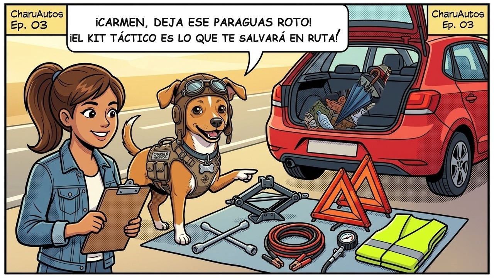
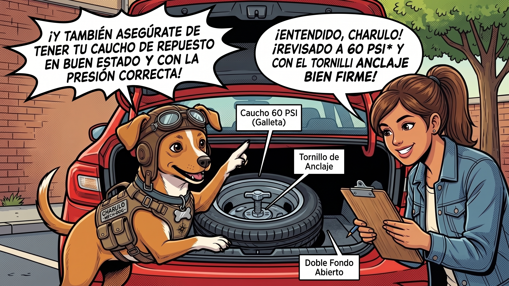

# Episodio 03 — La Caja Mágica de la Cajuela
### Las Aventuras de Charu • Módulo 03 Adaptado a Historieta

---

*Herramientas esenciales y kit de emergencia táctico de cajuela*

---

### [ESCENA: Apertura de la cajuela del auto rojo de Carmen. En su interior reina el desorden: un paraguas quebrado, botellas de plástico, una toalla playera y bolsas de supermercado arrugadas.]

**[CARTUCHO DEL NARRADOR]:**
> Charu se asoma a la cajuela abierta y parpadea atónito ante el caos acumulado.

**Charu (Piloto y Mentor)** `🤨 Inspección Severa`:
*cruzando los brazos y levantando una ceja con ironía cómica*
> "Carmen... Si hoy a las 11 de la noche en una autopista solitaria se te poncha una llanta, ¿planeas ahuyentar los peligros arrojándole ese paraguas roto y la toalla playera?"

**Carmen (Conductora Principiante)** `😳 Vergüenza Divertida`:
*sonrojándose mientras apila apenada los cacharros viejos fuera del maletero*
> "¡Ups! Confieso que la cajuela se convirtió en el armario de lo que no sabía dónde guardar... ¡El vendedor me juró que venía con llanta de repuesto y no revisé nada más!"

---

*Episodio 03 (Parte 2): Inspección del caucho de repuesto temporal (galleta), presión a 60 PSI y tornillo de anclaje*

💥 **[EFECTO SONORO VISUAL]:** *¡CLAC! ¡DOBLE FONDO AL DESCUBIERTO!* (Charu tira de la correa y revela el compartimiento del caucho de repuesto)

**Charu (Piloto y Mentor)** `⚠️ Inspección Crítica`:
*señalando con su pata el vástago de válvula y el tornillo mariposa de anclaje*
> "¡Ese es el gran error de los conductores novatos, Carmen! Confían en que tienen una llanta de repuesto abajo, pero nunca la revisan. En reposo pierde hasta 1 PSI al mes. Si tu repuesto es de uso temporal (galleta), requiere 60 PSI para aguantar el peso del auto. ¡Una llanta de auxilio desinflada en el fondo es solo peso muerto!"

**Carmen (Conductora Principiante)** `📝 Aprendizaje Clave`:
*anotando en su libreta mientras comprueba con el manómetro*
> "¡Menos mal levantamos la alfombra! Estaba en 35 PSI cuando debería tener 60. ¡La inflamos ya mismo y verifiqué que el tornillo de anclaje esté bien apretado para que no vibre en las curvas!"

💥 **[EFECTO SONORO VISUAL]:** *¡CLIC! ¡EQUIPADO!* (El Kit Táctico resplandece ordenado en su estuche rígido)

**Charu (Piloto y Mentor)** `🛡️ Equipamiento Táctico`:
*abriendo con orgullo un maletín negro con compartimentos de espuma de alta densidad*
> "¡Aquí tienes tu kit táctico de rescate! 2 triángulos reflectantes de base pesada, linterna frontal LED recargable, minicompresor 12V con manómetro digital, kit de mechas vulcanizantes y cables pasa-corriente calibre 4 AWG. Y el chaleco reflectante va en la guantera: ¡te lo pones ANTES de abrir la puerta!"

**Carmen (Conductora Principiante)** `💪 ¡Empoderada!`:
*guardando el kit táctico con firmeza y orden impecable*
> "¡Todo cupo en un solo estuche compacto que costó menos de $45 USD! Ahora sé que si ocurre una eventualidad, tengo las armas necesarias para salir rodando."

---

💡 **[LA REGLA DE ORO DE CHARU]:**
> *"Guarda siempre el chaleco reflectante en la guantera o debajo del asiento del conductor, jamás en el fondo de la cajuela."*
