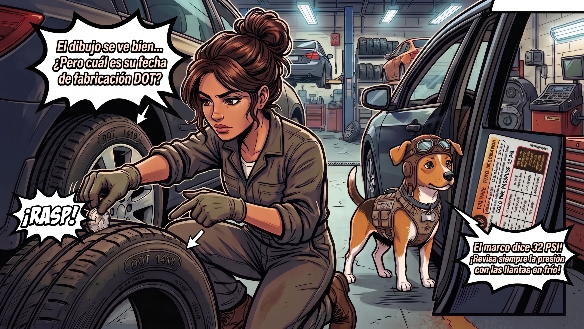

# Episodio 06 — Las Runas Secretas del Neumático
### Las Aventuras de Charu • Módulo 06 Adaptado a Historieta

---

*Código DOT de caducidad, banda de rodamiento y presión del pilar B*

---

### [ESCENA: En una gomería / llantera de segunda mano con letreros llamativos: 'LLANTAS SEMINUEVAS A PRECIO DE REGALO: $25 USD'. Carmen inspecciona un caucho con apariencia reluciente.]

**[CARTUCHO DEL NARRADOR]:**
> El vendedor ofrece con insistencia un neumático lustrado con abundante silicona negra brillante.

**Carmen (Conductora Principiante)** `🤑 Tentación de Oferta`:
*tocando el neumático brillante con intenciones de sacar la tarjeta*
> "¡Mira qué ganga, Charu! Está baratísima, se ve negrísima como nueva y los surcos se ven profundos. ¡Con esto me ahorro $80 dólares!"

**Charu (Piloto y Mentor)** `🛑 ¡Frena esa Billetera!`:
*apuntando con su pata a un pequeño óvalo grabado en el flanco del caucho*
> "¡Alto ahí! Lee las runas sagradas del flanco: 'DOT XXXX 1418'. ¿Sabes qué significa? Semana 14 del año 2018. ¡Ese neumático tiene 8 años de fabricado! La goma está reseca y cristalizada. En una frenada sobre piso mojado patinarás como si estuvieras en una pista de patinaje sobre hielo."

💥 **[EFECTO SONORO VISUAL]:** *¡DOT 1418: CADUCADO!* (Caucho cristalizado = 0% de agarre en pavimento mojado)

**Carmen (Conductora Principiante)** `😱 ¡Casi Caigo en la Trampa!`:
*apartando la mano del neumático con indignación hacia el vendedor*
> "¡¿Me iban a vender una llanta de hace 8 años disfrazada con abrillantador?! ¡Menos mal me enseñaste a descifrar el código DOT y la prueba de la moneda!"

**Charu (Piloto y Mentor)** `📖 La Verdad del Pilar B`:
*señalando la calcomanía metálica en el marco de la puerta del auto de Carmen*
> "Y la presión correcta nunca es el número gigante que dice la llanta (esa es la presión máxima de ruptura). La presión de ingeniería está en la etiqueta del Pilar B de tu auto: 32 PSI adelante y 30 PSI atrás."

---

💡 **[LA REGLA DE ORO DE CHARU]:**
> *"Los neumáticos caducan a los 5 años desde su fecha de fabricación aunque conserven dibujo profundo; el caucho pierde elasticidad y se vuelve piedra."*
