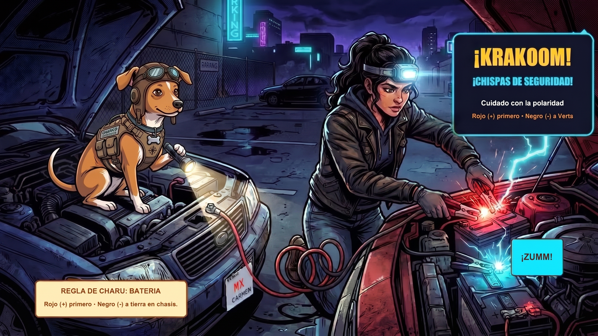

# Episodio 07 — Chispa y Rescate a Medianoche
### Las Aventuras de Charu • Módulo 07 Adaptado a Historieta

---

*Batería, fusibles de colores y puente seguro sin quemar la ECU*

---

### [ESCENA: Medianoche en el estacionamiento desolado de un centro comercial. Carmen gira la llave de encendido... Las luces parpadean débilmente y solo se escucha un triste chasquido metálico.]

**[CARTUCHO DEL NARRADOR]:**
> La noche está fría y el tablero apenas tiene fuerza para encender los testigos. Un conductor bienintencionado se acerca con unos cables finos y enredados.

💥 **[EFECTO SONORO VISUAL]:** *¡TRAC-TRAC-TRAC!* (El motor de arranque no gira: batería con menos de 10.5V)

**Carmen (Conductora Principiante)** `😰 Angustia Nocturna`:
*apretando el volante con el frío de la noche y mirando el estacionamiento oscuro*
> "¡No enciende! El señor de al lado me dice que conectemos los cables rojo con rojo y negro con negro directo entre las dos baterías a ver qué pasa..."

**Charu (Piloto y Mentor)** `🛑 ¡ALTO VOLTAJE!`:
*sacando los cables profesionales 4 AWG de su kit táctico y colocándose las gafas protectoras*
> "¡Si conectas al revés o cierras el circuito sobre la batería que desprende hidrógeno inflamable, provocarás un chispazo que freirá la computadora del motor de $1.200 USD! Sigue el Orden Sagrado del Rescate."

**Charu (Piloto y Mentor)** `⚡ El Orden Sagrado`:
*guiando la mano de Carmen paso a paso con su linterna*
> "1. Pinza Roja al Positivo (+) de tu batería muerta. 2. Pinza Roja al Positivo (+) del auto donante. 3. Pinza Negra al Negativo (-) del auto donante. 4. Pinza Negra a un tornillo o metal sin pintar del chasis de tu auto, LEJOS de la batería."

💥 **[EFECTO SONORO VISUAL]:** *¡WROOOOM!* (El motor ruge al primer giro de llave sin titubeos)

**Carmen (Conductora Principiante)** `💪 ¡Triunfo Absoluto!`:
*acelerando suavemente con una sonrisa triunfal en el rostro*
> "¡Arrancó de inmediato y sin soltar una sola chispa peligrosa! Y ahora sé que si se me apaga la radio o una luz, reviso los fusibles de colores por 50 centavos."

---

💡 **[LA REGLA DE ORO DE CHARU]:**
> *"La última pinza negra va a un metal sólido sin pintar del bloque motor o chasis, NUNCA al borne negativo de la batería agotada para evitar chispas inflamables."*
