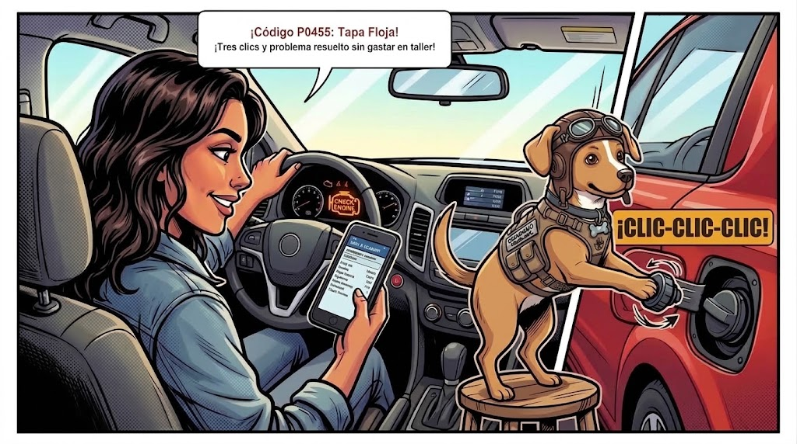

# Episodio 10 — El Árbol de Navidad en el Tablero
### Las Aventuras de Charu • Módulo 10 Adaptado a Historieta

---

*Testigos luminosos, escáner OBD-II y el misterio del tapón de gasolina*

---

### [ESCENA: A mitad de camino hacia el trabajo. En el tablero de instrumentos se ilumina una silueta amarilla con forma de motor: CHECK ENGINE.]

**[CARTUCHO DEL NARRADOR]:**
> Un pequeño pitido alerta a Carmen. Una luz ámbar fija brilla en su velocímetro.

💥 **[EFECTO SONORO VISUAL]:** *¡BEEP-BEEP!* (Testigo Check Engine (MIL) iluminado en ámbar constante)

**Carmen (Conductora Principiante)** `😰 Susto en el Tablero`:
*aferrándose al volante con los ojos clavados en el ícono amarillo*
> "¡¡CHARU, EL MOTORCITO AMARILLO!! ¡Se prendió el Check Engine! Llamé a un taller rápido y me dijeron que seguramente se dañó el convertidor catalítico o la caja de velocidades..."

**Charu (Piloto y Mentor)** `🚦 Semáforo ISO`:
*conectando un pequeño escáner OBD-II Bluetooth de $15 USD bajo el volante*
> "¡Calma! Recuerda el código de colores ISO: Azul/Verde = Sistema activo; Amarillo ámbar = Precaución/Atención programada (el auto rueda seguro, no hay que llamar grúa); Rojo = Peligro crítico (apagar de inmediato); Amarillo parpadeante = Falla de encendido severa (detenerse)."

**Charu (Piloto y Mentor)** `📱 Diagnóstico en Vivo`:
*mostrando la pantalla del teléfono de Carmen conectada al escáner*
> "El escáner arroja: 'Código P0455: Fuga grande en sistema EVAP'. ¿Cargaste gasolina esta mañana, Carmen?"

**Carmen (Conductora Principiante)** `💡 ¡Resolución en 5 Segundos!`:
*bajando del auto, cerrando la tapa del combustible y girándola con fuerza*
> "¡Sí! El despachador de la gasolinera la dejó floja. La apreté hasta escuchar los 3 clics ('¡CLIC-CLIC-CLIC!'), borré el código con la aplicación... ¡y la luz jamás volvió a encenderse! ¡Cero dólares gastados!"

---

💡 **[LA REGLA DE ORO DE CHARU]:**
> *"Aprieta siempre el tapón del tanque de combustible hasta escuchar 3 clics firmes; una tapa floja dispara el código EVAP de Check Engine simulando una avería grave."*
