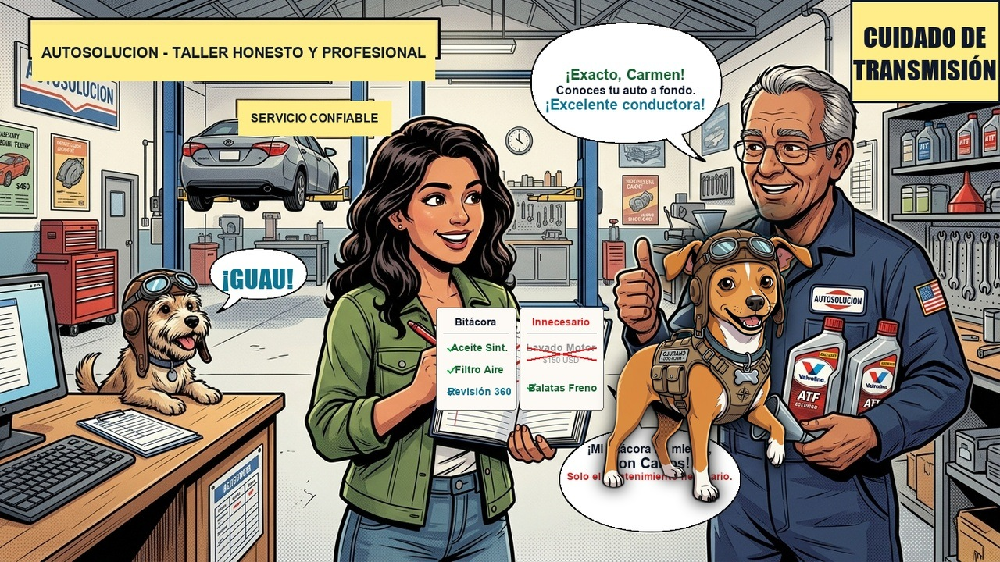

# Episodio 11 — La Factura Fantasma y los 100k km
### Las Aventuras de Charu • Módulo 11 Adaptado a Historieta

---

*El mapa de kilometraje, mitos de fluidos sellados y correa de distribución*

---

### [ESCENA: En el taller honesto AutoSolución. Don Carlos recibe a Carmen para la revisión de los 60.000 km con su manual de mantenimiento abierto sobre el mostrador.]

**[CARTUCHO DEL NARRADOR]:**
> El odómetro del auto de Carmen marca exactamente 60.020 kilómetros.

**Carmen (Conductora Principiante)** `📋 Revisión Informada`:
*mostrando a Don Carlos su cuaderno con los puntos del manual del fabricante*
> "Don Carlos, en otro taller me pasaron un presupuesto de $850 USD diciendo que a los 60 mil kilómetros hay que limpiar inyectores con ultrasonido, cambiar cables y hacer 'lavado interno de motor'..."

**Don Carlos (El Mecánico Honesto)** `🔧 Transparencia Total`:
*tachando con una pluma roja los conceptos innecesarios en la hoja*
> "¡Puro invento comercial, señorita Carmen! Lo que el fabricante de tu auto estipula para los 60.000 km es muy claro: cambio de fluido ATF de caja automática, líquido de frenos DOT 4, bujías y filtro de aire. El servicio real cuesta $190 USD, no $850."

**Carmen (Conductora Principiante)** `🤔 Duda del Fluido Eterno`:
*preguntando con genuina curiosidad técnica*
> "Don Carlos, ¿y es verdad lo que dicen en algunos concesionarios de que el aceite de la transmisión automática dura 'de por vida' y nunca se cambia?"

**Don Carlos (El Mecánico Honesto)** `💡 Desmintiendo el Mito`:
*mostrando una probeta con fluido ATF degradado y oscuro frente a uno nuevo traslúcido*
> "¡Ese es el mito más peligroso de la industria! 'De por vida' solo significa hasta que venza la garantía de fábrica. El fluido hidráulico se degrada por calor y fricción. Cambiarlo a los 60k km evita una reparación de $3.500 USD."

💥 **[EFECTO SONORO VISUAL]:** *¡$660 AHORRADOS!* (Mantenimiento preventivo real y transmisión protegida para 300.000 km)

---

💡 **[LA REGLA DE ORO DE CHARU]:**
> *"No existe ningún aceite eterno: el fluido de transmisión automática (ATF/CVT) debe sustituirse rigurosamente entre los 60.000 y 80.000 km para no quemar la caja."*
