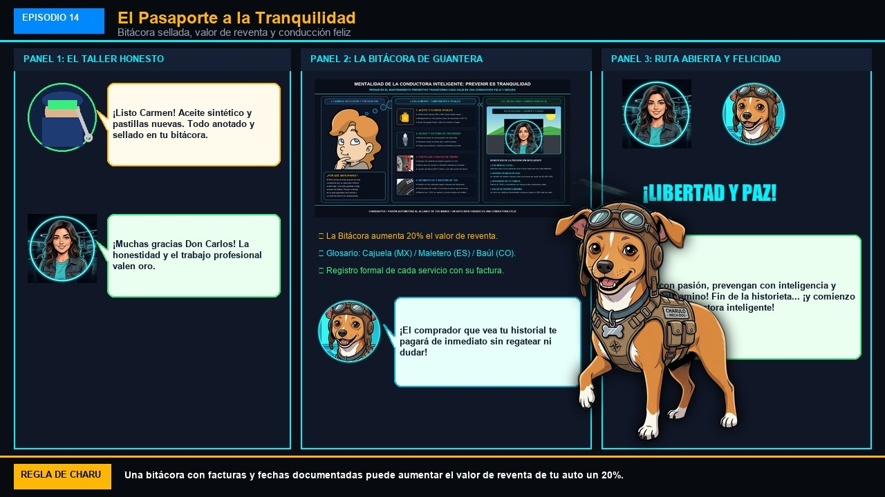

# Episodio 14 — El Pasaporte a la Tranquilidad
### Las Aventuras de Charu • Módulo 14 Adaptado a Historieta

---

*Bitácora de servicio, valor de reventa y conducción feliz*

---

### [ESCENA: Atardecer dorado en una carretera panorámica. Carmen conduce su auto rojo con gafas de sol oscuras, Charu viaja en el asiento del copiloto disfrutando de la brisa, y sobre el tablero descansa la Bitácora de Mantenimiento sellada.]

**[CARTUCHO DEL NARRADOR]:**
> En el taller de Don Carlos, el auto de Carmen recibió sus repuestos certificados y cada detalle quedó registrado con sello y firma profesional.

**Don Carlos (El Mecánico Honesto)** `⭐ Trabajo Impecable`:
*entregándole a Carmen su libreta sellada con las facturas adjuntas*
> "¡Listo Carmen! Aceite sintético certificado, pastillas nuevas y revisión de 25 puntos. Tu Bitácora de Guantera está sellada con fecha, kilometraje y número de lote."

**Charu (Piloto y Mentor)** `💎 Oro en la Guantera`:
*tocando la bitácora con orgullo*
> "¡Esa pequeña libreta es tu pasaporte a la tranquilidad! El día que decidas vender este auto, cualquier comprador que vea todo documentado te pagará de inmediato el precio más alto del mercado sin dudar."

**Carmen (Conductora Principiante)** `✨ Libertad y Paz`:
*conduciendo con serenidad y alegría bajo los últimos rayos dorados del sol*
> "Atrás quedaron los días de miedo e incertidumbre. Ahora entiendo mi auto, sé cuidarlo, sé defenderme en un taller y disfruto cada kilómetro con una sonrisa. ¡Gracias Charu!"

💥 **[EFECTO SONORO VISUAL]:** *¡CONDUCCIÓN FELIZ!* (Ruta abierta, música en el estéreo y seguridad total en cada curva)

**Charu (Piloto y Mentor)** `🏁 Mensaje Final`:
*levantando su pulgar con la bandera de cuadros al viento*
> "¡Manejen con pasión, prevengan con inteligencia y disfruten del camino! Fin de la historieta... ¡y comienzo de tu vida como Conductora Inteligente!"

---

💡 **[LA REGLA DE ORO DE CHARU]:**
> *"Una bitácora de servicio con facturas y fechas documentadas puede aumentar el valor de reventa de tu auto hasta un 20% frente a otro sin historial comprobable."*
