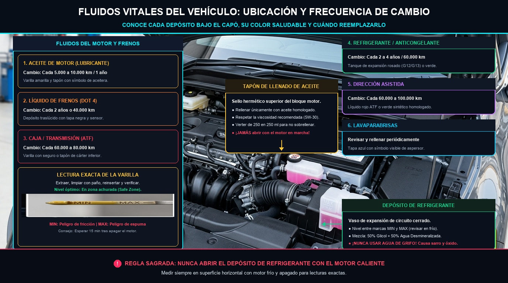
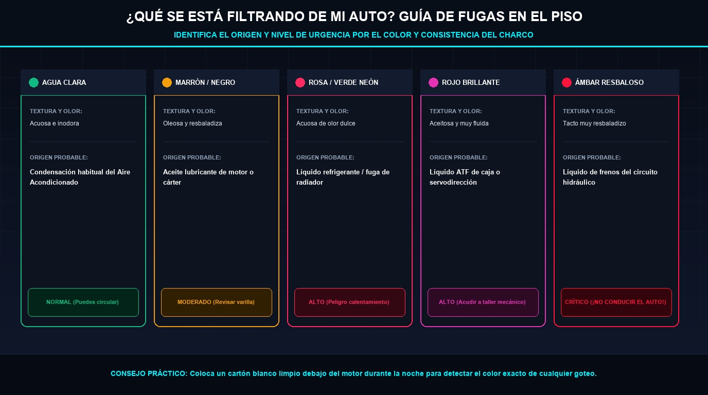

# Módulo 05 — Fluidos Vitales: La Sangre y el Sudor de tu Vehículo
### Manual del Conductor Inteligente • Edición Cero Conocimientos
*Por CharuAutos (@charuautopics) — "Pasión Automotriz al Alcance de tus Manos"*

---

## 🩸 1. Los 5 Fluidos Esenciales que Mantienen Vivo tu Motor

Un vehículo moderno depende de cinco fluidos principales para funcionar sin destruirse a sí mismo. Si aprendes a revisarlos, evitarás el 70% de las averías catastróficas de motor y transmisión:

*Infografía Técnica en Alta Definición: Ubicación exacta de los depósitos en el vano motor, colores y frecuencias de reemplazo.*

| Fluido Vital | Color Saludable | Cuándo Revisar | Consecuencia de Falla |
| :--- | :--- | :--- | :--- |
| **Aceite de Motor** | Miel dorado a ámbar traslúcido | Cada 1.000 km o 15 días | Fundición completa del motor |
| **Líquido Refrigerante** | Rosa fosforito, verde neón o azul | Mensualmente (siempre en frío) | Sobrecalentamiento y junta de culata |
| **Líquido de Frenos** | Amarillo pálido a ámbar claro | Cada 2 a 3 meses | Pérdida total de capacidad de frenado |
| **Dirección Asistida / ATF** | Rojo grosella brillante o rosa | Cada 3 meses | Dirección pesada y desgaste de bomba |
| **Limpiaparabrisas** | Azul o verde traslúcido | Semanalmente | Visibilidad nula ante barro o lluvia |

---

## 🛢️ 2. Aceite de Motor: Lectura Exacta de la Varilla

El aceite lubrica las piezas metálicas que se mueven a miles de revoluciones por minuto, dispersa el calor interno y arrastra impurezas hacia el filtro.

### Procedimiento de Medición en 5 Pasos:
1. **Superficie plana:** Estaciona el auto en un terreno completamente horizontal. En una pendiente, la lectura será falsa.
2. **Motor tibio/frío:** Apaga el motor y espera al menos **10 a 15 minutos** para que todo el aceite de la culata descienda al cárter.
3. **Primera extracción:** Saca la varilla (suele tener tirador amarillo o naranja). Límpiala completamente con un paño de microfibra o papel sin pelusa. No mires esta primera lectura: no es válida porque el aceite salpicó al circular.
4. **Segunda inserción:** Introduce la varilla hasta el fondo firmemente, espera 3 segundos y extráela con cuidado manteniéndola vertical con la punta hacia abajo.
5. **Lectura visual:** Observa dónde se sitúa la película brillante de aceite.

*Fotografía e Ilustración: Interpretación correcta de los niveles de la varilla (MIN, Zona Segura y el peligro grave del sobrellenado).*

> [!WARNING]
> ### ⚠️ El Error del Sobrellenado
> Muchos conductores novatos piensan: "si un poco es bueno, más es mejor". **Falso y peligroso**. Si el nivel de aceite supera la marca MAX, el cigüeñal golpeará la superficie del aceite batiéndolo como mayonesa y creando burbujas de aire. Las bombas de aceite no bombean espuma, por lo que las piezas se quedarán sin lubricación y los retenes reventarán por exceso de presión en el cárter.

### Decodificando la Viscosidad: ¿Qué significa 5W-30 o 0W-20?
- **El número con la "W" (Winter / Invierno):** Indica la fluidez en frío. Un `0W` o `5W` fluye como agua al arrancar a baja temperatura, llegando al árbol de levas en microsegundos.
- **El segundo número (Verano / Temperatura de operación a 100 °C):** Indica la viscosidad cuando el motor está a régimen térmico pleno. Un `30` o `40` mantendrá una película protectora resistente bajo el sol abrasador.
- **¿Mineral vs Sintético?:** Los aceites **100% sintéticos** modernos protegen el doble, se degradan menos y resisten hasta 10.000 - 15.000 km frente a los 5.000 km del mineral clásico. Usa siempre la especificación recomendada por el fabricante (API SP, ILSAC GF-6 o normas ACEA).

---

## ❄️ 3. Refrigerante / Anticongelante: El Escudo Térmico

El refrigerante es una mezcla equilibrada de 50% agua desmineralizada y 50% glicol (monoetilenglicol) con aditivos anticorrosivos. Eleva el punto de ebullición a más de 125 °C bajo presión y evita que el bloque se congele a -35 °C.

> [!CAUTION]
> ### 🛑 REGLA INQUEBRANTABLE DE SEGURIDAD
> **NUNCA, BAJO NINGUNA CIRCUNSTANCIA, ABRAS EL DEPÓSITO DE EXPANSIÓN O RADIADOR CON EL MOTOR RECIÉN APAGADO.**  
> El sistema almacena líquido a más de 100 °C y presiones de 1 a 1.4 bar. Al retirar el tapón, la caída repentina de presión hace que el líquido entre en ebullición instantánea, provocando una erupción que rocía agua hirviendo y vapor directamente sobre tu cara y manos.  
> Espera siempre que el motor esté **frío al tacto** (mínimo 45 minutos).

### ¿Por qué NUNCA se debe usar agua de grifo?
El agua del grifo contiene sales, cloro y cal que oxidan el radiador por dentro, forman sarro que tapa los conductos microscópicos de la culata y corroe la bomba de agua. Solo en una emergencia absoluta y para llegar al taller más próximo se admite agua; luego deberá drenarse y purgarse el circuito por completo.

---

## 🛑 4. Líquido de Frenos: La Fuerza Hidráulica Oculta

El líquido de frenos transmite la fuerza de tu pie desde el pedal hasta las cuatro ruedas con una presión que supera los 100 bares.

- **Naturaleza Higroscópica:** El líquido de frenos absorbe humedad ambiental del aire como una esponja a través de los microporos de los manguitos flexibles.
- **El Fenómeno del "Vapor Lock":** Con apenas un 3% de agua absorbida, el punto de ebullición del líquido cae de 260 °C a menos de 150 °C. Si bajas una colina frenando repetidamente, los discos calientan las pinzas, el agua dentro del líquido hierve y crea **burbujas de vapor**. Como el vapor se comprime, el pedal de freno se irá al fondo **sin frenar el auto**.
- **Cambio Obligatorio:** Se debe reemplazar cada **2 años o 40.000 km**, independientemente del uso del auto.
- **Especificaciones:** La mayoría de autos usan **DOT 4** (compatible hacia atrás con DOT 3). Nunca mezcles con fluidos base silicona (DOT 5).

> [!WARNING]
> El líquido de frenos es un decapante corrosivo para la pintura de la carrocería. Si derramas una sola gota en la chapa, enjuágala inmediatamente con abundante agua corriente.

---

## 🕵️‍♂️ 5. Guía de Detección de Fugas en el Suelo (Tabla del Detective)

Si al mover tu auto por la mañana ves manchas en el suelo del garaje o la acera, no te alarmes a ciegas; usa esta tabla de identificación cromática y de consistencia:

*Infografía Técnica en Alta Definición: Diagnóstico inmediato de averías según el color, textura y consistencia del charco bajo el auto.*

| Color del Charco | Textura y Olor | Origen Probable | Nivel de Urgencia |
| :--- | :--- | :--- | :--- |
| **Transparente** | Acuosa, inodora | Condensación de Aire Acondicionado | 🟢 **NORMAL:** No es una fuga de fluido |
| **Marrón oscuro** | Oleosa, resbaladiza | Aceite lubricante de motor | 🟡 **MODERADO:** Revisar nivel en varilla |
| **Rosa / Verde** | Acuosa, olor dulce | Líquido Refrigerante / Anticongelante | 🔴 **ALTO:** Peligro de sobrecalentamiento |
| **Rojo brillante** | Aceitosa, fluido fino | ATF (Caja automática o servodirección) | 🔴 **ALTO:** Acudir a taller especializado |
| **Ámbar claro** | Muy resbalosa al tacto | Líquido de Frenos | ⛔ **CRÍTICO: ¡NO CONDUCIR EL AUTO!** |
