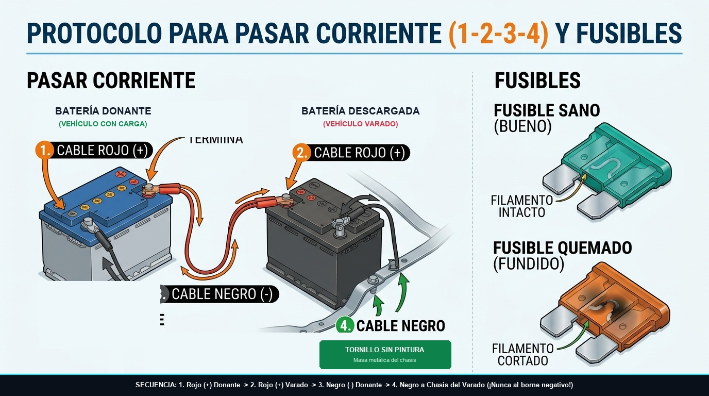

# Módulo 07 — Batería, Sistema Eléctrico, Fusibles y Luces
### Manual del Conductor Inteligente • Edición Cero Conocimientos
*Por CharuAutos (@charuautopics) — "Pasión Automotriz al Alcance de tus Manos"*

---

## ⚡ 1. La Batería de 12V: El Corazón Eléctrico

La batería tiene una misión principal: entregar una corriente violenta de entre 300 y 600 amperios durante 2 segundos para mover el motor de arranque. Una vez que el motor enciende, el **alternador** toma el relevo, genera la electricidad del vehículo y recarga la batería.

### Los Voltajes que Debes Conocer:
Si tienes un multímetro digital básico de $10 USD:
- **12.6V a 12.8V (Motor apagado):** Batería cargada al 100%.
- **12.2V (Motor apagado):** Batería al 50% de carga (recarga preventiva).
- **Menos de 11.9V (Motor apagado):** Batería descargada o comunicada internamente. No arrancará.
- **13.8V a 14.4V (Motor encendido en ralentí):** El alternador está cargando perfectamente. Si marca menos de 13.2V o más de 15.0V, el alternador o regulador está averiado.

---

## 🔌 2. Protocolo de Puente de Arranque Seguro (Jump Start)

Hacer un puente de arranque de manera incorrecta puede quemar computadoras de a bordo (ECU) o provocar explosiones de gas hidrógeno liberado por una batería dañada. Sigue rigurosamente este orden:

*Infografía Automotriz: Secuencia 1-2-3-4 de conexión de cables para pasar corriente y comprobación de fusible sano vs quemado.*

### Paso a Paso Riguroso:
1. **Posición:** Estaciona el auto auxiliador cerca del auto sin batería, pero **sin que los parachoques o carrocerías se toquen entre sí**. Apaga el motor y retira las llaves en ambos.
2. **Paso 1 (Rojo a Muerta):** Conecta una pinza del **cable ROJO (+)** al borne positivo de la batería descargada.
3. **Paso 2 (Rojo a Sana):** Conecta la otra pinza del **cable ROJO (+)** al borne positivo de la batería del auto donante.
4. **Paso 3 (Negro a Sana):** Conecta una pinza del **cable NEGRO (-)** al borne negativo de la batería donante.
5. **Paso 4 (Negro a Masa Metálica del Auto Muerto):** Conecta la otra pinza del **cable NEGRO (-)** a una parte metálica gruesa y sin pintar del bloque del motor o tornillo de la torreta de amortiguación del auto varado.
   - *¿Por qué no al borne negativo de la batería descargada?* Porque al conectar el último cable siempre salta una microchispa. Si la batería descargada emitió vapores de hidrógeno inflamable, la chispa podría provocar una deflagración. Conectarlo al chasis alejado de la batería elimina este riesgo.
6. **Arranque:**
   - Enciende el auto donante y mantenlo acelerado levemente a 1.500 RPM durante 3 a 5 minutos para transferir energía inicial.
   - Da arranque al auto averiado. Debería encender de inmediato.
7. **Desconexión en Orden Inverso Exacto:**
   - 1° Retirar pinza negra de masa metálica.
   - 2° Retirar pinza negra del auto donante.
   - 3° Retirar pinza roja del auto donante.
   - 4° Retirar pinza roja del auto auxiliado.
8. **Rodaje:** Conduce el auto auxiliado durante un mínimo de 30 a 45 minutos continuos sin apagarlo para que el alternador restaure la carga química.

---

## 🧯 3. Fusibles: Los Guardianes de la Instalación Eléctrica

Si de repente dejan de funcionar los limpiaparabrisas, la toma de 12V del mechero o una luz interior, el 90% de las veces no hay una avería grave: simplemente se ha "volado" (fundido) un fusible de $0.50 USD.

### La Anatomía de un Fusible de Cuchilla:
### Tabla de Códigos de Color Estándar DIN:
| Color del Fusible | Amperaje (A) | Circuitos Típicos Protegidos |
| :--- | :---: | :--- |
| **Naranja / Beige** | 5A | Módulos de confort, sensores del cuadro |
| **Rojo** | 10A | Luces de posición, radio, airbag |
| **Azul** | 15A | Tomas de mechero 12V, bomba limpiaparabrisas |
| **Amarillo** | 20A | Faros principales, limpiaparabrisas |
| **Blanco / Claro** | 25A | Luneta térmica trasera, ventilador A/C |
| **Verde** | 30A | Elevalunas eléctricos, motor de calefacción |

> [!CAUTION]
> ### 🚫 LA REGLA SAGRADA DE LOS FUSIBLES
> **NUNCA instales un fusible de mayor amperaje que el original y JAMÁS sustituyas un fusible por papel de aluminio o un trozo de alambre de cobre.**  
> El fusible es el eslabón débil diseñado a propósito para derretirse de forma controlada si hay un cortocircuito. Si colocas un fusible de 30A donde iba uno de 10A, el fusible no se fundirá; lo que se fundirá e incendiará será el mazo de cables dentro de tu tablero.

---

## 💡 4. Cambio de Bombillas Halógenas (H7 / H4)

- **Regla de oro:** **NUNCA toques la ampolla de cuarzo/cristal con los dedos descalzos**. La grasa natural de tu piel se transfiere al cristal. Al encender la bombilla y superar los 250 °C, esa grasa crea un punto caliente que hace que el cristal se sobrecaliente localmente y estalle en pocos días. Manipúlala siempre sosteniéndola por el casquillo metálico o usando guantes limpios.
