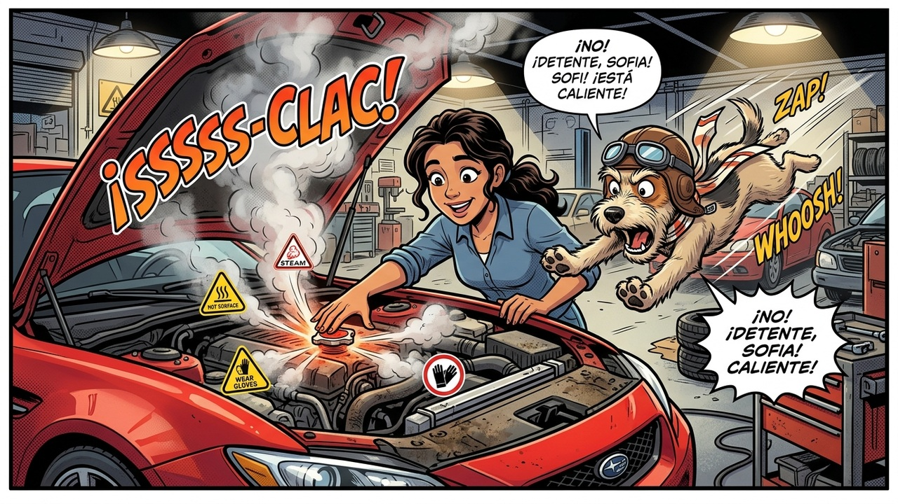

# Episodio 01 — El Misterio del Capó y las 5 Reglas de Oro
### Las Aventuras de Charu • Módulo 01 Adaptado a Historieta

---

*Seguridad física, sentido común y peligros del refrigerante hirviendo*

---

### [ESCENA: Sábado por la mañana en la cochera. Tras regresar de un viaje por carretera, Sofía nota un silbido vaporoso bajo el capó y decide abrirlo por primera vez para ver si le falta agua.]

**[CARTUCHO DEL NARRADOR]:**
> Sofía abre el seguro del capó. El vano motor irradia una ola de calor sofocante. Ve una tapa metálica brillante con un símbolo de advertencia y estira el brazo decidida...

**Sofía (Conductora Principiante)** `🤔 Curiosidad Ingenua`:
*con la mano a escasos centímetros de la tapa metálica del radiador*
> "Bueno... esto no debe ser tan difícil. Solo desenrosco esta tapita plateada para echarle un poco de agua del grifo..."

💥 **[EFECTO SONORO VISUAL]:** *¡SSSSSS-CLAC!* (Vapor a presión silbando a más de 115°C)

**Charu (Piloto y Mentor)** `🛑 ¡ALTO AHÍ!`:
*aterrizando en un salto acrobático y apartando el brazo de Sofía de un manotazo firme*
> "¡¡DETENTE, SOFÍA!! ¡Si giras esa tapa ahora mismo, el refrigerante presurizado a 125°C estallará como un géiser hirviendo directo a tu cara, cuello y brazos causando quemaduras de tercer grado!"

**Sofía (Conductora Principiante)** `😱 ¡Pánico y Asombro!`:
*retrocediendo dos pasos con las manos en el pecho y el corazón acelerado*
> "¡¿125 grados?! ¡¿Una bomba de vapor en mi propio auto?! ¡Casi termino en el hospital el primer fin de semana!"

**Charu (Piloto y Mentor)** `📋 Reglas Sagradas`:
*desplegando una infografía holográfica con 5 mandamientos de seguridad*
> "¡Tranquila, para eso estamos aquí! Memoriza las 5 Reglas Inviolables: 1. Motor caliente = Zona Prohibida (espera 45 min). 2. Superficie plana y freno puesto. 3. El gato hidráulico jamás sostiene el auto solo (usar torres). 4. Desconectar el borne negativo de la batería antes de tocar cables. 5. Gafas y guantes siempre."

**Sofía (Conductora Principiante)** `😌 ¡Lección Aprendida!`:
*colocándose unos guantes de nitrilo y gafas protectoras con renovada compostura*
> "¡Anotadísimo en mi mente! La seguridad física va primero. ¡Ahora explícame qué es lo que hace latir a este auto!"

---

💡 **[LA REGLA DE ORO DE CHARU]:**
> *"Nunca abras la tapa del radiador ni del vaso presurizado con el motor caliente. Deja enfriar al menos 45 minutos."*
