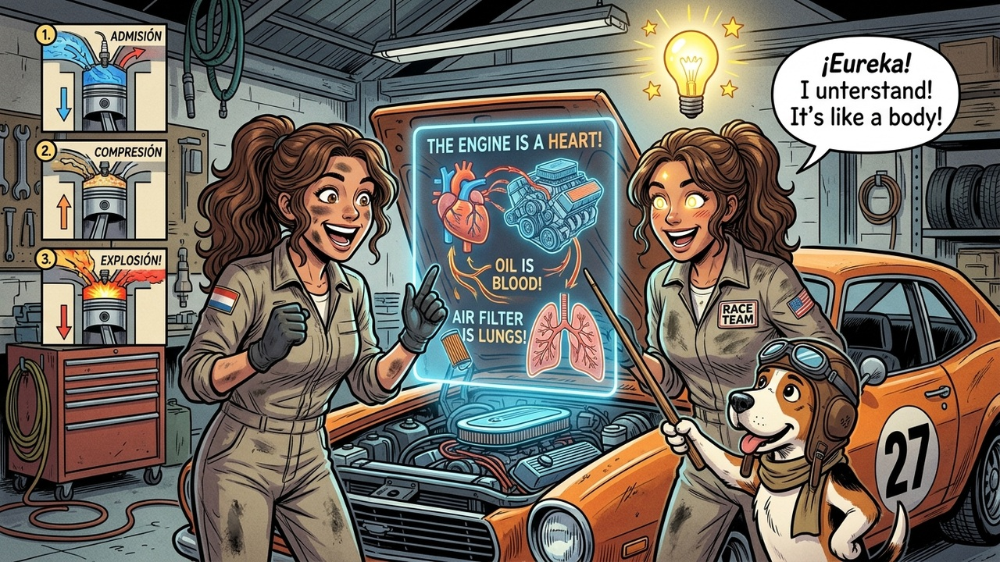

# Episodio 02 — El Auto es un Cuerpo Humano
### Las Aventuras de Charu • Módulo 02 Adaptado a Historieta

---

*Anatomía del vano motor y el ciclo de 4 tiempos sin jerga*

---

### [ESCENA: Bajo la luz clara de la cochera, Sofía observa el bloque motor repleto de mangueras, tubos y sensores. Charu despliega un holograma interactivo que compara la máquina con un organismo vivo.]

**[CARTUCHO DEL NARRADOR]:**
> Sofía mira el vano motor con expresión perpleja, como si intentara descifrar jeroglíficos alienígenas.

**Sofía (Conductora Principiante)** `🤯 Confusión Total`:
*rascándose la cabeza y señalando el laberinto de cables y tubos de acero*
> "Charu, sé totalmente honesto... ¿Cómo diablos hace este bloque de fierros para mover más de una tonelada de peso con solo acariciar un pedal?"

**Charu (Piloto y Mentor)** `💡 Analogía Médica`:
*apuntando con una varita holográfica brillante al corazón del motor*
> "¡Míralo como un cuerpo humano! Motor = Corazón; Aceite sintético = Sangre que lubrica y enfría; Filtro de aire = Pulmones; Gasolina = Comida; Tubo de escape = Exhalación; Computadora ECU = Cerebro digital."

💥 **[EFECTO SONORO VISUAL]:** *¡BUM! ¡BRROOOM!* (Ciclo de 4 Tiempos: Admisión ➡️ Compresión ➡️ Explosión ➡️ Escape)

**Sofía (Conductora Principiante)** `💡 ¡Momento Eureka!`:
*con los ojos brillantes y una gran sonrisa de entendimiento*
> "¡Eureka! ¡Tiene todo el sentido del mundo! Si el aceite se seca, le da un infarto; si el filtro se tapa, el motor se asfixia; y si la gasolina está sucia, se indigesta. ¡Por fin lo entiendo sin fórmulas raras!"

**Charu (Piloto y Mentor)** `🏆 ¡Exacto!`:
*sonriendo satisfecho con las orejas levantadas*
> "¡Esa es la mentalidad! Y recuerda: cuando enciendas en frío por la mañana, dale 30 a 60 segundos antes de moverte para que la 'sangre' llegue a cada rincón del 'corazón'."

---

💡 **[LA REGLA DE ORO DE CHARU]:**
> *"El 75% del desgaste de un motor ocurre en los primeros 90 segundos posteriores al encendido en frío; nunca aceleres a fondo al arrancar."*
