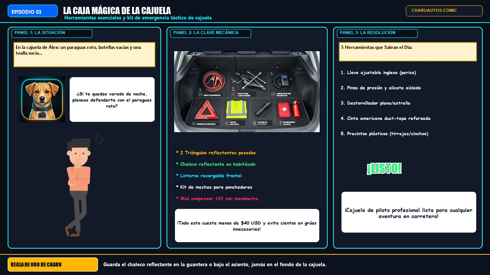

# Episodio 03 — La Caja Mágica de la Cajuela
### Las Aventuras de Charu • Módulo 03 Adaptado a Historieta

---

*Viñeta Principal: Charu auditando la cajuela de Álex y organizando el kit táctico de supervivencia vial.*

---

### [ESCENA: Cajuela abierta del auto]

**[CARTUCHO DEL NARRADOR]:**
> En la cajuela de Álex había un paraguas roto, dos botellas de refresco vacías, una toalla sucia y un balón desinflado.

**VIÑETA 1:**  
*Charu con patas en jarras mirando la cajuela con decepción cómica.*  
- **Charu:** — Álex... Si hoy te quedas varado a las 11 de la noche en una ruta sin luz, ¿planeas defenderte arrojándole el paraguas a los problemas?  
- **Álex (apenado):** — Bueno... ¡El vendedor me dijo que traía rueda de auxilio!

**VIÑETA 2:**  
*Charu saca una caja organizadora táctica con iluminación LED y la despliega.*  
- **Charu:** — La cajuela es tu búnker de rescate. Aquí va el **KIT OBLIGATORIO DE SALVACIÓN**:  
  - 🔺 **Dos triángulos reflectantes** con base pesada.  
  - 🦺 **Chaleco fluorescente** (va en la guantera, te lo pones ANTES de bajar).  
  - 🔦 **Linterna recargable** o frontal (porque nadie tiene 3 manos).  
  - 💨 **Compresor portátil 12V** con manómetro digital.  
  - 🧵 **Kit de mechas para llantas** (soluciona un clavo en 5 minutos).  
  - 🧯 **Extintor ABC de 1 kg** con manómetro en verde vigente.

**VIÑETA 3:**  
*Charu muestra un estuche compacto de herramientas caseras esenciales:*  
- **Charu:** — Y en herramientas de mano, no necesitas un taller entero:  
  1. Llave inglesa ajustable (perico).  
  2. Pinza de presión y alicate universal aislado.  
  3. Destornillador reversible plano/estrella.  
  4. Cinta aislante y precintos plásticos (cinchos/tirrajes).  
  5. Un rollo de cinta americana reforzada (*duct tape*).

**VIÑETA 4:**  
*La cajuela de Álex ahora está impecable, con todo asegurado contra los laterales.*  
- **Álex:** — ¡Parece el equipamiento de un equipo de rescate de Fórmula 1!  
- **Charu:** — Y lo mejor: todo esto cuesta menos de $40 dólares y te ahorrará cientos en grúas innecesarias.

---

💡 **[LA REGLA DE ORO DE CHARU]:**  
*"El chaleco reflectante debe guardarse dentro del habitáculo (en la guantera o bajo el asiento), jamás en el fondo de la cajuela. En una emergencia vial debes bajar del auto ya visible a 150 metros."*
