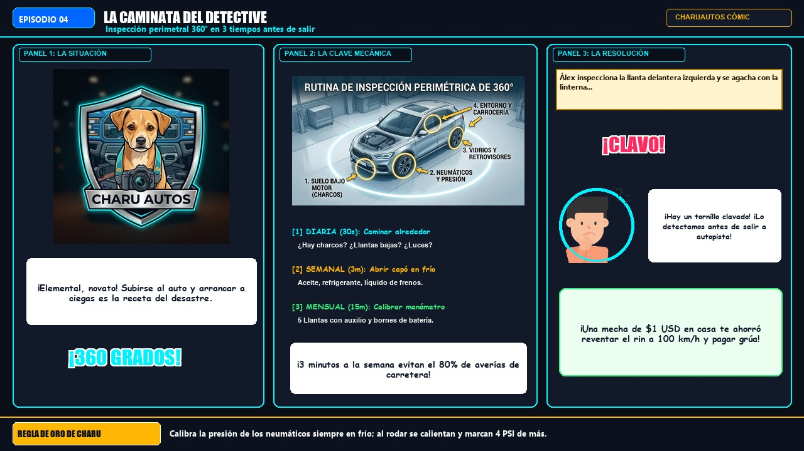

# Episodio 04 — La Caminata del Detective
### Las Aventuras de Charu • Módulo 04 Adaptado a Historieta

---

*Viñeta Principal: Charu detective con lupa luminosa enseñando a Álex la rutina perimetral de 3 tiempos.*

---

### [ESCENA: Alrededor del auto en la mañana]

**[CARTUCHO DEL NARRADOR]:**
> La mayoría de la gente se sube al auto, enciende el motor, pone música y arranca a ciegas. Hasta que un neumático desinflado destruye el rin a las tres cuadras.

**VIÑETA 1:**  
*Charu aparece con sombrero de detective inglés, pipa de burbujas y una lupa gigante de Neón Cian.*  
- **Charu:** — Elemental, mi querido Álex. Hoy aprenderás el hábito que separa a los novatos de los conductores inteligentes: **La Caminata 360°**.  
- **Álex:** — ¿Caminar alrededor de mi propio auto? ¿No creerán los vecinos que estoy loco?

**VIÑETA 2:**  
*Secuencia de viñetas rápidas mostrando los tres tiempos:*  
- **Charu:**  
  - ⏱️ **TIEMPO 1: El Escaneo Diario (30 Segundos)**  
    Caminar alrededor antes de abrir la puerta. Mirar el suelo: ¿hay charcos? Mirar las 4 llantas: ¿alguna está aplastada? Mirar los vidrios y retrovisores.  
  - ⏱️ **TIEMPO 2: La Guardia Semanal (3 Minutos)**  
    Abrir el capó con motor frío. Mirar nivel de aceite, refrigerante y líquido de frenos. Probar luces delanteras, traseras y reversa.  
  - ⏱️ **TIEMPO 3: La Inspección Mensual (15 Minutos)**  
    Calibrar presión con manómetro en las 5 llantas (incluyendo auxilio). Revisar profundidad de dibujo y bornes de batería.

**VIÑETA 3:**  
*Álex agachándose junto a la llanta delantera izquierda con la lupa.*  
- **Álex:** — ¡Espera, Charu! Mira esto... ¡Hay un tornillo brillante clavado en la banda de rodamiento de la llanta delantera!  
- **Charu (asintiendo satisfecho):** — ¡Brillante deducción, detective! Ese tornillo habría reventado tu caucho en plena autopista a 100 km/h. Como lo detectamos aquí en la cochera, podemos repararlo con una mecha en 5 minutos.

**VIÑETA 4:**  
*Álex anota en su celular con una sonrisa de victoria.*  
- **Álex:** — ¡30 segundos de caminata acaban de salvarme una tarde entera y $100 dólares de grúa!  
- **Charu:** — La prevención no es paranoia, Álex: es libertad económica.

---

💡 **[LA REGLA DE ORO DE CHARU]:**  
*"Revisa siempre la presión de los neumáticos en frío (antes de rodar más de 2 km). Al rodar, el aire interior se calienta y marca de 3 a 5 PSI más de lo real."*
