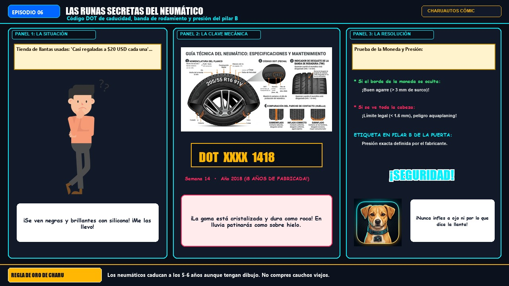

# Episodio 06 — Las Runas Secretas del Neumático
### Las Aventuras de Charu • Módulo 06 Adaptado a Historieta

---

*Viñeta Principal: Charu con lupa descifrando las inscripciones del flanco de la llanta y realizando la prueba de la moneda.*

---

### [ESCENA: Frente a una tienda de llantas usadas de ocasión]

**[CARTUCHO DEL NARRADOR]:**
> Álex quería ahorrar y vio un letrero: *"Llantas seminuevas casi regaladas: $20 USD cada una"*. Se veían negras y brillantes.

**VIÑETA 1:**  
*Álex con la billetera abierta a punto de pagarle al vendedor de la tienda.*  
- **Álex:** — ¡Mira esta ganga, Charu! Tienen mucho dibujo y están lustradas con silicona.  
- **Charu (saltando al flanco del neumático con linterna UV):** — ¡Frena esa billetera, Álex! La silicona maquilla a los muertos. Vamos a leer **EL CÓDIGO DOT**.

**VIÑETA 2:**  
*Primer plano macro al código ovalado en el caucho: `DOT 1417`.*  
- **Charu:** — Mira los últimos cuatro dígitos:  
  - Los primeros dos números (`14`) indican la **semana del año**.  
  - Los últimos dos números (`17`) indican el **año de fabricación: ¡2017!**  
  - ¡Esta llanta tiene casi 10 años de fabricada! La goma está cristalizada como el plástico duro. En una frenada de lluvia patinarás como sobre hielo.  
- **Álex (boquiabierto):** — ¡¿Las llantas tienen fecha de caducidad como la leche?!

**VIÑETA 3:**  
*Charu saca una moneda y la introduce de cabeza en los surcos de rodamiento:*  
- **Charu:** — ¡Por supuesto! A los 5 años la goma pierde agarre y a los 6 se descarta aunque tenga dibujo. Y para medir el desgaste en tus llantas actuales, usa **la prueba de la moneda**:  
  - Si el dibujo tapa el borde exterior de la moneda, tienes más de 3 mm de vida.  
  - Si se ve toda la cabeza, tienes menos de 1.6 mm: estás en el límite legal de infracción y riesgo inminente de *aquaplaning*.

**VIÑETA 4:**  
*Álex revisa la etiqueta plateada en el marco de la puerta del conductor (Pilar B):*  
- **Álex:** — ¡Y aquí en la puerta dice la presión exacta: 32 PSI adelante y 30 PSI atrás! El vendedor me decía que le metiera 45 PSI a ojo...  
- **Charu:** — ¡Jamás infles según lo que dice el costado de la llanta (esa es la presión máxima de ruptura)! La presión real la define el peso de tu carrocería en la puerta.

---

💡 **[LA REGLA DE ORO DE CHARU]:**  
*"Neumáticos con 25% menos de presión triplican el riesgo de siniestro y aumentan el consumo de gasolina en un 10%. Revísalos cada 15 días."*
