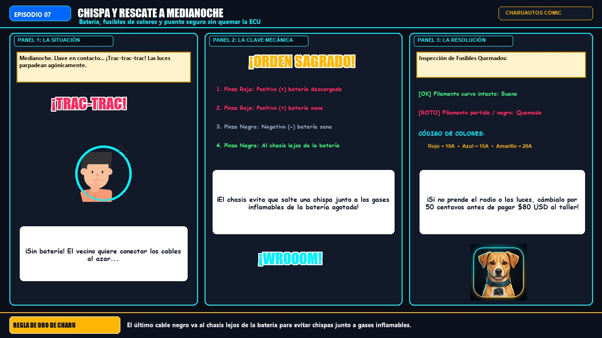

# Episodio 07 — Chispa y Rescate a Medianoche
### Las Aventuras de Charu • Módulo 07 Adaptado a Historieta

---

*Viñeta Principal: Medianoche en ruta; Charu supervisa la conexión exacta de cables pasa-corriente para salvar la computadora del auto.*

---

### [ESCENA: Estacionamiento oscuro a medianoche, lluvia ligera]

**[CARTUCHO DEL NARRADOR]:**
> Medianoche. Álex gira la llave de su auto y solo escucha un triste y agónico: *¡Trac-trac-trac!* Las luces parpadean como velas muriéndose.

**VIÑETA 1:**  
*Álex desesperado golpeando el volante.*  
- **Álex:** — ¡No arranca! ¡Me quedé sin batería a medianoche!  
- **Vecino servicial con cables enredados:** — ¡Tranquilo amigo! Ponemos mi camioneta frente a tu auto, pegamos los bornes como caigan y le damos arranque con furia.  
- **Charu (saliendo de la oscuridad como un ninja):** — ¡¡ALTO AHÍ VECINO!! Si conectan los cables al azar van a generar un pico de tensión inversa y quemarán la computadora (ECU) de $1.200 USD de ambos autos.

**VIÑETA 2:**  
*Charu despliega el diagrama de conexión con cables luminosos:*  
- **Charu:** — Grábense a fuego el **ORDEN MILITAR DEL PUENTE DE BATERÍA**:  
  1. 🔴 **Pinza Roja:** Al borne **POSITIVO (+)** de la batería descargada de Álex.  
  2. 🔴 **Pinza Roja:** Al borne **POSITIVO (+)** de la batería sana del vecino.  
  3. ⚫ **Pinza Negra:** Al borne **NEGATIVO (-)** de la batería sana del vecino.  
  4. ⚫ **Pinza Negra (CRÍTICO):** A un metal sin pintar del chasis o motor de Álex, **LEJOS DE LA BATERÍA**.  
- **Álex:** — ¿Por qué no al borne negativo de mi batería?  
- **Charu:** — Porque al hacer contacto salta una chispa, y las baterías agotadas emiten gas hidrógeno inflamable. ¡No queremos fuegos artificiales!

**VIÑETA 3:**  
*Encienden el motor de auxilio 3 minutos, luego Álex da arranque a su auto:*  
- **[ONOMATOPEYA]:** *¡WRRRR-ROOOOOM!* El motor arranca al primer toque.  
- **Álex:** — ¡Revivió! ¡Eres un genio, Charu!

**VIÑETA 4:**  
*Charu le muestra una cajita plástica transparente con fusibles de colores:*  
- **Charu:** — Y si algún día no encienden las luces o el radio, antes de pagar $80 USD en un taller eléctrico, abre la caja de fusibles. Si el filamento curvo de metal en el medio está partido o ennegrecido, cámbialo por otro del **mismo color y amperaje exacto** (Rojo=10A, Azul=15A, Amarillo=20A). ¡Cuesta 50 centavos de dólar!

---

💡 **[LA REGLA DE ORO DE CHARU]:**  
*"Nunca reemplaces un fusible quemado con un alambre, papel aluminio o un fusible de mayor amperaje. El fusible es el cinturón de seguridad de los cables; si lo anulas, se quemará la instalación del auto."*
