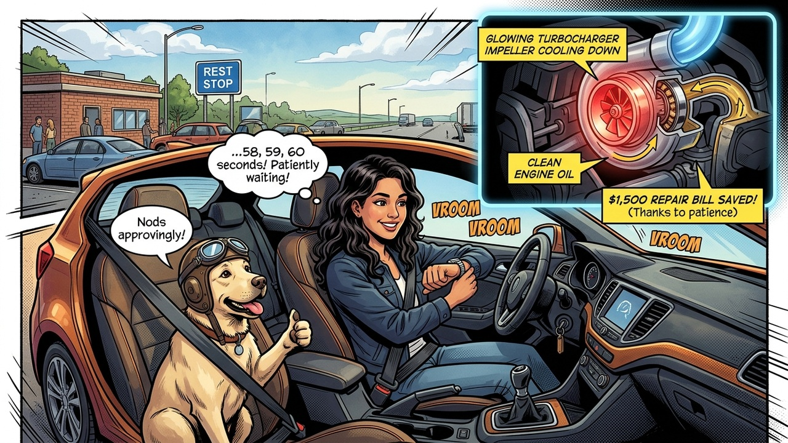

# Episodio 09 — El Caracol de las 200.000 RPM
### Las Aventuras de Charu • Módulo 09 Adaptado a Historieta

---

*Turbocompresor, mitos de enfriamiento y la Regla de los 60 Segundos*

---

### [ESCENA: Estación de servicio al borde de una autopista rápida. Sofía se estaciona tras manejar 2 horas a 120 km/h y se prepara para apagar el motor de inmediato.]

**[CARTUCHO DEL NARRADOR]:**
> El motor turboalimentado de Sofía acaba de trabajar a fondo. El turbocompresor se encuentra al rojo vivo bajo el aislante térmico.

**Sofía (Conductora Principiante)** `⏱️ Apuro Cotidiano`:
*con la mano en la llave lista para girarla y bajarse a comprar un café*
> "¡Uff, qué buen ritmo traíamos en la pista! Voy a apagar rápido para ir al baño..."

**Charu (Piloto y Mentor)** `🛑 ¡60 SEGUNDOS SAGRADOS!`:
*poniendo su pata sobre la mano de Sofía en la llave*
> "¡¡SOFÍA, ESPERA UN MINUTO!! Tu auto tiene motor turbo. Esa turbina gira a más de 200.000 revoluciones por minuto empujada por gases de escape que rozan los 900°C. Flota sobre una microscópica película de aceite a presión."

**Charu (Piloto y Mentor)** `🔥 La Ciencia de la Fricción`:
*mostrando un gráfico térmico de carbonización de aceite*
> "Si cortas el motor de golpe, la bomba de aceite se detiene al instante. El aceite estancado en el eje hirviendo se cocina y se convierte en coque (carbón abrasivo). ¡Esa lija destruye el turbo de $1.500 USD en pocos meses!"

💥 **[EFECTO SONORO VISUAL]:** *¡TIC... TAC... 60s!* (60 segundos al ralentí bajan la temperatura interna 300 grados)

**Sofía (Conductora Principiante)** `😌 Paciencia de Oro`:
*mirando tranquilamente su reloj de pulsera mientras el motor descansa en marcha mínima*
> "58... 59... ¡60 segundos! Es fascinante pensar que 60 segundos de paciencia protegen una pieza de más de mil quinientos dólares. ¡De ahora en adelante siempre le daré su minuto de respiro!"

---

💡 **[LA REGLA DE ORO DE CHARU]:**
> *"Tras una exigencia en autopista o subida pronunciada, deja el motor turbo al ralentí durante 60 segundos antes de girar la llave de apagado."*
