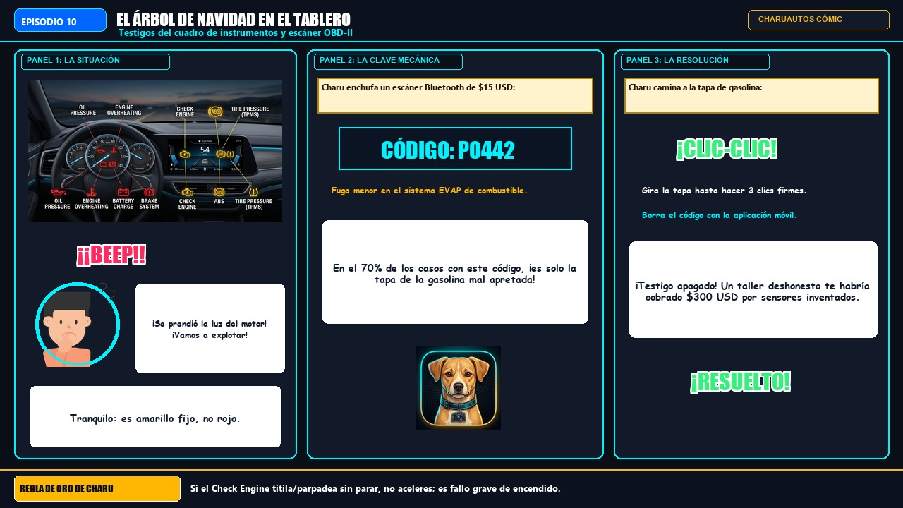

# Episodio 10 — El Árbol de Navidad en el Tablero
### Las Aventuras de Charu • Módulo 10 Adaptado a Historieta

---

*Viñeta Principal: El tablero de Álex iluminado; Charu conecta el escáner OBD-II y descifra el misterio del Check Engine.*

---

### [ESCENA: Tráfico de la tarde, dentro del auto]

**[CARTUCHO DEL NARRADOR]:**
> De repente, sonó un *¡BEEP!* agudo. Un icono con forma de pequeño motor amarillo se encendió fijamente en el tablero: el temido **CHECK ENGINE**.

**VIÑETA 1:**  
*Álex entra en pánico mirando el tablero como si fuera a explotar:*  
- **Álex:** — ¡¡SE PRENDIÓ EL CHECK ENGINE!! ¡Se rompió el motor! ¡Vamos a explotar en medio del tráfico!  
- **Charu (riendo con tranquilidad):** — ¡Cálmate, Álex! Respira hondo y mira el color del testigo. ¿Es rojo o es amarillo?  
- **Álex:** — Es... amarillo fijo.

**VIÑETA 2:**  
*Charu muestra la infografía del Semáforo Universal ISO:*  
- **Charu:** — Recuerda la **REGLA DEL SEMÁFORO**:  
  - 🔴 **ROJO (Peligro crítico):** Presión de aceite baja, temperatura hirviendo o fallo de frenos. *¡Detén el auto a la orilla de inmediato y apaga el motor!*  
  - 🟡 **AMARILLO / ÁMBAR (Precaución preventiva):** Check Engine, ABS, presión de llantas. *El auto funciona, pero la computadora detectó una anomalía. Puedes seguir conduciendo con suavidad hasta revisar.*  
  - 🟢 / 🔵 **VERDE / AZUL (Informativo):** Luces altas, direccionales encendidas.

**VIÑETA 3:**  
*Charu saca un pequeño conector Bluetooth de $15 USD y lo enchufa bajo el volante:*  
- **Charu:** — Todos los autos desde 1996 tienen este puerto trapezoidal de 16 pines: el **conector OBD-II**. Conectamos este escáner barato y leemos el código en el celular...  
- **[CELULAR DE ÁLEX]:** *Código P0442 — Fuga menor en el sistema EVAP de gases.*  
- **Álex:** — ¿Fuga del sistema EVAP? ¿Eso qué significa?

**VIÑETA 4:**  
*Charu se baja, camina a la tapa de gasolina, la gira y hace ¡CLIC! tres veces con fuerza:*  
- **Charu:** — ¡Significa que en la gasolinera cerraron la tapa de combustible floja y se escapaban vapores! Apretamos la tapa, borramos el código con la app y... ¡testigo apagado!  
- **Álex:** — ¡No me lo puedo creer! En un taller deshonesto me habrían cobrado $300 USD diciendo que cambiaron tres sensores.

---

💡 **[LA REGLA DE ORO DE CHARU]:**  
*"Si el Check Engine parpadea (titila) como loco en vez de quedarse fijo, significa fallo grave de encendido que puede destruir el catalizador. En ese caso no aceleres y detente pronto."*
