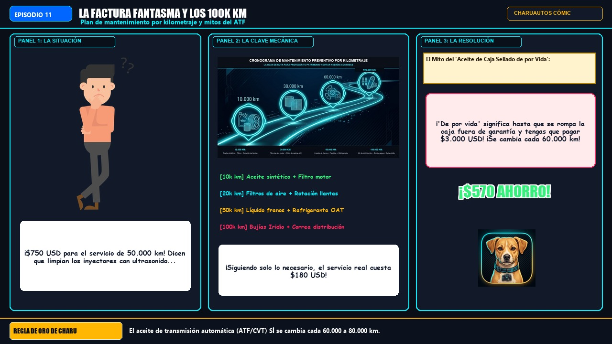

# Episodio 11 — La Factura Fantasma y los 100k km
### Las Aventuras de Charu • Módulo 11 Adaptado a Historieta

---

*Viñeta Principal: Charu desenrolla el mapa de ruta de los 10k a los 100k km desmantelando los costos inflados y mitos de taller.*

---

### [ESCENA: Mesa de la cocina de Álex, revisando facturas]

**[CARTUCHO DEL NARRADOR]:**
> El odómetro de Álex marcaba 49.800 km. Un amigo le dijo: *"Prepárate, el servicio de los 50.000 km te va a costar un riñón y medio"*.

**VIÑETA 1:**  
*Álex con calculadora en mano sacando cuentas con cara de terror.*  
- **Álex:** — Charu, me pasaron una cotización de $750 USD para el mantenimiento de los 50.000 km. Dicen que incluye 'limpieza de inyectores por ultrasonido', 'aditivo antifricción espacial' y 'alineación de antena'...  
- **Charu (tachando la hoja con un marcador rojo furioso):** — ¡Pamplinas y fantasías de taller para engordar facturas!

**VIÑETA 2:**  
*Charu despliega el auténtico mapa cronológico de kilometraje:*  
- **Charu:** — Este es el **MAPA REAL DE SERVICIOS POR KILOMETRAJE**:  
  - 🟢 **Cada 10.000 km:** Aceite sintético 100% + Filtro de aceite + Inspección 360°.  
  - 🔵 **Cada 20.000 km:** Filtro de aire de motor + Filtro de cabina + Rotación de llantas.  
  - 🟡 **Cada 40.000 - 50.000 km:** Líquido de frenos (absorbe humedad) + Refrigerante de motor + Pastillas de freno (según desgaste).  
  - 🔴 **Cada 80.000 - 100.000 km:** Cambio de bujías de Iridio + **Fluido de transmisión (ATF/CVT)** + Correa de distribución (si usa banda y no cadena).

**VIÑETA 3:**  
*Álex señala un apartado con signo de interrogación:*  
- **Álex:** — Pero en la concesionaria me dijeron que el aceite de mi caja de cambios es 'sellado de por vida' y nunca se cambia...  
- **Charu:** — ¡La mentira más destructiva de la industria automotriz! Las cajas de cambio operan bajo fricción y calor infernal. El aceite pierde viscosidad. 'De por vida' solo significa 'hasta que se rompa la caja fuera de garantía y tengas que pagar $3.000 USD por una nueva'. ¡Se cambia cada 60.000 a 80.000 km!

**VIÑETA 4:**  
*Álex reescribe el presupuesto real:*  
- **Álex:** — Cotizando solo lo que realmente necesita el manual del fabricante, el servicio de 50k km me sale en $180 USD con repuestos de primera calidad.  
- **Charu:** — ¡Ahorro neto de casi $600 USD con un solo golpe de criterio!

---

💡 **[LA REGLA DE ORO DE CHARU]:**  
*"Llevar tu propio aceite sintético con la certificación exacta (API SP / ILSAC GF-6) y filtros de marca reconocida al taller ahorra hasta un 40% en sobreprecios de lubricantes."*
