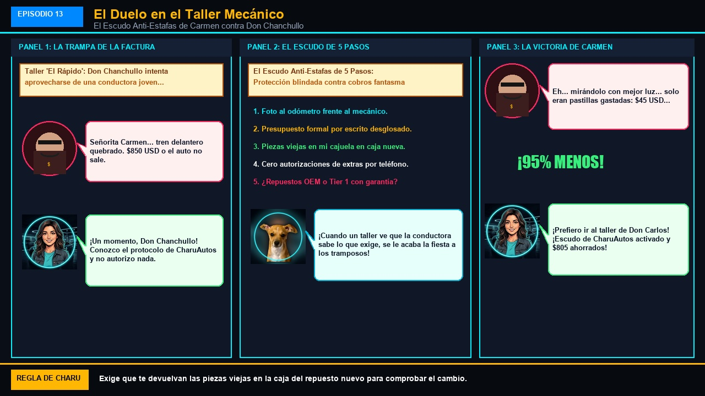

# Episodio 13 — El Duelo en el Taller Mecánico
### Las Aventuras de Charu • Módulo 13 Adaptado a Historieta

---

*El Escudo Anti-Estafas y el Protocolo de 5 Pasos de Carmen*

---

### [ESCENA: Taller desordenado 'El Tornillo Loco'. Don Chanchullo frota sus manos mientras contempla a Carmen llegar con su vehículo para un simple cambio de pastillas de freno.]

**[CARTUCHO DEL NARRADOR]:**
> Don Chanchullo pone cara de preocupación fingida y sale del foso con una libreta grasienta.

**Don Chanchullo (El Taller Sospechoso)** `😈 El Cuento del Tío`:
*meneando la cabeza con gesto de tragedia exagerada*
> "Uy, señorita... qué suerte tuvo de llegar viva. El tren delantero está destrozado, los amortiguadores reventados y la cremallera quebrada. Son $850 dólares o el auto no puede rodar ni una cuadra..."

**Carmen (Conductora Principiante)** `🛡️ ¡ESCUDO ACTIVADO!`:
*cruzando los brazos con mirada serena, firme e inquebrantable*
> "Un momento, Don Chanchullo. Vamos a aplicar el Escudo de CharuAutos: 1. Le tomé foto al odómetro frente a usted. 2. Exijo presupuesto por escrito desglosando repuesto y mano de obra. 3. No autorizo extras por teléfono. 4. Las piezas viejas me las entrega en mi cajuela en las cajas nuevas. 5. ¿Sus repuestos son OEM o Tier 1 con garantía certificada?"

**Don Chanchullo (El Taller Sospechoso)** `😰 ¡Descubierto In Fraganti!`:
*tragando saliva y guardando apresuradamente la libreta grasienta*
> "Eh... bueno... ejem... mirándolo bien con mejor iluminación... el tren delantero está en perfecto estado. En realidad solo eran las pastillas de freno delanteras gastadas por $45 USD..."

💥 **[EFECTO SONORO VISUAL]:** *¡ESCUDO: 95% DESCUENTO!* (La factura se redujo de $850 a $45 USD en 30 segundos)

**Charu (Piloto y Mentor)** `🏆 ¡Jaquel Mate!`:
*haciendo una reverencia con su casco de carreras*
> "¡Cuando un mecánico abusivo se da cuenta de que la conductora tiene conocimiento, exige comprobantes y no firma cheques en blanco, se le acaba el negocio del engaño!"

---

💡 **[LA REGLA DE ORO DE CHARU]:**
> *"Exige siempre que te devuelvan las piezas viejas sustituidas dentro de las cajas de los repuestos nuevos para verificar que realmente las cambiaron."*
