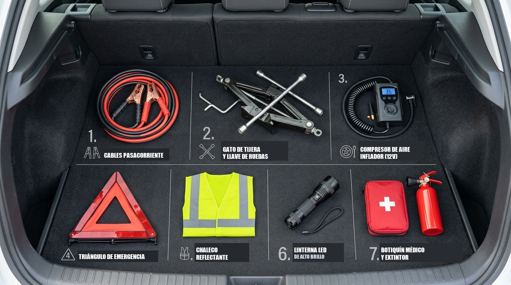

# Módulo 03 — Herramientas Básicas y Kit de Emergencia
### Manual del Conductor Inteligente • Edición Cero Conocimientos
*Por CharuAutos (@charuautopics) — "Pasión Automotriz al Alcance de tus Manos"*

---

## 🧰 1. El Kit del Principiante Inteligente (Menos de $40 USD)

No necesitas gastar cientos de dólares en cajas de herramientas profesionales. Como conductor precavido, solo requieres 6 elementos esenciales que caben en una pequeña bolsa bajo el asiento:

```text
┌──────────────────────────────────────┬───────────────┬───────────────────────────┐
│ HERRAMIENTA RECOMENDADA              │ COSTO ESTIMADO│ UTILIDAD CLAVE            │
├──────────────────────────────────────┼───────────────┼───────────────────────────┤
│ 1. Calibrador Digital de Neumáticos  │ $8 - $12 USD  │ Medir presión en frío     │
│ 2. Linterna Frontal LED (manos libres)│ $7 - $10 USD │ Iluminar sin ocupar manos │
│ 3. Juego de Cables de Puente (4 AWG) │ $15 - $22 USD │ Arrancar batería muerta   │
│ 4. Guantes de Trabajo Nitrilo / Piel │ $4 - $6 USD   │ Proteger de calor y grasa │
│ 5. Paño de Microfibra y Toallitas    │ $3 - $5 USD   │ Limpiar varilla y manos   │
│ 6. Llave Telescópica para Ruedas     │ $12 - $16 USD │ Palanca extra p/ tuercas  │
└──────────────────────────────────────┴───────────────┴───────────────────────────┘
```

> [!TIP]
> **El Secreto de la Llave Telescópica:** La llave pequeña en forma de "L" que traen los autos de fábrica es corta y requiere que hagas una fuerza sobrehumana para aflojar tuercas apretadas con pistola neumática en talleres. Una llave telescópica extensible duplica tu brazo de palanca: **con la mitad de esfuerzo aflojas cualquier tuerca fácilmente**.

---

## 🎒 2. El Kit Obligatorio de Supervivencia en la Cajuela

En la mayoría de los países de habla hispana, estos elementos son obligatorios por ley de tránsito y te salvarán la vida ante una avería en autopista:

1. **Triángulos de Señalización Reflectivos (2 unidades):**  
   - Se colocan a **50 metros detrás del auto** en carretera convencional y a **100 metros en autopista** para avisar a los autos que vienen a 120 km/h.
2. **Chaleco Reflectante de Alta Visibilidad:**  
   - **Guárdalo dentro de la guantera o bajo el asiento del piloto**, NUNCA en la cajuela. Si te bajas del auto en una noche oscura sin el chaleco puesto, corres riesgo de atropellamiento.
3. **Mini Compresor Eléctrico Portátil (12V para encendedor):**  
   - Cuesta entre $20 y $30 USD y te permite inflar una llanta desinflada en 4 minutos sin tener que desmontarla en un lugar peligroso.
4. **Botiquín de Primeros Auxilios:**  
   - Gasas estériles, vendas, alcohol, cinta médica, tijeras y analgésicos básicos.
5. **Extintor Automotriz de Polvo Químico Seco (Tipo ABC):**  
   - Verifica que el manómetro esté en la zona verde y no vencido.

---

## ❌ Qué Cosas NO Vale la Pena Comprar al Inicio
- **Juegos de 150 llaves y copas:** Ocupan espacio, pesan 15 kg y el 90% de las medidas jamás las usarás.
- **Líquidos "milagrosos" para tapar fugas de radiador:** Contienen partículas que taponan los conductos microscópicos del calefactor de cabina y causan averías de cientos de dólares.
- **Herramientas de marcas ultra baratas sin certificar:** Se doblan en el primer intento y redondean las tuercas dejándote atrapado.


---

## 🎒 Resumen Visual: El Kit de Emergencia Completo en tu Cajuela


*Elementos Reglamentarios y Esenciales para Conducir con Tranquilidad en Ciudad y Carretera*
