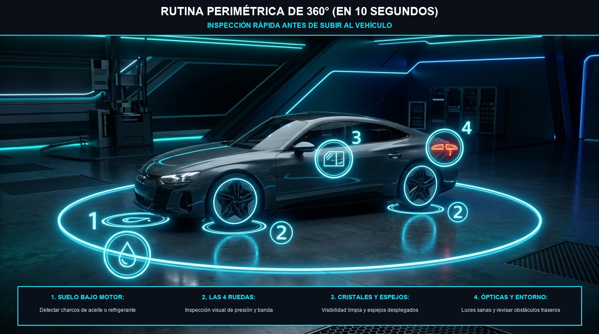

# Módulo 04 — Rutinas de Revisión en 5 Minutos (Diaria, Semanal y Mensual)
### Manual del Conductor Inteligente • Edición Cero Conocimientos
*Por CharuAutos (@charuautopics) — "Pasión Automotriz al Alcance de tus Manos"*

---

## ⏱️ 1. La Filosofía del Mantenimiento Predictivo

El 80% de las averías catastróficas (motor fundido, caja rota o radiador estallado) **empiezan semanas antes como una fuga silenciosa o un nivel bajo** que pudo detectarse con una mirada de 30 segundos.

Crear hábitos preventivos es la diferencia entre gastar $15 USD en un litro de aceite a tiempo o gastar $2.500 USD en rectificar un motor arruinado.

---

## 🚶 2. El Chequeo Visual Diario (30 Segundos al Acercarte al Auto)

Cada mañana antes de subirte al vehículo, haz una inspección rápida en 3 pasos:

*Fotografía e Ilustración: Protocolo visual perimétrico de 4 puntos para realizar en 10 segundos antes de encender el motor.*

- **Paso 1: Suelo bajo el motor.** ¿Hay charcos negros (aceite), rosados/verdes (coolant) o rojizos (caja)? *(Nota: agua clara e inodora es condensación normal del A/C).*
- **Paso 2: Las 4 ruedas.** Comprueba visualmente que ninguna llanta se vea visiblemente aplastada o desinflada.
- **Paso 3: Vidrios y retrovisores.** Parabrisas libre de excrementos de aves, nieve, ramas o suciedad que reste visibilidad.
- **Paso 4: Entorno y carrocería.** Asegúrate de que no haya mascotas, juguetes o pilotes ocultos detrás de la trayectoria de salida.

---

## 🗓️ 3. La Rutina Semanal de 5 Minutos (Día Sábado o Domingo)

Con el auto estacionado en un lugar plano y el motor **frío y apagado**:

### 1. Nivel de Aceite de Motor
- Saca la varilla amarilla/naranja.
- Límpiala con un papel o toalla de microfibra.
- Insértala de nuevo hasta el fondo.
- Retírala y observa: el aceite debe estar **entre los orificios o marcas MIN y MAX**.
- *Si está cerca del MIN:* Agrega de 0.5 a 1 litro del aceite de la misma viscosidad recomendada en tu manual.

### 2. Nivel de Líquido Refrigerante / Coolant
- Mira el envase plástico translúcido al lado del radiador.
- Sin abrirlo, confirma que el nivel esté entre las marcas **COLD / MIN** y **FULL / MAX**.

### 3. Líquido Limpiaparabrisas
- Abre la tapa azul y rellena con líquido lavaparabrisas formulado (evita agua del grifo sola porque crea hongos y sarro que obstruyen los aspersores).

---

## 📆 4. La Rutina Mensual de 10 Minutos (El Primer Fin de Semana de Cada Mes)

| Componente | Qué Comprobar | Acción Preventiva |
| :--- | :--- | :--- |
| **Presión de Neumáticos** | Medir con calibrador digital las 4 ruedas + la de repuesto. | Inflar a las PSI indicadas en la etiqueta de la puerta del conductor. |
| **Líquido de Frenos** | Nivel visible a través del envase transparente cerca de la pared de fuego. | Si bajó del MIN, no solo rellenes: ¡revisa desgaste de pastillas! |
| **Batería y Bornes** | Inspeccionar si hay corrosión blanca/azulada en los postes. | Limpiar con agua caliente y bicarbonato usando un cepillo viejo. |
| **Luces Exteriores** | Encender bajas, altas, intermitentes, reversa y freno. | Pídele a alguien que mire atrás o apóyate contra una pared para ver el reflejo. |
| **Escobillas Limpiaparabrisas** | Pasar un trapo húmedo por el filo de goma. | Si rechina, salta o deja rayas sobre el vidrio, cámbialas de inmediato. |
