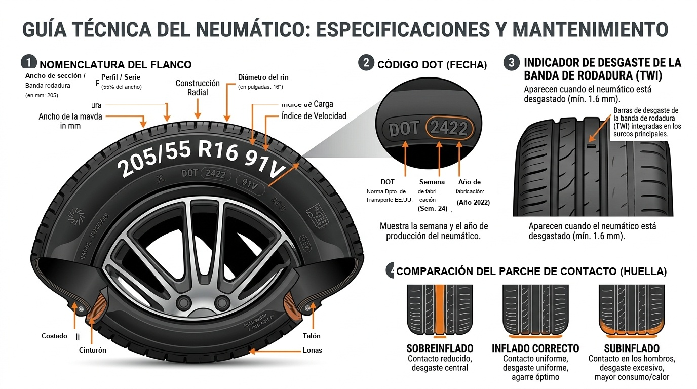

# Módulo 06 — Neumáticos, Frenos y Seguridad Activa
### Manual del Conductor Inteligente • Edición Cero Conocimientos
*Por CharuAutos (@charuautopics) — "Pasión Automotriz al Alcance de tus Manos"*

---

## 🛞 1. Los Neumáticos: Tus Únicos 4 Puntos de Contacto con la Tierra

Mucha gente cree que los frenos detienen el vehículo; en estricto rigor físico, **los frenos detienen las ruedas, pero los neumáticos detienen el auto**. El área total de contacto entre un automóvil moderno y el asfalto equivale aproximadamente al tamaño de cuatro postales de papel. De esa minúscula superficie dependen tu vida y la de tus acompañantes.

---

## 💨 2. Presión de Inflado en Frío: Dónde Encontrarla y Cómo Medirla

El error más común es leer la presión máxima grabada en el flanco del neumático (ej: `44 PSI MAX PRESS`). **Ese NO es el inflado de tu auto; es el límite de ruptura que soporta el neumático antes de reventar en fábrica.**

### Dónde está la etiqueta oficial de tu auto:
Abre la puerta del conductor y mira el **pilar B** (el marco metálico donde traba la puerta). Allí encontrarás una placa metálica o pegatina con la presión exacta para tu modelo (expresada en PSI y BAR), distinguiendo entre carga normal y carga completa con equipaje.

```text
       PEGATINA TÍPICA EN EL MARCO DE LA PUERTA (PILAR B)
┌─────────────────────────────────────────────────────────────┐
│  TIRE AND LOADING INFORMATION / INFORMACIÓN DE NEUMÁTICOS   │
├───────────────────┬─────────────────────┬───────────────────┤
│  DIMENSIÓN RUEDA  │  DELANTERA (FRONT)  │  TRASERA (REAR)   │
├───────────────────┼─────────────────────┼───────────────────┤
│  205/55 R16 91V   │  32 PSI (2.2 BAR)   │  30 PSI (2.1 BAR) │
│  Con carga plena  │  35 PSI (2.4 BAR)   │  36 PSI (2.5 BAR) │
└───────────────────┴─────────────────────┴───────────────────┘
```

### ¿Qué significa medir "en frío"?:
Se considera en frío cuando el auto ha rodado **menos de 2 km** o ha estado estacionado durante al menos **2 horas**. Al rodar por autopista, la fricción calienta el aire interno y sube la presión de 3 a 5 PSI de forma natural; jamás desinfles un neumático caliente pensando que está sobreinflado.

---


*Infografía: Decodificación del Código DOT, Presión en Frío y Banda de Rodadura*

## 🪙 3. La Prueba de la Moneda y el Código de Antigüedad DOT

### A. La Prueba de la Moneda para Desgaste de Banda:
El límite legal mínimo en la mayoría de países es de **1.6 mm** de profundidad en los surcos principales, pero sobre asfalto mojado la distancia de frenado se duplica cuando el dibujo baja de **3.0 mm**.

1. Toma una moneda con borde visible (por ejemplo, una moneda de 1 Euro, de 10 pesos mexicanos o una moneda de 1 cuarto de dólar americano con la cabeza de Washington hacia abajo).
2. Introdúcela en las ranuras centrales de la banda de rodadura.
3. Si puedes ver la parte superior de la corona o el borde exterior completo sin que el surco lo cubra, el neumático ha perdido sus canales de evacuación hidrodinámica: **el riesgo de aquaplaning en lluvia es inminente**.

```text
     NEUMÁTICO SANO (> 3mm)            NEUMÁTICO PELIGROSO (< 1.6mm)
   ┌───┐    ┌───┐    ┌───┐            ┌───┐    ┌───┐    ┌───┐
   │   │    │   │    │   │            │   │    │   │    │   │
───┘   └────┘   └────┘   └───      ───┘   └────┘   └────┘   └───
  [ Surco Profundo: Desaloja ]       [ Surco Raso: Desliza en agua ]
```

### B. El Código DOT: La Fecha de Caducidad de la Goma:
Los neumáticos caducan por envejecimiento natural de los polímeros del caucho (se cristalizan y se vuelven rígidos como plástico), aunque nunca se hayan usado y tengan el dibujo intacto.
- Busca la palabra **DOT** en el flanco exterior y localiza un recuadro ovalado con **4 dígitos numéricos**:
  - Ejemplo: `DOT ... 2423`
  - **Primeros 2 dígitos (24):** Semana del año (Semana 24 = principios de Junio).
  - **Últimos 2 dígitos (23):** Año de fabricación (2023).
- **Regla de oro:** Neumáticos con más de **5 años** deben inspeccionarse minuciosamente por microfisuras; con más de **7 a 8 años**, deben reemplazarse por seguridad aunque tengan dibujo.

---

## 🔄 4. Rotación, Alineación y Balanceo

- **Rotación (cada 10.000 km):** Como las ruedas delanteras soportan el peso del motor, la dirección y el 70% de la frenada, se desgastan el doble de rápido que las traseras. Rotarlas de eje distribuye el desgaste de forma uniforme y alarga su vida útil un 40%.
- **Balanceo (Equilibrado):** Si el volante **tiembla o vibra rítmicamente** a velocidades de autopista (entre 90 y 120 km/h), las ruedas han perdido sus contrapesos de plomo.
- **Alineación:** Si sueltas el volante unos metros en una recta plana y el auto **se desvía bruscamente hacia la izquierda o derecha**, o si notas que las llantas se gastan más por el borde interno que por el externo, la geometría de la suspensión está descalibrada.

---

## 🛑 5. Inspección Visual de Pastillas y Discos de Freno

No necesitas desarmar la rueda para tener una estimación del estado de tus frenos en la mayoría de rines de aleación:

```text
┌─────────────────────────┬───────────────────────────┬────────────────────────────────┐
│ ELEMENTO                │ CONDICIÓN SALUDABLE       │ SEÑAL DE REEMPLAZO URGENTE     │
├─────────────────────────┼───────────────────────────┼────────────────────────────────┤
│ Grosor de Pastilla      │ 8 mm a 12 mm de material  │ Menos de 3 mm (Acudir a taller)│
│ Disco de Freno          │ Superficie lisa y pulida  │ Surcos profundos o reborde alto│
│ Sonido al Frenar        │ Silencio o leve fricción  │ Chirrido metálico chillón      │
│ Tacto en el Pedal       │ Firme y progresivo        │ Esponjoso o vibra fuertemente  │
└─────────────────────────┴───────────────────────────┴────────────────────────────────┘
```

> [!NOTE]
> ### 🎵 El Famoso "Chirrido de Chivato"
> Las pastillas de calidad incorporan una pequeña lengüeta de chapa metálica llamada avisador acústico. Cuando el material de fricción se desgasta hasta los 2.5 mm, esa chapita roza contra el disco produciendo un chillido agudo al frenar. No te asustes: es un diseño de ingeniería deliberado para avisarte antes de que el soporte de hierro dañe el disco.


---

## 🛑 Resumen Visual: Anatomía de Frenos y Suspensión


*Despiece de Cáliper, Pastillas, Disco Ventilado y Amortiguador*
