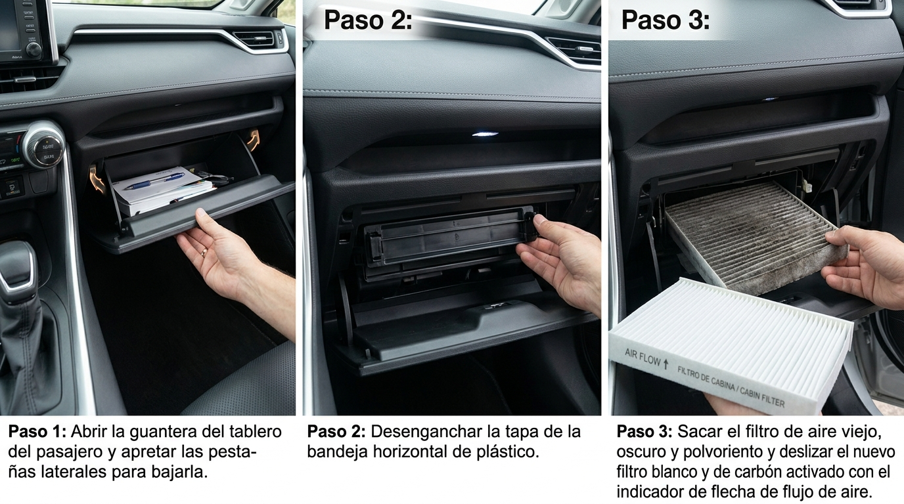
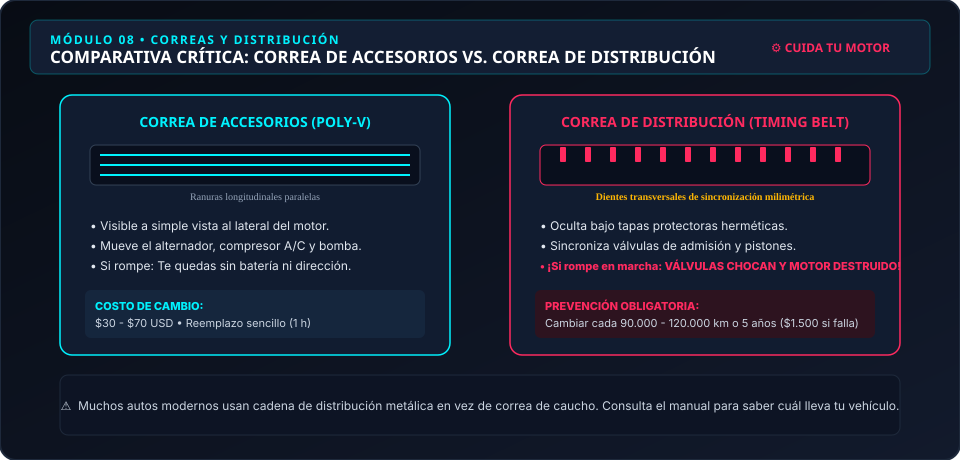

# Módulo 08 — Filtros, Bujías, Correas y Escobillas
### Manual del Conductor Inteligente • Edición Cero Conocimientos
*Por CharuAutos (@charuautopics) — "Pasión Automotriz al Alcance de tus Manos"*

---

## 🌬️ 1. Filtros de Aire: Los Pulmones del Auto y del Pasajero

### A. Filtro de Aire de Motor (Cambio DIY en 5 minutos):
Tu motor respira unos 10.000 litros de aire por cada litro de gasolina quemado. Si el filtro de aire está saturado de polvo e insectos, el motor trabaja forzado, pierde entre un 5% y 10% de potencia y aumenta el consumo de combustible.

- **Cómo cambiarlo:**
  1. Ubica la caja de plástico negra rectangular en el vano motor con una manguera gruesa que va hacia la admisión.
  2. Suelta las 2 a 4 grapas metálicas o retira un par de tornillos con destornillador de estrella.
  3. Levanta la tapa, extrae el filtro antiguo fijándote en su posición.
  4. Aspira o limpia con un paño húmedo el polvo suelto en el fondo de la caja plástica.
  5. Inserta el filtro nuevo y cierra las grapas asegurándote de que selle perfectamente alrededor del labio de goma.
- **La prueba de la linterna:** Pon una linterna por detrás del filtro. Si la luz no atraviesa el papel plisado, está saturado y debe reemplazarse.

### B. Filtro de Habitáculo / Cabina (El filtro antipolen):

*Procedimiento Visual: Extracción de Guantera y Sustitución del Filtro Antipolen en 5 Minutos*
Purifica el aire que tú y tu familia respiran por las rejillas del aire acondicionado.
- **Síntomas de cambio:** Olor a humedad o "calcetín sucio" al encender el aire, y vidrios que se empañan constantemente en invierno sin poder desempañarse con rapidez.
- **Ubicación típica:** En el 80% de los autos modernos se encuentra detrás de la guantera del copiloto (se sueltan dos topes plásticos laterales sin herramientas) o en la base exterior del parabrisas.
- **Atención a la flecha:** El filtro tiene grabada una flecha con las palabras `AIR FLOW ⬇️`. Debe apuntar siempre en la dirección hacia donde viaja el aire (suele ser hacia el suelo del habitáculo).

---

## ⚡ 2. Bujías: La Chispa de la Vida

En los motores de gasolina, la bujía genera el arco voltaico de más de 20.000 voltios que inflama la mezcla aire-combustible.

| Tipo de Bujía | Material del Electrodo | Intervalo Típico de Reemplazo | Rendimiento |
| :--- | :--- | :---: | :--- |
| **Cobre / Estándar** | Núcleo de cobre tradicional | 20.000 a 30.000 km | Tradicional, económico |
| **Platino (Single/Double)** | Pastilla de platino soldado | 60.000 a 80.000 km | Alta durabilidad y estabilidad |
| **Iridio (Iridium)** | Punta extrafina de iridio | 100.000 a 120.000 km | Máxima eficiencia de chispa |

### Lectura Rápida del Electrodo al Retirarlas:
- **Color café claro / gris tostado:** Combustión perfecta y motor en óptima salud.
- **Cubierta de hollín negro seco:** Mezcla excesivamente rica (demasiada gasolina o filtro de aire tapado).
- **Brillante o aceitosa:** Retenes de válvula o aros de pistón gastados que dejan pasar aceite a la cámara.
- **Electrodo derretido o blanco lechoso:** Mezcla excesivamente pobre o sobrecalentamiento severo.

---

## 🔄 3. Correas: La Diferencia Vital entre Accesorios y Distribución

Muchos conductores confunden las dos correas del motor. Conocer la diferencia te evitará perder miles de dólares:

*Ilustración técnica: Diferencias morfológicas y consecuencias de rotura entre correa Poly-V de accesorios y correa dentada de distribución.*

| Característica | Correa de Accesorios (Poly-V) | Correa de Distribución (Timing Belt) |
| :--- | :--- | :--- |
| **Visibilidad** | Visible a simple vista al lateral del motor | Oculta bajo tapas plásticas herméticas |
| **Morfología** | Ranuras longitudinales paralelas | Dientes de caucho transversales reforzados |
| **Función** | Mueve alternador, compresor A/C y bomba | Sincroniza el giro del cigüeñal con el árbol de levas |
| **Si se rompe** | Se apaga el alternador y se endurece la dirección | ¡Las válvulas chocan contra los pistones y destrozan el motor! |
| **Costo reparación** | $40 - $90 USD (cambio sencillo) | $1.500 - $3.000+ USD en rectificado y motor nuevo |

> [!CAUTION]
> ### 🛑 ¿Tu Auto Tiene Correa o Cadena de Distribución?
> - **Cadena metálica:** Bañada en aceite de motor. Suele durar la vida útil del vehículo (250.000+ km) y solo requiere inspección de tensores si empieza a sonar metálicamente al arrancar en frío.
> - **Correa de goma:** Se degrada con los años. **Debe reemplazarse estrictamente por tiempo o kilometraje** (típicamente cada 5 a 6 años o entre 60.000 y 100.000 km, lo que ocurra primero), aunque a simple vista se vea entera.

---

## 🌧️ 4. Escobillas Limpiaparabrisas: El Truco de la Toalla

Cambiar las plumillas o escobillas es una tarea de 3 minutos que te ahorra hasta $30 USD de mano de obra en talleres:

1. Levanta el brazo metálico del limpiaparabrisas hasta su posición de servicio vertical.
2. **El truco de la toalla (VITAL):** Coloca inmediatamente una toalla gruesa doblada sobre el parabrisas, directamente debajo del brazo levantado. Si mientras retiras la escobilla el brazo de acero accionado por resorte se te resbala de las manos, **impactará como un martillo contra el cristal y lo quebrará al instante**. La toalla absorberá el impacto.
3. Presiona la pestaña plástica de liberación central y desliza la escobilla desgastada hacia abajo.
4. Inserta la nueva escobilla en el gancho (generalmente tipo "J-Hook") hasta escuchar un "click" audible.
5. Retira la cubierta plástica protectora de la goma y apoya suavemente el brazo sobre el cristal.
