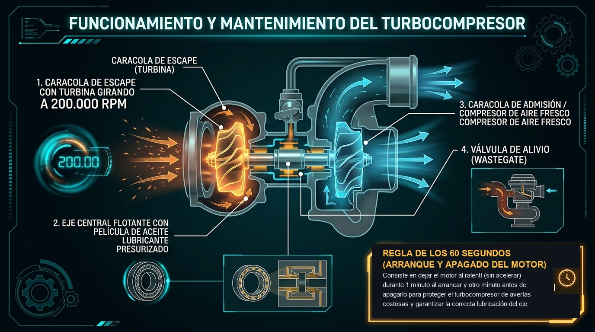
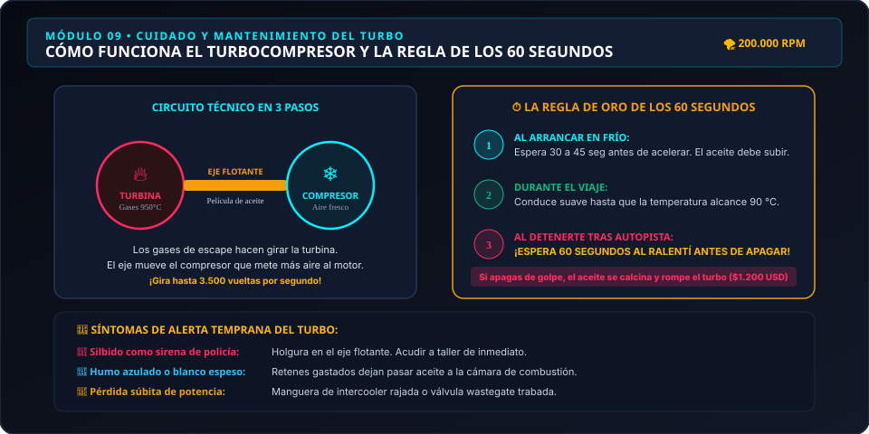

# Módulo 09 — El Turbocompresor: Cuidados Críticos y la Regla de los 60 Segundos
### Manual del Conductor Inteligente • Edición Cero Conocimientos
*Por CharuAutos (@charuautopics) — "Pasión Automotriz al Alcance de tus Manos"*

---

*Infografía Técnica: El Eje Flotante, Temperaturas Extremas y la Regla de Oro de los 60 Segundos*

---

## 🌪️ 1. ¿Qué es un Turbo y por qué tu Auto Probablemente Tiene Uno?

Si compraste un auto fabricado en los últimos 10 a 15 años, lo más seguro es que su motor sea turboalimentado (incluso en vehículos utilitarios compactos de 1.0 a 1.5 litros como EcoBoost, TSI, TCe, PureTech o diésel TDI/CRDi).

### La Explicación sin Jerga:
Imagina un **molino de viento diminuto de altísima precisión**. El turbo aprovecha los gases calientes que salen por el escape para hacer girar una turbina. Esa turbina mueve un compresor que **inyecta mucho más aire a presión dentro de los cilindros**. 
- **El resultado:** Un motor pequeño de 3 o 4 cilindros obtiene la potencia y aceleración de un motor grande de 6 cilindros, pero consumiendo mucho menos combustible cuando conduces suave.

*Ilustración técnica: Flujo de gases a 950 °C, eje flotante a 200.000 RPM y el protocolo de ralentí preventivo.*

---

## ⏱️ 2. La Regla de Oro: Los 60 Segundos que Salvan Miles de Dólares

El eje que une las dos turbinas del turbo gira a velocidades vertiginosas (entre **150.000 y 250.000 revoluciones por minuto**) y soporta temperaturas que superan los **850 °C a 1.000 °C**. 

A esa velocidad, ningún rodamiento de bolas convencional sobreviviría. El eje "flota" sobre una **micro-película de aceite de motor a presión** inyectada por la bomba de lubricación.

> [!CAUTION]
> ### 🛑 EL ERROR FATAL: APAGAR EL MOTOR DE GOLPE
> Cuando conduces por autopista a 120 km/h o subes una cuesta exigente, el turbo está al rojo vivo.  
> Si llegas a una estación de servicio o a tu casa y **apagas el motor de inmediato**, la bomba de aceite se detiene en seco.  
> El aceite que queda atrapado dentro del turbo quieto se "cocina" por el calor residual extremo (fenómeno de **carbonización / coquización**), convirtiéndose en carbón duro abrasivo.  
> Al día siguiente, cuando arranques, ese carbón rayará el eje y destruirá los sellos.  
> **Costo de reemplazar un turbo dañado: $800 a $2.500 USD.**

### 💡 El Protocolo de los 60 Segundos:
1. **Al arrancar por las mañanas:** Espera **30 a 60 segundos** en ralentí antes de iniciar la marcha para que la presión de aceite llegue al turbo. Conduce con suavidad los primeros 5 minutos sin pisar el acelerador a fondo.
2. **Al llegar a tu destino (especialmente tras autopista o viajes largos):** Permanece sentado con el motor en ralentí durante **60 segundos** antes de girar la llave para apagar. Ese minuto permite que el aceite siga fluyendo fresco, evacuando el calor extremo del turbo de forma progresiva.

---

## 🛢️ 3. El Aceite que Exige un Motor Turbo

Los motores turboalimentados no perdonan el uso de aceites baratos o minerales:
- **100% Sintético Obligatorio:** Requieren aceites formulados específicamente para resistir cizallamiento térmico extremo (normas **API SP**, **ILSAC GF-6** o **ACEA C2/C3**).
- **Protección contra LSPI (Preignición a Baja Velocidad):** En motores turbo de inyección directa de baja cilindrada (TGDI), el aceite incorrecto puede causar detonaciones destructivas espontáneas dentro del cilindro.
- **Respetar los Kilómetros:** Nunca extiendas el cambio de aceite más allá de los **10.000 km** o 1 año. En un motor turbo, el aceite viejo con hollín degrada directamente los sellos de la turbina.

---

## 👂 4. Síntomas de un Turbo en Problemas

Aprende a identificar las señales de fatiga antes de una rotura catastrófica:

| Síntoma Sensorial | Qué está Ocurriendo en el Turbo | Acción Recomendada |
| :--- | :--- | :--- |
| **🚓 Silbido como sirena de policía** al acelerar | Holgura excesiva en el eje flotante y roce de álabes | Acudir de inmediato al taller; el turbo está por romperse |
| **💨 Humo denso azulado o blanquecino** por el escape | Retenes de aceite quemados dejan filtrar fluido | Revisar nivel de aceite a diario y cambiar cartucho (CHRA) |
| **🐌 Pérdida súbita de aceleración ("Limp Mode")** | Manguera de intercooler rajada o válvula wastegate trabada | Inspeccionar abrazaderas, manguitos o válvula de descarga |
