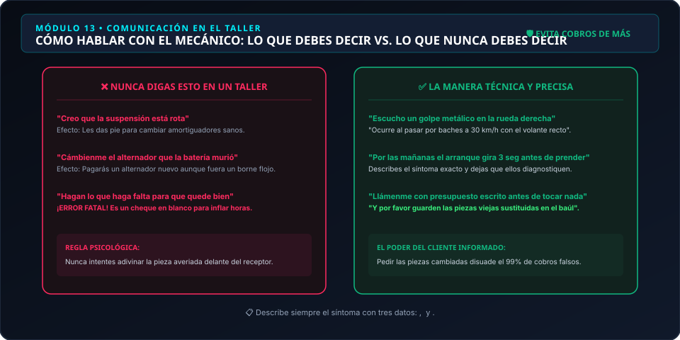
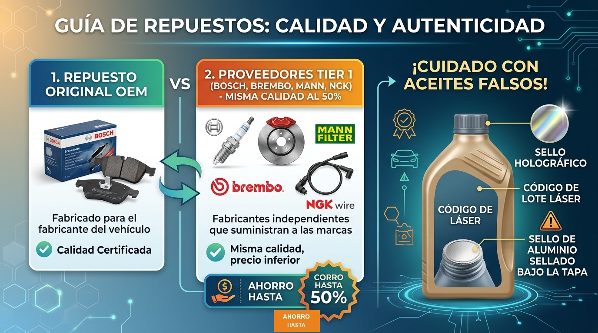
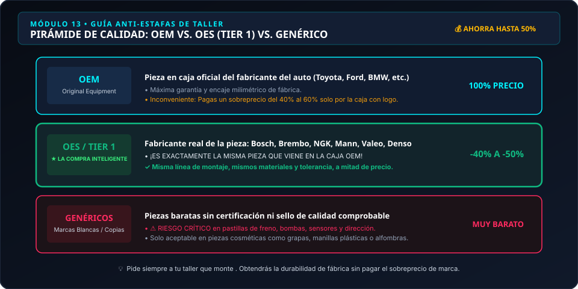

# Módulo 13 — Guía para ir al Taller sin Ser Estafado
### Manual del Conductor Inteligente • Edición Cero Conocimientos
*Por CharuAutos (@charuautopics) — "Pasión Automotriz al Alcance de tus Manos"*

---

## 🛡️ 1. El Escudo Protector del Conductor Inteligente

El miedo a ser estafado en un taller mecánico es una de las razones principales por las cuales muchos conductores postergan el mantenimiento preventivo. La asimetría de información juega a favor del mecánico inescrupuloso: él conoce el vocabulario técnico y tú no.

Este módulo te enseña las técnicas exactas de comunicación, documentación y verificación para negociar de igual a igual y evitar sobreprecios absurdos.

---

## 🗣️ 2. Cómo Explicar el Problema sin Parecer un Novato

### La Regla de Oro: Describe Síntomas Sensoriales, JAMÁS des Diagnósticos.
Cuando un conductor llega al taller diciendo: *"Creo que se rompió la transmisión automática"*, el mecánico deshonesto escucha: *"Esta persona está dispuesta a gastar $1.500 USD en una caja de cambios aunque solo sea un taco de motor de $40 USD"*.

*Ilustración técnica: Lo que nunca debes decir vs. la manera asertiva de reportar síntomas para evitar sobrecostos.*

| ❌ Lo que NUNCA debes decir | ✅ La Manera Correcta y Precisa |
| :--- | :--- |
| "Creo que la suspensión trasera está rota" | "Escucho un golpe metálico en la rueda trasera derecha al pasar por badenes a 30 km/h" |
| "Cámbienme el alternador que la batería murió" | "Por las mañanas el motor de arranque gira lento durante 3 segundos antes de encender" |
| "Hagan lo que haga falta para que quede bien" | "Revisen el origen del chirrido al frenar y llámenme con un presupuesto escrito detallado antes de comprar o cambiar cualquier pieza" |

---

## 📋 3. Las 4 Cláusulas Innegociables en Todo Presupuesto

Antes de entregar las llaves de tu vehículo en cualquier taller, haz respetar estas 4 condiciones:

### 1. Presupuesto Previo Escrito y Detallado:
El documento debe desglosar:
- Costo unitario de cada repuesto con marca y número de parte.
- Cantidad de horas estimadas de mano de obra y tarifa por hora.
- Impuestos aplicables.

### 2. Cláusula de Cero Sorpresas ("No Add-ons"):
Declara explícitamente: *"Cualquier avería imprevista o pieza adicional que descubran durante el trabajo debe ser aprobada por mí por escrito (WhatsApp o correo) con su costo correspondiente antes de proceder. No autorizo gastos no pactados"*.

### 3. Exigir las Piezas Viejas Sustituidas en una Caja:
Cuando te entreguen el auto reparado, pide ver las piezas usadas que cambiaron:
- Si cambiaron las pastillas de freno, deben entregarte las pastillas viejas en la caja del repuesto nuevo.
- Si cambiaron un termostato, la bomba de agua o un rodamiento, exige ver la pieza desgastada.  
*Esto elimina de raíz la vieja estafa de "cobrar por repuestos que nunca se cambiaron".*

### 4. Conocer las Categorías de Repuestos:

*Infografía: Distinción entre Embalaje Oficial OEM, Calidad de Primer Nivel Aftermarket y Copias Riesgosas*

*Ilustración técnica: Niveles de recambios, calidad real de fábrica y la oportunidad de ahorrar hasta un 50% con piezas OES.*

| Tipo de Repuesto | Qué es en Realidad | Recomendación CharuAutos |
| :--- | :--- | :--- |
| **OEM (Original de Fábrica)** | Caja oficial con el logo de la marca del auto | Calidad máxima pero con sobreprecio del 40-60% |
| **OES / Tier 1 (Bosch, Brembo, NGK, Mann)** | El fabricante real que surte las piezas al concesionario | **¡LA COMPRA INTELIGENTE!** Misma pieza que OEM a mitad de precio |
| **Genérico de Bajo Costo (Marca blanca)** | Copias baratas sin pruebas de fatiga certificadas | ⚠️ Peligro en frenos y suspensión; solo aceptable en plásticos |

---

## 🚩 4. Banderas Rojas (Red Flags) para Huir de un Taller

Huye si notas cualquiera de estos comportamientos:
- Se niegan a darte un presupuesto por escrito o solo te dicen cifras verbales vagas ("te costará unos $300 o más, ya veremos al abrir").
- Te presionan con pánico: *"Si sacas el auto hoy mismo de aquí, tus frenos van a explotar en la esquina y te vas a matar"*.
- Las instalaciones están en un caos absoluto, con charcos de aceite no recogidos y herramientas tiradas por el suelo.
- No te permiten ver las piezas que cambiaron argumentando que "ya las tiraron a la basura".

---

## 🛠️ Resumen Visual: Pasos del Conductor Inteligente en el Taller

*Protocolo de Recepción, Diagnóstico con Presupuesto Previo y Entrega con Piezas Viejas en Mano*
