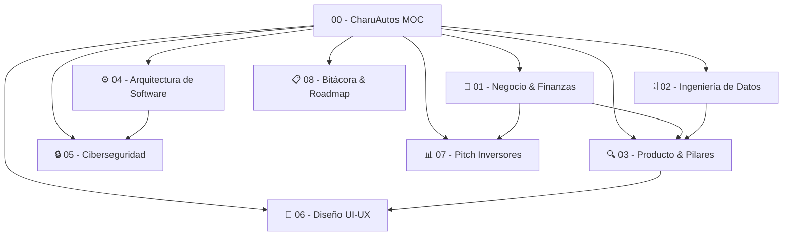

---
tags:
  - moc
  - index
  - charuautos
  - arquitectura
aliases:
  - Indice Maestro
  - Hub Central
---

# 🚗 CharuAutos App — Hub Maestro de Conocimiento (MOC)

Bienvenido al **Baúl de Obsidian Oficial** del ecosistema de **CharuAutos App**. Este entorno interconecta toda la documentación técnica, estratégica, de ingeniería de datos, ciberseguridad y presentación a inversores.

---

## 🗺️ Mapa de Contenidos Interconectados

---

### 📂 1. Negocio, Monetización y Mercado
- [[Modelo de Negocio Hibrido]]: Arquitectura de ingresos B2C Freemium y B2B Marketplace & Leads.
- [[Mercado Automotriz Venezuela]]: Análisis del parque automotor dual, crisis de combustible y pagos multimoneda.
- [[Unit Economics & Proyecciones]]: CAC ($0.80-$1.50), LTV ($14.50), ARPU y márgenes brutos.

### 📂 2. Ingeniería de Datos & Gobernanza
- [[Arquitectura Medallion Lakehouse]]: Capas Bronze, Silver y Gold para streaming y analítica.
- [[Master Data Management (MDM) Vehicular]]: Catálogo canónico con moteado y jerga popular venezolana.
- [[Data Quality & Great Expectations]]: Reglas de completitud, monotonicidad de odómetro y detección de data drift.
- [[RAG & Modelado Analitico pgvector]]: Almacén vectorial para diagnóstico en lenguaje natural.

### 📂 3. Especificación de Producto & Pilares
- [[Pilar 1 - Matchmaker Inteligente]]: Árbol de decisiones y algoritmo de compatibilidad (% de Match).
- [[Pilar 2 - Diagnostico OBD2 Manual]]: Semáforo de riesgo ISO y generador del Escudo Anti-Estafas.
- [[Pilar 3 - Cuaderno Dinamico & Health Score]]: Timeline de vida útil, Health Score y métricas $/km.
- [[Scraping & Parsing de Fichas Tecnicas PDF]]: Extracción heurística y regex de brochures comerciales.

### 📂 4. Arquitectura de Software & Stack
- [[Diagrama C4 & Microservicios]]: Contenedores, Local-First Reactive Sync y perimetría.
- [[Frontend React Native & NativeWind]]: Expo SDK 51, TypeScript y componentes móviles.
- [[Esquemas de Base de Datos PostgreSQL]]: DDL canónico, TimescaleDB y pgvector.

### 📂 5. Ciberseguridad, Implementación y Mantenimiento
- [[Modelo de Amenazas STRIDE]]: Identificación de vectores de ataque en el entorno automotriz.
- [[Cadena Criptografica Anti-Fraude Odomoetro]]: Hashing SHA-256 encadenado para kilometraje inalterable.
- [[Seguridad Movil OWASP & Zero Trust]]: SQLCipher, Keychain/Keystore y Certificate Pinning.
- [[Plan de Mantenimiento & Disaster Recovery]]: Estrategia de backup 3-2-1 y respuesta a incidentes.

### 📂 6. Diseño UI/UX
- [[Design Tokens Dark Showroom]]: Paleta institucional Obsidiana (`#070a0f`), Cyan (`#00f2fe`) y Ámbar (`#ffb703`).
- [[Wireflows & Microinteracciones]]: Time-to-Value < 45s y Modo Manos Sucias en autopista.

### 📂 7. Inversores & Pitch Deck
- [[Pitch Deck Maestro Inversores]]: Presentación ejecutiva de 11 diapositivas para comités de inversión.
- [[Tesis de Inversion & Moat]]: Análisis de foso defensivo, costo de cambio y tracción.

### 📂 8. Bitácora de Desarrollo
- [[Bitacora de Desarrollo Viva]]: Registro detallado de hitos cumplidos, estado en curso y roadmap restante.
