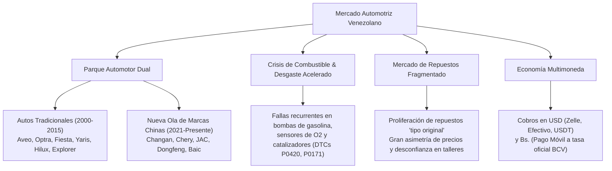
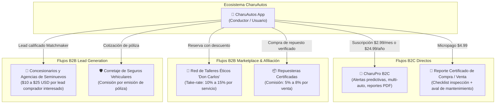

# Sección 01: Resumen Ejecutivo, Contexto de Mercado (Venezuela) y Modelo de Negocio Híbrido

---

## 1.1. Contexto de Mercado: La Realidad Automotriz en Venezuela

Para que **CharuAutos App** triunfe en el mercado venezolano, su diseño funcional y de negocio debe responder con precisión milimétrica a las anomalías y particularidades del parque automotor y la economía local:



### 1. El Fenómeno del Parque Automotor Dual
- **El Bloque Clásico (2000–2015):** Vehículos con 10 a 20 años de rodaje continuo. Modelos icónicos como Chevrolet Aveo, Optra, Spark, Silverado; Ford Fiesta, EcoSport, Explorer; Toyota Corolla, Yaris, Fortuner; Hyundai Getz y Renault Clio/Logan. Requieren mantenimiento preventivo constante y padecen de repuestos de calidad dudosa.
- **La Nueva Ola Asiática (2021–Presente):** Crecimiento exponencial de marcas chinas ensambladas o importadas (Changan, JAC, Chery, Dongfeng, Jetour, DFSK). Los compradores carecen de referencias históricas sobre durabilidad, reventa y disponibilidad de repuestos a largo plazo.
- **La Oportunidad CharuAutos:** El comprador venezolano vive en un dilema permanente: *“¿Compro un Toyota Corolla 2008 usado por $7,500 o un Changan Alsvin 0km financiado por $16,000?”*. Nuestro **Matchmaker** responde exactamente a este dolor sin sesgos de marca.

### 2. Calidad del Combustible y Patología Mecánica Local
- Las variaciones en el octanaje y la presencia de sedimentos o agua en los tanques subterráneos provocan una tasa desproporcionada de fallas en:
  - Bombas de combustible (pilas de gasolina) quemadas por recalentamiento o filtros saturados.
  - Inyectores obstruidos y mezcla pobre (Códigos `P0171`, `P0174`).
  - Falsas explosiones y misfires (Códigos `P0300`, `P0301`).
  - Degradación prematura de sensores de oxígeno y convertidores catalíticos (Código `P0420`).
- La app debe contextualizar los códigos OBD2 en función de la realidad del combustible venezolano.

### 3. Ecosistema de Pagos Multimoneda
- Cualquier sistema de monetización en Venezuela debe admitir:
  - **Pago Móvil y Transferencias Bancarias (VES):** Integrado con APIs bancarias locales a tasa BCV.
  - **Dólares en Efectivo / Depósitos Custodia.**
  - **Fintech / Criptoactivos:** Binance Pay (USDT), Zinli, Wally Tech, Pipol Pay o Zelle.

---

## 1.2. Misión, Visión y Propuesta de Valor Única (UVP)

- **Misión:** Empoderar a los conductores en Venezuela mediante inteligencia de datos, educación preventiva y herramientas transparentes para comprar, diagnosticar y mantener sus vehículos sin ser víctimas de engaños ni sobreprecios.
- **Visión:** Convertirse en la plataforma digital y pasaporte vehicular de referencia en Venezuela y el norte de Sudamérica, intermediando de forma ética la relación entre conductores, comercios de repuestos y talleres de servicio.
- **Propuesta de Valor Única (UVP):**
  > *"El copiloto digital que te dice con honestidad qué auto comprar para las calles de Venezuela, qué tiene tu carro cuando prende el Check Engine y cuánto deberías pagar realmente por arreglarlo."*

---

## 1.3. Buyer Personas Locales

```text
┌───────────────────────────────────┬───────────────────────────────────┬───────────────────────────────────┐
│ 1. El Comprador Indeciso          │ 2. La Conductora Protectora       │ 3. El Dueño de Micro-Flota        │
│ (Avatar: Daniel, 29 años)         │ (Avatar: Carmen, 35 años)         │ (Avatar: Roberto, 44 años)        │
├───────────────────────────────────┼───────────────────────────────────┼───────────────────────────────────┤
│ • Situación: Quiere comprar su    │ • Situación: Usa un sedán para    │ • Situación: Administra 4 vans de │
│   primer auto o renovar el que    │   trasladar a sus hijos y trabajo │   despacho o mototaxis/delivery.  │
│   tiene con $6,000 - $12,000 USD. │ • Dolor: Terror a quedarse varada │ • Dolor: Falta de control de gas- │
│ • Dolor: Miedo a comprar un "pote │   en la autopista y a que el      │   tos, mecánicos que facturan re- │
│   chocado" o un carro chino sin   │   mecánico le invente fallas caras│   puestos inexistentes.           │
│   repuestos en el país.           │ • Solución CharuAutos: Diagnósti- │ • Solución CharuAutos: Dashboard  │
│ • Solución CharuAutos: Matchmaker │   co OBD2 en español claro y      │   multi-vehículo con alertas de   │
│   conversacional y ficha técnica. │   Escudo Anti-Estafas.            │   kilometraje y costos $/km.      │
└───────────────────────────────────┴───────────────────────────────────┴───────────────────────────────────┘
```

---

## 1.4. Modelo de Negocio Híbrido Detallado

La estrategia de monetización combina flujos **B2C directos** con flujos **B2B transaccionales**:



### 1. Nivel B2C: Freemium + CharuPro
- **Capa Gratuita (Free Tier):**
  - Acceso completo al **Matchmaker de compra** (Hook de entrada viral).
  - 3 consultas mensuales de códigos OBD2 manuales.
  - Registro de 1 vehículo en el Cuaderno de Mantenimiento con métricas básicas.
- **Suscripción CharuPro ($2.99 USD/mes o $24.99 USD/año):**
  - Consultas OBD2 ilimitadas con árbol completo de causa-raíz y guía de preguntas para el taller.
  - Registro multi-vehículo (hasta 3 autos para familias).
  - Generador de **Certificado Digital de Mantenimiento** en PDF para aumentar el valor de reventa del auto.
  - Descuentos exclusivos del 10% en mano de obra en la Red de Talleres certificados.
- **Pasarelas de Pago Habilitadas:** Pago Móvil (a tasa BCV), Binance Pay (USDT), Zinli, Tarjetas internacionales.

### 2. Nivel B2B Marketplace: Red de Talleres y Repuesteras
- **Take-rate de Talleres (10% - 15%):** El usuario detecta la falla con el escáner manual y la app le sugiere: *"3 talleres de confianza cerca de ti en Caracas/Valencia que solucionan este código con precio de mano de obra cerrado"*. El taller paga una comisión por cliente efectivamente atendido.
- **Afiliación de Repuestos (5% - 8%):** Vinculación directa del código de falla con el repuesto exacto (ej. Código P0300 -> Juego de bujías y cables recomendados) disponible en repuesteras verificadas que garantizan piezas originales (no copias piratas).

### 3. Nivel B2B Lead Generation: Concesionarios y Seguros
- **Leads Calificados del Matchmaker:** Cuando un usuario finaliza la entrevista del Matchmaker y selecciona un modelo de su interés (ej. *Changan CS35*, *Toyota Yaris*, *JAC JS4*), se le ofrece: *“¿Deseas que un asesor oficial te agende una prueba de manejo o cotice el plan de financiamiento?”*. Ese lead perfilado con presupuesto y capacidad de pago se vende al concesionario por $15 a $30 USD.

---

## 1.5. Unit Economics Preliminares (Proyección para 1,000 Usuarios Activos)

| Métrica / Parámetro | Valor Estimado (Mercado Venezuela) | Racional Financiero |
| :--- | :---: | :--- |
| **CAC (Costo de Adquisición de Cliente)** | **$0.80 - $1.50 USD** | Altamente orgánico gracias al contenido viral de la Historieta de Charu en TikTok e Instagram (`@charuautopics`) y el boca a boca del Matchmaker. |
| **Conversión a CharuPro B2C** | **3.5%** | De cada 1,000 usuarios, ~35 contratan la suscripción anual ($24.99) = **$874 USD**. |
| **Conversión a Marketplace (Talleres/Repuestos)** | **4.0%** | 40 usuarios realizan al menos 1 servicio al mes con ticket promedio de $60 USD. Take-rate del 12% = **$288 USD/mes** ($3,456 anual). |
| **Venta de Leads Calificados (Concesionarios/Seguros)** | **15 leads/mes** | 15 leads vendidos a $20 USD = **$300 USD/mes** ($3,600 anual). |
| **LTV Proyectado (12 meses)** | **$7.93 USD por usuario registrado** | Muy saludable frente a un CAC de ~$1.20 USD (Ratio LTV/CAC > 6x). |
