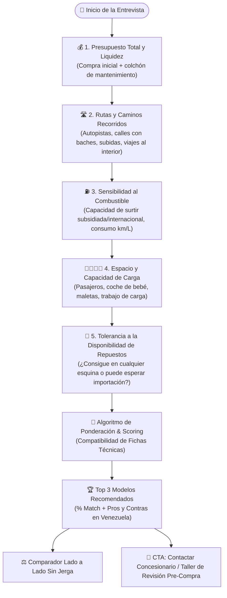
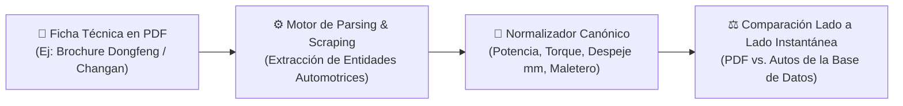
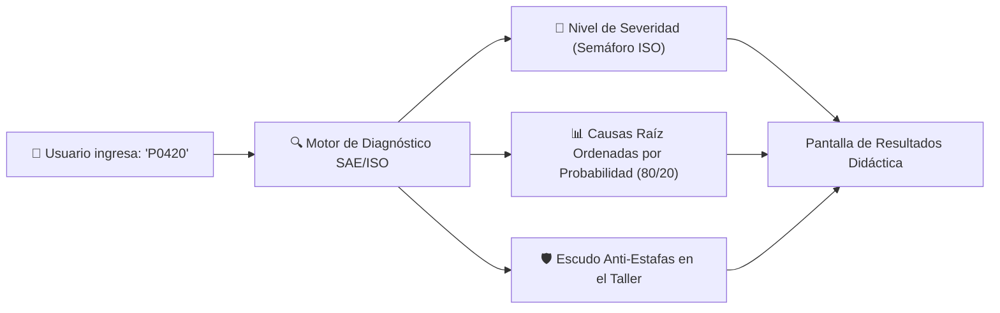
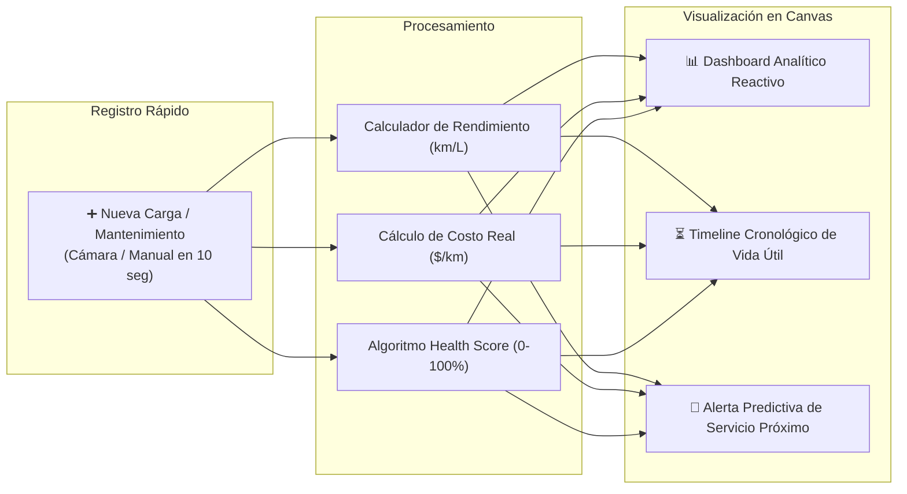

# Sección 03: Especificación Funcional Detallada de los 3 Pilares Core
### Diseño de Producto, Algoritmos, Lógica de Negocio y Experiencia Funcional
*Especialmente contextualizado para el mercado automotriz venezolano • Hook: Matchmaker-First*

---

## 3.1. Pilar 1 (Hook Principal): Matchmaker de Compra & Comparador Inteligente

El **Matchmaker de CharuAutos** no es un simple filtro de búsqueda por precio o año; es un **asesor virtual empático** que traduce las necesidades cotidianas del usuario en especificaciones de ingeniería automotriz adaptadas a las exigencias de Venezuela.



### 1. El Árbol Conversacional Guiado (Entrevista Sin Jerga)

Las preguntas evitan tecnicismos y se basan en escenarios del día a día en Venezuela:

| Pregunta del Asistente | Opciones de Respuesta | Traducción a Variables de Ingeniería |
| :--- | :--- | :--- |
| **1. "¿Cuánto dinero tienes disponible para el carro?"** | A) < $4,000 USD<br>B) $4,000 - $8,000 USD<br>C) $8,000 - $15,000 USD<br>D) > $15,000 USD (0km / Financiamiento) | Filtra segmentos: Usados de batalla, sedanes tradicionales, SUVs medianas o modelos 0km nuevos chinos/financiamientos. |
| **2. "¿Por dónde vas a rodar la mayor parte del tiempo?"** | A) Pura ciudad plana (Caracas centro, Maracaibo)<br>B) Subidas fuertes y cerros (El Hatillo, Táchira, Mérida)<br>C) Vías con muchos huecos y baches pronunciados<br>D) Viajes largos interurbanos por autopistas | - Despeje al suelo mínimo (ej. > 170 mm para opción C).<br>- Curva de torque a bajas RPM (> 140 Nm para opción B).<br>- Rigidez estructural del tren delantero. |
| **3. "¿Cuál es tu prioridad con la gasolina?"** | A) Máximo ahorro, que rinda bastante<br>B) No me importa tanto el consumo, prefiero fuerza<br>C) Que acepte gasolina regular sin pistoneo ni fallas | - Relación de compresión del motor (preferir motores < 10.5:1 atmosféricos para evitar detonación con octanaje irregular).<br>- Consumo mixto > 14 km/litro. |
| **4. "¿Qué tan fácil quieres conseguir los repuestos?"** | A) "Que los vendan hasta en la panadería"<br>B) "Puedo esperar unos días si el carro es más moderno" | Ponderador de densidad de stock en repuesteras locales (ej. Toyota/Chevrolet vs. marcas asiáticas emergentes). |

---

### 2. Algoritmo de Ponderación y Scoring (% de Compatibilidad)

Para cada vehículo $i$ de la base de datos canónica, el Score de Compatibilidad ($S_i \in [0, 100]$) se calcula mediante una suma ponderada normalizada:

$$S_i = \left( \sum_{j=1}^{6} w_j \cdot C_{ij} \right) \times P_{\text{penalización}}$$

Donde:
- $w_j$ = Peso relativo asignado a cada criterio según las respuestas del usuario ($\sum w_j = 1$).
- $C_{ij} \in [0, 1]$ = Grado de cumplimiento del vehículo $i$ en el criterio $j$:
  1. **$C_1$ (Ajuste a Presupuesto):** Penalización cuadrática si excede el presupuesto del usuario.
  2. **$C_2$ (Costo Total de Mantenimiento TCO en Venezuela):** Basado en el precio de repuestos clave (amortiguadores, pastillas, kit de embrague, bujías).
  3. **$C_3$ (Despeje del Suelo / Suspensión):** Distancia libre al suelo contra irregularidades viales.
  4. **$C_4$ (Tolerancia al Combustible Local):** Sensibilidad del sistema de inyección y sensores de O2.
  5. **$C_5$ (Habitabilidad & Espacio):** Volumen del maletero en litros y espacio entre ejes.
  6. **$C_6$ (Liquidez de Reventa):** Tiempo promedio en días que tarda el modelo en venderse en portales de segunda mano.
- $P_{\text{penalización}}$ = Factor de descuento (0.75) si el modelo posee un historial crítico de fallas endémicas (ej. rotura de correa de tiempo en modelos de interferencia sin mantenimiento estricto).

---

### 3. Comparador Lado a Lado: Fichas Técnicas "Humanizadas"

Cuando el usuario selecciona dos o tres modelos para contrastar (ej. *Toyota Corolla 2011* vs. *Changan Alsvin 2024* vs. *Ford Fiesta 2012*), la interfaz traduce las especificaciones crudas a lenguaje intuitivo:

```text
┌──────────────────────────────────────┬──────────────────────────────────────┬──────────────────────────────────────┐
│ TOYOTA COROLLA 1.8 (2011)            │ CHANGAN ALSVIN 1.4 (2024)            │ FORD FIESTA TITANIUM (2012)          │
├──────────────────────────────────────┼──────────────────────────────────────┼──────────────────────────────────────┤
│ 🏆 Compatibilidad: 94%               │ 🏆 Compatibilidad: 88%               │ 🏆 Compatibilidad: 76%               │
│                                      │                                      │                                      │
│ 🛡️ Repuestos en Venezuela:          │ 🛡️ Repuestos en Venezuela:          │ 🛡️ Repuestos en Venezuela:          │
│ Inmediatos en cualquier ciudad       │ En concesionarios y tiendas grandes  │ Frecuentes, pero ojo con imitaciones │
│                                      │                                      │                                      │
│ 🛑 Altura contra Huecos y Policías:  │ 🛑 Altura contra Huecos y Policías:  │ 🛑 Altura contra Huecos y Policías:  │
│ Buena (160 mm de despeje)            │ Regular (145 mm, raspa si va cargado)│ Baja (135 mm, requiere cuidado)      │
│                                      │                                      │                                      │
│ ⛽ Comportamiento con la Gasolina:   │ ⛽ Comportamiento con la Gasolina:   │ ⛽ Comportamiento con la Gasolina:   │
│ Excelente, motor rústico de cadena   │ Requiere mantenimiento de inyectores │ Sensible a suciedad en tanque        │
│                                      │                                      │                                      │
│ 💰 Costo de Mantenimiento Anual:     │ 💰 Costo de Mantenimiento Anual:     │ 💰 Costo de Mantenimiento Anual:     │
│ ~$320 USD/año                        │ ~$260 USD/año (primeros años)        │ ~$410 USD/año (frecuente en tren del)│
└──────────────────────────────────────┴──────────────────────────────────────┴──────────────────────────────────────┘
```

---

### 4. Ingesta Inteligente de Fichas Técnicas por PDF Adjunto (Document Scraping & Parsing)

Para responder a la necesidad de evaluar vehículos no listados o modelos recién importados por concesionarios en Venezuela:
- **Flujo de Carga:** El usuario o vendedor puede adjuntar un archivo PDF oficial (brochure comercial o ficha técnica del fabricante) arrastrándolo a la app o seleccionándolo desde el celular.
- **Motor de Extracción y Regex Heurístico:**
  - Extrae cilindrada, potencia en HP, torque en Nm, despeje al suelo en mm, volumen de maletero y tipo de transmisión/distribución.
- **Normalización Automática a la Interfaz Canónica:**
  - El documento procesado se convierte automáticamente en una entidad `CanonicalVehicle` candidata.
  - Se incorpora de inmediato al comparador lado a lado para contrastarlo contra cualquier auto del catálogo de CharuAutos.



---

## 3.2. Pilar 2: Asistente Mecánico & Diagnóstico OBD2 Manual

En la fase MVP, el usuario no necesita hardware Bluetooth. El diagnóstico se activa mediante un **buscador predictivo de códigos DTC** o un **selector visual de síntomas**.



### 1. El Semáforo de Severidad ISO/SAE
- **🟢 Código Nivel 1 (Leve / Conducción Segura):**
  - *Ejemplos:* `P0442` (pequeña fuga EVAP / tapa de gasolina floja), `P0128` (termostato abre a destiempo).
  - *Mensaje:* *"Puedes seguir manejando con tranquilidad. No daña el motor a corto plazo. Revísalo en tu próximo servicio rutinario."*
- **🟡 Código Nivel 2 (Precaución / Atención Necesaria):**
  - *Ejemplos:* `P0420` (eficiencia catalizador baja), `P0171` (mezcla pobre en banco 1).
  - *Mensaje:* *"El auto rueda, pero consumirá más gasolina o perderá fuerza. Atiéndelo pronto para evitar averías mayores."*
- **🔴 Código Nivel 3 (Crítico / Detener el Auto Inmediatamente):**
  - *Ejemplos:* `P0300` parpadeando (misfire masivo dañando motor), `P0524` (presión de aceite insuficiente).
  - *Mensaje:* *"¡ALERTA ROJA! Detén el vehículo en un lugar seguro y apaga el motor. Continuar la marcha puede fundir el motor o causar daños catastróficos."*

---

### 2. Árbol de Causas Raíz 80/20 y Desglose Económico

Para evitar que el usuario gaste cientos de dólares innecesariamente, la app muestra las causas más probables ordenadas de menor a mayor costo:

#### Caso de Estudio: Código `P0420` (Muy frecuente en Venezuela por combustible)
1. **Causa más barata y probable (60% de los casos):** Sensor de oxígeno posterior defectuoso o sucio ($25 - $40 USD).
2. **Segunda causa común (25% de los casos):** Fuga en el tubo de escape o junta suelta antes del catalizador ($15 USD de soldadura).
3. **Causa más cara y menos común (15% de los casos):** Catalizador verdaderamente fundido o tapado ($200 - $600 USD).

---

### 3. Generador del "Escudo Anti-Estafas" para el Taller

La app genera una tarjeta exportable a WhatsApp o pantalla completa que el usuario muestra o utiliza como libreto al hablar con el mecánico:

```text
╔══════════════════════════════════════════════════════════════════════════╗
║  🛡️ ESCUDO CHARUAUTOS — REGLAS PARA EL MECÁNICO                          ║
╠══════════════════════════════════════════════════════════════════════════╣
║  Vehículo: Chevrolet Aveo 1.6 • Código Detectado: P0171 (Mezcla Pobre)   ║
║                                                                          ║
║  1. PREGUNTA CLAVE DE CONFRONTACIÓN:                                     ║
║     "Amigo, antes de cambiar la bomba de gasolina completa, ¿podemos      ║
║     medir la presión en el riel de inyectores con el manómetro y         ║
║     revisar si hay una toma de aire falsa en la manguera de vacío?"      ║
║                                                                          ║
║  2. CONDICIONES OBLIGATORIAS:                                            ║
║     • Todo repuesto reemplazado debe entregarse en su caja original      ║
║       con la pieza vieja retirada como evidencia.                        ║
║     • No autorizo trabajos adicionales sin presupuesto escrito previo.   ║
║     • Escaneo final para verificar que el código se borró y no volvió.   ║
╚══════════════════════════════════════════════════════════════════════════╝
```

---

## 3.3. Pilar 3: Cuaderno de Mantenimiento Dinámico & Dashboard Analítico

El cuaderno de mantenimiento digital sustituye a la libreta física olvidada en la guantera, convirtiendo cada gasto en inteligencia preventiva.



### 1. El Timeline Interactivo de Vida Útil

Una línea de tiempo interactiva donde el usuario hace scroll horizontal o vertical por los hitos mecánicos de su auto:
- **Nodos Verdes:** Mantenimientos preventivos realizados a tiempo (cambio de aceite 5W-30, filtro de cabina, rotación de llantas).
- **Nodos Amarillos:** Servicios próximos a vencer (ej. *"Faltan 800 km para cambio de pastillas de freno"*).
- **Nodos Rojos:** Servicios vencidos con alerta de riesgo (ej. *"Correa de distribución con 62,000 km sin cambiar: riesgo de rotura"*).

---

### 2. Algoritmo del "Health Score" del Vehículo (0 a 100%)

El puntaje de salud del vehículo ($H \in [0, 100]$) se recalcula automáticamente con cada ingreso de kilometraje:

$$H = 100 - \sum_{k=1}^{M} \left( \Delta_{\text{vencimiento}, k} \times \omega_k \right) - \text{Penalización}_{\text{DTC}}$$

Donde:
- $\omega_k$ es el peso del componente según su criticidad mecánica (ej. Aceite de motor: $\omega = 25$; Filtro de aire acondicionado: $\omega = 5$).
- $\Delta_{\text{vencimiento}, k}$ es el porcentaje de sobre-kilometraje transcurrido desde la fecha límite.
- $\text{Penalización}_{\text{DTC}}$ descuenta 15 puntos por cada código Nivel 2 activo y 35 puntos por cada código Nivel 3 sin resolver.

*Impacto Comercial:* Un auto con **Health Score > 90%** durante más de 6 meses desbloquea el sello de **"Vehículo Certificado CharuAutos"**, aumentando su valor de reventa en el mercado local entre un **5% y un 12%**.

---

### 3. Dashboard Financiero Bimonetario ($/km)

El dashboard resuelve la necesidad de los conductores venezolanos de entender cuánto les cuesta realmente mover el vehículo:

```text
┌──────────────────────────────────────────────────────────────────────────┐
│ 📊 RESUMEN DE SALUD Y COSTOS — TOYOTA COROLLA (2011)                      │
├──────────────────────────────────────────────────────────────────────────┤
│  ❤️ Salud Global: 92/100 (Excelente)     🛣️ Odómetro: 148,500 km         │
├──────────────────────────────────────────────────────────────────────────┤
│  ⛽ RENDIMIENTO DE COMBUSTIBLE:           💰 COSTO OPERATIVO:             │
│  • 12.4 km / Litro (Promedio ciudad)     • $0.11 USD / km recorrido      │
│  • Autonomía por tanque: ~580 km         • (Aprox. 4.18 Bs./km a tasa BCV)│
├──────────────────────────────────────────────────────────────────────────┤
│  🔔 PRÓXIMA ALERTA PREVENTIVA:                                           │
│  ⚠️ Cambio de Aceite y Filtro en 1,200 km (Estimado: 22 días)             │
│  Presupuesto estimado repuestos: $35 - $45 USD                            │
└──────────────────────────────────────────────────────────────────────────┘
```
