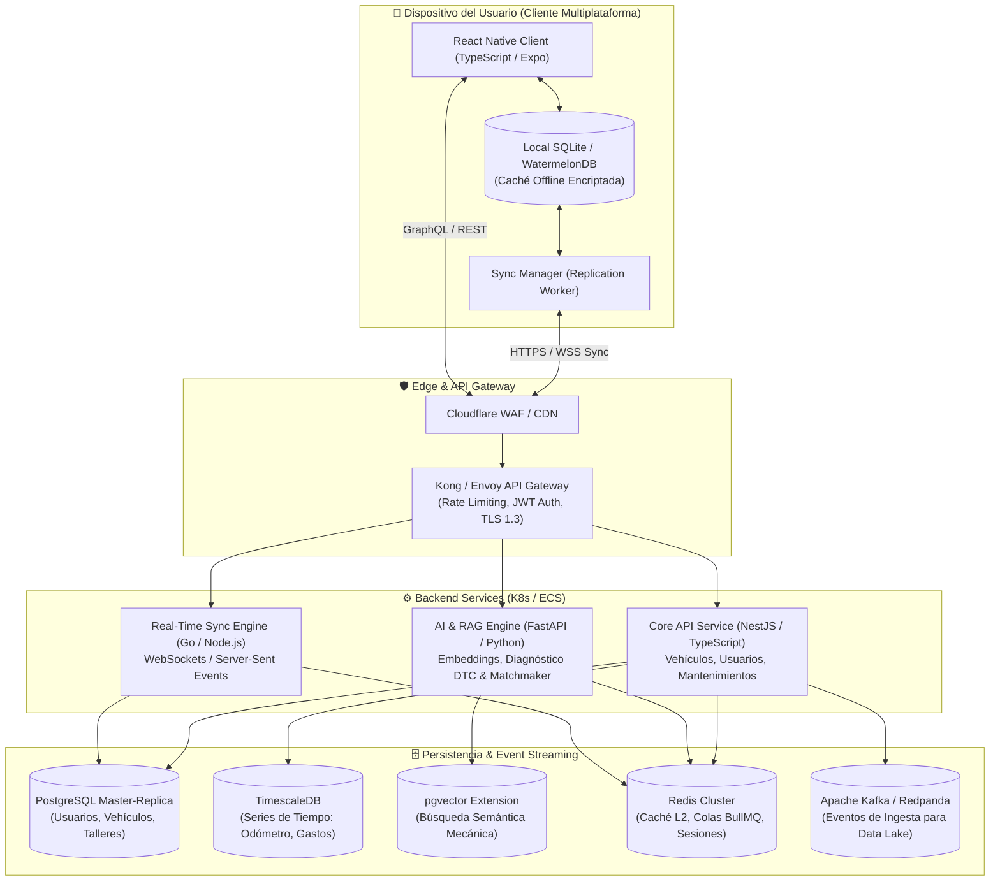
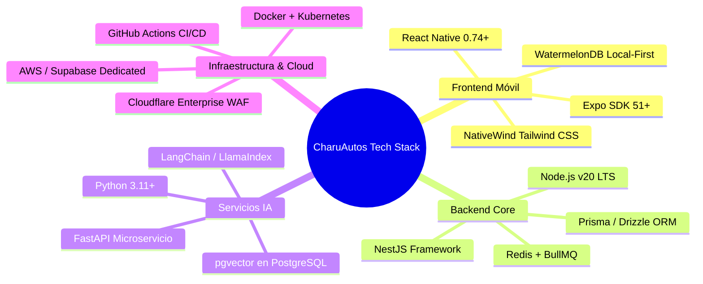
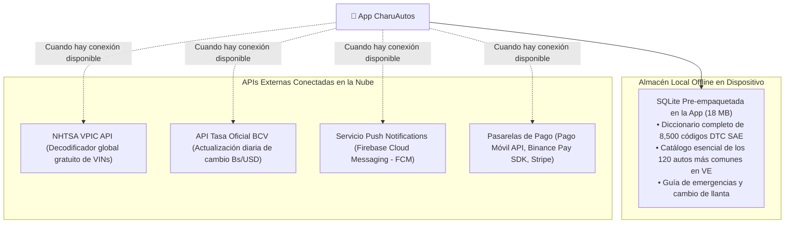

# Sección 04: Arquitectura Técnica y Stack de Software
### Diseño de Arquitectura de Sistemas, Diagrama C4, Selección de Stack y Persistencia Local-First
*Diseñado bajo estándares de ingeniería de software moderna para resiliencia offline y alta concurrencia.*

---

## 4.1. Arquitectura del Sistema: Diagrama C4 (Nivel Contenedores)

La arquitectura sigue el patrón **Local-First Reactive Sync** con microservicios en el backend desacoplados mediante colas de eventos:



---

## 4.2. Selección Justificada del Stack Tecnológico



| Capa / Componente | Tecnología Seleccionada | Justificación Técnica & Comercial |
| :--- | :--- | :--- |
| **Frontend Móvil** | **React Native + Expo (TypeScript)** | • Un solo codebase para iOS, Android y versión Web PWA.<br>• Arquitectura moderna con nuevo motor *Hermes* y compilador reactivo.<br>• Acceso directo a biometría, cámara y SQLite nativo. |
| **Estilos & UI Kit** | **NativeWind (Tailwind CSS v3)** | • Permite una implementación limpia del sistema de diseño *Dark Showroom* con variables compartidas entre web y móvil. |
| **Persistencia Local** | **WatermelonDB (sobre SQLite)** | • Extremadamente rápido para grandes volúmenes de datos en dispositivos móviles de gama media/baja.<br>• Permite consultas reactivas en <16ms para garantizar 60 fps en la UI. |
| **Backend Core API** | **NestJS (Node.js)** | • Arquitectura modular basada en principios SOLID y Domain-Driven Design (DDD).<br>• Tipado estricto extremo con TypeScript compartido con el frontend. |
| **Motor IA & Diagnóstico** | **FastAPI (Python)** | • Framework asíncrono ultrarrápido para servir modelos de embeddings e integrarse con librerías de IA (NumPy, PyTorch, LangChain). |
| **Base de Datos Operacional** | **PostgreSQL 16 + TimescaleDB** | • PostgreSQL garantiza consistencia ACID para compras, reservas y transacciones.<br>• TimescaleDB gestiona eficientemente millones de lecturas de kilometraje y consumos de combustible con compresión del 90%. |
| **Base de Datos Vectorial** | **pgvector (Integrado en Postgres)** | • Elimina la necesidad de pagar y mantener un clúster separado de Pinecone o Qdrant en el MVP, abaratando la factura cloud en más de $300/mes. |

---

## 4.3. Modelo Operacional de Base de Datos (PostgreSQL DDL Schemas)

A continuación, el esquema canónico de las tablas nodales para el MVP:

```sql
-- 1. EXTENSIONES NECESARIAS
CREATE EXTENSION IF NOT EXISTS "uuid-ossp";
CREATE EXTENSION IF NOT EXISTS "pgcrypto";
CREATE EXTENSION IF NOT EXISTS "vector";

-- 2. TABLA DE USUARIOS
CREATE TABLE users (
    id UUID PRIMARY KEY DEFAULT gen_random_uuid(),
    email VARCHAR(255) UNIQUE NOT NULL,
    password_hash VARCHAR(255) NOT NULL,
    full_name VARCHAR(150) NOT NULL,
    phone_number VARCHAR(50),
    role VARCHAR(20) DEFAULT 'driver' CHECK (role IN ('driver', 'mechanic', 'dealer', 'admin')),
    is_pro_member BOOLEAN DEFAULT FALSE,
    pro_expires_at TIMESTAMP WITH TIME ZONE,
    created_at TIMESTAMP WITH TIME ZONE DEFAULT NOW(),
    updated_at TIMESTAMP WITH TIME ZONE DEFAULT NOW()
);

-- 3. TABLA DE VEHÍCULOS DEL USUARIO (GARAGE)
CREATE TABLE user_vehicles (
    id UUID PRIMARY KEY DEFAULT gen_random_uuid(),
    user_id UUID NOT NULL REFERENCES users(id) ON DELETE CASCADE,
    canonical_trim_id UUID NOT NULL, -- FK hacia el catálogo MDM
    license_plate_hash VARCHAR(64) NOT NULL, -- Blind index HMAC
    encrypted_license_plate TEXT NOT NULL, -- AES-256 encrypted
    current_mileage INT NOT NULL CHECK (current_mileage >= 0),
    health_score INT DEFAULT 100 CHECK (health_score BETWEEN 0 AND 100),
    created_at TIMESTAMP WITH TIME ZONE DEFAULT NOW(),
    updated_at TIMESTAMP WITH TIME ZONE DEFAULT NOW()
);

-- 4. TABLA DE REGISTROS DE COMBUSTIBLE Y GASTOS (TIMESCALEDB HYPERTABLE)
CREATE TABLE fuel_logs (
    id UUID DEFAULT gen_random_uuid(),
    vehicle_id UUID NOT NULL REFERENCES user_vehicles(id) ON DELETE CASCADE,
    logged_at TIMESTAMP WITH TIME ZONE NOT NULL DEFAULT NOW(),
    mileage_at_fill INT NOT NULL,
    liters_filled NUMERIC(6, 2) NOT NULL,
    price_total_usd NUMERIC(8, 2) NOT NULL,
    price_total_ves NUMERIC(12, 2),
    bcv_exchange_rate NUMERIC(10, 4),
    fuel_octane VARCHAR(10) CHECK (fuel_octane IN ('regular_91', 'premium_95', 'diesel', 'unknown')),
    PRIMARY KEY (id, logged_at)
);

-- 5. TABLA CANÓNICA DE CÓDIGOS DTC OBD2 (SAE J2012)
CREATE TABLE dtc_codes (
    code VARCHAR(10) PRIMARY KEY, -- Ej: 'P0420'
    system_category VARCHAR(30) NOT NULL, -- Powertrain, Chassis, Body, Network
    severity_level INT NOT NULL CHECK (severity_level BETWEEN 1 AND 3), -- 1: Leve, 2: Precaución, 3: Crítico
    technical_name VARCHAR(255) NOT NULL,
    plain_spanish_summary TEXT NOT NULL,
    causes_root_json JSONB NOT NULL, -- Lista ponderada de causas
    anti_scam_questions JSONB NOT NULL, -- Preguntas blindaje
    embedding vector(1536) -- Vector para búsqueda semántica por síntomas
);
```

---

## 4.4. Catálogo de APIs y Repositorios Locales de Datos

Para asegurar que la app funcione en los lugares más recónditos de las carreteras venezolanas sin conexión a internet, se diseña una arquitectura híbrida de datos:


